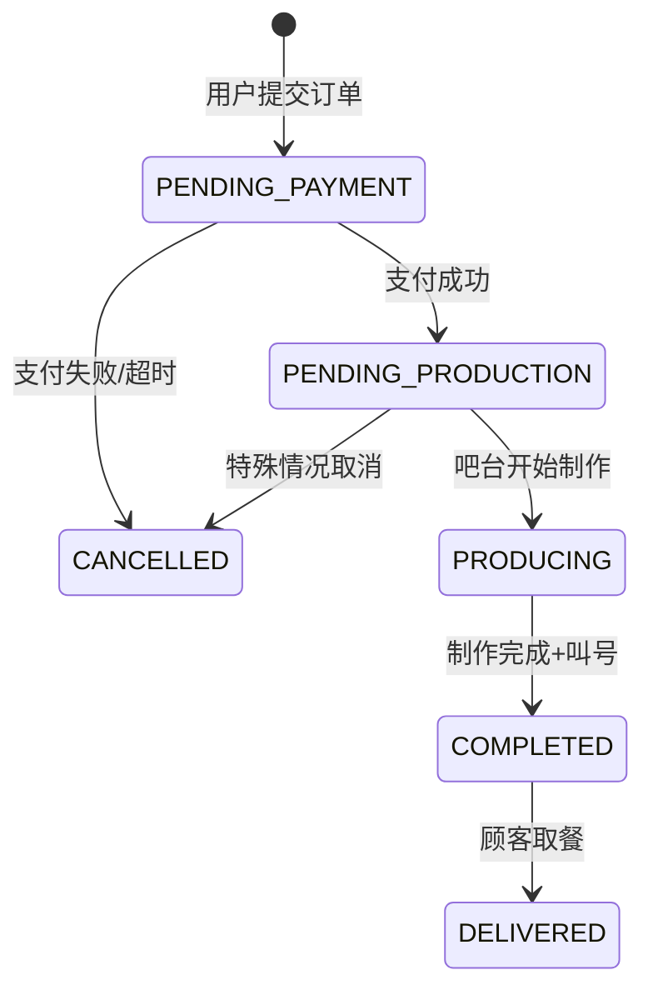

# 业务概念澄清：饮品订单创建与出品管理 (O003-beverage-order)

**Feature**: O003-beverage-order
**版本**: 1.0.0
**创建日期**: 2025-12-27
**最后更新**: 2025-12-27

---

## 业务术语定义

### 饮品分类 (Beverage Categories)

**定义**: 按饮品类型进行的一级分类，用于菜单组织和用户浏览

**标准分类**:
- 咖啡 (Coffee): 包括美式、拿铁、卡布奇诺等咖啡类饮品
- 茶饮 (Tea): 包括红茶、绿茶、奶茶等茶类饮品
- 果汁 (Juice): 包括鲜榨果汁、冰沙等水果类饮品
- 其他 (Others): 其他类型饮品

**使用场景**: C端菜单页按分类展示标签页，用户点击分类查看对应饮品列表

**示例**: 用户点击"咖啡"分类，显示美式咖啡、拿铁、摩卡等咖啡类饮品

---

### 饮品规格 (Beverage Specifications)

**定义**: 饮品的可选配置选项，影响最终价格和配方

**规格类型** (spec_type):
1. **SIZE** (容量): 中杯 (Medium)、大杯 (Large)
   - 价格调整: 中杯 +0元，大杯 +5元
   - 示例: 中杯拿铁 28元，大杯拿铁 33元

2. **TEMPERATURE** (温度): 热饮 (Hot)、常温 (Room)、冰饮 (Iced)
   - 价格调整: 通常为 0元
   - 示例: 热拿铁、冰拿铁

3. **SWEETNESS** (甜度): 正常糖 (Normal)、半糖 (Half)、少糖 (Less)、无糖 (None)
   - 价格调整: 通常为 0元
   - 示例: 正常糖奶茶、半糖奶茶

4. **TOPPING** (配料): 珍珠 (Boba)、椰果 (Coconut Jelly)、布丁 (Pudding)
   - 价格调整: 每种配料 +3元
   - 示例: 珍珠奶茶 = 基础奶茶价格 + 3元

**组合规则**:
- 每个规格类型只能选择一个选项（单选）
- SIZE 和 TEMPERATURE 为必选项
- SWEETNESS 和 TOPPING 为可选项
- 最终价格 = 基础价格 + 所有规格的价格调整总和

**示例计算**:
```
基础饮品: 拿铁 (base_price = 28元)
选择规格:
  - SIZE: 大杯 (price_adjustment = +5元)
  - TEMPERATURE: 冰饮 (price_adjustment = 0元)
  - TOPPING: 珍珠 (price_adjustment = +3元)
最终价格 = 28 + 5 + 0 + 3 = 36元
```

---

### 订单状态流转 (Order Status Transitions)

**定义**: 饮品订单从创建到完成的生命周期状态机

**6 种状态**:
1. **PENDING_PAYMENT** (待支付): 订单已创建，等待用户支付
2. **PENDING_PRODUCTION** (待制作): 支付完成，等待吧台开始制作
3. **PRODUCING** (制作中): 吧台已开始制作饮品
4. **COMPLETED** (已完成): 饮品制作完成，等待顾客取餐
5. **DELIVERED** (已交付): 顾客已取走饮品
6. **CANCELLED** (已取消): 订单被取消（支付前或特殊情况）

**状态流转规则**:


**状态变更触发事件**:
- PENDING_PAYMENT → PENDING_PRODUCTION: Mock支付成功（500ms延迟）
- PENDING_PRODUCTION → PRODUCING: B端工作人员点击"开始制作"按钮，触发BOM扣料
- PRODUCING → COMPLETED: B端工作人员点击"制作完成"按钮，触发叫号通知
- COMPLETED → DELIVERED: B端工作人员点击"已交付"按钮

**不允许的状态变更**:
- 禁止从 PRODUCING 回退到 PENDING_PRODUCTION（BOM扣料已执行，不可逆）
- 禁止从 COMPLETED 回退到 PRODUCING
- 禁止从 DELIVERED 回退到任何状态

---

### 取餐号 (Queue Number)

**定义**: 用于叫号通知顾客取餐的唯一标识符

**编号格式**: `D001` - `D999`
- 前缀: 固定字母 `D` (代表 Drink 饮品)
- 序号: 001-999 的三位数字

**生成规则**:
1. **每日重置**: 每天午夜 00:00 重置序号为 001
2. **递增规则**: 同一天内每个新订单递增（001 → 002 → 003 → ...）
3. **循环规则**: 达到 D999 后，如果当天仍有新订单，从 D001 重新开始（覆盖已交付的旧订单号）
4. **并发安全**: 使用 PostgreSQL Advisory Lock 确保高并发下序号不重复

**使用场景**:
- C端: 支付成功后，订单详情页显示取餐号（如 "您的取餐号: D023"）
- B端: 订单列表和详情页显示取餐号，叫号时语音播报"D023 号取餐"
- 叫号通知: 订单状态变为 COMPLETED 时，B端显示"已叫号 D023"，C端小程序推送通知

**边界情况**:
- 如果当天订单超过 999 个，序号循环回 D001
- 已交付的订单号可被新订单重用（假设顾客已取餐离开）

---

### 订单号 (Order Number)

**定义**: 饮品订单的唯一标识符，用于订单查询和追踪

**编号格式**: `BORDT + yyyyMMddHHmmss + 4位随机数字`
- 前缀: `BORDT` (Beverage Order)
- 时间戳: 14 位数字，格式 yyyyMMddHHmmss（如 20251227143025）
- 随机数: 4 位随机数字（0000-9999）

**示例**: `BORDT202512271430250123`

**生成规则**:
- 订单创建时生成，不可修改
- 时间戳使用订单创建时刻的服务器时间
- 随机数使用 SecureRandom 生成，避免同一秒内订单号冲突

**使用场景**:
- C端: 订单详情页显示订单号，用户可通过订单号查询历史订单
- B端: 订单列表和详情页显示订单号，用于订单检索和客服查询

---

## 业务规则澄清

### BOM 扣料规则 (Bill of Materials Deduction)

**定义**: 根据饮品配方自动扣减原料库存的业务逻辑

**触发时机**: 订单状态从 PENDING_PRODUCTION 变更为 PRODUCING 时触发

**扣料流程**:
1. **查询配方**: 根据 `beverage_id + selected_specs` 查询对应的 `beverage_recipes` 记录
2. **计算原料**: 根据 `recipe_ingredients` 表计算需要扣减的 SKU 和数量
   - 示例: 拿铁(大杯) = 咖啡豆 25g + 牛奶 250ml + 水 50ml
3. **库存验证**: 调用 P003 库存查询 API，验证当前门店库存是否充足
4. **悲观锁扣减**: 调用 P004 库存调整 API，使用 `SELECT FOR UPDATE` 悲观锁执行扣减
5. **原子性保证**: 扣料失败时回滚订单状态，不允许部分扣减

**计算公式**:
```
扣减数量 = 基础配方数量 × 订单项数量
示例: 2杯大杯拿铁
  - 咖啡豆: 25g/杯 × 2 = 50g
  - 牛奶: 250ml/杯 × 2 = 500ml
  - 水: 50ml/杯 × 2 = 100ml
```

**边界情况处理**:

1. **库存不足**:
   - 行为: 扣料失败，订单状态保持 PENDING_PRODUCTION
   - 提示: B端显示"库存不足: 牛奶剩余 200ml，需要 500ml"
   - 解决: 运营人员补货后重新点击"开始制作"

2. **并发扣料冲突**:
   - 场景: 两个订单同时扣减同一 SKU 的库存
   - 保护: 使用 P004 API 的悲观锁机制（SELECT FOR UPDATE）
   - 行为: 后提交的订单等待前一个事务提交后再执行

3. **扣料部分成功**:
   - 场景: 扣减 3 种原料，第 2 种失败
   - 保护: P004 API 使用数据库事务，自动回滚所有扣减
   - 行为: 所有原料库存恢复，订单状态不变

4. **P003/P004 API 不可用**:
   - 行为: 扣料失败，订单状态保持 PENDING_PRODUCTION
   - 提示: B端显示"库存系统暂时不可用，请稍后重试"
   - 降级: MVP 版本无降级策略，必须等待库存系统恢复

**与 P003/P004 集成约束**:
- P003 (库存查询): 调用 `GET /api/inventory/store/{storeId}/sku/{skuId}` 查询实时库存
- P004 (库存调整): 调用 `POST /api/inventory/adjust` 执行扣减，传入 `adjustment_type=BOM_DEDUCTION`
- 依赖: BOM 扣料功能完全依赖 P003/P004 模块，这两个模块必须先部署和可用

---

### Mock 支付规则

**定义**: MVP 阶段使用前端模拟支付，不对接真实支付网关

**实现方式**:
- **延迟**: 500 毫秒固定延迟（模拟支付网关响应时间）
- **成功率**: 100% 自动成功（无失败场景）
- **支付金额**: 前端计算总价并传递给后端，后端不验证金额正确性
- **支付凭证**: 生成 Mock 支付流水号（格式: `MOCK_PAY_` + 时间戳）

**C端用户流程**:
1. 用户点击"提交订单"后跳转到支付页面
2. 显示订单金额和"微信支付"按钮（仅 UI 展示）
3. 用户点击支付按钮，前端延迟 500ms
4. 调用后端 `POST /api/client/beverage-orders/{id}/pay` 接口
5. 后端返回支付成功，前端跳转到订单详情页，显示订单号和取餐号

**业务假设**:
- 所有订单默认支付成功，无需处理支付失败、超时、退款等场景
- 订单创建后必须在 30 分钟内完成支付，否则自动取消（后续版本实现）
- 支付成功后订单不可取消（后续版本支持退款）

**后续真实集成计划**:
- Phase 2: 对接微信支付 API（JSAPI 支付）
- 需实现: 支付失败处理、超时取消、退款流程、支付回调验签

---

### Mock 叫号规则

**定义**: MVP 阶段使用前端模拟叫号通知，不对接真实语音播报系统

**实现方式**:
- **B端语音播报**: Mock 实现，仅在控制台输出 `console.log("语音播报: D023 号取餐")`
- **C端推送通知**: 使用 Taro.showToast + Taro.vibrateShort 模拟通知
- **叫号记录**: 更新 `queue_numbers` 表的 `status` 字段为 `CALLED`

**B端工作人员流程**:
1. 订单状态变更为 COMPLETED 时，自动触发叫号
2. B端订单详情页显示"已叫号 D023"状态
3. 控制台输出模拟语音播报日志

**C端用户通知**:
1. 订单状态变为 COMPLETED 时，C端小程序通过 8 秒轮询检测到状态变化
2. 显示 Toast 提示"您的订单 D023 已完成，请取餐"
3. 触发震动提醒（Taro.vibrateShort）

**业务假设**:
- MVP 阶段不考虑顾客未及时取餐的场景（无重复叫号）
- 不考虑叫号失败或顾客听不到的场景

**后续真实集成计划**:
- Phase 2: 对接语音播报硬件（TTS 文字转语音）
- Phase 2: 支持微信小程序推送通知（模板消息）

---

### 轮询通知策略

**定义**: C端和B端使用轮询方式实现订单状态的实时更新

**技术选型原因**:
- MVP 阶段不引入 WebSocket 或 Server-Sent Events (SSE) 的复杂性
- 轮询实现简单，适合低并发场景（预计每分钟 < 10 个订单）

**轮询参数**:
- **轮询间隔**: 8 秒（research.md Decision 2）
- **轮询端点**:
  - C端: `GET /api/client/beverage-orders/{id}` 查询单个订单状态
  - B端: `GET /api/admin/beverage-orders/pending` 查询待处理订单列表
- **停止条件**:
  - C端: 订单状态变为 DELIVERED 或用户离开订单详情页
  - B端: 用户离开待处理订单页面

**实现方式** (TanStack Query):
```typescript
// C端订单详情页
const { data: order } = useQuery({
  queryKey: ['beverage-order', orderId],
  queryFn: () => fetchOrderDetail(orderId),
  refetchInterval: 8000, // 8秒轮询
  enabled: order?.status !== 'DELIVERED', // 已交付时停止轮询
})
```

**业务假设**:
- 订单状态更新延迟最长 8 秒，用户可接受
- 轮询不会对服务器造成显著负载（预计峰值 < 50 并发用户）

**后续优化计划**:
- Phase 2: 引入 WebSocket 实现真正的实时推送
- Phase 2: 优化轮询策略（如 Exponential Backoff）

---

## 业务流程说明

### C端下单流程 (US1)

**完整流程**:
1. 用户打开小程序，点击底部"点餐菜单"tab（FR-001）
2. 浏览饮品菜单，按分类（咖啡/茶饮/果汁）查看饮品列表
3. 点击某个饮品进入详情页，查看大图、描述、营养信息
4. 选择规格（大杯/冰饮/珍珠），系统实时计算并显示总价
5. 点击"加入购物车"，饮品添加到购物车（支持多个饮品）
6. 点击"去结算"，进入订单确认页，显示所有饮品和总价
7. 点击"提交订单"，后端创建订单（状态: PENDING_PAYMENT）
8. 跳转到支付页面，显示订单金额和"微信支付"按钮
9. 点击"微信支付"，前端延迟 500ms 后调用支付接口
10. 支付成功，订单状态变为 PENDING_PRODUCTION
11. 跳转到订单详情页，显示订单号（BORDT...）和取餐号（D023）
12. 订单详情页每 8 秒轮询订单状态，等待状态变化
13. 当状态变为 COMPLETED 时，显示 Toast "您的订单 D023 已完成，请取餐"
14. 用户前往吧台取餐

**关键决策点**:
- 步骤 4: 用户可以修改规格选择，系统重新计算价格
- 步骤 6: 用户可以修改数量或删除购物车中的饮品
- 步骤 9: Mock 支付 100% 成功，无失败分支

---

### B端出品流程 (US2)

**完整流程**:
1. B端工作人员登录管理后台，打开"待处理订单"页面
2. 页面每 8 秒轮询 `GET /api/admin/beverage-orders/pending` 接口
3. 有新订单时，页面顶部显示通知（音频提醒 + 浏览器通知）
4. 工作人员点击订单卡片，打开订单详情 Modal
5. 查看订单详情: 饮品名称、规格、数量、取餐号（D023）
6. 查看配方和 BOM 清单（咖啡豆 50g、牛奶 500ml）
7. 工作人员准备开始制作，点击"开始制作"按钮
8. 后端触发 BOM 扣料流程（调用 P003/P004 API）
9. 扣料成功，订单状态变为 PRODUCING
10. 工作人员制作饮品（线下物理操作）
11. 制作完成后，点击"制作完成"按钮
12. 后端触发叫号通知，订单状态变为 COMPLETED
13. B端显示"已叫号 D023"，控制台输出模拟语音播报
14. 顾客前来取餐，工作人员核对取餐号后点击"已交付"按钮
15. 订单状态变为 DELIVERED，流程结束

**关键决策点**:
- 步骤 8: 如果库存不足，扣料失败，订单状态保持 PENDING_PRODUCTION，显示错误提示
- 步骤 8: 如果并发冲突（两个订单同时扣同一 SKU），后提交的订单等待
- 步骤 11: 叫号后订单不可回退到制作中状态

---

## 边界情况与例外

### 调整后库存为负

**场景**: BOM 扣料时，原料库存不足以满足订单需求

**示例**:
- 当前牛奶库存: 200ml
- 订单需求: 2 杯大杯拿铁 = 500ml 牛奶
- 差额: 缺少 300ml

**处理策略**:
1. P004 库存调整 API 拒绝扣减请求，返回错误响应
2. 后端捕获异常，订单状态保持 PENDING_PRODUCTION
3. B端显示错误提示: "库存不足: 牛奶剩余 200ml，需要 500ml"
4. 工作人员补货后，重新点击"开始制作"按钮
5. 如果库存仍不足，继续显示错误提示

**业务规则**:
- 系统禁止库存为负数（data-model.md 约束: `quantity >= 0`）
- BOM 扣料必须全部成功或全部失败（原子性）

---

### 并发订单扣料冲突

**场景**: 两个订单几乎同时点击"开始制作"，扣减同一 SKU 的库存

**示例**:
- 当前咖啡豆库存: 60g
- 订单 A: 需要 50g 咖啡豆
- 订单 B: 需要 50g 咖啡豆
- 两个订单同时发起扣料请求

**处理策略**:
1. 使用悲观锁（SELECT FOR UPDATE）确保串行执行
2. 订单 A 先获得锁，执行扣减，咖啡豆库存变为 10g
3. 订单 A 事务提交，释放锁
4. 订单 B 获得锁，尝试扣减 50g，发现库存不足
5. 订单 B 扣料失败，返回库存不足错误

**技术保障**:
- P004 API 内部使用 `SELECT FOR UPDATE` 对 `store_inventory` 表加行级锁
- 锁在事务提交或回滚后自动释放
- 后提交的订单等待前一个事务完成（最长等待时间: 30 秒超时）

---

### 订单创建后用户未支付

**场景**: 用户提交订单后，未点击支付按钮就退出小程序

**MVP 处理策略**:
- 订单状态保持 PENDING_PAYMENT
- 无自动取消机制（后续版本实现 30 分钟超时自动取消）
- 用户可在"我的订单"页查看未支付订单，继续支付

**后续版本**:
- 订单创建后 30 分钟未支付，自动取消
- 使用定时任务扫描 PENDING_PAYMENT 状态的订单

---

### C端轮询期间网络中断

**场景**: 用户在订单详情页查看订单状态时，手机网络中断

**处理策略** (FR-024):
1. TanStack Query 检测到网络请求失败
2. 显示离线横幅（OfflineBanner 组件）: "网络连接已断开，请检查网络"
3. 用户输入的数据（如购物车内容）保留在 Zustand + Taro.setStorageSync
4. 网络恢复后，自动重试轮询请求
5. 订单状态更新成功后，隐藏离线横幅

**数据保护**:
- 购物车数据持久化到 Taro.setStorageSync，应用重启后恢复
- 已提交的订单无需保护（已存储在服务器）

---

### 顾客未及时取餐

**场景**: 订单状态变为 COMPLETED（已叫号），但顾客 30 分钟内未取餐

**MVP 处理策略**:
- 无自动处理机制
- 工作人员线下联系顾客或等待顾客主动取餐
- 订单状态保持 COMPLETED

**后续版本**:
- 超过 30 分钟未取餐，订单状态变为 EXPIRED
- 支持重新叫号功能

---

## 业务假设与约束

### 假设

1. **门店环境假设**:
   - 饮品订单仅适用于有吧台的门店（影院内吧台或独立咖啡店）
   - 单个门店每分钟订单量 < 10 个（低并发场景）
   - 工作人员有稳定的网络连接和浏览器环境

2. **SKU 主数据假设**:
   - P001 SKU 模块已包含饮品原料数据（咖啡豆、牛奶、水、糖等）
   - SKU 单价数据准确且已录入系统
   - 所有原料 SKU 使用统一的计量单位（克、毫升）

3. **库存系统假设**:
   - P003 库存查询模块已部署且可用
   - P004 库存调整模块支持 BOM_DEDUCTION 调整类型
   - 库存系统响应时间 < 1 秒

4. **支付假设**:
   - MVP 阶段所有订单默认支付成功
   - 订单金额计算由前端和后端双重验证（后续版本）
   - 无退款场景

5. **取餐号假设**:
   - 单日订单量 < 999 个（不会出现序号耗尽的情况）
   - 顾客能够理解取餐号的含义并主动关注叫号

6. **审批阈值假设**:
   - MVP 阶段无审批流程
   - 所有订单自动通过（无需运营总监审批）

---

### 约束

1. **技术约束**:
   - C端必须使用 Taro 框架开发（支持微信小程序和 H5）
   - B端必须使用 React + Ant Design
   - 后端必须使用 Spring Boot + Supabase
   - 所有 API 响应必须遵循 ApiResponse<T> 格式

2. **数据约束**:
   - 饮品名称长度: 1-50 字符
   - 饮品描述长度: 0-500 字符
   - 订单备注长度: 0-200 字符
   - 饮品价格范围: 1-9999 元（分为单位: 100-999900 分）
   - 规格价格调整范围: -100 到 +100 元

3. **性能约束** (Success Criteria):
   - 菜单页面首屏加载时间 ≤ 2 秒 (SC-007)
   - 系统支持 100 并发订单不崩溃 (SC-008)
   - BOM 扣料准确率 100% (SC-004)

4. **安全约束**:
   - 所有 API 请求必须包含 JWT Token 认证
   - C端只能查询自己的订单
   - B端只能管理自己门店的订单

5. **业务约束**:
   - 订单一旦支付成功，不可取消（MVP 阶段）
   - BOM 扣料一旦执行成功，不可回退
   - 取餐号每日重置，不跨天累积

---

## 后续版本演进计划

### Phase 2 功能增强

1. **真实支付集成**:
   - 对接微信支付 JSAPI
   - 支持支付失败、超时、退款

2. **真实叫号系统**:
   - 对接 TTS 语音播报硬件
   - 支持微信小程序模板消息推送

3. **WebSocket 实时通知**:
   - 替换轮询机制，实现真正的实时推送

4. **订单自动取消**:
   - 30 分钟未支付自动取消
   - 超时未取餐订单处理

### Phase 3 高级功能

1. **库存预警**:
   - 原料库存低于阈值时，B端显示预警
   - 自动生成补货建议

2. **配方管理**:
   - B端支持配方的增删改查
   - 配方版本控制和生效时间管理

3. **销售统计增强**:
   - 饮品销售排行榜
   - 高峰时段分析
   - 客单价分析

---

**文档维护**:
- 任何业务规则变更必须同步更新此文档
- 代码实现与此文档冲突时，以此文档为准
- 如需修改业务规则，必须先更新此文档并通过团队评审
