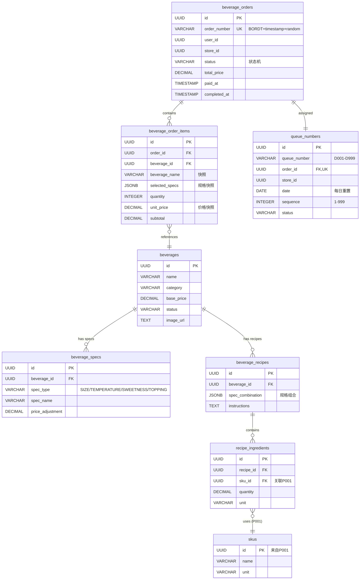

# 数据模型文档 (Data Model)

**Feature**: 饮品订单创建与出品管理 (Beverage Order & Production Management)
**Spec ID**: O003-beverage-order
**Date**: 2025-12-27
**Version**: 1.0.0
**Status**: Draft

---

## 目录

1. [实体概览](#实体概览)
2. [详细实体定义](#详细实体定义)
3. [实体关系图](#实体关系图)
4. [数据完整性规则](#数据完整性规则)
5. [验证规则总结](#验证规则总结)
6. [索引策略](#索引策略)
7. [数据迁移说明](#数据迁移说明)

---

## 实体概览

本功能涉及 **7 个核心实体**，分为三个业务域：

| 实体名称 (中文) | 实体名称 (英文) | 表名 (PostgreSQL) | 业务域 | 说明 |
|----------------|----------------|------------------|--------|------|
| 饮品 | Beverage | `beverages` | 商品管理 | 菜单中的饮品商品 |
| 饮品规格 | BeverageSpec | `beverage_specs` | 商品管理 | 饮品的可选规格（大小/温度/甜度/配料） |
| 饮品配方 | BeverageRecipe | `beverage_recipes` | BOM管理 | 饮品制作配方 |
| 配方原料关联 | RecipeIngredient | `recipe_ingredients` | BOM管理 | 配方与原料的关联表 |
| 饮品订单 | BeverageOrder | `beverage_orders` | 订单管理 | 顾客的饮品订单主表 |
| 订单商品项 | BeverageOrderItem | `beverage_order_items` | 订单管理 | 订单中的具体饮品项 |
| 取餐号 | QueueNumber | `queue_numbers` | 叫号系统 | 叫号取餐的号码 |

**依赖关系说明**：
- `recipe_ingredients` 依赖 `skus` 表（来自 P001-sku-master-data）
- BOM 扣料依赖 `store_inventory` 表（来自 P003-inventory-query）
- 库存扣减依赖 `inventory_adjustments` 表（来自 P004-inventory-adjustment）

---

## 详细实体定义

### 1. Beverage (饮品)

**用途**: 代表菜单中的饮品商品，包含基本信息、价格、分类等。

#### 表定义

```sql
CREATE TABLE beverages (
  -- 主键
  id UUID PRIMARY KEY DEFAULT gen_random_uuid(),

  -- 基本信息
  name VARCHAR(100) NOT NULL,
  description TEXT,
  category VARCHAR(50) NOT NULL,

  -- 图片资源
  image_url TEXT,                           -- 主图 URL (Supabase Storage)
  detail_images JSONB DEFAULT '[]'::jsonb,  -- 详情图数组 ["url1", "url2"]

  -- 价格
  base_price DECIMAL(10,2) NOT NULL,        -- 基础价格（小杯/标准规格）

  -- 营养信息（可选）
  nutrition_info JSONB,                     -- {"calories": 150, "sugar": "10g"}

  -- 状态管理
  status VARCHAR(20) NOT NULL DEFAULT 'ACTIVE',
  is_recommended BOOLEAN DEFAULT false,     -- 推荐标签
  sort_order INTEGER DEFAULT 0,             -- 排序权重

  -- 审计字段
  created_at TIMESTAMP NOT NULL DEFAULT NOW(),
  updated_at TIMESTAMP NOT NULL DEFAULT NOW(),
  created_by UUID,
  updated_by UUID,

  -- 约束
  CONSTRAINT check_category CHECK (category IN ('COFFEE', 'TEA', 'JUICE', 'SMOOTHIE', 'MILK_TEA', 'OTHER')),
  CONSTRAINT check_status CHECK (status IN ('ACTIVE', 'INACTIVE', 'OUT_OF_STOCK')),
  CONSTRAINT check_base_price CHECK (base_price >= 0)
);

-- 索引
CREATE INDEX idx_beverage_category_status ON beverages(category, status) WHERE status = 'ACTIVE';
CREATE INDEX idx_beverage_sort ON beverages(sort_order DESC, created_at DESC);
```

#### 字段说明

| 字段名 | 类型 | 约束 | 默认值 | 说明 |
|--------|------|------|--------|------|
| id | UUID | PK, NOT NULL | gen_random_uuid() | 主键 |
| name | VARCHAR(100) | NOT NULL | - | 饮品名称 |
| description | TEXT | NULL | - | 饮品描述 |
| category | VARCHAR(50) | NOT NULL | - | 分类（咖啡/茶饮/果汁等） |
| image_url | TEXT | NULL | - | 主图 URL |
| detail_images | JSONB | NULL | '[]' | 详情图数组 |
| base_price | DECIMAL(10,2) | NOT NULL, >= 0 | - | 基础价格 |
| nutrition_info | JSONB | NULL | - | 营养信息 |
| status | VARCHAR(20) | NOT NULL | 'ACTIVE' | 状态 |
| is_recommended | BOOLEAN | NULL | false | 是否推荐 |
| sort_order | INTEGER | NULL | 0 | 排序权重 |
| created_at | TIMESTAMP | NOT NULL | NOW() | 创建时间 |
| updated_at | TIMESTAMP | NOT NULL | NOW() | 更新时间 |

#### 验证规则

- **FR-001**: `status = 'ACTIVE'` 的饮品才能在 C 端菜单中展示
- **边界情况**: `category = 'OUT_OF_STOCK'` 时前端显示"暂时缺货"标签
- **价格验证**: `base_price` 必须 >= 0，不允许负价格

---

### 2. BeverageSpec (饮品规格)

**用途**: 定义饮品的可选规格（大小、温度、甜度、配料），每个规格可以有价格调整。

#### 表定义

```sql
CREATE TABLE beverage_specs (
  -- 主键
  id UUID PRIMARY KEY DEFAULT gen_random_uuid(),

  -- 外键
  beverage_id UUID NOT NULL REFERENCES beverages(id) ON DELETE CASCADE,

  -- 规格信息
  spec_type VARCHAR(50) NOT NULL,           -- SIZE/TEMPERATURE/SWEETNESS/TOPPING
  spec_name VARCHAR(50) NOT NULL,           -- 具体规格值（如：小杯/中杯/大杯）
  spec_code VARCHAR(50),                    -- 规格代码（用于配方匹配）
  price_adjustment DECIMAL(10,2) DEFAULT 0, -- 价格调整（±）

  -- 展示与排序
  sort_order INTEGER DEFAULT 0,
  is_default BOOLEAN DEFAULT false,         -- 是否默认选中

  -- 审计字段
  created_at TIMESTAMP NOT NULL DEFAULT NOW(),

  -- 约束
  CONSTRAINT check_spec_type CHECK (spec_type IN ('SIZE', 'TEMPERATURE', 'SWEETNESS', 'TOPPING')),
  CONSTRAINT unique_beverage_spec UNIQUE (beverage_id, spec_type, spec_name)
);

-- 索引
CREATE INDEX idx_spec_beverage ON beverage_specs(beverage_id, spec_type);
```

#### 字段说明

| 字段名 | 类型 | 约束 | 默认值 | 说明 |
|--------|------|------|--------|------|
| id | UUID | PK, NOT NULL | gen_random_uuid() | 主键 |
| beverage_id | UUID | FK, NOT NULL | - | 关联的饮品 ID |
| spec_type | VARCHAR(50) | NOT NULL | - | 规格类型 |
| spec_name | VARCHAR(50) | NOT NULL | - | 规格名称 |
| spec_code | VARCHAR(50) | NULL | - | 规格代码 |
| price_adjustment | DECIMAL(10,2) | NULL | 0 | 价格调整 |
| sort_order | INTEGER | NULL | 0 | 排序权重 |
| is_default | BOOLEAN | NULL | false | 是否默认 |

#### 验证规则

- **FR-003**: 每个 `spec_type` 至少有一个选项
- **唯一性**: 同一饮品的同一规格类型下，`spec_name` 不能重复
- **价格调整**: `price_adjustment` 可以为负数（如折扣），但最终价格不能 < 0

#### 规格类型说明

| spec_type | 说明 | 示例 spec_name |
|-----------|------|----------------|
| SIZE | 容量大小 | 小杯, 中杯, 大杯 |
| TEMPERATURE | 温度 | 冷, 热, 去冰, 少冰 |
| SWEETNESS | 甜度 | 无糖, 半糖, 标准, 多糖 |
| TOPPING | 配料/加料 | 珍珠, 椰果, 布丁, 奶盖 |

---

### 3. BeverageRecipe (饮品配方)

**用途**: 定义饮品的制作配方（BOM），关联具体的规格组合和所需原料。

#### 表定义

```sql
CREATE TABLE beverage_recipes (
  -- 主键
  id UUID PRIMARY KEY DEFAULT gen_random_uuid(),

  -- 外键
  beverage_id UUID NOT NULL REFERENCES beverages(id) ON DELETE CASCADE,

  -- 规格组合（可选）
  spec_combination JSONB,                   -- {"size":"large","temperature":"hot"}

  -- 制作说明
  instructions TEXT,                        -- 制作步骤文本
  preparation_time INTEGER DEFAULT 120,     -- 预计制作时间（秒）

  -- 审计字段
  created_at TIMESTAMP NOT NULL DEFAULT NOW(),
  updated_at TIMESTAMP NOT NULL DEFAULT NOW(),

  -- 约束（一个饮品+规格组合只有一个配方）
  CONSTRAINT unique_beverage_recipe UNIQUE (beverage_id, spec_combination)
);

-- 索引
CREATE INDEX idx_recipe_beverage ON beverage_recipes(beverage_id);
```

#### 字段说明

| 字段名 | 类型 | 约束 | 默认值 | 说明 |
|--------|------|------|--------|------|
| id | UUID | PK, NOT NULL | gen_random_uuid() | 主键 |
| beverage_id | UUID | FK, NOT NULL | - | 关联的饮品 ID |
| spec_combination | JSONB | NULL | - | 规格组合 |
| instructions | TEXT | NULL | - | 制作步骤 |
| preparation_time | INTEGER | NULL | 120 | 预计制作时间（秒） |

#### 验证规则

- **FR-014**: BOM 扣料前必须查询到对应的配方
- **SC-004**: BOM 扣料准确率 100%，配方数据必须准确
- **规格匹配**: `spec_combination` 为 NULL 表示基础配方（适用所有规格），非 NULL 时精确匹配

#### spec_combination 示例

```json
// 示例 1: 基础配方（适用所有规格）
null

// 示例 2: 大杯热饮配方
{"size": "large", "temperature": "hot"}

// 示例 3: 加珍珠配方（配料叠加）
{"topping": "pearl"}
```

---

### 4. RecipeIngredient (配方原料关联)

**用途**: 关联饮品配方与具体原料（SKU），定义用量。

#### 表定义

```sql
CREATE TABLE recipe_ingredients (
  -- 主键
  id UUID PRIMARY KEY DEFAULT gen_random_uuid(),

  -- 外键
  recipe_id UUID NOT NULL REFERENCES beverage_recipes(id) ON DELETE CASCADE,
  sku_id UUID NOT NULL REFERENCES skus(id) ON DELETE RESTRICT,  -- 依赖 P001

  -- 用量信息
  quantity DECIMAL(10,3) NOT NULL,          -- 用量（支持小数）
  unit VARCHAR(20) NOT NULL,                -- 单位（g/ml/个）

  -- 审计字段
  created_at TIMESTAMP NOT NULL DEFAULT NOW(),

  -- 约束
  CONSTRAINT check_quantity CHECK (quantity > 0),
  CONSTRAINT unique_recipe_sku UNIQUE (recipe_id, sku_id)
);

-- 索引
CREATE INDEX idx_recipe_ingredient ON recipe_ingredients(recipe_id);
CREATE INDEX idx_ingredient_sku ON recipe_ingredients(sku_id);
```

#### 字段说明

| 字段名 | 类型 | 约束 | 默认值 | 说明 |
|--------|------|------|--------|------|
| id | UUID | PK, NOT NULL | gen_random_uuid() | 主键 |
| recipe_id | UUID | FK, NOT NULL | - | 关联的配方 ID |
| sku_id | UUID | FK, NOT NULL | - | 关联的 SKU ID (原料) |
| quantity | DECIMAL(10,3) | NOT NULL, > 0 | - | 用量 |
| unit | VARCHAR(20) | NOT NULL | - | 单位 |

#### 验证规则

- **SC-004**: BOM 扣料时，必须精确按照 `quantity` 扣减库存
- **FR-015**: 扣料前必须校验 `store_inventory.available_quantity >= quantity * order_item.quantity`
- **单位一致性**: `unit` 必须与 `skus.unit` 一致

#### 常用单位

| unit | 说明 | 适用原料 |
|------|------|---------|
| g | 克 | 咖啡豆、茶叶、糖 |
| ml | 毫升 | 牛奶、水、糖浆 |
| piece | 个 | 杯子、吸管 |

---

### 5. BeverageOrder (饮品订单)

**用途**: 代表顾客的一笔饮品订单，包含订单状态、支付信息、时间追踪等。

#### 表定义

```sql
CREATE TABLE beverage_orders (
  -- 主键
  id UUID PRIMARY KEY DEFAULT gen_random_uuid(),

  -- 订单编号（业务主键）
  order_number VARCHAR(50) NOT NULL UNIQUE, -- "BORDT" + yyyyMMddHHmmss + 4位随机

  -- 用户与门店
  user_id UUID NOT NULL,                    -- 下单用户（关联认证系统）
  store_id UUID NOT NULL,                   -- 门店 ID

  -- 订单金额
  total_price DECIMAL(10,2) NOT NULL,       -- 订单总价

  -- 订单状态
  status VARCHAR(20) NOT NULL DEFAULT 'PENDING_PAYMENT',

  -- 支付信息（MVP 阶段为 Mock）
  payment_method VARCHAR(50),               -- MOCK_WECHAT_PAY
  transaction_id VARCHAR(100),              -- 支付流水号
  paid_at TIMESTAMP,                        -- 支付时间

  -- 时间追踪
  production_start_time TIMESTAMP,          -- 开始制作时间
  completed_at TIMESTAMP,                   -- 完成时间
  delivered_at TIMESTAMP,                   -- 交付时间
  cancelled_at TIMESTAMP,                   -- 取消时间

  -- 顾客备注
  customer_note TEXT,

  -- 审计字段
  created_at TIMESTAMP NOT NULL DEFAULT NOW(),
  updated_at TIMESTAMP NOT NULL DEFAULT NOW(),

  -- 约束
  CONSTRAINT check_status CHECK (status IN (
    'PENDING_PAYMENT',      -- 待支付
    'PENDING_PRODUCTION',   -- 待制作
    'PRODUCING',            -- 制作中
    'COMPLETED',            -- 已完成（待取餐）
    'DELIVERED',            -- 已交付
    'CANCELLED'             -- 已取消
  )),
  CONSTRAINT check_total_price CHECK (total_price >= 0)
);

-- 索引
CREATE INDEX idx_order_user ON beverage_orders(user_id, created_at DESC);
CREATE INDEX idx_order_store_status ON beverage_orders(store_id, status, created_at DESC);
CREATE INDEX idx_order_number ON beverage_orders(order_number);
CREATE INDEX idx_order_created_at ON beverage_orders(created_at DESC);
```

#### 字段说明

| 字段名 | 类型 | 约束 | 默认值 | 说明 |
|--------|------|------|--------|------|
| id | UUID | PK, NOT NULL | gen_random_uuid() | 主键 |
| order_number | VARCHAR(50) | NOT NULL, UNIQUE | - | 订单号（业务主键） |
| user_id | UUID | NOT NULL | - | 下单用户 |
| store_id | UUID | NOT NULL | - | 门店 ID |
| total_price | DECIMAL(10,2) | NOT NULL, >= 0 | - | 订单总价 |
| status | VARCHAR(20) | NOT NULL | 'PENDING_PAYMENT' | 订单状态 |
| payment_method | VARCHAR(50) | NULL | - | 支付方式 |
| transaction_id | VARCHAR(100) | NULL | - | 支付流水号 |
| paid_at | TIMESTAMP | NULL | - | 支付时间 |
| production_start_time | TIMESTAMP | NULL | - | 开始制作时间 |
| completed_at | TIMESTAMP | NULL | - | 完成时间 |
| delivered_at | TIMESTAMP | NULL | - | 交付时间 |
| cancelled_at | TIMESTAMP | NULL | - | 取消时间 |
| customer_note | TEXT | NULL | - | 顾客备注 |

#### 验证规则

- **FR-002**: `order_number` 格式为 "BORDT" + yyyyMMddHHmmss + 4位随机数
- **FR-007**: 支付成功后，`status` 从 'PENDING_PAYMENT' 变更为 'PENDING_PRODUCTION'
- **FR-014**: 标记为 'PRODUCING' 时，必须先执行 BOM 扣料
- **SC-005**: 状态更新延迟不超过 3 秒（通过轮询机制保证）

#### 状态流转图

```
PENDING_PAYMENT (待支付)
  ↓ [用户支付成功]
PENDING_PRODUCTION (待制作)
  ↓ [工作人员开始制作 + BOM扣料]
PRODUCING (制作中)
  ↓ [工作人员标记完成 + 触发叫号]
COMPLETED (已完成/待取餐)
  ↓ [顾客取餐，工作人员确认]
DELIVERED (已交付)

特殊流程:
PENDING_PAYMENT → CANCELLED (支付失败/用户取消)
PENDING_PRODUCTION → CANCELLED (原料不足/用户申请取消)
PRODUCING → CANCELLED (制作失败/不可抗力)
```

#### 状态变更记录（FR-026）

```sql
-- 订单状态变更日志表（用于审计和问题排查）
CREATE TABLE beverage_order_status_logs (
  id UUID PRIMARY KEY DEFAULT gen_random_uuid(),
  order_id UUID NOT NULL REFERENCES beverage_orders(id) ON DELETE CASCADE,
  from_status VARCHAR(20),
  to_status VARCHAR(20) NOT NULL,
  changed_by UUID,                          -- 操作人（NULL表示系统自动）
  change_reason TEXT,                       -- 变更原因
  created_at TIMESTAMP NOT NULL DEFAULT NOW(),

  CONSTRAINT check_from_status CHECK (from_status IN (
    'PENDING_PAYMENT', 'PENDING_PRODUCTION', 'PRODUCING', 'COMPLETED', 'DELIVERED', 'CANCELLED'
  )),
  CONSTRAINT check_to_status CHECK (to_status IN (
    'PENDING_PAYMENT', 'PENDING_PRODUCTION', 'PRODUCING', 'COMPLETED', 'DELIVERED', 'CANCELLED'
  ))
);

CREATE INDEX idx_status_log_order ON beverage_order_status_logs(order_id, created_at DESC);
```

---

### 6. BeverageOrderItem (订单商品项)

**用途**: 订单中的具体饮品项，记录下单时的饮品快照（价格、规格等），避免菜单变更影响历史订单。

#### 表定义

```sql
CREATE TABLE beverage_order_items (
  -- 主键
  id UUID PRIMARY KEY DEFAULT gen_random_uuid(),

  -- 外键
  order_id UUID NOT NULL REFERENCES beverage_orders(id) ON DELETE CASCADE,
  beverage_id UUID NOT NULL REFERENCES beverages(id) ON DELETE RESTRICT,

  -- 饮品快照（下单时的数据）
  beverage_name VARCHAR(100) NOT NULL,      -- 饮品名称快照
  beverage_image_url TEXT,                  -- 图片快照
  selected_specs JSONB NOT NULL,            -- 选中的规格快照

  -- 数量与价格
  quantity INTEGER NOT NULL DEFAULT 1,
  unit_price DECIMAL(10,2) NOT NULL,        -- 单价快照（含规格调整）
  subtotal DECIMAL(10,2) NOT NULL,          -- 小计 = unit_price * quantity

  -- 审计字段
  created_at TIMESTAMP NOT NULL DEFAULT NOW(),

  -- 约束
  CONSTRAINT check_quantity CHECK (quantity > 0),
  CONSTRAINT check_unit_price CHECK (unit_price >= 0),
  CONSTRAINT check_subtotal CHECK (subtotal >= 0),
  CONSTRAINT check_subtotal_calculation CHECK (subtotal = unit_price * quantity)
);

-- 索引
CREATE INDEX idx_order_item_order ON beverage_order_items(order_id);
CREATE INDEX idx_order_item_beverage ON beverage_order_items(beverage_id);
```

#### 字段说明

| 字段名 | 类型 | 约束 | 默认值 | 说明 |
|--------|------|------|--------|------|
| id | UUID | PK, NOT NULL | gen_random_uuid() | 主键 |
| order_id | UUID | FK, NOT NULL | - | 关联的订单 ID |
| beverage_id | UUID | FK, NOT NULL | - | 关联的饮品 ID |
| beverage_name | VARCHAR(100) | NOT NULL | - | 饮品名称快照 |
| beverage_image_url | TEXT | NULL | - | 图片 URL 快照 |
| selected_specs | JSONB | NOT NULL | - | 选中的规格快照 |
| quantity | INTEGER | NOT NULL, > 0 | 1 | 数量 |
| unit_price | DECIMAL(10,2) | NOT NULL, >= 0 | - | 单价快照 |
| subtotal | DECIMAL(10,2) | NOT NULL, >= 0 | - | 小计 |

#### 验证规则

- **快照不可变**: 订单创建后，`beverage_name`, `unit_price`, `selected_specs` 不可修改
- **小计计算**: `subtotal` 必须等于 `unit_price * quantity`
- **订单总价**: `beverage_orders.total_price` 必须等于 SUM(subtotal)

#### selected_specs 示例

```json
// 示例: 大杯热美式咖啡，半糖，加珍珠
{
  "size": {
    "name": "大杯",
    "code": "large",
    "priceAdjustment": 5.00
  },
  "temperature": {
    "name": "热",
    "code": "hot",
    "priceAdjustment": 0
  },
  "sweetness": {
    "name": "半糖",
    "code": "half",
    "priceAdjustment": 0
  },
  "topping": {
    "name": "珍珠",
    "code": "pearl",
    "priceAdjustment": 3.00
  }
}

// 价格计算:
// base_price = 15.00 (美式咖啡基础价)
// unit_price = 15.00 + 5.00 (大杯) + 0 + 0 + 3.00 (珍珠) = 23.00
```

---

### 7. QueueNumber (取餐号)

**用途**: 叫号系统的取餐号，每日重置，支持语音播报和顾客取餐。

#### 表定义

```sql
CREATE TABLE queue_numbers (
  -- 主键
  id UUID PRIMARY KEY DEFAULT gen_random_uuid(),

  -- 取餐号
  queue_number VARCHAR(10) NOT NULL,        -- 格式: D001-D999

  -- 外键
  order_id UUID NOT NULL REFERENCES beverage_orders(id) ON DELETE CASCADE,
  store_id UUID NOT NULL,

  -- 日期与序号
  date DATE NOT NULL,                       -- 生成日期（每日重置）
  sequence INTEGER NOT NULL,                -- 当日序号（1-999）

  -- 状态
  status VARCHAR(20) NOT NULL DEFAULT 'PENDING',
  called_at TIMESTAMP,                      -- 叫号时间
  picked_at TIMESTAMP,                      -- 取餐时间

  -- 审计字段
  created_at TIMESTAMP NOT NULL DEFAULT NOW(),

  -- 约束
  CONSTRAINT check_status CHECK (status IN ('PENDING', 'CALLED', 'PICKED')),
  CONSTRAINT check_sequence CHECK (sequence >= 1 AND sequence <= 999),
  CONSTRAINT unique_store_date_sequence UNIQUE (store_id, date, sequence),
  CONSTRAINT unique_order UNIQUE (order_id)  -- 一个订单只有一个取餐号
);

-- 索引
CREATE INDEX idx_queue_number ON queue_numbers(store_id, date, status);
CREATE INDEX idx_queue_order ON queue_numbers(order_id);
```

#### 字段说明

| 字段名 | 类型 | 约束 | 默认值 | 说明 |
|--------|------|------|--------|------|
| id | UUID | PK, NOT NULL | gen_random_uuid() | 主键 |
| queue_number | VARCHAR(10) | NOT NULL | - | 取餐号（D001-D999） |
| order_id | UUID | FK, NOT NULL, UNIQUE | - | 关联的订单 ID |
| store_id | UUID | NOT NULL | - | 门店 ID |
| date | DATE | NOT NULL | - | 生成日期 |
| sequence | INTEGER | NOT NULL, 1-999 | - | 当日序号 |
| status | VARCHAR(20) | NOT NULL | 'PENDING' | 状态 |
| called_at | TIMESTAMP | NULL | - | 叫号时间 |
| picked_at | TIMESTAMP | NULL | - | 取餐时间 |

#### 验证规则

- **FR-015**: 取餐号格式为 "D" + 三位序号（D001-D999）
- **每日重置**: `date` 字段变化时，`sequence` 从 1 重新开始
- **唯一性**: 同一门店、同一天、同一序号不能重复
- **并发安全**: 使用 PostgreSQL Advisory Lock 保证并发生成时序号不冲突

#### 取餐号生成算法

```java
// QueueNumberGenerator.java
public String generate(String storeId, String orderId) {
    LocalDate today = LocalDate.now();

    // 使用分布式锁（事务级）
    long lockKey = (storeId + today.toString()).hashCode();
    acquireAdvisoryLock(lockKey);

    // 查询当日最大序号
    Integer maxSequence = queueNumberRepository
        .findMaxSequenceByStoreAndDate(storeId, today);
    Integer nextSequence = (maxSequence == null ? 0 : maxSequence) + 1;

    if (nextSequence > 999) {
        throw new QueueNumberExhaustedException("当日取餐号已用尽");
    }

    // 格式化: D + 三位序号
    String queueNumber = String.format("D%03d", nextSequence);

    // 插入数据库
    QueueNumber qn = new QueueNumber();
    qn.setQueueNumber(queueNumber);
    qn.setOrderId(orderId);
    qn.setStoreId(storeId);
    qn.setDate(today);
    qn.setSequence(nextSequence);
    queueNumberRepository.save(qn);

    return queueNumber;
}
```

#### 状态流转

```
PENDING (待叫号)
  ↓ [订单完成，系统触发叫号]
CALLED (已叫号)
  ↓ [顾客取餐，工作人员确认]
PICKED (已取餐)
```

---

## 实体关系图



---

## 数据完整性规则

### 外键级联规则

| 父表 | 子表 | 删除策略 | 更新策略 | 说明 |
|------|------|---------|---------|------|
| beverages | beverage_specs | CASCADE | CASCADE | 删除饮品时同时删除规格 |
| beverages | beverage_recipes | CASCADE | CASCADE | 删除饮品时同时删除配方 |
| beverage_recipes | recipe_ingredients | CASCADE | CASCADE | 删除配方时同时删除原料关联 |
| skus | recipe_ingredients | RESTRICT | CASCADE | 原料被配方引用时不允许删除 |
| beverage_orders | beverage_order_items | CASCADE | CASCADE | 删除订单时同时删除订单项 |
| beverage_orders | queue_numbers | CASCADE | CASCADE | 删除订单时同时删除取餐号 |
| beverages | beverage_order_items | RESTRICT | CASCADE | 饮品被订单引用时不允许删除 |

### Check 约束

#### beverages 表
- `category IN ('COFFEE', 'TEA', 'JUICE', 'SMOOTHIE', 'MILK_TEA', 'OTHER')`
- `status IN ('ACTIVE', 'INACTIVE', 'OUT_OF_STOCK')`
- `base_price >= 0`

#### beverage_specs 表
- `spec_type IN ('SIZE', 'TEMPERATURE', 'SWEETNESS', 'TOPPING')`

#### recipe_ingredients 表
- `quantity > 0`

#### beverage_orders 表
- `status IN ('PENDING_PAYMENT', 'PENDING_PRODUCTION', 'PRODUCING', 'COMPLETED', 'DELIVERED', 'CANCELLED')`
- `total_price >= 0`

#### beverage_order_items 表
- `quantity > 0`
- `unit_price >= 0`
- `subtotal >= 0`
- `subtotal = unit_price * quantity`

#### queue_numbers 表
- `status IN ('PENDING', 'CALLED', 'PICKED')`
- `sequence >= 1 AND sequence <= 999`

### 唯一约束

| 表名 | 字段组合 | 说明 |
|------|---------|------|
| beverage_orders | order_number | 订单号全局唯一 |
| beverage_specs | (beverage_id, spec_type, spec_name) | 同一饮品的同一规格类型下名称唯一 |
| beverage_recipes | (beverage_id, spec_combination) | 同一饮品的同一规格组合只有一个配方 |
| recipe_ingredients | (recipe_id, sku_id) | 同一配方中同一原料只能出现一次 |
| queue_numbers | (store_id, date, sequence) | 同一门店同一天序号唯一 |
| queue_numbers | order_id | 一个订单只有一个取餐号 |

---

## 验证规则总结

### 功能需求映射

| 需求编号 | 验证规则 | 实现方式 |
|---------|---------|---------|
| FR-001 | 菜单只展示 ACTIVE 状态的饮品 | 查询条件: `WHERE status = 'ACTIVE'` |
| FR-002 | 订单号格式验证 | 后端生成: "BORDT" + yyyyMMddHHmmss + 4位随机 |
| FR-007 | 支付成功后状态变更 | 状态机: PENDING_PAYMENT → PENDING_PRODUCTION |
| FR-014 | BOM 扣料时机 | 状态机: PENDING_PRODUCTION → PRODUCING + 扣料事务 |
| FR-015 | BOM 扣料前库存校验 | 悲观锁查询: SELECT FOR UPDATE + 库存判断 |
| FR-015 | 取餐号格式 | 后端生成: "D" + 三位序号（001-999） |
| FR-016 | 叫号触发时机 | 状态机: PRODUCING → COMPLETED + 叫号通知 |

### 成功标准映射

| 成功标准 | 验证规则 | 实现方式 |
|---------|---------|---------|
| SC-004 | BOM 扣料准确率 100% | recipe_ingredients.quantity 精确扣减 + 事务保证 |
| SC-006 | 订单状态变更记录完整性 100% | beverage_order_status_logs 表记录所有状态变更 |

---

## 索引策略

### 性能关键索引

| 表名 | 索引名 | 字段 | 类型 | 用途 |
|------|-------|------|------|------|
| beverages | idx_beverage_category_status | (category, status) WHERE status='ACTIVE' | 部分索引 | C端菜单查询 |
| beverage_orders | idx_order_store_status | (store_id, status, created_at DESC) | 复合索引 | B端订单列表查询 |
| beverage_orders | idx_order_user | (user_id, created_at DESC) | 复合索引 | C端订单历史查询 |
| queue_numbers | idx_queue_number | (store_id, date, status) | 复合索引 | 叫号系统查询 |
| beverage_order_status_logs | idx_status_log_order | (order_id, created_at DESC) | 复合索引 | 状态变更审计 |

### 查询优化建议

```sql
-- 优化 1: C端菜单查询（按分类）
SELECT * FROM beverages
WHERE status = 'ACTIVE' AND category = 'COFFEE'
ORDER BY sort_order DESC, created_at DESC;
-- 使用索引: idx_beverage_category_status

-- 优化 2: B端待制作订单列表
SELECT * FROM beverage_orders
WHERE store_id = :storeId
  AND status IN ('PENDING_PRODUCTION', 'PRODUCING')
ORDER BY created_at ASC;
-- 使用索引: idx_order_store_status

-- 优化 3: 查询订单详情（含订单项）
SELECT o.*, oi.*, qn.queue_number
FROM beverage_orders o
LEFT JOIN beverage_order_items oi ON o.id = oi.order_id
LEFT JOIN queue_numbers qn ON o.id = qn.order_id
WHERE o.id = :orderId;
-- 使用索引: PK (o.id), idx_order_item_order, idx_queue_order
```

---

## 数据迁移说明

### MVP 阶段初始化

#### 步骤 1: 创建基础数据表

```sql
-- 执行顺序（按依赖关系）:
-- 1. beverages
-- 2. beverage_specs
-- 3. beverage_recipes
-- 4. recipe_ingredients (依赖 skus 表，来自 P001)
-- 5. beverage_orders
-- 6. beverage_order_items
-- 7. queue_numbers
-- 8. beverage_order_status_logs (可选)
```

#### 步骤 2: 插入初始饮品数据

```sql
-- 示例: 创建美式咖啡
INSERT INTO beverages (id, name, description, category, base_price, status, image_url)
VALUES (
  gen_random_uuid(),
  '美式咖啡',
  '经典美式咖啡，浓郁香醇',
  'COFFEE',
  15.00,
  'ACTIVE',
  'https://storage.supabase.co/.../americano.jpg'
) RETURNING id;

-- 添加规格
INSERT INTO beverage_specs (beverage_id, spec_type, spec_name, price_adjustment, is_default)
VALUES
  (:beverage_id, 'SIZE', '小杯', 0, true),
  (:beverage_id, 'SIZE', '大杯', 5, false),
  (:beverage_id, 'TEMPERATURE', '热', 0, true),
  (:beverage_id, 'TEMPERATURE', '冰', 0, false);

-- 添加基础配方
INSERT INTO beverage_recipes (id, beverage_id, spec_combination, preparation_time)
VALUES (
  gen_random_uuid(),
  :beverage_id,
  NULL,  -- 基础配方，适用所有规格
  120
) RETURNING id;

-- 添加配方原料（假设 SKU 已存在）
INSERT INTO recipe_ingredients (recipe_id, sku_id, quantity, unit)
VALUES
  (:recipe_id, :coffee_beans_sku_id, 20, 'g'),
  (:recipe_id, :water_sku_id, 300, 'ml');
```

#### 步骤 3: 数据校验脚本

```sql
-- 校验 1: 检查所有饮品都有规格
SELECT b.id, b.name
FROM beverages b
LEFT JOIN beverage_specs bs ON b.id = bs.beverage_id
WHERE b.status = 'ACTIVE'
GROUP BY b.id, b.name
HAVING COUNT(bs.id) = 0;
-- 预期结果: 空（所有饮品都有规格）

-- 校验 2: 检查所有配方都有原料
SELECT r.id, r.beverage_id
FROM beverage_recipes r
LEFT JOIN recipe_ingredients ri ON r.id = ri.recipe_id
GROUP BY r.id, r.beverage_id
HAVING COUNT(ri.id) = 0;
-- 预期结果: 空（所有配方都有原料）

-- 校验 3: 检查订单总价与订单项小计一致性
SELECT o.id, o.order_number, o.total_price, SUM(oi.subtotal) AS calculated_total
FROM beverage_orders o
JOIN beverage_order_items oi ON o.id = oi.order_id
GROUP BY o.id, o.order_number, o.total_price
HAVING o.total_price != SUM(oi.subtotal);
-- 预期结果: 空（所有订单总价正确）
```

### 数据清理策略

```sql
-- 定时任务: 每日凌晨 1 点清理 30 天前的取餐号记录
DELETE FROM queue_numbers
WHERE date < CURRENT_DATE - INTERVAL '30 days';

-- 定时任务: 每周日凌晨归档 90 天前的已完成订单（可选）
-- 将订单数据移动到归档表，保持主表性能
INSERT INTO beverage_orders_archive
SELECT * FROM beverage_orders
WHERE status IN ('DELIVERED', 'CANCELLED')
  AND created_at < CURRENT_DATE - INTERVAL '90 days';

DELETE FROM beverage_orders
WHERE status IN ('DELIVERED', 'CANCELLED')
  AND created_at < CURRENT_DATE - INTERVAL '90 days';
```

---

## 附录: 数据示例

### 完整订单数据示例

```json
// beverage_orders 表记录
{
  "id": "550e8400-e29b-41d4-a716-446655440000",
  "order_number": "BORDT202512271430251234",
  "user_id": "user-123",
  "store_id": "store-456",
  "total_price": 46.00,
  "status": "COMPLETED",
  "payment_method": "MOCK_WECHAT_PAY",
  "transaction_id": "MOCK_1735291825000",
  "paid_at": "2025-12-27T14:30:30Z",
  "production_start_time": "2025-12-27T14:31:00Z",
  "completed_at": "2025-12-27T14:35:00Z",
  "customer_note": "少冰，谢谢",
  "created_at": "2025-12-27T14:30:25Z"
}

// beverage_order_items 表记录（2 个饮品）
[
  {
    "id": "item-001",
    "order_id": "550e8400-e29b-41d4-a716-446655440000",
    "beverage_id": "beverage-americano",
    "beverage_name": "美式咖啡",
    "beverage_image_url": "https://.../americano.jpg",
    "selected_specs": {
      "size": {"name": "大杯", "code": "large", "priceAdjustment": 5.00},
      "temperature": {"name": "冰", "code": "cold", "priceAdjustment": 0}
    },
    "quantity": 2,
    "unit_price": 20.00,  // base_price 15 + size 5
    "subtotal": 40.00     // 20 * 2
  },
  {
    "id": "item-002",
    "order_id": "550e8400-e29b-41d4-a716-446655440000",
    "beverage_id": "beverage-milk-tea",
    "beverage_name": "珍珠奶茶",
    "beverage_image_url": "https://.../milk-tea.jpg",
    "selected_specs": {
      "size": {"name": "小杯", "code": "small", "priceAdjustment": 0},
      "sweetness": {"name": "半糖", "code": "half", "priceAdjustment": 0},
      "topping": {"name": "珍珠", "code": "pearl", "priceAdjustment": 3.00}
    },
    "quantity": 1,
    "unit_price": 18.00,  // base_price 15 + topping 3
    "subtotal": 18.00     // 18 * 1
  }
]

// queue_numbers 表记录
{
  "id": "queue-001",
  "queue_number": "D042",
  "order_id": "550e8400-e29b-41d4-a716-446655440000",
  "store_id": "store-456",
  "date": "2025-12-27",
  "sequence": 42,
  "status": "CALLED",
  "called_at": "2025-12-27T14:35:10Z",
  "created_at": "2025-12-27T14:30:30Z"
}
```

---

## 变更历史

| 版本 | 日期 | 变更说明 | 作者 |
|------|------|---------|------|
| 1.0.0 | 2025-12-27 | 初始版本，定义 7 个核心实体 | Claude |

---

**文档结束**
