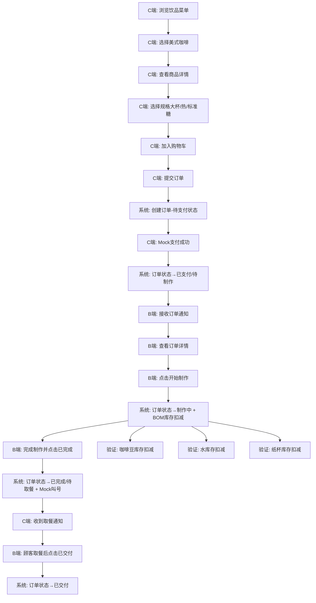

# 端到端测试用例文档 - 小程序美式咖啡下单流程

**功能模块**: 饮品订单管理 - 小程序下单与BOM扣料
**测试版本**: O003-beverage-order v1.0
**编写人**: E2E Test Writer
**编写日期**: 2025-12-29
**Spec 引用**: [spec.md](./spec.md)

---

## 📋 测试概述

### 测试目标
验证小程序用户下单购买"美式咖啡"饮品的完整业务流程,包括:
1. C端小程序下单流程的完整性和正确性
2. 订单状态流转的准确性(待支付 → 已支付 → 制作中 → 已完成 → 已交付)
3. BOM原料库存在各个订单状态变化时的正确扣减
4. 上餐后订单状态是否正确更新为"待取餐"(即已完成状态)
5. 各环节数据一致性和完整性

### 业务流程图


### 涉及系统/模块
- [x] B端管理后台 (React + Ant Design)
- [x] C端小程序 (Taro 微信小程序)
- [x] 后端API (Spring Boot)
- [x] 数据库 (Supabase PostgreSQL)
- [x] 库存管理模块 (P003/P004)

---

## 🔑 关键业务节点

| 节点序号 | 节点名称 | 操作端 | 关键检查点 |
|---------|---------|-------|----------|
| 1 | 饮品菜单浏览 | C端 | 饮品列表展示、美式咖啡可见、价格正确 |
| 2 | 商品详情查看 | C端 | 详情页展示、规格选择器可用、库存充足 |
| 3 | 加入购物车 | C端 | 购物车数量更新、价格计算正确 |
| 4 | 提交订单 | C端 | 订单创建成功、订单号生成、取餐号生成 |
| 5 | 支付成功 | C端 | Mock支付成功、订单状态变更为"待制作" |
| 6 | B端接收订单 | B端 | 订单列表显示新订单、轮询通知生效 |
| 7 | 开始制作 | B端 | 订单状态→制作中、BOM库存扣减触发 |
| 8 | BOM库存扣减 | 系统 | 咖啡豆/水/纸杯库存正确扣减、扣减日志记录 |
| 9 | 完成制作 | B端 | 订单状态→已完成、Mock叫号提示 |
| 10 | 顾客取餐 | B端 | 订单状态→已交付、订单归档 |

---

## 📝 测试用例清单

### TC-BEV-001: 小程序下单美式咖啡 - 正向完整流程

**用例ID**: TC-BEV-001
**优先级**: 🔴 高
**测试类型**: 端到端测试 (E2E)

**前置条件**:
- [x] 饮品"美式咖啡"已在B端配置并上架
  - 商品名称: 美式咖啡
  - 分类: COFFEE
  - 基础价格: ¥15.00
  - 状态: ACTIVE (已上架)
- [x] 美式咖啡已配置规格:
  - SIZE: 中杯(+0元) / 大杯(+3元)
  - TEMPERATURE: 热 / 冰
  - SWEETNESS: 无糖 / 半糖 / 标准糖
- [x] 美式咖啡已配置BOM配方:
  - 咖啡豆: 20g/杯 (大杯25g)
  - 水: 200ml/杯 (大杯250ml)
  - 纸杯: 1个/杯
- [x] 原料库存充足:
  - 咖啡豆: 1000g
  - 水: 5000ml
  - 纸杯: 100个
- [x] C端用户已完成静默登录
- [x] B端管理后台已打开(无需登录)
- [x] 小程序底部导航栏包含"点餐菜单"tab

**测试数据**:
```yaml
用户信息:
  用户昵称: 测试用户A

订单信息:
  饮品: 美式咖啡
  规格: 大杯 + 热 + 标准糖
  数量: 1杯
  单价: ¥18.00 (基础价15 + 大杯加价3)
  总价: ¥18.00

原料消耗预期:
  咖啡豆: -25g
  水: -250ml
  纸杯: -1个
```

**测试步骤**:

| 步骤 | 操作端 | 操作描述 | 预期结果 | 实际结果 | 通过状态 |
|-----|-------|---------|---------|---------|---------|
| 1 | C端 | 打开小程序,点击底部导航栏"点餐菜单"tab | ✅ 进入饮品菜单页,按分类展示饮品列表 | | ☐ 通过 ☐ 失败 |
| 2 | C端 | 在"咖啡"分类下找到"美式咖啡",查看展示信息 | ✅ 显示:商品图片、名称"美式咖啡"、价格"¥15起"、状态"有货" | | ☐ 通过 ☐ 失败 |
| 3 | C端 | 点击"美式咖啡"商品卡片 | ✅ 进入商品详情页,显示大图、描述、规格选择器(大小/温度/甜度) | | ☐ 通过 ☐ 失败 |
| 4 | C端 | 在规格选择器中选择:大杯 | ✅ 大杯选项高亮,价格更新为"¥18.00"(+3元) | | ☐ 通过 ☐ 失败 |
| 5 | C端 | 选择温度:热 | ✅ 热选项高亮,价格不变 | | ☐ 通过 ☐ 失败 |
| 6 | C端 | 选择甜度:标准糖 | ✅ 标准糖选项高亮,价格不变 | | ☐ 通过 ☐ 失败 |
| 7 | C端 | 点击"加入购物车"按钮 | ✅ Toast提示"已添加到购物车",购物车图标角标显示"1" | | ☐ 通过 ☐ 失败 |
| 8 | C端 | 点击右上角购物车图标 | ✅ 进入购物车页面,显示:商品名称"美式咖啡(大杯/热/标准糖)" x1、单价¥18.00、小计¥18.00、总价¥18.00 | | ☐ 通过 ☐ 失败 |
| 9 | C端 | 点击"去结算"按钮 | ✅ 进入订单确认页,显示:订单商品列表、总价¥18.00、"提交订单"按钮 | | ☐ 通过 ☐ 失败 |
| 10 | C端 | 点击"提交订单"按钮 | ✅ 订单创建成功,跳转到订单详情页,显示:订单号(格式BORDT+时间戳+随机数)、取餐号(如001)、订单状态"待支付"、"去支付"按钮 | | ☐ 通过 ☐ 失败 |
| 11 | C端 | 点击"去支付"按钮 | ✅ Mock支付自动成功,页面显示"支付成功",订单状态更新为"待制作" | | ☐ 通过 ☐ 失败 |
| 12 | B端 | 打开B端订单管理页面,等待5-10秒(轮询间隔) | ✅ 订单列表自动刷新,显示新订单:订单号、取餐号、饮品"美式咖啡(大杯/热/标准糖)"、状态"待制作"、下单时间 | | ☐ 通过 ☐ 失败 |
| 13 | B端 | 点击订单,查看订单详情 | ✅ 显示:顾客备注(如无则为空)、饮品配方、所需原料(咖啡豆25g、水250ml、纸杯1个)、"开始制作"按钮 | | ☐ 通过 ☐ 失败 |
| 14 | B端 | 点击"开始制作"按钮 | ✅ 订单状态更新为"制作中",按钮变为"标记完成",C端订单详情页状态同步更新为"制作中" | | ☐ 通过 ☐ 失败 |
| 15 | 系统 | 验证BOM库存扣减(后置检查) | ✅ 触发BOM自动扣料,调用P004库存调整API,原料库存正确扣减(见后置检查清单) | | ☐ 通过 ☐ 失败 |
| 16 | B端 | 完成饮品制作,点击"标记完成"按钮 | ✅ 订单状态更新为"已完成",B端显示"已叫号"提示(Mock语音播报),C端收到小程序推送通知"您的订单已完成,请取餐" | | ☐ 通过 ☐ 失败 |
| 17 | C端 | 查看订单详情页 | ✅ 订单状态显示"已完成",显示取餐号"001",显示"等待取餐"提示 | | ☐ 通过 ☐ 失败 |
| 18 | B端 | 顾客取餐后,点击"已交付"按钮 | ✅ 订单状态更新为"已交付",订单从待处理列表移动到历史订单列表,C端订单状态同步更新 | | ☐ 通过 ☐ 失败 |

**后置检查 - BOM库存扣减验证**:

在步骤15完成后,立即执行以下数据库检查:

| 检查项 | 检查方式 | 检查内容 | 预期值 | 实际值 | 状态 |
|-------|---------|---------|-------|-------|------|
| 咖啡豆库存 | API查询/数据库查询 | `store_inventory`表,SKU=咖啡豆的`available_qty` | 1000g - 25g = 975g | | ☐ ✅ ☐ ❌ |
| 水库存 | API查询/数据库查询 | `store_inventory`表,SKU=水的`available_qty` | 5000ml - 250ml = 4750ml | | ☐ ✅ ☐ ❌ |
| 纸杯库存 | API查询/数据库查询 | `store_inventory`表,SKU=纸杯的`available_qty` | 100个 - 1个 = 99个 | | ☐ ✅ ☐ ❌ |
| 库存调整日志 | 数据库查询 | `inventory_adjustments`表,查询最新3条记录 | 3条记录:咖啡豆-25g、水-250ml、纸杯-1个,reason_code="BOM_DEDUCTION",remarks包含订单号 | | ☐ ✅ ☐ ❌ |
| BOM扣料日志 | 后端日志 | 搜索日志关键词"BomDeduction - SUCCESS" | 日志包含:orderNumber、总原料数3、成功扣减3 | | ☐ ✅ ☐ ❌ |

**后置检查 - 订单数据验证**:

| 检查项 | 检查位置 | 检查内容 | 预期值 | 实际值 | 状态 |
|-------|---------|---------|-------|-------|------|
| 订单状态 | `beverage_orders.status` | 订单最终状态 | DELIVERED | | ☐ ✅ ☐ ❌ |
| 订单总价 | `beverage_orders.total_price` | 订单总价 | 18.00 | | ☐ ✅ ☐ ❌ |
| 支付时间 | `beverage_orders.paid_at` | 支付时间戳 | 不为空,步骤11的时间 | | ☐ ✅ ☐ ❌ |
| 制作开始时间 | `beverage_orders.production_start_time` | 制作开始时间戳 | 不为空,步骤14的时间 | | ☐ ✅ ☐ ❌ |
| 完成时间 | `beverage_orders.completed_at` | 完成时间戳 | 不为空,步骤16的时间 | | ☐ ✅ ☐ ❌ |
| 交付时间 | `beverage_orders.delivered_at` | 交付时间戳 | 不为空,步骤18的时间 | | ☐ ✅ ☐ ❌ |

---

### TC-BEV-002: 订单状态流转异常 - 制作中时库存不足

**用例ID**: TC-BEV-002
**优先级**: 🔴 高
**测试类型**: 异常测试

**前置条件**:
- [x] 美式咖啡已配置并上架
- [x] 订单已创建并支付成功,状态为"待制作"
- [x] **异常设置**: 手动将"咖啡豆"库存调整为10g (不足制作1杯大杯美式所需的25g)

**异常场景**: B端工作人员点击"开始制作"时,咖啡豆库存不足,BOM扣料失败

**测试步骤**:

| 步骤 | 操作端 | 操作描述 | 预期结果 | 实际结果 | 通过状态 |
|-----|-------|---------|---------|---------|---------|
| 1 | B端 | 打开订单详情,查看原料需求 | ✅ 显示:咖啡豆25g、水250ml、纸杯1个 | | ☐ 通过 ☐ 失败 |
| 2 | B端 | 点击"开始制作"按钮 | ✅ 系统执行库存验证,发现咖啡豆库存不足(10g < 25g),阻止扣料 | | ☐ 通过 ☐ 失败 |
| 3 | B端 | 查看错误提示 | ✅ 显示错误提示:"库存不足,无法完成扣料:\n咖啡豆: 可用库存 10 g < 需求 25 g" | | ☐ 通过 ☐ 失败 |
| 4 | 系统 | 验证订单状态 | ✅ 订单状态仍为"待制作",未变更为"制作中" | | ☐ 通过 ☐ 失败 |
| 5 | 系统 | 验证库存数据 | ✅ 所有原料库存未被扣减(咖啡豆10g、水5000ml、纸杯100个保持不变) | | ☐ 通过 ☐ 失败 |

**异常处理验证**:
- [x] 错误提示准确,包含库存不足的具体原料和数量
- [x] 订单状态未被错误更新
- [x] 库存数据完全未被扣减(事务回滚生效)
- [x] 后端日志记录异常:"BomDeduction - INSUFFICIENT_INVENTORY"

---

### TC-BEV-003: 订单取消与库存回退

**用例ID**: TC-BEV-003
**优先级**: 🟡 中
**测试类型**: 异常测试

**测试场景3**: 订单制作中取消(需补货或库存回退)

**前置条件**:
- [x] 订单已开始制作,状态为"制作中"
- [x] BOM库存已扣减

**测试步骤**:

| 步骤 | 操作端 | 操作描述 | 预期结果 | 实际结果 | 通过状态 |
|-----|-------|---------|---------|---------|---------|
| 1 | B端 | 订单状态"制作中",BOM已扣料(咖啡豆-25g、水-250ml、纸杯-1) | ✅ 库存已扣减 | | ☐ 通过 ☐ 失败 |
| 2 | B端 | 发现原料不足或制作失败,点击"标记缺料"按钮 | ✅ 弹出对话框,要求填写缺料原因 | | ☐ 通过 ☐ 失败 |
| 3 | B端 | 填写缺料原因"咖啡豆实际不足",提交 | ✅ 订单状态更新为"已取消",原因标注"缺料:咖啡豆实际不足" | | ☐ 通过 ☐ 失败 |
| 4 | 系统 | 执行库存回退 | ✅ **重要**: 调用P004库存调整API,执行库存回加操作:咖啡豆+25g、水+250ml、纸杯+1,reason_code="BOM_ROLLBACK" | | ☐ 通过 ☐ 失败 |
| 5 | 系统 | 验证库存数据 | ✅ 库存恢复到扣减前状态 | | ☐ 通过 ☐ 失败 |
| 6 | 系统 | 触发退款流程 | ✅ 通知C端用户订单已取消,退款处理中 | | ☐ 通过 ☐ 失败 |

---

### TC-BEV-004: 并发订单BOM扣料一致性

**用例ID**: TC-BEV-004
**优先级**: 🟡 中
**测试类型**: 并发测试

**前置条件**:
- [x] 咖啡豆库存设置为100g (仅够制作4杯大杯美式)
- [x] 准备5个订单,每个订单1杯大杯美式(每杯需25g咖啡豆)

**测试场景**: 高峰期多个订单同时开始制作,验证库存扣减的原子性和一致性

**测试步骤**:

| 步骤 | 操作端 | 操作描述 | 预期结果 | 实际结果 | 通过状态 |
|-----|-------|---------|---------|---------|---------|
| 1 | B端 | 5个订单全部处于"待制作"状态 | ✅ 订单列表显示5个待处理订单 | | ☐ 通过 ☐ 失败 |
| 2 | B端 | 同时点击(或脚本模拟并发)5个订单的"开始制作"按钮 | ✅ 系统串行处理,前4个订单扣料成功,第5个订单因库存不足扣料失败 | | ☐ 通过 ☐ 失败 |
| 3 | 系统 | 验证成功订单状态 | ✅ 前4个订单状态更新为"制作中" | | ☐ 通过 ☐ 失败 |
| 4 | 系统 | 验证失败订单状态 | ✅ 第5个订单状态仍为"待制作",显示错误提示"库存不足" | | ☐ 通过 ☐ 失败 |
| 5 | 系统 | 验证库存数据 | ✅ 咖啡豆库存=100g - 4*25g = 0g,无超扣或重复扣减 | | ☐ 通过 ☐ 失败 |
| 6 | 系统 | 验证库存调整日志 | ✅ `inventory_adjustments`表包含4条扣料记录,每条25g,总计100g | | ☐ 通过 ☐ 失败 |

---

## 🔄 状态流转测试

### 饮品订单状态流转验证

| 当前状态 | 操作 | 目标状态 | 是否允许 | 测试结果 | 备注 |
|---------|------|---------|---------|---------|------|
| PENDING_PAYMENT (待支付) | Mock支付成功 | PENDING_PRODUCTION (待制作) | ✅ | ☐ 通过 ☐ 失败 | FR-008 |
| PENDING_PAYMENT (待支付) | 取消订单 | CANCELLED (已取消) | ✅ | ☐ 通过 ☐ 失败 | - |
| PENDING_PAYMENT (待支付) | 直接开始制作 | PRODUCING (制作中) | ❌ | ☐ 通过 ☐ 失败 | 应阻止,必须先支付 |
| PENDING_PRODUCTION (待制作) | 点击开始制作 | PRODUCING (制作中) | ✅ | ☐ 通过 ☐ 失败 | FR-014 + BOM扣料 |
| PENDING_PRODUCTION (待制作) | 申请退款 | CANCELLED (已取消) | ✅ | ☐ 通过 ☐ 失败 | 未扣料,可取消 |
| PRODUCING (制作中) | 完成制作 | COMPLETED (已完成) | ✅ | ☐ 通过 ☐ 失败 | FR-017 叫号通知 |
| PRODUCING (制作中) | 标记缺料 | CANCELLED (已取消) | ✅ | ☐ 通过 ☐ 失败 | 需填写缺料原因+库存回退 |
| COMPLETED (已完成) | 顾客取餐 | DELIVERED (已交付) | ✅ | ☐ 通过 ☐ 失败 | FR-018 |
| DELIVERED (已交付) | 任何操作 | 任何状态 | ❌ | ☐ 通过 ☐ 失败 | 终态,不可流转 |
| CANCELLED (已取消) | 任何操作 | 任何状态 | ❌ | ☐ 通过 ☐ 失败 | 终态,不可流转 |

---

## 📊 数据验证检查清单

### BOM库存扣减详细验证

**测试订单**: 1杯大杯美式咖啡(热/标准糖)

| 原料名称 | 扣减前库存 | 消耗数量 | 扣减后库存 | 单位 | 数据库字段 | 验证状态 |
|---------|-----------|---------|-----------|------|-----------|---------|
| 咖啡豆 | 1000 | 25 | 975 | g | `store_inventory.available_qty` | ☐ ✅ ☐ ❌ |
| 水 | 5000 | 250 | 4750 | ml | `store_inventory.available_qty` | ☐ ✅ ☐ ❌ |
| 纸杯 | 100 | 1 | 99 | 个 | `store_inventory.available_qty` | ☐ ✅ ☐ ❌ |

### 库存调整日志验证

查询SQL示例:
```sql
SELECT * FROM inventory_adjustments
WHERE reason_code = 'BOM_DEDUCTION'
  AND remarks LIKE '%订单号: BORDT%'
ORDER BY created_at DESC
LIMIT 3;
```

| 字段 | 预期值 | 实际值 | 验证状态 |
|-----|-------|-------|---------|
| adjustment_type | 'shortage' (盘亏) | | ☐ ✅ ☐ ❌ |
| quantity (咖啡豆) | 25 | | ☐ ✅ ☐ ❌ |
| quantity (水) | 250 | | ☐ ✅ ☐ ❌ |
| quantity (纸杯) | 1 | | ☐ ✅ ☐ ❌ |
| reason_code | 'BOM_DEDUCTION' | | ☐ ✅ ☐ ❌ |
| reason_text | '饮品订单自动扣料' | | ☐ ✅ ☐ ❌ |
| remarks | 包含订单号 | | ☐ ✅ ☐ ❌ |

### 订单时间戳验证

| 时间字段 | 更新时机 | 预期值 | 实际值 | 验证状态 |
|---------|---------|-------|-------|---------|
| created_at | 订单创建时 | 不为空 | | ☐ ✅ ☐ ❌ |
| paid_at | 支付成功时 | 不为空,晚于created_at | | ☐ ✅ ☐ ❌ |
| production_start_time | 开始制作时 | 不为空,晚于paid_at | | ☐ ✅ ☐ ❌ |
| completed_at | 完成制作时 | 不为空,晚于production_start_time | | ☐ ✅ ☐ ❌ |
| delivered_at | 交付时 | 不为空,晚于completed_at | | ☐ ✅ ☐ ❌ |
| 时间逻辑 | 整体验证 | created_at < paid_at < production_start_time < completed_at < delivered_at | | ☐ ✅ ☐ ❌ |

---

## 📈 测试总结

### 关键验证点总结

✅ **必须验证通过的关键点**:
1. 订单状态流转准确性 (PENDING_PAYMENT → PENDING_PRODUCTION → PRODUCING → COMPLETED → DELIVERED)
2. BOM库存扣减准确性 (咖啡豆-25g、水-250ml、纸杯-1个)
3. 库存扣减时机正确 (仅在"开始制作"时扣减,而非支付时)
4. 上餐后状态更新正确 (COMPLETED状态即"待取餐"/"已完成")
5. 库存不足时阻止扣料并事务回滚
6. 取消订单时库存正确回退
7. 并发场景下库存无超扣或重复扣减

---

## 📎 附录

### 测试数据清理脚本
```sql
-- 清理测试订单数据
DELETE FROM beverage_order_items WHERE order_id IN (
  SELECT id FROM beverage_orders WHERE order_number LIKE 'BORDT%TEST%'
);
DELETE FROM beverage_orders WHERE order_number LIKE 'BORDT%TEST%';

-- 重置测试库存
UPDATE store_inventory SET available_qty = 1000 WHERE sku_id = '[咖啡豆SKU_ID]';
UPDATE store_inventory SET available_qty = 5000 WHERE sku_id = '[水SKU_ID]';
UPDATE store_inventory SET available_qty = 100 WHERE sku_id = '[纸杯SKU_ID]';
```

---

**文档版本**: v1.0
**最后更新**: 2025-12-29
