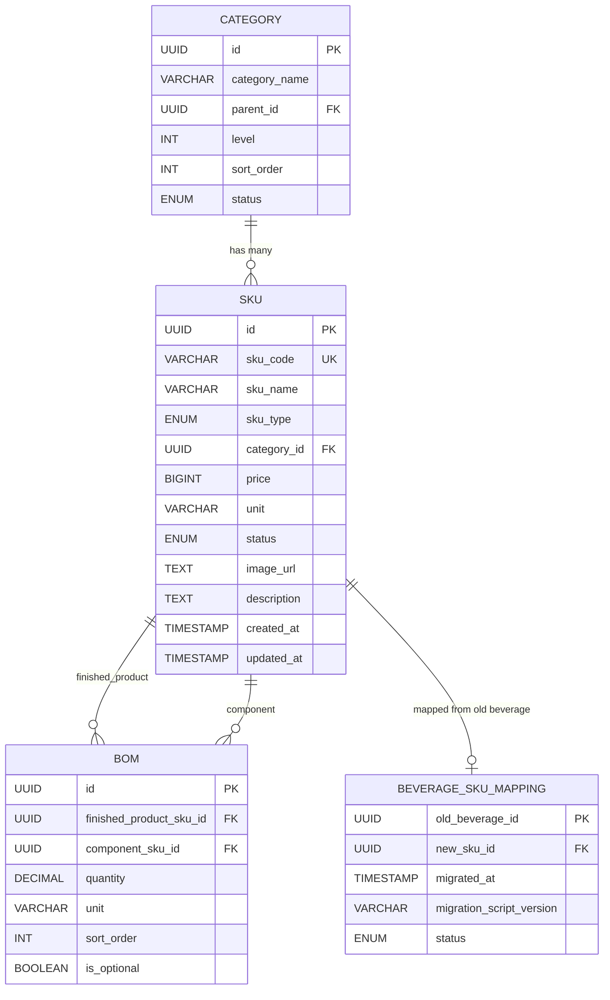

# Data Model: 饮品模块复用SKU管理能力

**@spec O004-beverage-sku-reuse**

**Date**: 2025-12-31 | **Phase**: 1 (Design & Contracts)

## Overview

This document defines the data models and entity relationships for the beverage SKU reuse feature. All entities are persisted in Supabase PostgreSQL and managed through Spring Boot JPA repositories.

## Entities

### 1. SKU (Stock Keeping Unit)

**Purpose**: 商品库存单位，表示可独立管理和售卖的商品项（包括成品饮品、包材、原料）

**Table Name**: `skus`

**Fields**:

| Field | Type | Constraints | Description |
|-------|------|-------------|-------------|
| `id` | UUID | PRIMARY KEY | SKU唯一标识符 |
| `sku_code` | VARCHAR(50) | NOT NULL, UNIQUE | SKU编码（如 FIN-MOJITO-001） |
| `sku_name` | VARCHAR(100) | NOT NULL | SKU名称（如 薄荷威士忌鸡尾酒） |
| `sku_type` | ENUM | NOT NULL | SKU类型：finished_product, packaging, raw_material |
| `category_id` | UUID | FOREIGN KEY → categories(id) | 所属分类ID |
| `price` | BIGINT | NOT NULL | 价格（单位：分，如 3500 = 35.00元） |
| `unit` | VARCHAR(20) | NOT NULL | 计量单位（如 份、个、毫升、克） |
| `status` | ENUM | NOT NULL, DEFAULT 'enabled' | 状态：enabled, disabled, draft |
| `image_url` | TEXT | NULLABLE | 商品图片URL（可选） |
| `description` | TEXT | NULLABLE | 商品描述（可选） |
| `created_at` | TIMESTAMP | NOT NULL, DEFAULT NOW() | 创建时间 |
| `updated_at` | TIMESTAMP | NOT NULL, DEFAULT NOW() | 更新时间 |
| `created_by` | UUID | FOREIGN KEY → users(id), NULLABLE | 创建人ID |
| `updated_by` | UUID | FOREIGN KEY → users(id), NULLABLE | 更新人ID |

**Validation Rules**:

- `sku_code` 格式：
  - finished_product: `FIN-{NAME}-{SEQUENCE}` (如 FIN-MOJITO-001)
  - packaging: `PKG-{NAME}-{SEQUENCE}` (如 PKG-CUP-001)
  - raw_material: `RAW-{NAME}-{SEQUENCE}` (如 RAW-WHISKEY-001)
- `sku_name` 长度：1-100字符
- `price` 必须 > 0
- `unit` 必须为非空字符串（1-20字符）
- `sku_type` 枚举值严格校验（不允许其他值）

**State Transitions**:

```
draft → enabled      (草稿发布为启用)
enabled → disabled   (启用停用)
disabled → enabled   (停用重新启用)
enabled → draft      (禁止：启用不能回到草稿)
```

**Indexes**:

- PRIMARY KEY: `id`
- UNIQUE INDEX: `sku_code`
- INDEX: `category_id` (用于按分类查询)
- INDEX: `sku_type` (用于按类型过滤，FR-006关键查询)
- INDEX: `status` (用于按状态过滤)

---

### 2. Category (分类)

**Purpose**: 商品分类，支持层级结构（如 饮品 > 鸡尾酒）

**Table Name**: `categories`

**Fields**:

| Field | Type | Constraints | Description |
|-------|------|-------------|-------------|
| `id` | UUID | PRIMARY KEY | 分类唯一标识符 |
| `category_name` | VARCHAR(50) | NOT NULL | 分类名称（如 鸡尾酒、软饮、包材） |
| `parent_id` | UUID | FOREIGN KEY → categories(id), NULLABLE | 父分类ID（NULL表示顶级分类） |
| `level` | INT | NOT NULL | 层级（1=顶级，2=二级，依此类推） |
| `sort_order` | INT | NOT NULL, DEFAULT 0 | 排序序号 |
| `status` | ENUM | NOT NULL, DEFAULT 'enabled' | 状态：enabled, disabled |
| `created_at` | TIMESTAMP | NOT NULL, DEFAULT NOW() | 创建时间 |
| `updated_at` | TIMESTAMP | NOT NULL, DEFAULT NOW() | 更新时间 |

**Validation Rules**:

- `category_name` 长度：1-50字符
- `parent_id` 必须指向存在的分类（或为NULL）
- `level` 必须 ≥ 1，最大层级建议 ≤ 3
- 同一父分类下的 `category_name` 不能重复

**Hierarchical Structure**:

```
饮品 (level=1, parent_id=NULL)
├── 鸡尾酒 (level=2, parent_id=饮品.id)
├── 软饮 (level=2, parent_id=饮品.id)
└── 果汁 (level=2, parent_id=饮品.id)

包材 (level=1, parent_id=NULL)
├── 容器 (level=2, parent_id=包材.id)
└── 餐具 (level=2, parent_id=包材.id)
```

**Indexes**:

- PRIMARY KEY: `id`
- INDEX: `parent_id` (用于查询子分类)
- INDEX: `level` (用于按层级查询)

---

### 3. BOM (Bill of Materials - 配方清单)

**Purpose**: 成品SKU的配方组成，定义原料和包材的用量关系

**Table Name**: `boms`

**Fields**:

| Field | Type | Constraints | Description |
|-------|------|-------------|-------------|
| `id` | UUID | PRIMARY KEY | BOM唯一标识符 |
| `finished_product_sku_id` | UUID | FOREIGN KEY → skus(id), NOT NULL | 成品SKU ID（必须是 sku_type=finished_product） |
| `component_sku_id` | UUID | FOREIGN KEY → skus(id), NOT NULL | 组成部分SKU ID（可以是 raw_material 或 packaging） |
| `quantity` | DECIMAL(10,3) | NOT NULL | 用量（如 30.000 毫升威士忌） |
| `unit` | VARCHAR(20) | NOT NULL | 单位（必须与 component_sku.unit 一致） |
| `sort_order` | INT | NOT NULL, DEFAULT 0 | 排序序号 |
| `is_optional` | BOOLEAN | NOT NULL, DEFAULT FALSE | 是否可选组件（如可选加料） |
| `created_at` | TIMESTAMP | NOT NULL, DEFAULT NOW() | 创建时间 |
| `updated_at` | TIMESTAMP | NOT NULL, DEFAULT NOW() | 更新时间 |

**Validation Rules**:

- `finished_product_sku_id` 必须指向 `sku_type = 'finished_product'` 的SKU（FR-006核心约束）
- `component_sku_id` 必须指向 `sku_type IN ('raw_material', 'packaging')` 的SKU
- `component_sku_id` 不能等于 `finished_product_sku_id`（禁止循环引用）
- `quantity` 必须 > 0
- `unit` 必须与 `skus.unit` 匹配（如果 component_sku.unit = '毫升'，则 BOM.unit 也必须是 '毫升'）
- 同一成品SKU下，`component_sku_id` 不能重复（一个成品不能重复添加同一组件）

**Example Data**:

```sql
-- 薄荷威士忌鸡尾酒 (FIN-MOJITO-001) 的配方
INSERT INTO boms (finished_product_sku_id, component_sku_id, quantity, unit, sort_order) VALUES
  ('sku-mojito-uuid', 'sku-whiskey-raw-uuid', 30.000, '毫升', 1),  -- 威士忌原液
  ('sku-mojito-uuid', 'sku-cola-raw-uuid', 200.000, '毫升', 2),     -- 可乐浓缩液
  ('sku-mojito-uuid', 'sku-cup-pkg-uuid', 1.000, '个', 3),          -- 杯子
  ('sku-mojito-uuid', 'sku-straw-pkg-uuid', 1.000, '根', 4);        -- 吸管
```

**Indexes**:

- PRIMARY KEY: `id`
- INDEX: `finished_product_sku_id` (用于查询成品的所有组件，FR-008关键查询)
- INDEX: `component_sku_id` (用于反向查询某个原料/包材被哪些成品使用)
- UNIQUE INDEX: `(finished_product_sku_id, component_sku_id)` (防止重复添加)

---

### 4. BeverageSkuMapping (饮品SKU映射表)

**Purpose**: 数据迁移时记录旧饮品ID → 新SKU ID的映射关系，用于向下兼容和数据追溯

**Table Name**: `beverage_sku_mapping`

**Fields**:

| Field | Type | Constraints | Description |
|-------|------|-------------|-------------|
| `old_beverage_id` | UUID | PRIMARY KEY | 旧饮品管理表 beverage_config 的 ID |
| `new_sku_id` | UUID | FOREIGN KEY → skus(id), NOT NULL | 迁移后的SKU ID |
| `migrated_at` | TIMESTAMP | NOT NULL, DEFAULT NOW() | 迁移时间 |
| `migration_script_version` | VARCHAR(50) | NOT NULL | 迁移脚本版本号（如 V2025_12_31_001） |
| `status` | ENUM | NOT NULL, DEFAULT 'active' | 映射状态：active, deprecated |

**Validation Rules**:

- `old_beverage_id` 必须唯一（每个旧饮品只能映射到一个新SKU）
- `new_sku_id` 必须指向 `sku_type = 'finished_product'` 的SKU
- `migration_script_version` 必须匹配实际运行的Flyway脚本版本

**Use Case**:

1. **数据迁移查询**：`SELECT new_sku_id FROM beverage_sku_mapping WHERE old_beverage_id = 'xxx'`
2. **向下兼容**：旧系统引用 `beverage_id` 时，通过映射表查询对应的 `new_sku_id`
3. **回滚支持**：记录迁移时间和版本，支持数据回滚

**Indexes**:

- PRIMARY KEY: `old_beverage_id`
- INDEX: `new_sku_id` (用于反向查询)

---

## Entity Relationships

### ER Diagram (Mermaid Syntax)



### Relationship Descriptions

1. **Category → SKU (1:N)**
   - 一个分类可以包含多个SKU
   - 一个SKU必须属于一个分类（`category_id NOT NULL`）
   - 删除分类时，必须先移除或重新分配所有关联SKU（防止孤儿数据）

2. **SKU → BOM (1:N, as finished_product)**
   - 一个成品SKU可以有多个BOM记录（多个原料/包材组成）
   - 一个BOM记录必须关联一个成品SKU（`finished_product_sku_id NOT NULL`）
   - 约束：`finished_product_sku.sku_type = 'finished_product'`（通过数据库CHECK约束或应用层验证）

3. **SKU → BOM (1:N, as component)**
   - 一个原料/包材SKU可以被多个BOM记录引用（多个成品复用）
   - 一个BOM记录必须关联一个组件SKU（`component_sku_id NOT NULL`）
   - 约束：`component_sku.sku_type IN ('raw_material', 'packaging')`

4. **SKU → BeverageSkuMapping (1:1)**
   - 一个新SKU可以被一个旧饮品ID映射（迁移数据）
   - 一个旧饮品ID只能映射到一个新SKU（`old_beverage_id PRIMARY KEY`）
   - 仅用于数据迁移和向下兼容，新创建的SKU不会有映射记录

---

## Validation Rules Summary

### Cross-Entity Validation

1. **FR-006 约束 - BOM只能关联finished_product SKU**:
   ```sql
   -- Database CHECK constraint
   ALTER TABLE boms ADD CONSTRAINT chk_bom_finished_product
   CHECK (
     EXISTS (
       SELECT 1 FROM skus
       WHERE id = finished_product_sku_id
       AND sku_type = 'finished_product'
     )
   );

   -- Application Layer (Zod Schema)
   const bomSchema = z.object({
     finished_product_sku_id: z.string().uuid().refine(async (id) => {
       const sku = await skuService.findById(id);
       return sku.sku_type === 'finished_product';
     }, { message: 'BOM只能关联finished_product类型的SKU' })
   });
   ```

2. **FR-007 约束 - SKU选择器过滤finished_product**:
   ```typescript
   // Frontend: SKU Selector Component
   const { data: skus } = useQuery({
     queryKey: ['skus', { type: 'finished_product' }],
     queryFn: () => fetchSkus({ type: 'finished_product' }),
   });

   // Backend: SKU Query API
   @GetMapping("/api/skus")
   public List<SKU> getSkus(@RequestParam(required = false) String type) {
     if (type != null) {
       return skuRepository.findBySkuType(SkuType.valueOf(type.toUpperCase()));
     }
     return skuRepository.findAll();
   }
   ```

3. **Data Integrity on Delete**:
   - 删除SKU前，必须检查是否被BOM引用：
     ```sql
     -- 如果 component_sku_id 被引用，禁止删除
     SELECT COUNT(*) FROM boms WHERE component_sku_id = 'target-sku-id';
     -- 如果 > 0，抛出异常 "SKU_REF_001: SKU被配方引用，无法删除"
     ```
   - 删除分类前，必须检查是否有SKU关联：
     ```sql
     SELECT COUNT(*) FROM skus WHERE category_id = 'target-category-id';
     -- 如果 > 0，抛出异常 "CAT_REF_001: 分类下存在SKU，无法删除"
     ```

---

## State Management

### Frontend State (Zustand)

**SKU管理界面客户端状态**:

```typescript
interface SKUManagementState {
  // UI状态
  isModalOpen: boolean;           // SKU创建/编辑模态框
  selectedSkuType: SkuType | null; // 当前选择的SKU类型（用于过滤）
  searchKeyword: string;           // 搜索关键词
  currentPage: number;             // 当前页码
  pageSize: number;                // 每页条数

  // Actions
  openModal: () => void;
  closeModal: () => void;
  setSkuType: (type: SkuType | null) => void;
  setSearchKeyword: (keyword: string) => void;
  setPage: (page: number) => void;
}
```

### Server State (TanStack Query)

**SKU数据查询与缓存**:

```typescript
// Query Key Factory
export const skuKeys = {
  all: ['skus'] as const,
  lists: () => [...skuKeys.all, 'list'] as const,
  list: (filters: { type?: string; category?: string; keyword?: string }) =>
    [...skuKeys.lists(), filters] as const,
  detail: (id: string) => [...skuKeys.all, 'detail', id] as const,
};

// Query Hook
export const useSkus = (filters: { type?: string; category?: string; keyword?: string }) => {
  return useQuery({
    queryKey: skuKeys.list(filters),
    queryFn: () => fetchSkus(filters),
    staleTime: 5 * 60 * 1000, // 5分钟
    refetchOnWindowFocus: true,
  });
};

// Mutation Hook
export const useCreateSku = () => {
  const queryClient = useQueryClient();
  return useMutation({
    mutationFn: createSku,
    onSuccess: (newSku) => {
      queryClient.invalidateQueries({ queryKey: skuKeys.lists() });
      queryClient.setQueryData(skuKeys.detail(newSku.id), newSku);
    },
  });
};
```

---

## Data Migration Strategy

### Phase 1: Create Mapping Table (Idempotent)

```sql
-- File: backend/src/main/resources/db/migration/V2025_12_31_001__migrate_beverages_to_skus.sql

-- Step 1: Create mapping table
CREATE TABLE IF NOT EXISTS beverage_sku_mapping (
    old_beverage_id UUID PRIMARY KEY,
    new_sku_id UUID NOT NULL REFERENCES skus(id) ON DELETE CASCADE,
    migrated_at TIMESTAMP DEFAULT NOW(),
    migration_script_version VARCHAR(50) NOT NULL DEFAULT 'V2025_12_31_001',
    status VARCHAR(20) NOT NULL DEFAULT 'active'
);

-- Step 2: Migrate beverage_config → skus table
INSERT INTO skus (id, sku_code, sku_name, sku_type, category_id, price, unit, status, created_at, updated_at)
SELECT
    gen_random_uuid() AS id,
    CONCAT('FIN-', UPPER(REPLACE(name, ' ', '-')), '-', LPAD(ROW_NUMBER() OVER (ORDER BY created_at)::TEXT, 3, '0')) AS sku_code,
    name AS sku_name,
    'finished_product' AS sku_type,
    category_id,
    price,
    '份' AS unit,
    CASE WHEN enabled THEN 'enabled' ELSE 'disabled' END AS status,
    created_at,
    updated_at
FROM beverage_config
WHERE NOT EXISTS (
    SELECT 1 FROM beverage_sku_mapping WHERE old_beverage_id = beverage_config.id
)
ON CONFLICT (sku_code) DO NOTHING
RETURNING id;

-- Step 3: Record mapping
INSERT INTO beverage_sku_mapping (old_beverage_id, new_sku_id)
SELECT b.id AS old_beverage_id, s.id AS new_sku_id
FROM beverage_config b
JOIN skus s ON s.sku_name = b.name AND s.sku_type = 'finished_product'
WHERE NOT EXISTS (SELECT 1 FROM beverage_sku_mapping WHERE old_beverage_id = b.id)
ON CONFLICT (old_beverage_id) DO NOTHING;

-- Step 4: Mark old table as deprecated
COMMENT ON TABLE beverage_config IS 'DEPRECATED: Migrated to skus table. See beverage_sku_mapping for ID mapping.';
```

### Rollback Plan

```sql
-- File: backend/src/main/resources/db/migration/V2025_12_31_002__rollback_beverage_migration.sql

-- Delete migrated SKUs and mapping
DELETE FROM skus WHERE id IN (SELECT new_sku_id FROM beverage_sku_mapping);
DELETE FROM beverage_sku_mapping;
```

---

## Performance Considerations

1. **Query Optimization**:
   - `skus` 表的 `sku_type` 字段必须有索引（高频过滤查询）
   - `boms` 表的 `(finished_product_sku_id, component_sku_id)` 复合索引（防止重复添加）
   - `categories` 表的 `parent_id` 索引（层级查询）

2. **Caching Strategy**:
   - SKU列表查询结果缓存5分钟（TanStack Query `staleTime: 5 * 60 * 1000`）
   - 分类树缓存10分钟（层级查询结果不常变化）
   - SKU详情缓存5分钟，更新/删除时立即失效

3. **Pagination**:
   - SKU列表默认分页大小：20条/页
   - 支持虚拟滚动（如果SKU总数 > 1000）

---

## Security Considerations

1. **Input Validation**:
   - 所有SKU字段使用Zod schema验证（前端）+ Bean Validation（后端）
   - `sku_code` 格式严格校验（正则表达式：`^(FIN|PKG|RAW)-[A-Z]+-\d{3}$`）
   - `price` 必须 > 0，防止负数或零价格

2. **Authorization**:
   - SKU创建/编辑/删除操作需要管理员权限（`@PreAuthorize("hasRole('ADMIN')")`）
   - BOM配置操作需要管理员权限
   - 分类管理操作需要管理员权限

3. **Data Integrity**:
   - 使用数据库外键约束保证引用完整性
   - 使用CHECK约束保证枚举值有效性
   - 使用UNIQUE约束防止重复数据

---

## TypeScript Type Definitions

**Frontend Types** (frontend/src/types/sku.ts):

```typescript
/** @spec O004-beverage-sku-reuse */

export enum SkuType {
  FINISHED_PRODUCT = 'finished_product',
  PACKAGING = 'packaging',
  RAW_MATERIAL = 'raw_material',
}

export enum SkuStatus {
  ENABLED = 'enabled',
  DISABLED = 'disabled',
  DRAFT = 'draft',
}

export interface SKU {
  id: string;
  skuCode: string;
  skuName: string;
  skuType: SkuType;
  categoryId: string;
  price: number; // 单位：分
  unit: string;
  status: SkuStatus;
  imageUrl?: string;
  description?: string;
  createdAt: string; // ISO 8601
  updatedAt: string; // ISO 8601
  createdBy?: string;
  updatedBy?: string;
}

export interface Category {
  id: string;
  categoryName: string;
  parentId?: string;
  level: number;
  sortOrder: number;
  status: 'enabled' | 'disabled';
  createdAt: string;
  updatedAt: string;
}

export interface BOM {
  id: string;
  finishedProductSkuId: string;
  componentSkuId: string;
  quantity: number;
  unit: string;
  sortOrder: number;
  isOptional: boolean;
  createdAt: string;
  updatedAt: string;
}

export interface BeverageSkuMapping {
  oldBeverageId: string;
  newSkuId: string;
  migratedAt: string;
  migrationScriptVersion: string;
  status: 'active' | 'deprecated';
}
```

---

## Java Entity Definitions

**Backend Entities** (backend/src/main/java/com/cinema/entity/):

```java
/**
 * @spec O004-beverage-sku-reuse
 */
@Entity
@Table(name = "skus", indexes = {
    @Index(name = "idx_sku_type", columnList = "sku_type"),
    @Index(name = "idx_category_id", columnList = "category_id"),
    @Index(name = "idx_status", columnList = "status")
})
public class SKU {
    @Id
    @GeneratedValue(strategy = GenerationType.UUID)
    private UUID id;

    @Column(name = "sku_code", nullable = false, unique = true, length = 50)
    private String skuCode;

    @Column(name = "sku_name", nullable = false, length = 100)
    private String skuName;

    @Enumerated(EnumType.STRING)
    @Column(name = "sku_type", nullable = false)
    private SkuType skuType;

    @ManyToOne(fetch = FetchType.LAZY)
    @JoinColumn(name = "category_id", nullable = false)
    private Category category;

    @Column(name = "price", nullable = false)
    private Long price; // 单位：分

    @Column(name = "unit", nullable = false, length = 20)
    private String unit;

    @Enumerated(EnumType.STRING)
    @Column(name = "status", nullable = false)
    private SkuStatus status = SkuStatus.ENABLED;

    @Column(name = "image_url", columnDefinition = "TEXT")
    private String imageUrl;

    @Column(name = "description", columnDefinition = "TEXT")
    private String description;

    @CreatedDate
    @Column(name = "created_at", nullable = false, updatable = false)
    private LocalDateTime createdAt;

    @LastModifiedDate
    @Column(name = "updated_at", nullable = false)
    private LocalDateTime updatedAt;

    // Getters and setters...
}
```

---

## Summary

This data model defines 4 core entities:

1. **SKU**: 商品库存单位（成品、包材、原料）
2. **Category**: 商品分类（支持层级结构）
3. **BOM**: 配方清单（成品 → 原料/包材关系）
4. **BeverageSkuMapping**: 数据迁移映射表（向下兼容）

**Key Design Decisions**:

- ✅ 使用 `sku_type` 枚举区分成品/包材/原料（FR-006核心约束）
- ✅ BOM表通过外键约束保证数据完整性（防止孤儿数据）
- ✅ 价格以"分"为单位存储，避免浮点数精度问题
- ✅ 状态字段使用枚举类型，严格控制有效值
- ✅ 迁移映射表支持数据追溯和回滚

**Next Steps**:

1. ✅ Data Model Complete
2. ⏳ Generate API contracts in `contracts/` directory
3. ⏳ Generate `quickstart.md` for developer onboarding
4. ⏳ Update agent context via `update-agent-context.sh`
