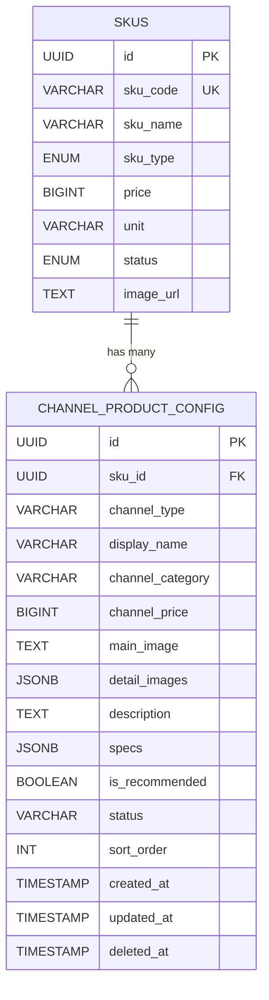

# Data Model: 渠道商品配置

**@spec O005-channel-product-config**

**Date**: 2026-01-01 | **Phase**: 1 (Design & Contracts)

## Overview

本文档定义渠道商品配置功能的数据模型和实体关系。采用 SKU 主数据 + 渠道配置的分层架构。

## Entity Relationships

```
┌──────────────────┐         ┌─────────────────────────┐
│      skus        │ 1     N │  channel_product_config │
│ (SKU 主数据)      │─────────│    (渠道商品配置)        │
│                  │         │                         │
│ - id             │         │ - id                    │
│ - sku_code       │         │ - sku_id (FK)           │
│ - sku_name       │         │ - channel_type          │
│ - sku_type       │         │ - display_name          │
│ - price          │         │ - channel_category      │
│ - ...            │         │ - channel_price         │
└──────────────────┘         │ - main_image            │
                             │ - specs (JSONB)         │
                             │ - ...                   │
                             └─────────────────────────┘
```

---

## Entities

### 1. ChannelProductConfig（渠道商品配置）

**Purpose**: 记录 SKU 成品在特定销售渠道的展示配置

**Table Name**: `channel_product_config`

**Fields**:

| Field | Type | Constraints | Description |
|-------|------|-------------|-------------|
| `id` | UUID | PRIMARY KEY | 配置唯一标识符 |
| `sku_id` | UUID | NOT NULL, FK → skus(id) | 关联的 SKU 成品 ID |
| `channel_type` | VARCHAR(50) | NOT NULL, DEFAULT 'MINI_PROGRAM' | 渠道类型 |
| `display_name` | VARCHAR(100) | NULLABLE | 渠道展示名称（空则使用 SKU 名称） |
| `channel_category` | VARCHAR(50) | NOT NULL | 渠道分类：ALCOHOL/COFFEE/BEVERAGE/SNACK/MEAL/OTHER |
| `channel_price` | BIGINT | NULLABLE | 渠道价格（分），空则使用 SKU 价格 |
| `main_image` | TEXT | NULLABLE | 主图 URL（空则使用 SKU 主图） |
| `detail_images` | JSONB | DEFAULT '[]' | 详情图 URL 数组 |
| `description` | TEXT | NULLABLE | 渠道商品描述 |
| `specs` | JSONB | DEFAULT '[]' | 规格配置（详见下方结构） |
| `is_recommended` | BOOLEAN | DEFAULT FALSE | 是否推荐 |
| `status` | VARCHAR(20) | NOT NULL, DEFAULT 'ACTIVE' | 状态：ACTIVE/INACTIVE/OUT_OF_STOCK |
| `sort_order` | INT | DEFAULT 0 | 排序序号 |
| `created_at` | TIMESTAMP | NOT NULL, DEFAULT NOW() | 创建时间 |
| `updated_at` | TIMESTAMP | NOT NULL, DEFAULT NOW() | 更新时间 |
| `deleted_at` | TIMESTAMP | NULLABLE | 软删除时间 |

**Constraints**:

```sql
-- 同一 SKU 在同一渠道只能配置一次
ALTER TABLE channel_product_config
ADD CONSTRAINT uq_sku_channel UNIQUE (sku_id, channel_type);

-- SKU 必须是 finished_product 类型（应用层校验）
-- 外键约束
ALTER TABLE channel_product_config
ADD CONSTRAINT fk_sku
FOREIGN KEY (sku_id) REFERENCES skus(id) ON DELETE CASCADE;
```

**Indexes**:

```sql
CREATE INDEX idx_channel_product_channel_type ON channel_product_config(channel_type);
CREATE INDEX idx_channel_product_category ON channel_product_config(channel_category);
CREATE INDEX idx_channel_product_status ON channel_product_config(status);
CREATE INDEX idx_channel_product_sku_id ON channel_product_config(sku_id);
```

---

### 2. Specs JSONB 结构

规格配置存储在 `specs` 字段中，采用 JSONB 格式。

**Structure**:

```typescript
interface ChannelProductSpec {
  id: string;           // 规格 ID（UUID）
  type: SpecType;       // 规格类型
  name: string;         // 规格显示名称（如"大小"、"温度"）
  required: boolean;    // 是否必选
  multiSelect: boolean; // 是否多选（如配料可多选）
  options: SpecOption[];
}

interface SpecOption {
  id: string;           // 选项 ID（UUID）
  name: string;         // 选项名称（如"大杯"、"热"）
  priceAdjust: number;  // 价格调整（分），正数加价，负数减价
  isDefault: boolean;   // 是否默认选中
  sortOrder: number;    // 排序序号
}

enum SpecType {
  SIZE = 'SIZE',                 // 大小：小杯/中杯/大杯
  TEMPERATURE = 'TEMPERATURE',   // 温度：冷/热/去冰
  SWEETNESS = 'SWEETNESS',       // 甜度：无糖/半糖/标准/多糖
  TOPPING = 'TOPPING',           // 配料：珍珠/椰果/布丁（可多选）
  SPICINESS = 'SPICINESS',       // 辣度：不辣/微辣/中辣/特辣
  SIDE = 'SIDE',                 // 配菜：薯条/沙拉/洋葱圈
  COOKING = 'COOKING',           // 做法：煎/烤/炸
  CUSTOM = 'CUSTOM',             // 自定义规格
}
```

**Example Data**:

```json
[
  {
    "id": "spec-001",
    "type": "SIZE",
    "name": "大小",
    "required": true,
    "multiSelect": false,
    "options": [
      { "id": "opt-001", "name": "小杯", "priceAdjust": -300, "isDefault": false, "sortOrder": 1 },
      { "id": "opt-002", "name": "中杯", "priceAdjust": 0, "isDefault": true, "sortOrder": 2 },
      { "id": "opt-003", "name": "大杯", "priceAdjust": 500, "isDefault": false, "sortOrder": 3 }
    ]
  },
  {
    "id": "spec-002",
    "type": "TEMPERATURE",
    "name": "温度",
    "required": true,
    "multiSelect": false,
    "options": [
      { "id": "opt-004", "name": "热", "priceAdjust": 0, "isDefault": true, "sortOrder": 1 },
      { "id": "opt-005", "name": "冷", "priceAdjust": 0, "isDefault": false, "sortOrder": 2 },
      { "id": "opt-006", "name": "去冰", "priceAdjust": 0, "isDefault": false, "sortOrder": 3 }
    ]
  },
  {
    "id": "spec-003",
    "type": "TOPPING",
    "name": "加料",
    "required": false,
    "multiSelect": true,
    "options": [
      { "id": "opt-007", "name": "珍珠", "priceAdjust": 200, "isDefault": false, "sortOrder": 1 },
      { "id": "opt-008", "name": "椰果", "priceAdjust": 200, "isDefault": false, "sortOrder": 2 },
      { "id": "opt-009", "name": "布丁", "priceAdjust": 300, "isDefault": false, "sortOrder": 3 }
    ]
  }
]
```

---

### 3. ChannelType（渠道类型枚举）

**Values**:

| Value | Description |
|-------|-------------|
| `MINI_PROGRAM` | 小程序点餐 |
| `POS` | 线下 POS（未来） |
| `DELIVERY` | 外卖平台（未来） |
| `ECOMMERCE` | 电商平台（未来） |

---

### 4. ChannelCategory（渠道分类枚举）

**Values**:

| Value | Label | Description |
|-------|-------|-------------|
| `ALCOHOL` | 酒 | 鸡尾酒、威士忌、啤酒等 |
| `COFFEE` | 咖啡 | 拿铁、美式、卡布奇诺等 |
| `BEVERAGE` | 饮料 | 果汁、奶茶、汽水等 |
| `SNACK` | 小食 | 薯条、爆米花、坚果等 |
| `MEAL` | 餐品 | 汉堡、套餐、沙拉等 |
| `OTHER` | 其他 | 其他商品 |

---

## ER Diagram



---

## Database Migration Script

```sql
-- File: V2026_01_01_001__create_channel_product_config.sql

-- 创建渠道商品配置表
CREATE TABLE channel_product_config (
    id UUID PRIMARY KEY DEFAULT gen_random_uuid(),
    sku_id UUID NOT NULL REFERENCES skus(id) ON DELETE CASCADE,
    channel_type VARCHAR(50) NOT NULL DEFAULT 'MINI_PROGRAM',
    display_name VARCHAR(100),
    channel_category VARCHAR(50) NOT NULL,
    channel_price BIGINT,
    main_image TEXT,
    detail_images JSONB DEFAULT '[]',
    description TEXT,
    specs JSONB DEFAULT '[]',
    is_recommended BOOLEAN DEFAULT FALSE,
    status VARCHAR(20) NOT NULL DEFAULT 'ACTIVE',
    sort_order INT DEFAULT 0,
    created_at TIMESTAMP NOT NULL DEFAULT NOW(),
    updated_at TIMESTAMP NOT NULL DEFAULT NOW(),
    deleted_at TIMESTAMP,

    -- 同一 SKU 在同一渠道只能配置一次
    CONSTRAINT uq_sku_channel UNIQUE (sku_id, channel_type)
);

-- 创建索引
CREATE INDEX idx_channel_product_channel_type ON channel_product_config(channel_type);
CREATE INDEX idx_channel_product_category ON channel_product_config(channel_category);
CREATE INDEX idx_channel_product_status ON channel_product_config(status);
CREATE INDEX idx_channel_product_sku_id ON channel_product_config(sku_id);

-- 添加注释
COMMENT ON TABLE channel_product_config IS '渠道商品配置表，记录 SKU 成品在特定销售渠道的展示配置';
COMMENT ON COLUMN channel_product_config.specs IS '规格配置 JSONB，结构见 data-model.md';
COMMENT ON COLUMN channel_product_config.channel_price IS '渠道价格（分），NULL 则使用 SKU 基础价格';
```

---

## TypeScript Type Definitions

```typescript
/** @spec O005-channel-product-config */

// 渠道类型
export enum ChannelType {
  MINI_PROGRAM = 'MINI_PROGRAM',
  POS = 'POS',
  DELIVERY = 'DELIVERY',
  ECOMMERCE = 'ECOMMERCE',
}

// 渠道分类
export enum ChannelCategory {
  ALCOHOL = 'ALCOHOL',
  COFFEE = 'COFFEE',
  BEVERAGE = 'BEVERAGE',
  SNACK = 'SNACK',
  MEAL = 'MEAL',
  OTHER = 'OTHER',
}

// 渠道分类标签
export const CHANNEL_CATEGORY_LABELS: Record<ChannelCategory, string> = {
  [ChannelCategory.ALCOHOL]: '酒',
  [ChannelCategory.COFFEE]: '咖啡',
  [ChannelCategory.BEVERAGE]: '饮料',
  [ChannelCategory.SNACK]: '小食',
  [ChannelCategory.MEAL]: '餐品',
  [ChannelCategory.OTHER]: '其他',
};

// 商品状态
export enum ChannelProductStatus {
  ACTIVE = 'ACTIVE',
  INACTIVE = 'INACTIVE',
  OUT_OF_STOCK = 'OUT_OF_STOCK',
}

// 规格类型
export enum SpecType {
  SIZE = 'SIZE',
  TEMPERATURE = 'TEMPERATURE',
  SWEETNESS = 'SWEETNESS',
  TOPPING = 'TOPPING',
  SPICINESS = 'SPICINESS',
  SIDE = 'SIDE',
  COOKING = 'COOKING',
  CUSTOM = 'CUSTOM',
}

// 规格类型标签
export const SPEC_TYPE_LABELS: Record<SpecType, string> = {
  [SpecType.SIZE]: '大小',
  [SpecType.TEMPERATURE]: '温度',
  [SpecType.SWEETNESS]: '甜度',
  [SpecType.TOPPING]: '加料',
  [SpecType.SPICINESS]: '辣度',
  [SpecType.SIDE]: '配菜',
  [SpecType.COOKING]: '做法',
  [SpecType.CUSTOM]: '自定义',
};

// 规格选项
export interface SpecOption {
  id: string;
  name: string;
  priceAdjust: number;  // 分
  isDefault: boolean;
  sortOrder: number;
}

// 规格配置
export interface ChannelProductSpec {
  id: string;
  type: SpecType;
  name: string;
  required: boolean;
  multiSelect: boolean;
  options: SpecOption[];
}

// 渠道商品配置
export interface ChannelProductConfig {
  id: string;
  skuId: string;
  channelType: ChannelType;
  displayName: string | null;
  channelCategory: ChannelCategory;
  channelPrice: number | null;  // 分
  mainImage: string | null;
  detailImages: string[];
  description: string | null;
  specs: ChannelProductSpec[];
  isRecommended: boolean;
  status: ChannelProductStatus;
  sortOrder: number;
  createdAt: string;
  updatedAt: string;
  deletedAt: string | null;

  // 关联的 SKU 信息（查询时 JOIN）
  sku?: {
    id: string;
    skuCode: string;
    skuName: string;
    price: number;
    imageUrl: string | null;
  };
}

// 创建请求
export interface CreateChannelProductRequest {
  skuId: string;
  channelType?: ChannelType;
  displayName?: string;
  channelCategory: ChannelCategory;
  channelPrice?: number;
  mainImage?: string;
  detailImages?: string[];
  description?: string;
  specs?: ChannelProductSpec[];
  isRecommended?: boolean;
  status?: ChannelProductStatus;
  sortOrder?: number;
}

// 更新请求
export interface UpdateChannelProductRequest {
  displayName?: string;
  channelCategory?: ChannelCategory;
  channelPrice?: number | null;
  mainImage?: string | null;
  detailImages?: string[];
  description?: string | null;
  specs?: ChannelProductSpec[];
  isRecommended?: boolean;
  status?: ChannelProductStatus;
  sortOrder?: number;
}

// 查询参数
export interface ChannelProductQueryParams {
  channelType?: ChannelType;
  channelCategory?: ChannelCategory;
  status?: ChannelProductStatus;
  keyword?: string;  // 搜索名称或 SKU 编码
  page?: number;
  size?: number;
}
```

---

## API Endpoints

| Method | Path | Description |
|--------|------|-------------|
| `GET` | `/api/channel-products` | 查询渠道商品列表 |
| `GET` | `/api/channel-products/:id` | 查询单个渠道商品 |
| `POST` | `/api/channel-products` | 创建渠道商品配置 |
| `PUT` | `/api/channel-products/:id` | 更新渠道商品配置 |
| `DELETE` | `/api/channel-products/:id` | 删除渠道商品配置（软删除） |
| `PATCH` | `/api/channel-products/:id/status` | 更新商品状态 |
| `GET` | `/api/skus/finished-products` | 获取可选 SKU 成品列表（用于 SKU 选择器） |

---

## State Management

### Frontend State (Zustand)

```typescript
interface ChannelProductState {
  // 列表筛选
  filters: {
    channelType: ChannelType;
    channelCategory?: ChannelCategory;
    status?: ChannelProductStatus;
    keyword?: string;
  };

  // UI 状态
  isCreateModalOpen: boolean;
  isEditModalOpen: boolean;
  isSpecModalOpen: boolean;
  editingProduct: ChannelProductConfig | null;

  // Actions
  setFilters: (filters: Partial<ChannelProductState['filters']>) => void;
  openCreateModal: () => void;
  openEditModal: (product: ChannelProductConfig) => void;
  openSpecModal: (product: ChannelProductConfig) => void;
  closeModals: () => void;
}
```

### Server State (TanStack Query)

```typescript
// Query Keys
export const channelProductKeys = {
  all: ['channel-products'] as const,
  lists: () => [...channelProductKeys.all, 'list'] as const,
  list: (params: ChannelProductQueryParams) =>
    [...channelProductKeys.lists(), params] as const,
  detail: (id: string) =>
    [...channelProductKeys.all, 'detail', id] as const,
};

// Hooks
export const useChannelProducts = (params: ChannelProductQueryParams) => {
  return useQuery({
    queryKey: channelProductKeys.list(params),
    queryFn: () => fetchChannelProducts(params),
  });
};

export const useCreateChannelProduct = () => {
  const queryClient = useQueryClient();
  return useMutation({
    mutationFn: createChannelProduct,
    onSuccess: () => {
      queryClient.invalidateQueries({ queryKey: channelProductKeys.lists() });
    },
  });
};
```

---

## Summary

本数据模型定义了：

1. **channel_product_config 表**: 渠道商品配置主表
2. **specs JSONB 结构**: 灵活的规格配置存储
3. **枚举类型**: ChannelType, ChannelCategory, SpecType
4. **TypeScript 类型定义**: 完整的前端类型
5. **API 端点设计**: RESTful API 规范
6. **状态管理**: Zustand + TanStack Query

关键设计决策：

- 使用 JSONB 存储规格配置，避免多表 JOIN，提高查询性能
- 保持与 SKU 主数据的关联，确保数据一致性
- 支持多渠道扩展（MINI_PROGRAM, POS, DELIVERY）
- 软删除机制，保留历史数据
