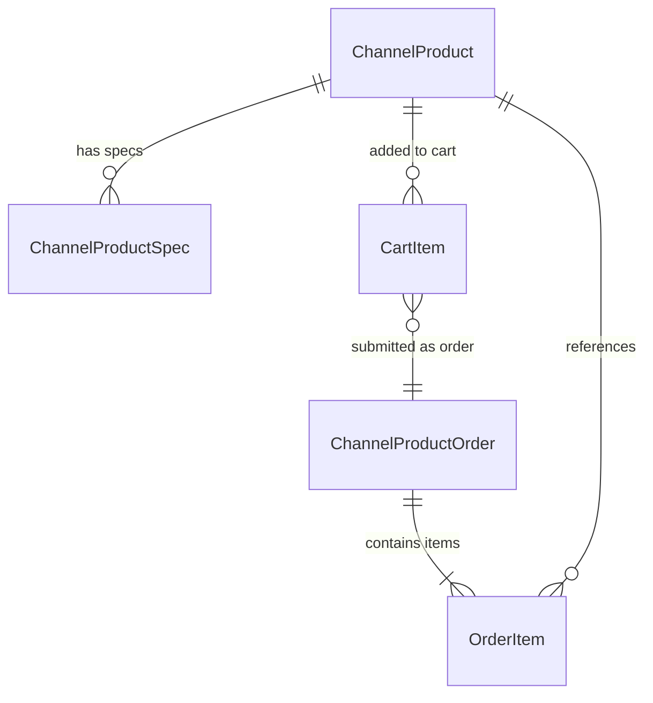

# Data Model: 小程序渠道商品订单适配

**Feature**: O006-miniapp-channel-order
**Date**: 2026-01-01
**Status**: Design Phase

## Overview

本文档定义小程序端(hall-reserve-taro)的数据模型,包括类型定义、状态管理结构、API 请求/响应格式。数据模型基于 O005 后端 API 契约,确保前后端类型一致性。

## Entity Definitions

### 1. ChannelProduct (渠道商品)

**Purpose**: 代表小程序菜单中的可售商品

**TypeScript Definition**:
```typescript
/**
 * @spec O006-miniapp-channel-order
 * 渠道商品 DTO - 商品列表/详情
 */
interface ChannelProductDTO {
  id: string                    // 渠道商品配置 ID
  skuId: string                 // 关联的 SKU ID (finished_product)
  channelType: 'MINI_PROGRAM'   // 渠道类型(小程序固定值)
  channelCategory: ChannelCategory  // 商品分类
  displayName: string           // 显示名称
  basePrice: number             // 基础价格(单位:分)
  mainImage: string             // 主图 URL
  detailImages: string[]        // 详情图 URL 列表
  description?: string          // 商品描述(详情页使用)
  status: ProductStatus         // 商品状态
  isRecommended: boolean        // 是否推荐
  sortOrder: number             // 排序权重
  stockStatus?: StockStatus     // 库存状态(详情页使用)
}

/**
 * 渠道分类枚举(扩展自 O003 的饮品分类)
 */
enum ChannelCategory {
  ALCOHOL = 'ALCOHOL',    // 酒水
  COFFEE = 'COFFEE',      // 咖啡
  BEVERAGE = 'BEVERAGE',  // 饮料
  SNACK = 'SNACK',        // 小食
  MEAL = 'MEAL',          // 餐品
  OTHER = 'OTHER'         // 其他
}

/**
 * 商品状态枚举
 */
enum ProductStatus {
  ACTIVE = 'ACTIVE',      // 已上架
  INACTIVE = 'INACTIVE'   // 已下架
}

/**
 * 库存状态枚举
 */
enum StockStatus {
  IN_STOCK = 'IN_STOCK',      // 有货
  LOW_STOCK = 'LOW_STOCK',    // 库存不足
  OUT_OF_STOCK = 'OUT_OF_STOCK'  // 无货
}
```

**Validation Rules**:
- `id`: 非空字符串,UUID 格式
- `basePrice`: 非负整数,单位为分(100 分 = 1 元)
- `displayName`: 非空字符串,长度 1-100 字符
- `mainImage`: 有效的 URL,HTTPS 协议
- `channelCategory`: 必须是枚举值之一

**Business Rules**:
- `status = INACTIVE` 的商品不显示在小程序菜单中
- `stockStatus = OUT_OF_STOCK` 的商品禁用"加入购物车"按钮
- `isRecommended = true` 的商品在列表顶部显示推荐标签

---

### 2. ChannelProductSpec (渠道商品规格)

**Purpose**: 代表商品的可选规格(大小/温度/甜度/配料/辣度/配菜/做法)

**TypeScript Definition**:
```typescript
/**
 * @spec O006-miniapp-channel-order
 * 渠道商品规格 DTO
 */
interface ChannelProductSpecDTO {
  id: string                    // 规格 ID
  channelProductId: string      // 所属渠道商品 ID
  specType: SpecType            // 规格类型
  specName: string              // 规格名称(如"杯型", "温度")
  options: SpecOptionDTO[]      // 规格选项列表
  isRequired: boolean           // 是否必选
  allowMultiple: boolean        // 是否允许多选
  sortOrder: number             // 排序权重
}

/**
 * 规格类型枚举(扩展自 O003 的 4 种到 7 种)
 */
enum SpecType {
  SIZE = 'SIZE',              // 杯型/尺寸
  TEMPERATURE = 'TEMPERATURE', // 温度
  SWEETNESS = 'SWEETNESS',     // 甜度
  TOPPING = 'TOPPING',        // 配料
  SPICINESS = 'SPICINESS',    // 辣度 (新增)
  SIDE = 'SIDE',              // 配菜 (新增)
  COOKING = 'COOKING'         // 做法 (新增)
}

/**
 * 规格选项 DTO
 */
interface SpecOptionDTO {
  id: string                  // 选项 ID
  optionName: string          // 选项名称(如"大杯", "热")
  priceAdjustment: number     // 价格调整(单位:分,可为负数)
  isDefault: boolean          // 是否默认选中
  sortOrder: number           // 排序权重
}

/**
 * 用户选择的规格(前端状态)
 */
interface SelectedSpec {
  specType: SpecType          // 规格类型
  specName: string            // 规格名称
  optionId: string            // 选中的选项 ID
  optionName: string          // 选项名称
  priceAdjustment: number     // 价格调整
}
```

**Validation Rules**:
- `isRequired = true` 的规格,用户必须至少选择一个选项
- `allowMultiple = false` 的规格,用户只能选择一个选项
- `priceAdjustment`: 可为负数(表示折扣),单位为分

**Business Rules**:
- 必选规格未选择时,禁用"加入购物车"按钮
- 默认规格选项(`isDefault = true`)在详情页自动选中
- 价格计算: 最终价格 = basePrice + Σ(selectedSpecs.priceAdjustment)

**Example**:
```typescript
// 示例: 咖啡商品的规格配置
const coffeeSpecs: ChannelProductSpecDTO[] = [
  {
    id: 'spec-001',
    channelProductId: 'prod-001',
    specType: SpecType.SIZE,
    specName: '杯型',
    isRequired: true,
    allowMultiple: false,
    options: [
      { id: 'opt-001', optionName: '小杯', priceAdjustment: -300, isDefault: false, sortOrder: 1 },
      { id: 'opt-002', optionName: '中杯', priceAdjustment: 0, isDefault: true, sortOrder: 2 },
      { id: 'opt-003', optionName: '大杯', priceAdjustment: 500, isDefault: false, sortOrder: 3 }
    ],
    sortOrder: 1
  },
  {
    id: 'spec-002',
    channelProductId: 'prod-001',
    specType: SpecType.TEMPERATURE,
    specName: '温度',
    isRequired: true,
    allowMultiple: false,
    options: [
      { id: 'opt-004', optionName: '热', priceAdjustment: 0, isDefault: true, sortOrder: 1 },
      { id: 'opt-005', optionName: '冰', priceAdjustment: 0, isDefault: false, sortOrder: 2 }
    ],
    sortOrder: 2
  }
]
```

---

### 3. CartItem (购物车项)

**Purpose**: 代表购物车中的一个商品项(包含选择的规格)

**TypeScript Definition**:
```typescript
/**
 * @spec O006-miniapp-channel-order
 * 购物车项(Zustand store)
 */
interface CartItem {
  cartItemId: string                   // 购物车项唯一 ID(前端生成)
  channelProductId: string             // 渠道商品 ID
  productName: string                  // 商品名称快照
  productImage: string                 // 商品图片快照
  basePrice: number                    // 基础价格快照
  selectedSpecs: Record<SpecType, SelectedSpec>  // 选中的规格
  quantity: number                     // 数量
  unitPrice: number                    // 单价(基础价 + 规格调整)
  subtotal: number                     // 小计(单价 x 数量)
}

/**
 * 购物车状态(Zustand)
 */
interface CartStore {
  items: CartItem[]                    // 购物车项列表
  totalQuantity: number                // 商品总数量
  totalPrice: number                   // 总价

  // Actions
  addItem: (product: ChannelProductDTO, selectedSpecs: Record<SpecType, SelectedSpec>) => void
  updateQuantity: (cartItemId: string, quantity: number) => void
  removeItem: (cartItemId: string) => void
  clearCart: () => void
}
```

**Validation Rules**:
- `quantity`: 必须 ≥ 1
- `cartItemId`: 前端生成的唯一 ID(UUID)
- 相同商品不同规格组合作为独立购物车项

**Business Rules**:
- 加入购物车时快照商品名称/价格/规格,避免后续商品配置变更影响已选商品
- 购物车数据存储在 Zustand 内存状态中,刷新页面后清空
- 删除商品时数量减为 0,从列表中移除

**Price Calculation**:
```typescript
// 单价计算
const unitPrice = basePrice + Object.values(selectedSpecs).reduce(
  (sum, spec) => sum + spec.priceAdjustment,
  0
)

// 小计计算
const subtotal = unitPrice * quantity

// 总价计算
const totalPrice = items.reduce((sum, item) => sum + item.subtotal, 0)
```

---

### 4. ChannelProductOrder (渠道商品订单)

**Purpose**: 代表一笔渠道商品订单

**TypeScript Definition**:
```typescript
/**
 * @spec O006-miniapp-channel-order
 * 渠道商品订单 DTO
 */
interface ChannelProductOrderDTO {
  id: string                      // 订单 ID
  orderNumber: string             // 订单号(如 CP202601010001)
  queueNumber: string             // 取餐号(如 A001)
  userId: string                  // 用户 ID
  status: OrderStatus             // 订单状态
  items: OrderItemDTO[]           // 订单项列表
  totalPrice: number              // 总价(单位:分)
  paymentStatus: PaymentStatus    // 支付状态
  paymentTime?: string            // 支付时间(ISO 8601)
  createdAt: string               // 创建时间(ISO 8601)
  updatedAt: string               // 更新时间(ISO 8601)
}

/**
 * 订单状态枚举
 */
enum OrderStatus {
  PENDING_PAYMENT = 'PENDING_PAYMENT',  // 待支付
  PENDING_PREPARE = 'PENDING_PREPARE',  // 待制作
  PREPARING = 'PREPARING',              // 制作中
  COMPLETED = 'COMPLETED',              // 已完成
  DELIVERED = 'DELIVERED',              // 已交付
  CANCELLED = 'CANCELLED'               // 已取消
}

/**
 * 支付状态枚举
 */
enum PaymentStatus {
  UNPAID = 'UNPAID',        // 未支付
  PAID = 'PAID',            // 已支付
  REFUNDED = 'REFUNDED'     // 已退款
}

/**
 * 订单项 DTO
 */
interface OrderItemDTO {
  id: string                               // 订单项 ID
  orderId: string                          // 所属订单 ID
  channelProductId: string                 // 渠道商品 ID
  productNameSnapshot: string              // 商品名称快照
  selectedSpecsSnapshot: Record<SpecType, SelectedSpec>  // 规格快照
  quantity: number                         // 数量
  unitPriceSnapshot: number                // 单价快照
  subtotal: number                         // 小计
}

/**
 * 创建订单请求 DTO
 */
interface CreateChannelProductOrderDTO {
  items: {
    channelProductId: string               // 渠道商品 ID
    selectedSpecs: Record<SpecType, SelectedSpec>  // 选中的规格
    quantity: number                       // 数量
    unitPrice: number                      // 单价
  }[]
}
```

**Validation Rules**:
- `orderNumber`: 非空字符串,格式 `CP + YYYYMMDD + 序号`
- `queueNumber`: 非空字符串,格式 `[A-Z][0-9]{3}`
- `items`: 非空数组,至少包含一个订单项
- `totalPrice`: 必须等于所有订单项小计之和

**Business Rules**:
- 订单创建后生成唯一订单号和取餐号
- 订单状态流转: 待支付 → 待制作 → 制作中 → 已完成 → 已交付
- 支付使用 Mock 实现(点击支付按钮自动成功)
- 订单项包含商品名称/规格/价格快照,避免商品配置变更影响历史订单

---

## State Management Schema

### Zustand Stores

#### 1. Cart Store (购物车状态)

```typescript
/**
 * @spec O006-miniapp-channel-order
 * 购物车 Store
 */
import { create } from 'zustand'
import { v4 as uuid } from 'uuid'

interface CartStore {
  // State
  items: CartItem[]

  // Computed
  totalQuantity: number
  totalPrice: number

  // Actions
  addItem: (product: ChannelProductDTO, selectedSpecs: Record<SpecType, SelectedSpec>) => void
  updateQuantity: (cartItemId: string, quantity: number) => void
  removeItem: (cartItemId: string) => void
  clearCart: () => void
}

export const useCartStore = create<CartStore>((set, get) => ({
  items: [],

  get totalQuantity() {
    return get().items.reduce((sum, item) => sum + item.quantity, 0)
  },

  get totalPrice() {
    return get().items.reduce((sum, item) => sum + item.subtotal, 0)
  },

  addItem: (product, selectedSpecs) => {
    const unitPrice = calculateUnitPrice(product.basePrice, selectedSpecs)
    const newItem: CartItem = {
      cartItemId: uuid(),
      channelProductId: product.id,
      productName: product.displayName,
      productImage: product.mainImage,
      basePrice: product.basePrice,
      selectedSpecs,
      quantity: 1,
      unitPrice,
      subtotal: unitPrice
    }
    set((state) => ({ items: [...state.items, newItem] }))
  },

  updateQuantity: (cartItemId, quantity) => {
    if (quantity <= 0) {
      get().removeItem(cartItemId)
      return
    }
    set((state) => ({
      items: state.items.map((item) =>
        item.cartItemId === cartItemId
          ? { ...item, quantity, subtotal: item.unitPrice * quantity }
          : item
      )
    }))
  },

  removeItem: (cartItemId) => {
    set((state) => ({
      items: state.items.filter((item) => item.cartItemId !== cartItemId)
    }))
  },

  clearCart: () => set({ items: [] })
}))
```

#### 2. Product Store (商品状态 - 可选)

```typescript
/**
 * @spec O006-miniapp-channel-order
 * 商品 Store (可选 - 用于缓存选中分类/商品详情)
 */
interface ProductStore {
  // State
  selectedCategory: ChannelCategory | null
  currentProduct: ChannelProductDTO | null

  // Actions
  setSelectedCategory: (category: ChannelCategory | null) => void
  setCurrentProduct: (product: ChannelProductDTO | null) => void
}

export const useProductStore = create<ProductStore>((set) => ({
  selectedCategory: null,
  currentProduct: null,

  setSelectedCategory: (category) => set({ selectedCategory: category }),
  setCurrentProduct: (product) => set({ currentProduct: product })
}))
```

### TanStack Query Keys

```typescript
/**
 * @spec O006-miniapp-channel-order
 * TanStack Query 缓存键定义
 */
export const queryKeys = {
  // 商品相关
  channelProducts: ['channel-products', 'mini-program'] as const,
  channelProductDetail: (id: string) => ['channel-products', 'mini-program', id] as const,
  channelProductSpecs: (id: string) => ['channel-products', 'mini-program', id, 'specs'] as const,

  // 订单相关
  myOrders: ['channel-product-orders', 'my'] as const,
  orderDetail: (id: string) => ['channel-product-orders', id] as const
}
```

---

## API Request/Response Formats

### 1. 获取商品列表

**Endpoint**: `GET /api/client/channel-products/mini-program`

**Request**: None

**Response**:
```typescript
interface ChannelProductListResponse {
  success: true
  data: ChannelProductDTO[]
  total: number
}
```

---

### 2. 获取商品详情

**Endpoint**: `GET /api/client/channel-products/mini-program/:id`

**Request**: None

**Response**:
```typescript
interface ChannelProductDetailResponse {
  success: true
  data: ChannelProductDetailDTO
}
```

---

### 3. 获取商品规格

**Endpoint**: `GET /api/client/channel-products/mini-program/:id/specs`

**Request**: None

**Response**:
```typescript
interface ChannelProductSpecsResponse {
  success: true
  data: ChannelProductSpecDTO[]
}
```

---

### 4. 创建订单

**Endpoint**: `POST /api/client/channel-product-orders`

**Request**:
```typescript
interface CreateOrderRequest {
  items: {
    channelProductId: string
    selectedSpecs: Record<SpecType, SelectedSpec>
    quantity: number
    unitPrice: number
  }[]
}
```

**Response**:
```typescript
interface CreateOrderResponse {
  success: true
  data: ChannelProductOrderDTO
}
```

---

### 5. 查询我的订单

**Endpoint**: `GET /api/client/channel-product-orders/my`

**Request Query Params**:
- `page`: number (可选,默认 1)
- `pageSize`: number (可选,默认 20)
- `status`: OrderStatus (可选,筛选订单状态)

**Response**:
```typescript
interface MyOrdersResponse {
  success: true
  data: ChannelProductOrderDTO[]
  total: number
  page: number
  pageSize: number
}
```

---

## Relationships & Dependencies



**Dependency Graph**:
- `ChannelProduct` ← 依赖 O005 后端 API
- `CartItem` ← 依赖 `ChannelProduct` 和 `ChannelProductSpec`
- `ChannelProductOrder` ← 依赖 `CartItem` (购物车数据)
- `OrderItem` ← 依赖 `ChannelProduct` (快照数据)

---

## Validation & Business Logic

### Price Calculation Function

```typescript
/**
 * @spec O006-miniapp-channel-order
 * 计算商品最终价格
 */
export function calculateUnitPrice(
  basePrice: number,
  selectedSpecs: Record<SpecType, SelectedSpec>
): number {
  const totalAdjustment = Object.values(selectedSpecs).reduce(
    (sum, spec) => sum + spec.priceAdjustment,
    0
  )
  return basePrice + totalAdjustment
}
```

### Required Specs Validation

```typescript
/**
 * @spec O006-miniapp-channel-order
 * 验证必选规格是否已选择
 */
export function validateRequiredSpecs(
  specs: ChannelProductSpecDTO[],
  selectedSpecs: Record<SpecType, SelectedSpec>
): { isValid: boolean; missingSpecs: string[] } {
  const requiredSpecs = specs.filter((s) => s.isRequired)
  const missingSpecs: string[] = []

  for (const spec of requiredSpecs) {
    if (!selectedSpecs[spec.specType]) {
      missingSpecs.push(spec.specName)
    }
  }

  return {
    isValid: missingSpecs.length === 0,
    missingSpecs
  }
}
```

---

## Migration from O003

**Key Changes**:

| O003 (Beverage) | O006 (Channel Product) | Impact |
|-----------------|------------------------|--------|
| `BeverageDTO` | `ChannelProductDTO` | 重命名类型,字段基本一致 |
| `beverageId` | `channelProductId` | 订单项关联字段名变更 |
| `BeverageCategory` (4种) | `ChannelCategory` (6种) | 分类枚举扩展 |
| `SpecType` (4种) | `SpecType` (7种) | 规格类型扩展 |
| `/api/client/beverages` | `/api/client/channel-products/mini-program` | API 端点变更 |
| `BeverageCartStore` | `CartStore` (通用) | 购物车 Store 重命名 |

**Backward Compatibility**: 无需保持向后兼容,O003 和 O006 为独立功能模块。

---

## Summary

本数据模型定义了小程序渠道商品订单功能的完整数据结构,包括:
- 6 个核心实体(ChannelProduct, ChannelProductSpec, CartItem, ChannelProductOrder, OrderItem, SelectedSpec)
- 2 个 Zustand Store (CartStore, ProductStore)
- 5 个 API 端点的请求/响应格式
- 价格计算和规格验证逻辑

所有类型定义与 O005 后端 API 契约保持一致,确保前后端类型安全 ✅
