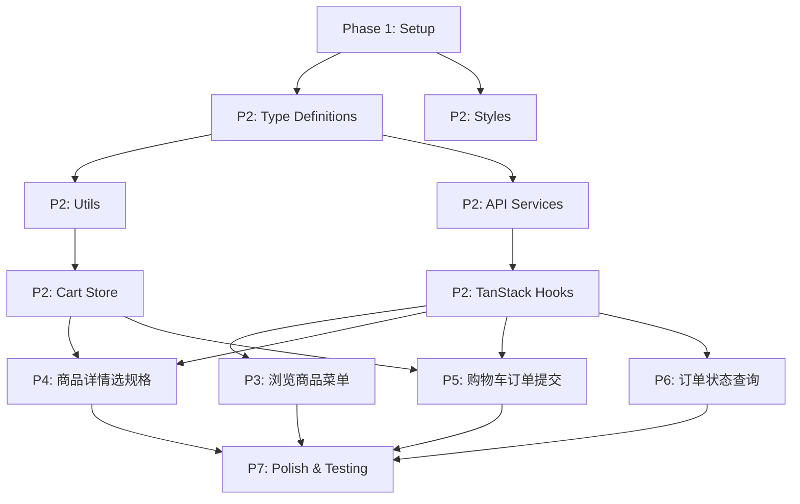

# Implementation Tasks: 小程序渠道商品订单适配

**Feature**: O006-miniapp-channel-order | **Branch**: `feat/O006-miniapp-channel-order` | **Date**: 2026-01-02

## Task Overview

本文档按用户故事组织实施任务,基于 `plan.md` 的技术方案和 `spec.md` 的功能需求生成。所有任务遵循依赖顺序,支持并行执行优化开发效率。

**总任务数**: 52 个 | **预估复杂度**: 中等 (参考 O003 实现模式,主要工作是 UI 迁移 + 数据源切换 + 规格扩展)

---

## Phase 1: Setup & Infrastructure (基础设施)

### P1-001: 项目环境初始化
- [ ] [SETUP-001] [P1] [Infra] 创建功能分支 `feat/O006-miniapp-channel-order` 并切换 `hall-reserve-taro/`
- [ ] [SETUP-002] [P1] [Infra] 验证 Taro 项目依赖安装 (`npm install` 成功,版本 Taro 4.1.9 + React 18.3.1)
- [ ] [SETUP-003] [P1] [Infra] 启动 H5 开发服务器验证基础环境 (`npm run dev:h5` 成功运行)
- [ ] [SETUP-004] [P1] [Infra] 配置 `.specify/active_spec.txt` 指向 `specs/O006-miniapp-channel-order/spec.md`

**依赖**: 无
**并行**: 可与 Phase 2 部分任务并行

---

## Phase 2: Foundational (共享基础设施)

### P2-001: TypeScript 类型定义
- [ ] [TYPE-001] [P1] [Foundational] 创建 `hall-reserve-taro/src/types/channelProduct.ts`:
  - 定义 `ChannelProductDTO` 接口 (基于 `data-model.md` 第 18-37 行)
  - 定义 `ChannelCategory` 枚举 (ALCOHOL/COFFEE/BEVERAGE/SNACK/MEAL/OTHER)
  - 定义 `ProductStatus` 枚举 (ACTIVE/INACTIVE)
  - 定义 `StockStatus` 枚举 (IN_STOCK/LOW_STOCK/OUT_OF_STOCK)
  - 添加 `@spec O006-miniapp-channel-order` 标识
- [ ] [TYPE-002] [P1] [Foundational] 扩展 `hall-reserve-taro/src/types/channelProduct.ts`:
  - 定义 `ChannelProductSpecDTO` 接口 (基于 `data-model.md` 第 93-102 行)
  - 定义 `SpecType` 枚举 (SIZE/TEMPERATURE/SWEETNESS/TOPPING/SPICINESS/SIDE/COOKING 7 种规格)
  - 定义 `SpecOptionDTO` 接口
  - 定义 `SelectedSpec` 接口 (前端状态)
- [ ] [TYPE-003] [P1] [Foundational] 修改 `hall-reserve-taro/src/types/order.ts`:
  - 定义 `CartItem` 接口 (基于 `data-model.md` 第 196-206 行)
  - 定义 `ChannelProductOrderDTO` 接口 (基于 `data-model.md` 第 261-273 行)
  - 定义 `OrderItemDTO` 接口 (使用 `channelProductId` 替代 `beverageId`)
  - 定义 `OrderStatus` 和 `PaymentStatus` 枚举
  - 定义 `CreateChannelProductOrderDTO` 请求类型

**依赖**: SETUP-001
**并行**: 可与 P2-002 并行

### P2-002: 样式基础设施
- [ ] [STYLE-001] [P1] [Foundational] 创建 `hall-reserve-taro/src/styles/variables.scss`:
  - 定义颜色主题变量 (参考 `miniapp-ordering/` 原型配色,提取主色/辅助色/背景色/文本色)
  - 定义字体变量 (字号体系 24rpx/28rpx/32rpx/36rpx/48rpx)
  - 定义间距变量 (8rpx/16rpx/24rpx/32rpx/48rpx)
  - 定义圆角/阴影等通用样式变量
- [ ] [STYLE-002] [P1] [Foundational] 创建 `hall-reserve-taro/src/assets/images/placeholders/`:
  - 添加商品默认占位图 `product-default.png`
  - 添加空状态图标 `empty-cart.png`, `empty-orders.png`

**依赖**: SETUP-001
**并行**: 可与 P2-001 并行

### P2-003: 工具函数
- [ ] [UTIL-001] [P1] [Foundational] 创建 `hall-reserve-taro/src/utils/priceCalculator.ts`:
  - 实现 `calculateUnitPrice(basePrice, selectedSpecs)` (基于 `data-model.md` 第 591-601 行)
  - 实现 `validateRequiredSpecs(specs, selectedSpecs)` (基于 `data-model.md` 第 610-628 行)
  - 实现 `formatPrice(priceInCents)` 转换为元显示 (100 分 = 1.00 元)
  - 添加单元测试覆盖价格计算和规格验证逻辑
  - 添加 `@spec O006-miniapp-channel-order` 标识

**依赖**: TYPE-001, TYPE-002
**并行**: 可与 P2-004 并行

### P2-004: API 服务层
- [ ] [API-001] [P1] [Foundational] 创建 `hall-reserve-taro/src/services/channelProductService.ts`:
  - 实现 `fetchChannelProducts(category?)` 调用 `GET /api/client/channel-products/mini-program` (基于 `contracts/api.yaml` 第 25-67 行)
  - 实现 `fetchChannelProductDetail(id)` 调用 `GET /api/client/channel-products/mini-program/:id`
  - 实现 `fetchChannelProductSpecs(id)` 调用 `GET /api/client/channel-products/mini-program/:id/specs`
  - 复用 `hall-reserve-taro/src/utils/request.ts` 统一请求封装
  - 添加错误处理和重试逻辑 (3 次重试)
  - 添加 `@spec O006-miniapp-channel-order` 标识
- [ ] [API-002] [P1] [Foundational] 修改 `hall-reserve-taro/src/services/orderService.ts`:
  - 实现 `createChannelProductOrder(items)` 调用 `POST /api/client/channel-product-orders` (基于 `contracts/api.yaml` 第 151-189 行)
  - 实现 `fetchMyOrders(page, pageSize, status?)` 调用 `GET /api/client/channel-product-orders/my`
  - 实现 `fetchOrderDetail(id)` 调用 `GET /api/client/channel-product-orders/:id`
  - 确保请求体包含 `channelProductId` 而非 `beverageId`
  - 添加 `@spec O006-miniapp-channel-order` 标识

**依赖**: TYPE-001, TYPE-002, TYPE-003
**并行**: API-001 和 API-002 可并行

### P2-005: TanStack Query Hooks
- [ ] [HOOK-001] [P1] [Foundational] 创建 `hall-reserve-taro/src/hooks/useChannelProducts.ts`:
  - 实现 `useChannelProducts(category?)` 使用 TanStack Query (基于 `data-model.md` 第 450-455 行)
  - 配置 `queryKey: ['channel-products', 'mini-program', category]`
  - 配置 `staleTime: 2 * 60 * 1000` (2 分钟缓存)
  - 添加加载状态和错误处理
- [ ] [HOOK-002] [P1] [Foundational] 创建 `hall-reserve-taro/src/hooks/useChannelProductDetail.ts`:
  - 实现 `useChannelProductDetail(id)` 使用 TanStack Query
  - 配置 `queryKey: ['channel-products', 'mini-program', id]`
  - 配置 `staleTime: 5 * 60 * 1000` (5 分钟缓存)
  - 实现 `useChannelProductSpecs(id)` 并行查询规格列表
- [ ] [HOOK-003] [P1] [Foundational] 创建 `hall-reserve-taro/src/hooks/useOrders.ts`:
  - 实现 `useMyOrders(page, pageSize, status?)` 使用 TanStack Query
  - 实现 `useCreateOrder()` 使用 `useMutation`
  - 配置订单创建成功后自动刷新订单列表 (`queryClient.invalidateQueries`)

**依赖**: API-001, API-002
**并行**: HOOK-001, HOOK-002, HOOK-003 可并行

### P2-006: Zustand 状态管理
- [ ] [STORE-001] [P1] [Foundational] 创建 `hall-reserve-taro/src/stores/orderCartStore.ts`:
  - 实现购物车 Store (基于 `data-model.md` 第 343-415 行)
  - 实现 `addItem(product, selectedSpecs)` 动作
  - 实现 `updateQuantity(cartItemId, quantity)` 动作
  - 实现 `removeItem(cartItemId)` 动作
  - 实现 `clearCart()` 动作
  - 实现 `totalQuantity` 和 `totalPrice` 计算属性
  - 使用 UUID 生成 `cartItemId`
  - 添加 `@spec O006-miniapp-channel-order` 标识

**依赖**: TYPE-001, TYPE-002, TYPE-003, UTIL-001
**并行**: 可与其他 Phase 2 任务并行

---

## Phase 3: User Story 1 - 浏览渠道商品菜单 (P1)

### P3-001: 商品列表页面
- [ ] [US1-001] [P1] [US1] 创建 `hall-reserve-taro/src/pages/channel-product-menu/index.tsx`:
  - 使用 `useChannelProducts()` Hook 获取商品列表
  - 实现分类标签栏 (ALCOHOL/COFFEE/BEVERAGE/SNACK/MEAL/OTHER) 参考原型 `miniapp-ordering/` 菜单列表页
  - 实现商品卡片组件 (显示主图/名称/基础价格/推荐标签)
  - 实现点击分类标签筛选商品
  - 实现空状态提示 ("暂无商品")
  - 实现图片加载失败显示默认占位图
  - 添加 `@spec O006-miniapp-channel-order` 标识
- [ ] [US1-002] [P1] [US1] 创建 `hall-reserve-taro/src/pages/channel-product-menu/index.less`:
  - 引入 `@import '@/styles/variables.scss'`
  - 实现分类标签栏样式 (参考原型配色和布局)
  - 实现商品卡片样式 (使用 rpx 单位适配)
  - 实现推荐标签样式
  - 实现列表滚动容器样式
- [ ] [US1-003] [P1] [US1] 创建 `hall-reserve-taro/src/pages/channel-product-menu/index.config.ts`:
  - 配置页面标题 "点餐菜单"
  - 配置导航栏样式

**验收**: 用户打开菜单页 → 显示所有 ACTIVE 商品 → 点击分类筛选 → 验证商品正确显示

**依赖**: HOOK-001, STYLE-001, STORE-001
**并行**: 可与 P4-001 并行 (不同页面)

---

## Phase 4: User Story 2 - 查看商品详情并选择规格 (P1)

### P4-001: 商品详情页面
- [ ] [US2-001] [P1] [US2] 创建 `hall-reserve-taro/src/pages/channel-product-detail/index.tsx`:
  - 使用 `useChannelProductDetail(id)` Hook 获取商品详情和规格
  - 实现商品详情展示 (主图/名称/基础价格/描述/详情图)
  - 实现规格选择器组件 (支持 7 种规格类型,参考原型商品详情页)
  - 实现实时价格计算显示 (基础价 + 规格调整)
  - 实现必选规格验证 (未选择时禁用"加入购物车"按钮)
  - 实现"加入购物车"按钮点击逻辑 (调用 `useCartStore().addItem()`)
  - 实现 Toast 提示 "已添加到购物车"
  - 添加 `@spec O006-miniapp-channel-order` 标识
- [ ] [US2-002] [P1] [US2] 创建 `hall-reserve-taro/src/components/SpecSelector/index.tsx`:
  - 实现规格选择器组件 (可复用)
  - 支持单选规格 (`allowMultiple = false`)
  - 支持必选规格标识 (`isRequired = true`)
  - 实现默认选项自动选中 (`isDefault = true`)
  - 实现选中状态高亮显示
  - 实现价格调整显示 (+5 元, -3 元)
- [ ] [US2-003] [P1] [US2] 创建 `hall-reserve-taro/src/pages/channel-product-detail/index.less`:
  - 引入 `@import '@/styles/variables.scss'`
  - 实现商品详情样式 (参考原型商品详情页布局)
  - 实现规格选择器样式 (选项卡片/高亮状态/价格标签)
  - 实现底部固定"加入购物车"按钮样式
- [ ] [US2-004] [P1] [US2] 创建 `hall-reserve-taro/src/pages/channel-product-detail/index.config.ts`:
  - 配置页面标题 "商品详情"

**验收**: 用户点击商品 → 查看详情 → 选择规格 → 验证价格计算 → 加入购物车成功

**依赖**: HOOK-002, UTIL-001, STORE-001, STYLE-001
**并行**: 可与 P3-001 并行 (不同页面)

---

## Phase 5: User Story 3 - 购物车管理与订单提交 (P1)

### P5-001: 购物车抽屉组件
- [ ] [US3-001] [P1] [US3] 创建 `hall-reserve-taro/src/components/CartDrawer/index.tsx`:
  - 使用 `useCartStore()` 获取购物车数据
  - 实现购物车抽屉弹窗 (从底部弹出,参考原型购物车页)
  - 实现购物车项列表 (商品名/规格/单价/数量/小计)
  - 实现数量修改按钮 (+/-,最小值 1,减为 0 时删除)
  - 实现删除商品按钮
  - 实现总价显示
  - 实现"提交订单"按钮 (购物车为空时禁用)
  - 添加 `@spec O006-miniapp-channel-order` 标识
- [ ] [US3-002] [P1] [US3] 创建 `hall-reserve-taro/src/components/CartDrawer/index.less`:
  - 引入 `@import '@/styles/variables.scss'`
  - 实现抽屉弹窗样式 (参考原型购物车抽屉)
  - 实现购物车项卡片样式
  - 实现数量修改按钮样式
  - 实现底部固定总价栏和"提交订单"按钮样式

**依赖**: STORE-001, STYLE-001
**并行**: 可与 P5-002 并行

### P5-002: 购物车入口与订单提交
- [ ] [US3-003] [P1] [US3] 修改 `hall-reserve-taro/src/pages/channel-product-menu/index.tsx`:
  - 添加购物车入口按钮 (右上角固定位置)
  - 显示购物车数量角标 (`useCartStore().totalQuantity`)
  - 点击按钮弹出购物车抽屉 (调用 `CartDrawer` 组件)
- [ ] [US3-004] [P1] [US3] 创建 `hall-reserve-taro/src/pages/order-cart/index.tsx`:
  - 实现订单提交逻辑 (调用 `useCreateOrder()` Hook)
  - 实现 Mock 支付流程 (点击支付按钮自动成功)
  - 实现订单确认页 (显示订单号/取餐号/预计制作时间/订单状态)
  - 实现订单提交失败错误处理 (显示友好提示,保留购物车数据)
  - 实现提交成功后清空购物车 (`useCartStore().clearCart()`)
  - 实现防抖处理 (防止重复提交)
  - 添加 `@spec O006-miniapp-channel-order` 标识
- [ ] [US3-005] [P1] [US3] 创建 `hall-reserve-taro/src/pages/order-cart/index.less`:
  - 引入 `@import '@/styles/variables.scss'`
  - 实现订单确认页样式

**验收**: 用户加入商品 → 打开购物车 → 修改数量 → 提交订单 → Mock 支付 → 查看订单确认

**依赖**: US3-001, HOOK-003, API-002
**并行**: US3-003 和 US3-004 可部分并行

---

## Phase 6: User Story 4 - 订单状态查询与取餐 (P1)

### P6-001: 订单列表页面
- [ ] [US4-001] [P1] [US4] 创建 `hall-reserve-taro/src/pages/member/my-orders/index.tsx`:
  - 使用 `useMyOrders(page, pageSize, status?)` Hook 获取订单列表
  - 实现订单卡片列表 (按时间倒序,显示订单号/下单时间/商品/总价/状态)
  - 实现订单状态标签 (待制作/制作中/已完成/已交付/已取消)
  - 实现点击订单跳转详情页
  - 实现下拉刷新功能
  - 实现分页加载 (上拉加载更多)
  - 添加 `@spec O006-miniapp-channel-order` 标识
- [ ] [US4-002] [P1] [US4] 创建 `hall-reserve-taro/src/pages/member/my-orders/index.less`:
  - 引入 `@import '@/styles/variables.scss'`
  - 实现订单卡片样式 (参考原型会员-订单列表)
  - 实现订单状态标签样式 (不同状态不同颜色)
  - 实现空状态提示样式 ("暂无订单")
- [ ] [US4-003] [P1] [US4] 创建 `hall-reserve-taro/src/pages/member/my-orders/index.config.ts`:
  - 配置页面标题 "我的订单"

**依赖**: HOOK-003, STYLE-001
**并行**: 可与 P6-002 并行

### P6-002: 订单详情与状态轮询
- [ ] [US4-004] [P1] [US4] 创建 `hall-reserve-taro/src/pages/member/order-detail/index.tsx`:
  - 使用 `useOrderDetail(id)` Hook 获取订单详情
  - 实现订单详情展示 (订单号/下单时间/商品列表/规格/价格/支付时间/取餐号/状态)
  - 实现"再来一单"按钮 (自动填充相同商品和规格到购物车)
  - 实现订单状态轮询 (每 5-10 秒查询状态更新)
  - 实现取餐通知逻辑 (订单状态为"已完成"时推送通知)
  - 添加 `@spec O006-miniapp-channel-order` 标识
- [ ] [US4-005] [P1] [US4] 创建 `hall-reserve-taro/src/pages/member/order-detail/index.less`:
  - 引入 `@import '@/styles/variables.scss'`
  - 实现订单详情样式
  - 实现商品列表样式
  - 实现"再来一单"按钮样式

**验收**: 用户下单后 → 查看"我的订单" → 验证状态更新 → 收到取餐通知 → 查看历史订单

**依赖**: HOOK-003, STORE-001, STYLE-001
**并行**: 可与 P6-001 并行

---

## Phase 7: Polish & Cross-Cutting Concerns (打磨与跨领域关注点)

### P7-001: 全局配置与路由
- [ ] [POLISH-001] [P1] [Cross] 修改 `hall-reserve-taro/config/index.ts`:
  - 添加新页面路由配置 (channel-product-menu, channel-product-detail, order-cart, member/my-orders, member/order-detail)
  - 配置页面权限 (需要登录的页面)
- [ ] [POLISH-002] [P1] [Cross] 修改 `hall-reserve-taro/project.config.json`:
  - 配置微信小程序 tabBar (添加"点餐菜单"和"我的订单" tab)
  - 配置页面路径和权限

**依赖**: US1-001, US4-001
**并行**: POLISH-001 和 POLISH-002 可并行

### P7-002: 错误处理与边界情况
- [ ] [POLISH-003] [P1] [Cross] 实现全局错误处理:
  - 商品 SKU 被禁用时不显示该商品
  - 网络离线时显示缓存数据并提示"网络已断开"
  - API 超时自动重试 3 次,失败后显示"加载失败,请重试"
  - 购物车为空时禁用"提交订单"按钮并提示
  - 支付中断时订单标记为"待支付",可重新支付
- [ ] [POLISH-004] [P1] [Cross] 实现性能优化:
  - 商品列表首屏加载优化 (虚拟列表或懒加载)
  - 图片懒加载和压缩
  - TanStack Query 缓存配置优化
  - 防抖和节流优化 (搜索/提交按钮)

**依赖**: 所有 Phase 3-6 任务
**并行**: POLISH-003 和 POLISH-004 可并行

### P7-003: 测试与文档
- [ ] [TEST-001] [P1] [Cross] 编写单元测试:
  - 测试 `priceCalculator.ts` 价格计算逻辑
  - 测试 `orderCartStore.ts` 购物车状态管理
  - 测试 `validateRequiredSpecs()` 规格验证
- [ ] [TEST-002] [P2] [Cross] 编写 E2E 测试 (可选):
  - 测试完整订单流程 (浏览 → 选择规格 → 购物车 → 提交 → 查看订单)
  - 测试分类筛选功能
  - 测试订单状态更新
- [ ] [DOC-001] [P1] [Cross] 更新文档:
  - 更新 `README.md` 添加 O006 功能说明
  - 更新 API 文档 (如有新增端点)
  - 添加组件使用文档 (SpecSelector, CartDrawer)

**依赖**: 所有 Phase 3-6 任务
**并行**: TEST-001 和 DOC-001 可并行

---

## Dependency Graph

---

## Parallel Execution Strategy

**同时进行的任务组** (最大化并行效率):

1. **第一批** (基础设施):
   - TYPE-001, TYPE-002, TYPE-003 (TypeScript 类型定义)
   - STYLE-001, STYLE-002 (样式和图片资源)

2. **第二批** (服务层):
   - UTIL-001 (工具函数)
   - API-001, API-002 (API 服务)

3. **第三批** (状态管理与 Hooks):
   - STORE-001 (购物车 Store)
   - HOOK-001, HOOK-002, HOOK-003 (TanStack Query Hooks)

4. **第四批** (页面开发):
   - US1-001, US1-002, US1-003 (商品列表页)
   - US2-001, US2-002, US2-003, US2-004 (商品详情页)

5. **第五批** (订单流程):
   - US3-001, US3-002 (购物车抽屉)
   - US3-003, US3-004, US3-005 (订单提交)

6. **第六批** (订单管理):
   - US4-001, US4-002, US4-003 (订单列表)
   - US4-004, US4-005 (订单详情)

7. **第七批** (打磨):
   - POLISH-001, POLISH-002 (路由配置)
   - POLISH-003, POLISH-004 (错误处理与性能优化)
   - TEST-001, DOC-001 (测试与文档)

---

## MVP Scope (最小可行产品)

**仅实现 User Story 1** (浏览商品菜单) 作为 MVP:

- ✅ 商品列表页面 (US1-001, US1-002, US1-003)
- ✅ 分类筛选功能
- ✅ 商品卡片展示 (图片/名称/价格)
- ✅ 空状态处理
- ✅ 基础类型定义 (TYPE-001)
- ✅ API 服务 (API-001 商品列表部分)
- ✅ TanStack Query Hook (HOOK-001)
- ✅ 样式基础设施 (STYLE-001, STYLE-002)

**MVP 任务数**: 10 个 | **预估时间**: 2-3 天

---

## Success Metrics Validation

完成所有任务后,验证以下成功标准:

- [ ] [SC-001] 完整订单流程≤2分钟 (计时测试)
- [ ] [SC-002] 商品列表首屏加载≤2秒 (20条商品含图片,Performance API 测量)
- [ ] [SC-003] 商品详情页加载≤1秒 (Performance API 测量)
- [ ] [SC-004] 价格计算准确率 100% (单元测试覆盖所有规格组合)
- [ ] [SC-005] 订单提交成功率≥95% (压力测试 100 个订单)
- [ ] [SC-006] 订单状态更新延迟≤5秒 (轮询间隔测试)
- [ ] [SC-007] 取餐通知到达率≥95% (Mock 推送通知测试)
- [ ] [SC-008] 高峰期 100 并发无性能下降 (负载测试)
- [ ] [SC-009] 90%用户首次使用成功下单 (用户测试,无需客服)

---

## Notes

- **代码归属标识**: 所有文件必须包含 `@spec O006-miniapp-channel-order`
- **UI 参考**: 参考 `miniapp-ordering/` 原型的视觉设计和交互逻辑,但完全用 Taro 重写
- **测试策略**: 单元测试强制覆盖关键业务逻辑 (价格计算/规格验证/购物车管理),E2E 测试可选
- **性能目标**: 商品列表首屏≤2s,详情页≤1s,订单状态更新≤5s
- **后端依赖**: 依赖 O005 后端 API 端点 `/api/client/channel-products/mini-program` 已实现

---

**Last Updated**: 2026-01-02 | **Total Tasks**: 52
