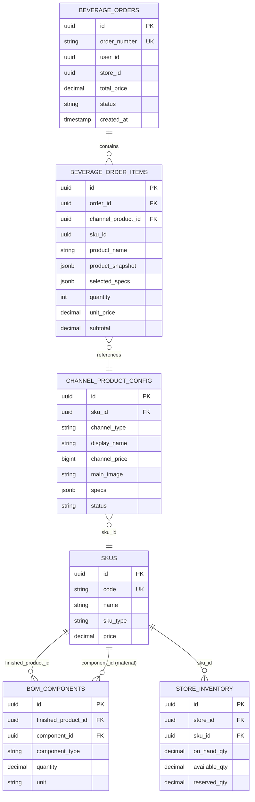

# Data Model: 订单模块迁移至渠道商品体系

**Spec**: O013-order-channel-migration  
**Date**: 2026-01-14

---

## 1. Entity Changes

### 1.1 BeverageOrderItem (订单商品项)

**Modified Entity** - 新增字段支持渠道商品体系

#### Current Schema (Before Migration)

```sql
CREATE TABLE beverage_order_items (
    id UUID PRIMARY KEY,
    order_id UUID NOT NULL REFERENCES beverage_orders(id),
    beverage_id UUID NOT NULL REFERENCES beverages(id),  -- 旧外键
    beverage_name VARCHAR(100) NOT NULL,
    beverage_image_url TEXT,
    selected_specs JSONB NOT NULL,
    quantity INTEGER NOT NULL,
    unit_price NUMERIC(10,2) NOT NULL,
    subtotal NUMERIC(10,2) NOT NULL,
    customer_note TEXT,
    created_at TIMESTAMP NOT NULL
);
```

#### New Schema (After Migration)

```sql
CREATE TABLE beverage_order_items (
    id UUID PRIMARY KEY DEFAULT gen_random_uuid(),
    order_id UUID NOT NULL REFERENCES beverage_orders(id) ON DELETE CASCADE,
    
    -- 新字段: 渠道商品ID (主要外键)
    channel_product_id UUID NOT NULL REFERENCES channel_product_config(id),
    
    -- 保留字段: SKU ID (用于库存扣减，不再作为外键)
    sku_id UUID NOT NULL,
    
    -- 快照字段
    product_name VARCHAR(100) NOT NULL,      -- 商品名称快照
    product_image_url TEXT,                   -- 商品图片快照
    product_snapshot JSONB NOT NULL,          -- 完整商品快照
    selected_specs JSONB NOT NULL,            -- 选中的规格快照
    
    -- 价格和数量
    quantity INTEGER NOT NULL DEFAULT 1,
    unit_price NUMERIC(10,2) NOT NULL,
    subtotal NUMERIC(10,2) NOT NULL,
    
    -- 其他
    customer_note TEXT,
    created_at TIMESTAMP NOT NULL DEFAULT now()
);

-- 索引
CREATE INDEX idx_order_item_channel_product ON beverage_order_items(channel_product_id);
CREATE INDEX idx_order_item_sku ON beverage_order_items(sku_id);
```

#### Field Mapping

| Old Field | New Field | Migration |
|-----------|-----------|-----------|
| `beverage_id` | `channel_product_id` | 新外键指向 channel_product_config |
| - | `sku_id` | 新增，存储关联的 SKU ID |
| `beverage_name` | `product_name` | 重命名 |
| `beverage_image_url` | `product_image_url` | 重命名 |
| - | `product_snapshot` | 新增，存储完整商品快照 |
| `selected_specs` | `selected_specs` | 保持，结构调整 |

---

### 1.2 product_snapshot JSON Structure

```json
{
  "channelProductId": "uuid-string",
  "displayName": "拿铁咖啡",
  "mainImage": "https://supabase.../latte.jpg",
  "channelPrice": 2800,
  "channelCategory": "COFFEE",
  "description": "经典意式拿铁",
  "sku": {
    "id": "sku-uuid",
    "code": "SKU-LATTE-001",
    "name": "拿铁咖啡 SKU",
    "type": "FINISHED_PRODUCT"
  },
  "selectedSpecs": [
    {
      "specType": "SIZE",
      "specName": "规格",
      "optionId": "opt-uuid",
      "optionName": "大杯",
      "priceAdjust": 300
    },
    {
      "specType": "TEMPERATURE",
      "specName": "温度",
      "optionId": "opt-uuid",
      "optionName": "热",
      "priceAdjust": 0
    }
  ],
  "snapshotAt": "2026-01-14T10:30:00Z"
}
```

---

### 1.3 selected_specs JSON Structure (Updated)

**Before**:
```json
{
  "size": "大杯",
  "temperature": "热",
  "sweetness": "半糖"
}
```

**After**:
```json
{
  "SIZE": {
    "optionId": "opt-uuid",
    "optionName": "大杯",
    "priceAdjust": 300
  },
  "TEMPERATURE": {
    "optionId": "opt-uuid",
    "optionName": "热",
    "priceAdjust": 0
  }
}
```

---

## 2. Tables to Delete

### 2.1 beverages 表

```sql
-- 旧饮品表，功能已被 channel_product_config + skus 替代
DROP TABLE IF EXISTS beverages CASCADE;
```

**依赖清理顺序**:
1. 先删除 `beverage_order_items.beverage_id` 外键约束
2. 删除 `beverage_specs` 表 (CASCADE)
3. 删除 `beverage_recipes` 表 (CASCADE)
4. 删除 `beverages` 表

### 2.2 beverage_specs 表

```sql
-- 饮品规格表，功能已被 channel_product_config.specs JSON 替代
DROP TABLE IF EXISTS beverage_specs CASCADE;
```

### 2.3 beverage_recipes 表

```sql
-- 饮品配方表，功能已被 bom_components 替代
DROP TABLE IF EXISTS beverage_recipes CASCADE;
```

### 2.4 recipe_ingredients 表

```sql
-- 配方原料表，功能已被 bom_components 替代
DROP TABLE IF EXISTS recipe_ingredients CASCADE;
```

### 2.5 beverage_sku_mapping 表

```sql
-- 饮品-SKU 映射表，已完成迁移，不再需要
DROP TABLE IF EXISTS beverage_sku_mapping CASCADE;
```

---

## 3. ER Diagram



---

## 4. Database Migration Script

```sql
-- @spec O013-order-channel-migration
-- Migration: Order Module to Channel Product System
-- Date: 2026-01-14

-- ============================================================
-- Step 1: Add new columns to beverage_order_items
-- ============================================================

-- 1.1 Add channel_product_id column
ALTER TABLE beverage_order_items
ADD COLUMN IF NOT EXISTS channel_product_id UUID;

-- 1.2 Add sku_id column (for inventory deduction)
ALTER TABLE beverage_order_items
ADD COLUMN IF NOT EXISTS sku_id UUID;

-- 1.3 Add product_snapshot column
ALTER TABLE beverage_order_items
ADD COLUMN IF NOT EXISTS product_snapshot JSONB;

-- 1.4 Rename columns for clarity
ALTER TABLE beverage_order_items
RENAME COLUMN beverage_name TO product_name;

ALTER TABLE beverage_order_items
RENAME COLUMN beverage_image_url TO product_image_url;

-- ============================================================
-- Step 2: Drop old foreign key constraint
-- ============================================================

-- 2.1 Drop the beverages foreign key (if exists)
ALTER TABLE beverage_order_items
DROP CONSTRAINT IF EXISTS beverage_order_items_beverage_id_fkey;

ALTER TABLE beverage_order_items
DROP CONSTRAINT IF EXISTS fk_order_item_beverage;

-- 2.2 Drop the old beverage_id column (after data migration)
-- Note: Do this in a separate migration after verifying data integrity
-- ALTER TABLE beverage_order_items DROP COLUMN IF EXISTS beverage_id;

-- ============================================================
-- Step 3: Add new foreign key constraint
-- ============================================================

ALTER TABLE beverage_order_items
ADD CONSTRAINT fk_order_item_channel_product
FOREIGN KEY (channel_product_id) REFERENCES channel_product_config(id)
ON DELETE RESTRICT;

-- ============================================================
-- Step 4: Create indexes
-- ============================================================

CREATE INDEX IF NOT EXISTS idx_order_item_channel_product 
ON beverage_order_items(channel_product_id);

CREATE INDEX IF NOT EXISTS idx_order_item_sku 
ON beverage_order_items(sku_id);

-- ============================================================
-- Step 5: Drop legacy tables (execute after verification)
-- ============================================================

-- 5.1 Drop beverage_specs (depends on beverages)
DROP TABLE IF EXISTS beverage_specs CASCADE;

-- 5.2 Drop beverage_recipes (depends on beverages)
DROP TABLE IF EXISTS beverage_recipes CASCADE;

-- 5.3 Drop recipe_ingredients (depends on beverage_recipes)
DROP TABLE IF EXISTS recipe_ingredients CASCADE;

-- 5.4 Drop beverage_sku_mapping
DROP TABLE IF EXISTS beverage_sku_mapping CASCADE;

-- 5.5 Drop beverages table
DROP TABLE IF EXISTS beverages CASCADE;

-- ============================================================
-- Step 6: Add comments
-- ============================================================

COMMENT ON COLUMN beverage_order_items.channel_product_id IS 
'@spec O013-order-channel-migration 渠道商品配置 ID';

COMMENT ON COLUMN beverage_order_items.sku_id IS 
'@spec O013-order-channel-migration SKU ID，用于库存扣减';

COMMENT ON COLUMN beverage_order_items.product_snapshot IS 
'@spec O013-order-channel-migration 商品快照，包含下单时的完整商品信息';
```

---

## 5. TypeScript Types

### 5.1 Order Item Types

```typescript
/** @spec O013-order-channel-migration */

/**
 * 订单商品项
 */
export interface OrderItem {
  id: string;
  orderId: string;
  channelProductId: string;
  skuId: string;
  productName: string;
  productImageUrl: string | null;
  productSnapshot: ProductSnapshot;
  selectedSpecs: Record<string, SelectedSpecOption>;
  quantity: number;
  unitPrice: number;  // 元
  subtotal: number;   // 元
  customerNote: string | null;
  createdAt: string;
}

/**
 * 商品快照
 */
export interface ProductSnapshot {
  channelProductId: string;
  displayName: string;
  mainImage: string | null;
  channelPrice: number;  // 分
  channelCategory: string;
  description: string | null;
  sku: {
    id: string;
    code: string;
    name: string;
    type: string;
  };
  selectedSpecs: SelectedSpecSnapshot[];
  snapshotAt: string;
}

/**
 * 选中的规格快照
 */
export interface SelectedSpecSnapshot {
  specType: string;
  specName: string;
  optionId: string;
  optionName: string;
  priceAdjust: number;  // 分
}

/**
 * 选中的规格选项
 */
export interface SelectedSpecOption {
  optionId: string;
  optionName: string;
  priceAdjust: number;  // 分
}
```

### 5.2 Create Order Request Types

```typescript
/** @spec O013-order-channel-migration */

/**
 * 创建订单请求
 */
export interface CreateOrderRequest {
  storeId: string;
  items: CreateOrderItemRequest[];
  customerNote?: string;
}

/**
 * 创建订单商品项请求
 */
export interface CreateOrderItemRequest {
  channelProductId: string;
  quantity: number;
  selectedSpecs: Record<string, SelectedSpecOption>;
  customerNote?: string;
}
```

---

## 6. Java Entity Changes

### 6.1 BeverageOrderItem Entity

```java
/** @spec O013-order-channel-migration */
@Entity
@Table(name = "beverage_order_items")
public class BeverageOrderItem {
    
    @Id
    @GeneratedValue(strategy = GenerationType.AUTO)
    private UUID id;
    
    @ManyToOne(fetch = FetchType.LAZY)
    @JoinColumn(name = "order_id", nullable = false)
    private BeverageOrder order;
    
    // 新字段: 渠道商品ID
    @Column(name = "channel_product_id", nullable = false)
    private UUID channelProductId;
    
    // 新字段: SKU ID (用于库存扣减)
    @Column(name = "sku_id", nullable = false)
    private UUID skuId;
    
    // 重命名: beverage_name → product_name
    @Column(name = "product_name", nullable = false, length = 100)
    private String productName;
    
    // 重命名: beverage_image_url → product_image_url
    @Column(name = "product_image_url", columnDefinition = "TEXT")
    private String productImageUrl;
    
    // 新字段: 商品快照
    @JdbcTypeCode(SqlTypes.JSON)
    @Column(name = "product_snapshot", nullable = false, columnDefinition = "jsonb")
    private String productSnapshot;
    
    @JdbcTypeCode(SqlTypes.JSON)
    @Column(name = "selected_specs", nullable = false, columnDefinition = "jsonb")
    private String selectedSpecs;
    
    @Column(nullable = false)
    private Integer quantity;
    
    @Column(name = "unit_price", nullable = false, precision = 10, scale = 2)
    private BigDecimal unitPrice;
    
    @Column(nullable = false, precision = 10, scale = 2)
    private BigDecimal subtotal;
    
    @Column(name = "customer_note", columnDefinition = "TEXT")
    private String customerNote;
    
    @Column(name = "created_at", nullable = false)
    private LocalDateTime createdAt;
}
```

---

## Summary

本数据模型变更将订单模块从 `beverages` 表体系迁移到 `channel_product_config` 体系：

1. **新增字段**: `channel_product_id`, `sku_id`, `product_snapshot`
2. **重命名字段**: `beverage_name` → `product_name`, `beverage_image_url` → `product_image_url`
3. **删除表**: `beverages`, `beverage_specs`, `beverage_recipes`, `recipe_ingredients`, `beverage_sku_mapping`
4. **外键变更**: `beverages` → `channel_product_config`
