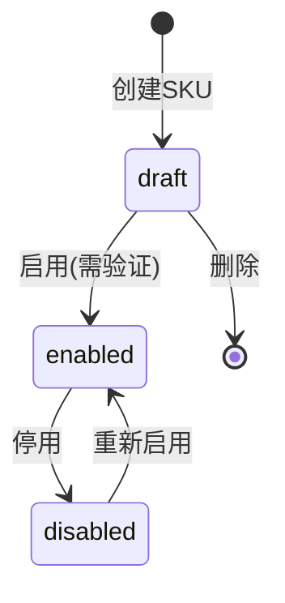

# API 接口规范: SKU主数据管理(支持BOM)

**功能分支**: P001-sku-master-data
**生成日期**: 2025-12-25
**版本**: v1.0
**基础路径**: `/api`

---

## 通用规范

### 认证方式

所有 API 请求必须在 HTTP Header 中包含认证令牌：

```http
Authorization: Bearer <access_token>
```

### 统一响应格式

所有 API 响应遵循统一的 JSON 格式规范（详见 `.claude/rules/08-api-standards.md`）：

#### 成功响应 (2xx)

**单个资源**:
```json
{
  "success": true,
  "data": {
    "id": "uuid",
    "name": "商品名称",
    ...
  },
  "timestamp": "2025-12-25T15:00:00Z"
}
```

**列表查询**:
```json
{
  "success": true,
  "data": [...],
  "total": 100,
  "page": 1,
  "pageSize": 20,
  "message": "查询成功"
}
```

#### 错误响应 (4xx/5xx)

```json
{
  "success": false,
  "error": "ERROR_CODE",
  "message": "用户友好的错误描述",
  "details": {
    "field": "fieldName",
    "reason": "详细原因"
  },
  "timestamp": "2025-12-25T15:00:00Z"
}
```

### HTTP 状态码

| 状态码 | 说明 |
|--------|------|
| 200 | 请求成功 |
| 201 | 创建成功 |
| 204 | 删除成功（无返回内容） |
| 400 | 请求参数错误 |
| 401 | 未认证 |
| 403 | 无权限 |
| 404 | 资源不存在 |
| 409 | 资源冲突（如重复条码） |
| 500 | 服务器内部错误 |

---

## API 端点列表

### 1. SKU 管理

#### 1.1 创建 SKU

**端点**: `POST /api/skus`
**权限**: 系统管理员
**描述**: 创建新的 SKU，支持四种类型（原料、包材、成品、套餐）

**请求体**:
```json
{
  "name": "威士忌可乐鸡尾酒",
  "spuId": "550e8400-e29b-41d4-a716-446655440000",
  "skuType": "finished_product",
  "mainUnit": "杯",
  "storeScope": [],
  "standardCost": null,
  "wasteRate": 5.0,
  "status": "draft"
}
```

**请求参数**:

| 字段 | 类型 | 必填 | 说明 |
|------|------|------|------|
| name | string | 是 | SKU名称，最大200字符 |
| spuId | UUID | 是 | 关联的SPU主键 |
| skuType | enum | 是 | SKU类型: `raw_material`, `packaging`, `finished_product`, `combo` |
| mainUnit | string | 是 | 主库存单位（如 ml、个、克） |
| storeScope | string[] | 否 | 门店范围，空数组=全门店，默认: [] |
| standardCost | decimal | 条件 | 标准成本（元），原料/包材必填，成品/套餐自动计算 |
| wasteRate | decimal | 否 | 损耗率（%），仅成品有效，范围0-100，默认: 0 |
| status | enum | 否 | SKU状态: `draft`, `enabled`, `disabled`，默认: `draft` |

**响应 (201 Created)**:
```json
{
  "success": true,
  "data": {
    "id": "a0eebc99-9c0b-4ef8-bb6d-6bb9bd380a11",
    "code": "SKU000001",
    "name": "威士忌可乐鸡尾酒",
    "spuId": "550e8400-e29b-41d4-a716-446655440000",
    "skuType": "finished_product",
    "mainUnit": "杯",
    "storeScope": [],
    "standardCost": null,
    "wasteRate": 5.0,
    "status": "draft",
    "createdAt": "2025-12-25T10:30:00Z",
    "updatedAt": "2025-12-25T10:30:00Z"
  },
  "timestamp": "2025-12-25T10:30:00Z"
}
```

**错误响应**:

| 错误码 | HTTP 状态 | 说明 |
|--------|----------|------|
| INVALID_SKU_TYPE | 400 | SKU类型不合法 |
| SPU_NOT_FOUND | 404 | 关联的SPU不存在 |
| MISSING_STANDARD_COST | 400 | 原料/包材类型缺少标准成本 |
| INVALID_WASTE_RATE | 400 | 损耗率超出范围（0-100） |
| DUPLICATE_SKU_CODE | 409 | SKU编码重复（自动生成失败） |

---

#### 1.2 获取 SKU 列表

**端点**: `GET /api/skus`
**权限**: 系统管理员、门店经理
**描述**: 分页查询 SKU 列表，支持多条件筛选

**查询参数**:

| 参数 | 类型 | 必填 | 说明 |
|------|------|------|------|
| page | int | 否 | 页码，从1开始，默认: 1 |
| pageSize | int | 否 | 每页大小，默认: 20，最大: 100 |
| keyword | string | 否 | 关键词搜索（匹配 code、name） |
| skuType | enum | 否 | SKU类型筛选 |
| status | enum | 否 | 状态筛选 |
| spuId | UUID | 否 | 按SPU筛选 |
| storeId | UUID | 否 | 按门店范围筛选 |
| sortBy | string | 否 | 排序字段: `createdAt`, `updatedAt`, `code`，默认: `createdAt` |
| sortOrder | string | 否 | 排序方向: `asc`, `desc`，默认: `desc` |

**响应 (200 OK)**:
```json
{
  "success": true,
  "data": [
    {
      "id": "a0eebc99-9c0b-4ef8-bb6d-6bb9bd380a11",
      "code": "SKU000001",
      "name": "威士忌可乐鸡尾酒",
      "skuType": "finished_product",
      "mainUnit": "杯",
      "standardCost": 29.93,
      "status": "enabled",
      "createdAt": "2025-12-25T10:30:00Z",
      "updatedAt": "2025-12-25T10:30:00Z"
    }
  ],
  "total": 100,
  "page": 1,
  "pageSize": 20
}
```

---

#### 1.3 获取 SKU 详情

**端点**: `GET /api/skus/{id}`
**权限**: 系统管理员、门店经理
**描述**: 获取单个 SKU 的详细信息，包括 BOM/套餐配置

**路径参数**:

| 参数 | 类型 | 说明 |
|------|------|------|
| id | UUID | SKU主键 |

**响应 (200 OK)**:
```json
{
  "success": true,
  "data": {
    "id": "a0eebc99-9c0b-4ef8-bb6d-6bb9bd380a11",
    "code": "SKU000001",
    "name": "威士忌可乐鸡尾酒",
    "spuId": "550e8400-e29b-41d4-a716-446655440000",
    "skuType": "finished_product",
    "mainUnit": "杯",
    "storeScope": [],
    "standardCost": 29.93,
    "wasteRate": 5.0,
    "status": "enabled",
    "bomComponents": [
      {
        "id": "bom-uuid-1",
        "componentId": "sku-uuid-whiskey",
        "componentName": "威士忌",
        "quantity": 45,
        "unit": "ml",
        "unitCost": 0.50,
        "totalCost": 22.50,
        "isOptional": false,
        "sortOrder": 1
      }
    ],
    "comboItems": null,
    "createdAt": "2025-12-25T10:30:00Z",
    "updatedAt": "2025-12-25T10:30:00Z"
  },
  "timestamp": "2025-12-25T10:30:00Z"
}
```

**错误响应**:

| 错误码 | HTTP 状态 | 说明 |
|--------|----------|------|
| SKU_NOT_FOUND | 404 | SKU不存在 |

---

#### 1.4 更新 SKU

**端点**: `PUT /api/skus/{id}`
**权限**: 系统管理员
**描述**: 更新 SKU 基础信息（不包括 BOM/套餐配置）

**路径参数**:

| 参数 | 类型 | 说明 |
|------|------|------|
| id | UUID | SKU主键 |

**请求体**:
```json
{
  "name": "威士忌可乐鸡尾酒（升级版）",
  "mainUnit": "杯",
  "storeScope": ["store-1", "store-2"],
  "wasteRate": 6.0,
  "status": "enabled"
}
```

**请求参数**:

| 字段 | 类型 | 必填 | 说明 |
|------|------|------|------|
| name | string | 否 | SKU名称 |
| mainUnit | string | 否 | 主库存单位 |
| storeScope | string[] | 否 | 门店范围 |
| standardCost | decimal | 否 | 标准成本（仅原料/包材可更新） |
| wasteRate | decimal | 否 | 损耗率（仅成品可更新） |
| status | enum | 否 | SKU状态 |

**注意**:
- `code` 字段只读，创建后不可修改
- `skuType` 只读，不可更改类型
- `spuId` 只读，不可更改关联

**响应 (200 OK)**:
```json
{
  "success": true,
  "data": {
    "id": "a0eebc99-9c0b-4ef8-bb6d-6bb9bd380a11",
    "code": "SKU000001",
    "name": "威士忌可乐鸡尾酒（升级版）",
    "skuType": "finished_product",
    "mainUnit": "杯",
    "storeScope": ["store-1", "store-2"],
    "standardCost": 31.42,
    "wasteRate": 6.0,
    "status": "enabled",
    "updatedAt": "2025-12-25T11:00:00Z"
  },
  "timestamp": "2025-12-25T11:00:00Z"
}
```

**错误响应**:

| 错误码 | HTTP 状态 | 说明 |
|--------|----------|------|
| SKU_NOT_FOUND | 404 | SKU不存在 |
| CANNOT_UPDATE_CODE | 400 | 不能修改SKU编码 |
| CANNOT_CHANGE_TYPE | 400 | 不能修改SKU类型 |
| INVALID_COST_UPDATE | 400 | 不能手动更新成品/套餐的标准成本 |

---

#### 1.5 删除 SKU

**端点**: `DELETE /api/skus/{id}`
**权限**: 系统管理员
**描述**: 删除 SKU，如果 SKU 被 BOM 或销售订单引用则阻止删除

**路径参数**:

| 参数 | 类型 | 说明 |
|------|------|------|
| id | UUID | SKU主键 |

**响应 (204 No Content)**:
```
（无返回内容）
```

**错误响应**:

| 错误码 | HTTP 状态 | 说明 |
|--------|----------|------|
| SKU_NOT_FOUND | 404 | SKU不存在 |
| SKU_IN_USE | 400 | SKU被引用，无法删除 |

**错误详情示例** (SKU_IN_USE):
```json
{
  "success": false,
  "error": "SKU_IN_USE",
  "message": "该SKU被以下资源引用，无法删除",
  "details": {
    "bomReferences": [
      {
        "finishedProductId": "sku-uuid-1",
        "finishedProductName": "威士忌可乐"
      }
    ],
    "orderReferences": [],
    "inventoryTransactions": 5
  },
  "timestamp": "2025-12-25T11:00:00Z"
}
```

---

#### 1.6 批量更新 SKU 状态

**端点**: `POST /api/skus/batch-status`
**权限**: 系统管理员
**描述**: 批量启用或停用多个 SKU

**请求体**:
```json
{
  "skuIds": [
    "sku-uuid-1",
    "sku-uuid-2",
    "sku-uuid-3"
  ],
  "status": "enabled"
}
```

**请求参数**:

| 字段 | 类型 | 必填 | 说明 |
|------|------|------|------|
| skuIds | UUID[] | 是 | SKU主键列表，最多100个 |
| status | enum | 是 | 目标状态: `enabled`, `disabled` |

**响应 (200 OK)**:
```json
{
  "success": true,
  "data": {
    "successCount": 2,
    "failedCount": 1,
    "results": [
      {
        "skuId": "sku-uuid-1",
        "success": true
      },
      {
        "skuId": "sku-uuid-2",
        "success": true
      },
      {
        "skuId": "sku-uuid-3",
        "success": false,
        "error": "BOM_NOT_CONFIGURED",
        "message": "成品SKU缺少BOM配置"
      }
    ]
  },
  "timestamp": "2025-12-25T11:00:00Z"
}
```

---

### 2. BOM 管理

#### 2.1 获取 BOM 配置

**端点**: `GET /api/skus/{id}/bom`
**权限**: 系统管理员、门店经理
**描述**: 获取成品 SKU 的 BOM 配置

**路径参数**:

| 参数 | 类型 | 说明 |
|------|------|------|
| id | UUID | 成品SKU主键 |

**响应 (200 OK)**:
```json
{
  "success": true,
  "data": {
    "finishedProductId": "sku-uuid-finished",
    "finishedProductName": "威士忌可乐鸡尾酒",
    "components": [
      {
        "id": "bom-uuid-1",
        "componentId": "sku-uuid-whiskey",
        "componentName": "威士忌",
        "componentType": "raw_material",
        "quantity": 45,
        "unit": "ml",
        "unitCost": 0.50,
        "totalCost": 22.50,
        "isOptional": false,
        "sortOrder": 1
      },
      {
        "id": "bom-uuid-2",
        "componentId": "sku-uuid-cola",
        "componentName": "可乐糖浆",
        "componentType": "raw_material",
        "quantity": 150,
        "unit": "ml",
        "unitCost": 0.02,
        "totalCost": 3.00,
        "isOptional": false,
        "sortOrder": 2
      },
      {
        "id": "bom-uuid-3",
        "componentId": "sku-uuid-glass",
        "componentName": "高脚杯",
        "componentType": "packaging",
        "quantity": 1,
        "unit": "个",
        "unitCost": 2.00,
        "totalCost": 2.00,
        "isOptional": false,
        "sortOrder": 3
      }
    ],
    "totalComponentCost": 27.50,
    "wasteRate": 5.0,
    "wasteCost": 1.38,
    "standardCost": 28.88,
    "calculatedAt": "2025-12-25T11:00:00Z"
  },
  "timestamp": "2025-12-25T11:00:00Z"
}
```

**错误响应**:

| 错误码 | HTTP 状态 | 说明 |
|--------|----------|------|
| SKU_NOT_FOUND | 404 | SKU不存在 |
| NOT_FINISHED_PRODUCT | 400 | 该SKU不是成品类型 |
| BOM_NOT_CONFIGURED | 404 | 该成品尚未配置BOM |

---

#### 2.2 更新 BOM 配置

**端点**: `PUT /api/skus/{id}/bom`
**权限**: 系统管理员
**描述**: 更新成品 SKU 的 BOM 配置，自动重新计算标准成本

**路径参数**:

| 参数 | 类型 | 说明 |
|------|------|------|
| id | UUID | 成品SKU主键 |

**请求体**:
```json
{
  "components": [
    {
      "componentId": "sku-uuid-whiskey",
      "quantity": 45,
      "unit": "ml",
      "isOptional": false,
      "sortOrder": 1
    },
    {
      "componentId": "sku-uuid-cola",
      "quantity": 150,
      "unit": "ml",
      "isOptional": false,
      "sortOrder": 2
    },
    {
      "componentId": "sku-uuid-glass",
      "quantity": 1,
      "unit": "个",
      "isOptional": false,
      "sortOrder": 3
    }
  ]
}
```

**请求参数**:

| 字段 | 类型 | 必填 | 说明 |
|------|------|------|------|
| components | array | 是 | BOM组件列表，至少1个 |
| components[].componentId | UUID | 是 | 组件SKU主键（必须是原料或包材） |
| components[].quantity | decimal | 是 | 组件数量，必须 > 0 |
| components[].unit | string | 是 | 组件单位 |
| components[].isOptional | boolean | 否 | 是否可选组件，默认: false |
| components[].sortOrder | int | 否 | 排序序号，默认: 0 |

**响应 (200 OK)**:
```json
{
  "success": true,
  "data": {
    "finishedProductId": "sku-uuid-finished",
    "components": [...],
    "totalComponentCost": 27.50,
    "wasteRate": 5.0,
    "wasteCost": 1.38,
    "standardCost": 28.88,
    "calculatedAt": "2025-12-25T11:00:00Z"
  },
  "message": "BOM配置已更新，标准成本已重新计算",
  "timestamp": "2025-12-25T11:00:00Z"
}
```

**错误响应**:

| 错误码 | HTTP 状态 | 说明 |
|--------|----------|------|
| SKU_NOT_FOUND | 404 | SKU不存在 |
| NOT_FINISHED_PRODUCT | 400 | 该SKU不是成品类型 |
| INVALID_COMPONENT_TYPE | 400 | 组件SKU类型不是原料或包材 |
| COMPONENT_NOT_FOUND | 404 | 组件SKU不存在 |
| COMPONENT_DISABLED | 400 | 组件SKU已停用 |
| CIRCULAR_DEPENDENCY | 400 | 检测到循环依赖 |
| EMPTY_COMPONENTS | 400 | 组件列表为空 |

---

#### 2.3 重新计算成本

**端点**: `POST /api/skus/{id}/recalculate-cost`
**权限**: 系统管理员
**描述**: 手动触发成品或套餐的标准成本重新计算

**路径参数**:

| 参数 | 类型 | 说明 |
|------|------|------|
| id | UUID | 成品或套餐SKU主键 |

**响应 (200 OK)**:
```json
{
  "success": true,
  "data": {
    "skuId": "sku-uuid-finished",
    "skuName": "威士忌可乐鸡尾酒",
    "oldStandardCost": 28.50,
    "newStandardCost": 29.93,
    "costChange": 1.43,
    "costBreakdown": {
      "componentCost": 28.50,
      "wasteCost": 1.43,
      "totalCost": 29.93
    },
    "calculatedAt": "2025-12-25T11:00:00Z"
  },
  "message": "成本重新计算完成",
  "timestamp": "2025-12-25T11:00:00Z"
}
```

**错误响应**:

| 错误码 | HTTP 状态 | 说明 |
|--------|----------|------|
| SKU_NOT_FOUND | 404 | SKU不存在 |
| NOT_CALCULATED_TYPE | 400 | 该SKU类型不支持成本计算（仅成品/套餐） |
| BOM_NOT_CONFIGURED | 400 | 成品缺少BOM配置 |
| COMBO_ITEMS_NOT_CONFIGURED | 400 | 套餐缺少子项配置 |

---

### 3. 套餐管理

#### 3.1 获取套餐子项

**端点**: `GET /api/skus/{id}/combo-items`
**权限**: 系统管理员、门店经理
**描述**: 获取套餐 SKU 的子项配置

**路径参数**:

| 参数 | 类型 | 说明 |
|------|------|------|
| id | UUID | 套餐SKU主键 |

**响应 (200 OK)**:
```json
{
  "success": true,
  "data": {
    "comboId": "sku-uuid-combo",
    "comboName": "情侣观影套餐",
    "items": [
      {
        "id": "combo-item-uuid-1",
        "subItemId": "sku-uuid-popcorn",
        "subItemName": "大份爆米花",
        "subItemType": "finished_product",
        "quantity": 1,
        "unit": "份",
        "unitCost": 15.86,
        "totalCost": 15.86,
        "sortOrder": 1
      },
      {
        "id": "combo-item-uuid-2",
        "subItemId": "sku-uuid-cocktail",
        "subItemName": "威士忌可乐",
        "subItemType": "finished_product",
        "quantity": 2,
        "unit": "杯",
        "unitCost": 29.93,
        "totalCost": 59.86,
        "sortOrder": 2
      }
    ],
    "totalCost": 75.72,
    "calculatedAt": "2025-12-25T11:00:00Z"
  },
  "timestamp": "2025-12-25T11:00:00Z"
}
```

**错误响应**:

| 错误码 | HTTP 状态 | 说明 |
|--------|----------|------|
| SKU_NOT_FOUND | 404 | SKU不存在 |
| NOT_COMBO_TYPE | 400 | 该SKU不是套餐类型 |
| COMBO_ITEMS_NOT_CONFIGURED | 404 | 该套餐尚未配置子项 |

---

#### 3.2 更新套餐子项

**端点**: `PUT /api/skus/{id}/combo-items`
**权限**: 系统管理员
**描述**: 更新套餐 SKU 的子项配置，自动重新计算标准成本

**路径参数**:

| 参数 | 类型 | 说明 |
|------|------|------|
| id | UUID | 套餐SKU主键 |

**请求体**:
```json
{
  "items": [
    {
      "subItemId": "sku-uuid-popcorn",
      "quantity": 1,
      "unit": "份",
      "sortOrder": 1
    },
    {
      "subItemId": "sku-uuid-cocktail",
      "quantity": 2,
      "unit": "杯",
      "sortOrder": 2
    }
  ]
}
```

**请求参数**:

| 字段 | 类型 | 必填 | 说明 |
|------|------|------|------|
| items | array | 是 | 套餐子项列表，至少1个 |
| items[].subItemId | UUID | 是 | 子项SKU主键（不能是套餐类型） |
| items[].quantity | decimal | 是 | 子项数量，必须 > 0 |
| items[].unit | string | 是 | 子项单位 |
| items[].sortOrder | int | 否 | 排序序号，默认: 0 |

**响应 (200 OK)**:
```json
{
  "success": true,
  "data": {
    "comboId": "sku-uuid-combo",
    "items": [...],
    "totalCost": 75.72,
    "calculatedAt": "2025-12-25T11:00:00Z"
  },
  "message": "套餐子项已更新，标准成本已重新计算",
  "timestamp": "2025-12-25T11:00:00Z"
}
```

**错误响应**:

| 错误码 | HTTP 状态 | 说明 |
|--------|----------|------|
| SKU_NOT_FOUND | 404 | SKU不存在 |
| NOT_COMBO_TYPE | 400 | 该SKU不是套餐类型 |
| INVALID_SUB_ITEM_TYPE | 400 | 子项SKU类型不能是套餐（避免嵌套） |
| SUB_ITEM_NOT_FOUND | 404 | 子项SKU不存在 |
| SUB_ITEM_DISABLED | 400 | 子项SKU已停用 |
| EMPTY_ITEMS | 400 | 子项列表为空 |

---

### 4. 门店范围验证

#### 4.1 验证门店范围一致性

**端点**: `POST /api/skus/{id}/validate-store-scope`
**权限**: 系统管理员
**描述**: 验证成品或套餐的门店范围配置是否与其组件/子项一致

**路径参数**:

| 参数 | 类型 | 说明 |
|------|------|------|
| id | UUID | 成品或套餐SKU主键 |

**请求体**:
```json
{
  "storeScope": ["store-1", "store-2"]
}
```

**请求参数**:

| 字段 | 类型 | 必填 | 说明 |
|------|------|------|------|
| storeScope | string[] | 是 | 目标门店范围，空数组=全门店 |

**响应 (200 OK)**:
```json
{
  "success": true,
  "data": {
    "valid": true,
    "errors": [],
    "warnings": [
      "组件 '威士忌' 仅在部分门店可用，可能影响供应"
    ],
    "checkedComponents": [
      {
        "componentId": "sku-uuid-whiskey",
        "componentName": "威士忌",
        "storeScope": ["store-1", "store-2", "store-3"],
        "available": true
      }
    ]
  },
  "message": "门店范围验证完成",
  "timestamp": "2025-12-25T11:00:00Z"
}
```

**验证失败示例**:
```json
{
  "success": true,
  "data": {
    "valid": false,
    "errors": [
      "组件 '可乐糖浆' 在门店 'store-2' 不可用",
      "组件 '高脚杯' 在门店 'store-1' 不可用"
    ],
    "warnings": [],
    "checkedComponents": [...]
  },
  "message": "门店范围验证失败",
  "timestamp": "2025-12-25T11:00:00Z"
}
```

**错误响应**:

| 错误码 | HTTP 状态 | 说明 |
|--------|----------|------|
| SKU_NOT_FOUND | 404 | SKU不存在 |
| NOT_VERIFIABLE_TYPE | 400 | 该SKU类型不需要验证（仅成品/套餐） |
| BOM_NOT_CONFIGURED | 400 | 成品缺少BOM配置 |
| COMBO_ITEMS_NOT_CONFIGURED | 400 | 套餐缺少子项配置 |

---

### 5. 单位换算

#### 5.1 获取单位换算列表

**端点**: `GET /api/unit-conversions`
**权限**: 系统管理员、门店经理
**描述**: 获取系统支持的单位换算关系

**查询参数**:

| 参数 | 类型 | 必填 | 说明 |
|------|------|------|------|
| category | enum | 否 | 单位类别: `volume`, `weight`, `quantity` |
| fromUnit | string | 否 | 源单位筛选 |
| toUnit | string | 否 | 目标单位筛选 |

**响应 (200 OK)**:
```json
{
  "success": true,
  "data": [
    {
      "id": "unit-conv-uuid-1",
      "fromUnit": "ml",
      "toUnit": "l",
      "conversionRate": 0.001,
      "category": "volume"
    },
    {
      "id": "unit-conv-uuid-2",
      "fromUnit": "g",
      "toUnit": "kg",
      "conversionRate": 0.001,
      "category": "weight"
    }
  ],
  "total": 15,
  "timestamp": "2025-12-25T11:00:00Z"
}
```

---

#### 5.2 计算单位换算

**端点**: `POST /api/unit-conversions/calculate`
**权限**: 系统管理员、门店经理
**描述**: 计算指定数量的单位换算结果

**请求体**:
```json
{
  "quantity": 500,
  "fromUnit": "ml",
  "toUnit": "l"
}
```

**请求参数**:

| 字段 | 类型 | 必填 | 说明 |
|------|------|------|------|
| quantity | decimal | 是 | 原始数量 |
| fromUnit | string | 是 | 源单位 |
| toUnit | string | 是 | 目标单位 |

**响应 (200 OK)**:
```json
{
  "success": true,
  "data": {
    "originalQuantity": 500,
    "fromUnit": "ml",
    "convertedQuantity": 0.5,
    "toUnit": "l",
    "conversionRate": 0.001
  },
  "timestamp": "2025-12-25T11:00:00Z"
}
```

**错误响应**:

| 错误码 | HTTP 状态 | 说明 |
|--------|----------|------|
| CONVERSION_NOT_FOUND | 404 | 不支持该单位换算 |
| INVALID_QUANTITY | 400 | 数量必须大于0 |

---

## 附录

### A. 成本计算公式

#### 成品标准成本

```
标准成本 = Σ(组件数量 × 组件单位成本) × (1 + 损耗率%)

其中:
- 组件数量: 换算到基础单位后的数量
- 组件单位成本: 来自组件SKU的standard_cost字段
- 损耗率: 成品SKU的waste_rate字段(默认0%)
```

**示例**:
```
成品: 威士忌可乐
组件1: 威士忌 50ml × 0.50元/ml = 25.00元
组件2: 可乐糖浆 100ml × 0.02元/ml = 2.00元
组件3: 杯子 1个 × 1.00元/个 = 1.00元
组件4: 冰块 50g × 0.01元/g = 0.50元
组件成本合计: 28.50元
损耗率: 5%
标准成本 = 28.50 × (1 + 0.05) = 29.93元
```

#### 套餐标准成本

```
标准成本 = Σ(子项数量 × 子项单位成本)

其中:
- 子项可以是成品(使用成品的标准成本)
- 子项数量换算到基础单位
```

**示例**:
```
套餐: 情侣观影套餐
子项1: 威士忌可乐 2杯 × 29.93元/杯 = 59.86元
子项2: 奶油爆米花 1桶 × 15.86元/桶 = 15.86元
标准成本 = 75.72元
```

---

### B. 门店范围验证规则

1. **空数组规则**: `storeScope = []` 表示全门店可用
2. **特定门店规则**: `storeScope = ['store-1', 'store-2']` 表示仅这些门店可用
3. **成品验证**: 启用成品SKU时,必须验证所有组件在目标门店可用
4. **套餐验证**: 启用套餐SKU时,必须验证所有子项在目标门店可用

**验证逻辑**:
- 全门店组件可以用于任何成品
- 全门店成品需要所有组件都是全门店
- 特定门店成品要求组件门店范围包含成品的所有门店

---

### C. SKU 状态转换规则



**转换验证**:
- `draft → enabled`:
  - 原料/包材: 必须有 standardCost
  - 成品: 必须配置 BOM
  - 套餐: 必须配置子项
  - 所有类型: 通过门店范围验证
- `enabled → disabled`: 无限制
- `disabled → enabled`: 同 `draft → enabled`

---

### D. 错误码汇总

| 错误码 | HTTP 状态 | 适用场景 |
|--------|----------|---------|
| INVALID_SKU_TYPE | 400 | SKU类型不合法 |
| SPU_NOT_FOUND | 404 | 关联的SPU不存在 |
| SKU_NOT_FOUND | 404 | SKU不存在 |
| MISSING_STANDARD_COST | 400 | 原料/包材缺少标准成本 |
| INVALID_WASTE_RATE | 400 | 损耗率超出范围 |
| DUPLICATE_SKU_CODE | 409 | SKU编码重复 |
| SKU_IN_USE | 400 | SKU被引用,无法删除 |
| NOT_FINISHED_PRODUCT | 400 | 该SKU不是成品类型 |
| NOT_COMBO_TYPE | 400 | 该SKU不是套餐类型 |
| BOM_NOT_CONFIGURED | 404/400 | 成品缺少BOM配置 |
| COMBO_ITEMS_NOT_CONFIGURED | 404/400 | 套餐缺少子项配置 |
| INVALID_COMPONENT_TYPE | 400 | 组件SKU类型不合法 |
| INVALID_SUB_ITEM_TYPE | 400 | 子项SKU类型不合法 |
| COMPONENT_NOT_FOUND | 404 | 组件SKU不存在 |
| SUB_ITEM_NOT_FOUND | 404 | 子项SKU不存在 |
| COMPONENT_DISABLED | 400 | 组件SKU已停用 |
| SUB_ITEM_DISABLED | 400 | 子项SKU已停用 |
| CIRCULAR_DEPENDENCY | 400 | 检测到循环依赖 |
| EMPTY_COMPONENTS | 400 | 组件列表为空 |
| EMPTY_ITEMS | 400 | 子项列表为空 |
| NOT_VERIFIABLE_TYPE | 400 | 该SKU类型不需要验证 |
| NOT_CALCULATED_TYPE | 400 | 该SKU类型不支持成本计算 |
| CONVERSION_NOT_FOUND | 404 | 不支持该单位换算 |
| INVALID_QUANTITY | 400 | 数量必须大于0 |
| CANNOT_UPDATE_CODE | 400 | 不能修改SKU编码 |
| CANNOT_CHANGE_TYPE | 400 | 不能修改SKU类型 |
| INVALID_COST_UPDATE | 400 | 不能手动更新成品/套餐的标准成本 |

---

**文档版本**: v1.0
**最后更新**: 2025-12-25
**维护者**: 技术团队
**变更日志**:
- 2025-12-25: 初始版本，基于 P001-sku-master-data 规格生成
