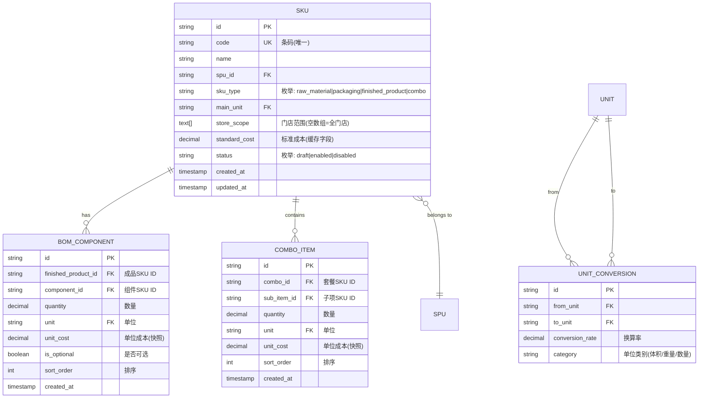

# 数据模型设计: SKU主数据管理(支持BOM)

**功能分支**: P001-sku-master-data
**创建日期**: 2025-12-24
**目的**: 定义 SKU 类型扩展、BOM 结构和门店范围配置的数据模型

---

## 实体概览



---

## 核心实体定义

### 1. SKU (skus)

**用途**: 库存保持单位主数据,支持四种类型的SKU

| 字段名 | 类型 | 约束 | 说明 |
|--------|------|------|------|
| `id` | UUID | PK, NOT NULL | 主键 |
| `code` | VARCHAR(50) | UNIQUE, NOT NULL | 条码(全局唯一) |
| `name` | VARCHAR(200) | NOT NULL | SKU名称 |
| `spu_id` | UUID | FK, NOT NULL | 关联SPU |
| `sku_type` | VARCHAR(20) | NOT NULL | SKU类型: `raw_material`(原料) \| `packaging`(包材) \| `finished_product`(成品) \| `combo`(套餐) |
| `main_unit` | VARCHAR(20) | FK, NOT NULL | 主单位(关联units表) |
| `store_scope` | TEXT[] | DEFAULT '{}' | 门店范围(空数组=全门店,非空=特定门店ID列表) |
| `standard_cost` | DECIMAL(10,2) | NULL | 标准成本(元),原料/包材手动输入,成品/套餐自动计算缓存 |
| `waste_rate` | DECIMAL(5,2) | DEFAULT 0 | 损耗率(%),仅成品类型有效 |
| `status` | VARCHAR(10) | NOT NULL | 状态: `draft`(草稿) \| `enabled`(启用) \| `disabled`(停用) |
| `created_at` | TIMESTAMP | NOT NULL | 创建时间 |
| `updated_at` | TIMESTAMP | NOT NULL | 更新时间 |

**索引**:
- `idx_skus_code`: UNIQUE (`code`)
- `idx_skus_spu_id`: (`spu_id`)
- `idx_skus_type`: (`sku_type`)
- `idx_skus_status`: (`status`)

**约束**:
```sql
-- SKU类型枚举检查
ALTER TABLE skus ADD CONSTRAINT chk_sku_type
CHECK (sku_type IN ('raw_material', 'packaging', 'finished_product', 'combo'));

-- 状态枚举检查
ALTER TABLE skus ADD CONSTRAINT chk_sku_status
CHECK (status IN ('draft', 'enabled', 'disabled'));

-- 标准成本业务规则
ALTER TABLE skus ADD CONSTRAINT chk_standard_cost
CHECK (
  -- 原料和包材必须有标准成本
  (sku_type IN ('raw_material', 'packaging') AND standard_cost IS NOT NULL AND standard_cost > 0)
  -- 成品和套餐的标准成本由系统计算
  OR sku_type IN ('finished_product', 'combo')
);

-- 损耗率仅成品有效
ALTER TABLE skus ADD CONSTRAINT chk_waste_rate
CHECK (
  (sku_type = 'finished_product' AND waste_rate >= 0 AND waste_rate <= 100)
  OR (sku_type != 'finished_product' AND waste_rate = 0)
);
```

**TypeScript 类型定义**:
```typescript
export enum SkuType {
  RAW_MATERIAL = 'raw_material',      // 原料
  PACKAGING = 'packaging',             // 包材
  FINISHED_PRODUCT = 'finished_product', // 成品
  COMBO = 'combo'                      // 套餐
}

export enum SkuStatus {
  DRAFT = 'draft',
  ENABLED = 'enabled',
  DISABLED = 'disabled'
}

export interface SKU {
  id: string
  code: string
  name: string
  spuId: string
  skuType: SkuType
  mainUnit: string
  storeScope: string[] // 空数组 = 全门店
  standardCost: number | null
  wasteRate: number
  status: SkuStatus
  createdAt: string
  updatedAt: string
}
```

---

### 2. BOM_COMPONENT (bom_components)

**用途**: 成品SKU的BOM组件配置(仅 `finished_product` 类型使用)

| 字段名 | 类型 | 约束 | 说明 |
|--------|------|------|------|
| `id` | UUID | PK, NOT NULL | 主键 |
| `finished_product_id` | UUID | FK, NOT NULL | 成品SKU ID |
| `component_id` | UUID | FK, NOT NULL | 组件SKU ID(必须是原料或包材) |
| `quantity` | DECIMAL(10,3) | NOT NULL | 数量 |
| `unit` | VARCHAR(20) | FK, NOT NULL | 单位(关联units表) |
| `unit_cost` | DECIMAL(10,2) | NULL | 单位成本快照(保存时记录) |
| `is_optional` | BOOLEAN | DEFAULT FALSE | 是否可选组件 |
| `sort_order` | INTEGER | DEFAULT 0 | 排序序号 |
| `created_at` | TIMESTAMP | NOT NULL | 创建时间 |

**索引**:
- `idx_bom_finished_product`: (`finished_product_id`)
- `idx_bom_component`: (`component_id`)

**约束**:
```sql
-- 组件必须是原料或包材类型
ALTER TABLE bom_components ADD CONSTRAINT chk_component_type
CHECK (
  component_id IN (
    SELECT id FROM skus WHERE sku_type IN ('raw_material', 'packaging')
  )
);

-- 成品不能循环依赖自己
ALTER TABLE bom_components ADD CONSTRAINT chk_no_self_reference
CHECK (finished_product_id != component_id);

-- 唯一性约束: 同一成品不能重复添加相同组件
ALTER TABLE bom_components ADD CONSTRAINT uk_bom_component
UNIQUE (finished_product_id, component_id);
```

**TypeScript 类型定义**:
```typescript
export interface BomComponent {
  id: string
  finishedProductId: string
  componentId: string
  quantity: number
  unit: string
  unitCost: number | null
  isOptional: boolean
  sortOrder: number
  createdAt: string
}
```

---

### 3. COMBO_ITEM (combo_items)

**用途**: 套餐SKU的子项配置(仅 `combo` 类型使用)

| 字段名 | 类型 | 约束 | 说明 |
|--------|------|------|------|
| `id` | UUID | PK, NOT NULL | 主键 |
| `combo_id` | UUID | FK, NOT NULL | 套餐SKU ID |
| `sub_item_id` | UUID | FK, NOT NULL | 子项SKU ID(可以是成品) |
| `quantity` | DECIMAL(10,3) | NOT NULL | 数量 |
| `unit` | VARCHAR(20) | FK, NOT NULL | 单位(关联units表) |
| `unit_cost` | DECIMAL(10,2) | NULL | 单位成本快照(保存时记录) |
| `sort_order` | INTEGER | DEFAULT 0 | 排序序号 |
| `created_at` | TIMESTAMP | NOT NULL | 创建时间 |

**索引**:
- `idx_combo_combo_id`: (`combo_id`)
- `idx_combo_sub_item`: (`sub_item_id`)

**约束**:
```sql
-- 套餐不能包含自己
ALTER TABLE combo_items ADD CONSTRAINT chk_combo_no_self
CHECK (combo_id != sub_item_id);

-- 子项不能是套餐类型(避免嵌套套餐)
ALTER TABLE combo_items ADD CONSTRAINT chk_sub_item_not_combo
CHECK (
  sub_item_id IN (
    SELECT id FROM skus WHERE sku_type != 'combo'
  )
);

-- 唯一性约束: 同一套餐不能重复添加相同子项
ALTER TABLE combo_items ADD CONSTRAINT uk_combo_sub_item
UNIQUE (combo_id, sub_item_id);
```

**TypeScript 类型定义**:
```typescript
export interface ComboItem {
  id: string
  comboId: string
  subItemId: string
  quantity: number
  unit: string
  unitCost: number | null
  sortOrder: number
  createdAt: string
}
```

---

### 4. UNIT_CONVERSION (unit_conversions)

**用途**: 单位换算关系表(依赖 FR-02 单位换算功能)

| 字段名 | 类型 | 约束 | 说明 |
|--------|------|------|------|
| `id` | UUID | PK, NOT NULL | 主键 |
| `from_unit` | VARCHAR(20) | FK, NOT NULL | 源单位 |
| `to_unit` | VARCHAR(20) | FK, NOT NULL | 目标单位 |
| `conversion_rate` | DECIMAL(10,6) | NOT NULL | 换算率(1 from_unit = ? to_unit) |
| `category` | VARCHAR(20) | NOT NULL | 单位类别: `volume`(体积) \| `weight`(重量) \| `quantity`(数量) |

**索引**:
- `idx_conversion_from_to`: UNIQUE (`from_unit`, `to_unit`)

**TypeScript 类型定义**:
```typescript
export enum UnitCategory {
  VOLUME = 'volume',
  WEIGHT = 'weight',
  QUANTITY = 'quantity'
}

export interface UnitConversion {
  id: string
  fromUnit: string
  toUnit: string
  conversionRate: number
  category: UnitCategory
}
```

**示例数据**:
```sql
INSERT INTO unit_conversions (from_unit, to_unit, conversion_rate, category) VALUES
('ml', 'l', 0.001, 'volume'),
('l', 'ml', 1000, 'volume'),
('g', 'kg', 0.001, 'weight'),
('kg', 'g', 1000, 'weight'),
('个', '打', 0.083333, 'quantity'),
('打', '个', 12, 'quantity');
```

---

## 业务规则

### BR-001: SKU类型与成本计算规则

| SKU类型 | 标准成本来源 | BOM要求 | 门店范围 |
|---------|-------------|---------|---------|
| 原料 (raw_material) | 手动输入(必填) | 无 | 支持配置 |
| 包材 (packaging) | 手动输入(必填) | 无 | 支持配置 |
| 成品 (finished_product) | BOM自动计算 | 必须配置 | 支持配置(需验证组件可用性) |
| 套餐 (combo) | 子项汇总计算 | 必须配置子项 | 支持配置(需验证子项可用性) |

### BR-002: 成品标准成本计算公式

```
标准成本 = Σ(组件数量 × 组件单位成本) × (1 + 损耗率%)

其中:
- 组件数量: 换算到基础单位后的数量
- 组件单位成本: 来自组件SKU的standard_cost字段
- 损耗率: 成品SKU的waste_rate字段(默认0%)
```

**示例**:
```
成品: 威士忌可乐
组件1: 威士忌 50ml × 0.50元/ml = 25.00元
组件2: 可乐糖浆 100ml × 0.02元/ml = 2.00元
组件3: 杯子 1个 × 1.00元/个 = 1.00元
组件4: 冰块 50g × 0.01元/g = 0.50元
组件成本合计: 28.50元
损耗率: 5%
标准成本 = 28.50 × (1 + 0.05) = 29.93元
```

### BR-003: 套餐标准成本计算公式

```
标准成本 = Σ(子项数量 × 子项单位成本)

其中:
- 子项可以是成品(使用成品的标准成本)
- 子项数量换算到基础单位
```

**示例**:
```
套餐: 情侣观影套餐
子项1: 威士忌可乐 2杯 × 29.93元/杯 = 59.86元
子项2: 奶油爆米花 1桶 × 15.86元/桶 = 15.86元
子项3: 黄油爆米花 1桶 × 15.75元/桶 = 15.75元
标准成本 = 91.47元
```

### BR-004: 门店范围验证规则

1. **空数组规则**: `store_scope = []` 表示全门店可用
2. **特定门店规则**: `store_scope = ['store-1', 'store-2']` 表示仅这些门店可用
3. **成品验证**: 启用成品SKU时,必须验证所有组件在目标门店可用
4. **套餐验证**: 启用套餐SKU时,必须验证所有子项在目标门店可用

**验证逻辑**:
```typescript
function validateStoreScopeForFinishedProduct(
  finishedProduct: SKU,
  components: SKU[]
): ValidationResult {
  const productStores = finishedProduct.storeScope.length === 0
    ? 'ALL'
    : new Set(finishedProduct.storeScope)

  for (const component of components) {
    const componentStores = component.storeScope.length === 0
      ? 'ALL'
      : new Set(component.storeScope)

    // 全门店组件可以用于任何成品
    if (componentStores === 'ALL') continue

    // 全门店成品需要所有组件都是全门店
    if (productStores === 'ALL') {
      return {
        valid: false,
        error: `组件"${component.name}"不是全门店可用,无法用于全门店成品`
      }
    }

    // 检查门店交集
    const hasIntersection = [...productStores].some(s => componentStores.has(s))
    if (!hasIntersection) {
      return {
        valid: false,
        error: `组件"${component.name}"在成品的门店范围内不可用`
      }
    }
  }

  return { valid: true }
}
```

### BR-005: BOM循环依赖检测

**禁止场景**:
- 成品A的BOM包含成品B,成品B的BOM包含成品A
- 成品的BOM不能包含自己

**实现策略**:
1. **前端限制**: BOM组件选择器仅显示原料和包材类型SKU
2. **后端验证**: 保存时检查 `component_id` 必须是 `raw_material` 或 `packaging` 类型
3. **数据库约束**: 使用 CHECK 约束强制执行

---

## 数据迁移计划

### 阶段1: 扩展 skus 表

```sql
-- 添加新字段
ALTER TABLE skus ADD COLUMN sku_type VARCHAR(20) DEFAULT 'raw_material';
ALTER TABLE skus ADD COLUMN store_scope TEXT[] DEFAULT '{}';
ALTER TABLE skus ADD COLUMN waste_rate DECIMAL(5,2) DEFAULT 0;

-- 添加约束
ALTER TABLE skus ADD CONSTRAINT chk_sku_type
CHECK (sku_type IN ('raw_material', 'packaging', 'finished_product', 'combo'));

ALTER TABLE skus ADD CONSTRAINT chk_waste_rate
CHECK (waste_rate >= 0 AND waste_rate <= 100);

-- 创建索引
CREATE INDEX idx_skus_type ON skus(sku_type);
```

### 阶段2: 创建 BOM 和套餐表

```sql
-- BOM组件表
CREATE TABLE bom_components (
  id UUID PRIMARY KEY DEFAULT gen_random_uuid(),
  finished_product_id UUID NOT NULL REFERENCES skus(id) ON DELETE CASCADE,
  component_id UUID NOT NULL REFERENCES skus(id) ON DELETE RESTRICT,
  quantity DECIMAL(10,3) NOT NULL CHECK (quantity > 0),
  unit VARCHAR(20) NOT NULL,
  unit_cost DECIMAL(10,2),
  is_optional BOOLEAN DEFAULT FALSE,
  sort_order INTEGER DEFAULT 0,
  created_at TIMESTAMP DEFAULT NOW(),
  CONSTRAINT uk_bom_component UNIQUE (finished_product_id, component_id)
);

CREATE INDEX idx_bom_finished_product ON bom_components(finished_product_id);
CREATE INDEX idx_bom_component ON bom_components(component_id);

-- 套餐子项表
CREATE TABLE combo_items (
  id UUID PRIMARY KEY DEFAULT gen_random_uuid(),
  combo_id UUID NOT NULL REFERENCES skus(id) ON DELETE CASCADE,
  sub_item_id UUID NOT NULL REFERENCES skus(id) ON DELETE RESTRICT,
  quantity DECIMAL(10,3) NOT NULL CHECK (quantity > 0),
  unit VARCHAR(20) NOT NULL,
  unit_cost DECIMAL(10,2),
  sort_order INTEGER DEFAULT 0,
  created_at TIMESTAMP DEFAULT NOW(),
  CONSTRAINT uk_combo_sub_item UNIQUE (combo_id, sub_item_id)
);

CREATE INDEX idx_combo_combo_id ON combo_items(combo_id);
CREATE INDEX idx_combo_sub_item ON combo_items(sub_item_id);
```

### 阶段3: 初始化测试数据

参考 `spec.md` 中的测试数据规范,创建21个SKU:
- 5个原料SKU
- 5个包材SKU
- 8个成品SKU(带BOM配置)
- 3个套餐SKU(带子项配置)

---

## 性能优化

### 1. 查询优化

**高频查询**: 按门店过滤可用SKU
```sql
-- 优化方案: 使用GIN索引加速数组查询
CREATE INDEX idx_skus_store_scope ON skus USING GIN(store_scope);

-- 查询示例
SELECT * FROM skus
WHERE store_scope = '{}'  -- 全门店
   OR 'store-1' = ANY(store_scope);  -- 特定门店
```

### 2. 成本计算缓存

- **策略**: 成品和套餐的标准成本在保存时计算并缓存到 `standard_cost` 字段
- **触发条件**:
  - 成品/套餐保存时
  - BOM组件变更时
  - 组件SKU成本变更时(需级联更新)
- **刷新机制**: 后端提供 `POST /api/skus/{id}/recalculate-cost` 接口手动触发

### 3. 级联更新策略

当原料/包材的标准成本变更时:
1. 查找所有依赖该组件的成品BOM
2. 异步批量重新计算成品标准成本
3. 递归计算依赖这些成品的套餐标准成本
4. 记录成本变更日志

---

## 数据完整性检查清单

- [x] 所有表定义有主键
- [x] 外键约束完整
- [x] 枚举字段有CHECK约束
- [x] 数值字段有范围校验
- [x] 唯一性约束(条码、BOM组件、套餐子项)
- [x] 删除级联策略明确(CASCADE vs RESTRICT)
- [x] 时间戳字段有默认值
- [x] 索引覆盖高频查询场景
- [x] TypeScript类型定义与数据库字段对齐
- [x] 业务规则有数据库约束支持

---

## 附录: 字段映射

### PostgreSQL ↔ TypeScript 字段名映射

| 数据库字段(snake_case) | TypeScript字段(camelCase) |
|----------------------|--------------------------|
| `sku_type` | `skuType` |
| `main_unit` | `mainUnit` |
| `store_scope` | `storeScope` |
| `standard_cost` | `standardCost` |
| `waste_rate` | `wasteRate` |
| `created_at` | `createdAt` |
| `updated_at` | `updatedAt` |
| `finished_product_id` | `finishedProductId` |
| `component_id` | `componentId` |
| `unit_cost` | `unitCost` |
| `is_optional` | `isOptional` |
| `sort_order` | `sortOrder` |
| `combo_id` | `comboId` |
| `sub_item_id` | `subItemId` |
