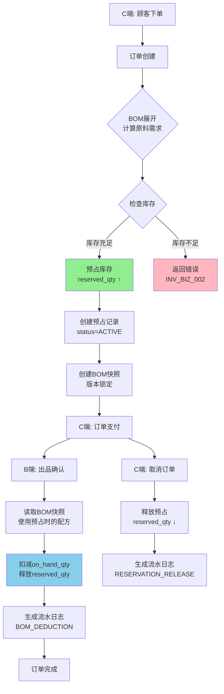

# 端到端测试用例文档 - BOM库存预占与扣减

**功能模块**: BOM库存预占与扣减（两阶段库存管理）
**测试版本**: 1.0.0
**编写人**: Claude (E2E Test Writer)
**编写日期**: 2025-12-29
**Spec 引用**: [specs/P005-bom-inventory-deduction/spec.md](./spec.md)

---

## 📋 测试概述

### 测试目标

验证 BOM (Bill of Materials) 库存预占与实扣的两阶段管理流程：
1. **订单下单阶段**: 通过BOM展开计算原料需求 → 检查可用库存 → 预占库存（锁定`reserved_qty`）
2. **订单出品阶段**: 使用BOM快照版本锁定 → 实际扣减`on_hand_qty` → 释放`reserved_qty` → 生成流水日志
3. **订单取消**: 释放已预占的库存
4. **异常处理**: 库存不足、并发冲突、BOM深度超限、数据一致性验证

覆盖 5 个用户故事：
- **US1 (P1)**: 订单下单时库存预占
- **US2 (P1)**: 订单出品时库存实扣
- **US3 (P2)**: 库存扣减流水查询
- **US4 (P2)**: 多层级套餐BOM展开
- **US5 (P3)**: 损耗率自动计算

### 业务流程图



### 涉及系统/模块

- [x] B端管理后台（订单管理、库存管理、流水查询）
- [x] C端小程序（下单、支付、订单查询）
- [x] 后端API（Spring Boot）
  - `/api/inventory/reservations` (POST, DELETE)
  - `/api/inventory/deductions` (POST)
  - `/api/inventory/transactions` (GET)
- [x] 数据库（Supabase PostgreSQL）
  - `inventory` 表
  - `inventory_reservations` 表
  - `inventory_transactions` 表
  - `bom_snapshots` 表
  - `bom_components` 表

---

## 🔑 关键业务节点

| 节点序号 | 节点名称 | 操作端 | 关键检查点 |
|---------|---------|-------|----------|
| 1 | BOM配方配置 | B端 | BOM组件配置正确、数量单位准确 |
| 2 | C端下单 | C端小程序 | 订单创建成功、商品选择正确 |
| 3 | BOM展开计算 | 系统 | 递归展开成功、数量计算准确、最大深度3层 |
| 4 | 库存可用性检查 | 系统 | available_qty = on_hand_qty - reserved_qty >= 需求量 |
| 5 | 库存预占 | 系统 | reserved_qty 增加、available_qty 减少、创建预占记录 |
| 6 | BOM快照创建 | 系统 | 快照数据完整、版本锁定生效 |
| 7 | 订单支付 | C端 | 支付成功、订单状态流转 |
| 8 | B端出品确认 | B端 | 触发库存实扣逻辑 |
| 9 | BOM快照加载 | 系统 | 使用预占时的配方、而非当前最新配方 |
| 10 | 库存实扣 | 系统 | on_hand_qty 减少、reserved_qty 减少、available_qty 计算正确 |
| 11 | 流水日志生成 | 系统 | 记录完整、包含BOM快照ID、数量变化正确 |
| 12 | 订单取消 | C端/B端 | 释放预占、reserved_qty 恢复、生成RELEASE日志 |

---

## 📝 测试用例清单

### TC-P005-001: 单品BOM展开与库存预占 - 正向流程（US1）

**用例ID**: TC-P005-001
**优先级**: 🔴 高
**测试类型**: 端到端测试
**覆盖故事**: US1

**前置条件**:
- [x] 威士忌可乐鸡尾酒已配置BOM配方
  - 45ml 威士忌 + 150ml 可乐 + 1个杯子 + 1根吸管
- [x] 门店库存充足
  - 威士忌: on_hand=1000ml, reserved=0ml, available=1000ml
  - 可乐: on_hand=5000ml, reserved=0ml, available=5000ml
  - 杯子: on_hand=100个, reserved=0, available=100
  - 吸管: on_hand=200根, reserved=0, available=200
- [x] C端用户已登录

**测试数据**:
```json
{
  "storeId": "00000000-0000-0000-0000-000000000001",
  "beverageName": "威士忌可乐鸡尾酒",
  "beverageId": "sku-cocktail-001",
  "quantity": 1,
  "expectedBomComponents": [
    {"skuId": "sku-whiskey-001", "name": "威士忌", "quantity": 45, "unit": "ml"},
    {"skuId": "sku-cola-001", "name": "可乐", "quantity": 150, "unit": "ml"},
    {"skuId": "sku-cup-001", "name": "杯子", "quantity": 1, "unit": "个"},
    {"skuId": "sku-straw-001", "name": "吸管", "quantity": 1, "unit": "根"}
  ]
}
```

**测试步骤**:

| 步骤 | 操作端 | 操作描述 | 预期结果 | 实际结果 | 通过状态 |
|-----|-------|---------|---------|---------|---------|
| 1 | C端 | 打开商品列表，选择"威士忌可乐鸡尾酒" | 商品详情展示正确 | | ☐ 通过 ☐ 失败 |
| 2 | C端 | 点击"加入购物车"，数量设为1 | 购物车显示1杯 | | ☐ 通过 ☐ 失败 |
| 3 | C端 | 进入购物车，点击"去结算" | 跳转到订单确认页 | | ☐ 通过 ☐ 失败 |
| 4 | C端 | 确认订单信息，点击"提交订单" | 触发订单创建API | | ☐ 通过 ☐ 失败 |
| 5 | 系统 | 创建订单记录（beverage_orders表） | 订单状态为PENDING_PAYMENT | | ☐ 通过 ☐ 失败 |
| 6 | 系统 | 调用库存预占API: POST /api/inventory/reservations | API返回200成功 | | ☐ 通过 ☐ 失败 |
| 7 | 系统 | BomExpansionService.expandBom() 展开BOM | 展开为4个原料组件 | | ☐ 通过 ☐ 失败 |
| 8 | 系统 | 检查威士忌库存：available=1000ml >= 45ml | 检查通过 | | ☐ 通过 ☐ 失败 |
| 9 | 系统 | 检查可乐库存：available=5000ml >= 150ml | 检查通过 | | ☐ 通过 ☐ 失败 |
| 10 | 系统 | 检查杯子库存：available=100 >= 1 | 检查通过 | | ☐ 通过 ☐ 失败 |
| 11 | 系统 | 检查吸管库存：available=200 >= 1 | 检查通过 | | ☐ 通过 ☐ 失败 |
| 12 | 系统 | 更新威士忌库存：reserved_qty: 0→45ml | on_hand不变，reserved增加45ml | | ☐ 通过 ☐ 失败 |
| 13 | 系统 | 更新可乐库存：reserved_qty: 0→150ml | on_hand不变，reserved增加150ml | | ☐ 通过 ☐ 失败 |
| 14 | 系统 | 更新杯子库存：reserved_qty: 0→1 | on_hand不变，reserved增加1 | | ☐ 通过 ☐ 失败 |
| 15 | 系统 | 更新吸管库存：reserved_qty: 0→1 | on_hand不变，reserved增加1 | | ☐ 通过 ☐ 失败 |
| 16 | 系统 | 创建4条inventory_reservations记录 | status=ACTIVE，关联orderId | | ☐ 通过 ☐ 失败 |
| 17 | 系统 | 创建BOM快照（bom_snapshots表） | 快照包含4个组件的配方数据 | | ☐ 通过 ☐ 失败 |
| 18 | C端 | 显示Toast提示"下单成功，库存已预占" | 提示显示正确 | | ☐ 通过 ☐ 失败 |
| 19 | C端 | 自动跳转到支付页面 | 显示订单ID和待支付金额 | | ☐ 通过 ☐ 失败 |

**后置检查**:
- [x] 数据库状态检查 - inventory表
  ```sql
  SELECT sku_id, on_hand_qty, reserved_qty, available_qty
  FROM inventory
  WHERE store_id = '00000000-0000-0000-0000-000000000001'
    AND sku_id IN ('sku-whiskey-001', 'sku-cola-001', 'sku-cup-001', 'sku-straw-001');
  ```
  - 威士忌: on_hand=1000ml, reserved=45ml, available=955ml ✅
  - 可乐: on_hand=5000ml, reserved=150ml, available=4850ml ✅
  - 杯子: on_hand=100, reserved=1, available=99 ✅
  - 吸管: on_hand=200, reserved=1, available=199 ✅

- [x] 库存预占记录检查 - inventory_reservations表
  ```sql
  SELECT * FROM inventory_reservations WHERE order_id = '{orderId}';
  ```
  - 记录数: 4 ✅
  - 所有记录status=ACTIVE ✅
  - reserved_quantity匹配BOM配方 ✅

- [x] BOM快照检查 - bom_snapshots表
  ```sql
  SELECT * FROM bom_snapshots WHERE order_id = '{orderId}';
  ```
  - 快照存在 ✅
  - snapshot_data包含components数组 ✅
  - 快照数据与当前BOM配方一致 ✅

---

### TC-P005-002: 订单出品库存实扣 - 正向流程（US2）

**用例ID**: TC-P005-002
**优先级**: 🔴 高
**测试类型**: 端到端测试
**覆盖故事**: US2

**前置条件**:
- [x] TC-P005-001已执行完成，库存已预占
- [x] 订单已支付（状态=PENDING_FULFILLMENT）
- [x] 库存状态：
  - 威士忌: on_hand=1000ml, reserved=45ml, available=955ml
  - 可乐: on_hand=5000ml, reserved=150ml, available=4850ml
  - 杯子: on_hand=100, reserved=1, available=99
  - 吸管: on_hand=200, reserved=1, available=199

**测试步骤**:

| 步骤 | 操作端 | 操作描述 | 预期结果 | 实际结果 | 通过状态 |
|-----|-------|---------|---------|---------|---------|
| 1 | B端 | 登录管理后台，进入"订单管理" | 显示订单列表 | | ☐ 通过 ☐ 失败 |
| 2 | B端 | 找到测试订单，状态显示"待出品" | 订单状态正确 | | ☐ 通过 ☐ 失败 |
| 3 | B端 | 点击订单详情，查看商品清单 | 显示"威士忌可乐鸡尾酒 × 1" | | ☐ 通过 ☐ 失败 |
| 4 | B端 | 点击"出品确认"按钮 | 触发库存扣减API | | ☐ 通过 ☐ 失败 |
| 5 | 系统 | 调用POST /api/inventory/deductions | API返回200成功 | | ☐ 通过 ☐ 失败 |
| 6 | 系统 | 查询该订单的ACTIVE预占记录 | 找到4条预占记录 | | ☐ 通过 ☐ 失败 |
| 7 | 系统 | 加载BOM快照（不使用当前配方） | 使用订单创建时的配方版本 | | ☐ 通过 ☐ 失败 |
| 8 | 系统 | 锁定威士忌库存行（SELECT FOR UPDATE） | 悲观锁生效，防止并发修改 | | ☐ 通过 ☐ 失败 |
| 9 | 系统 | 验证 on_hand(1000) >= reserved(45) | 数据一致性校验通过 | | ☐ 通过 ☐ 失败 |
| 10 | 系统 | 扣减威士忌: on_hand: 1000→955ml, reserved: 45→0ml | available保持955ml不变 | | ☐ 通过 ☐ 失败 |
| 11 | 系统 | 扣减可乐: on_hand: 5000→4850ml, reserved: 150→0ml | available保持4850ml不变 | | ☐ 通过 ☐ 失败 |
| 12 | 系统 | 扣减杯子: on_hand: 100→99, reserved: 1→0 | available保持99不变 | | ☐ 通过 ☐ 失败 |
| 13 | 系统 | 扣减吸管: on_hand: 200→199, reserved: 1→0 | available保持199不变 | | ☐ 通过 ☐ 失败 |
| 14 | 系统 | 生成4条库存流水日志 | type=BOM_DEDUCTION, quantity为负数 | | ☐ 通过 ☐ 失败 |
| 15 | 系统 | 流水日志包含bom_snapshot_id | 关联到订单的BOM快照 | | ☐ 通过 ☐ 失败 |
| 16 | 系统 | 更新预占记录status: ACTIVE→FULFILLED | 标记预占已完成 | | ☐ 通过 ☐ 失败 |
| 17 | 系统 | 更新预占记录fulfilled_at字段 | 记录完成时间戳 | | ☐ 通过 ☐ 失败 |
| 18 | B端 | 显示Toast提示"出品确认成功" | 提示显示正确 | | ☐ 通过 ☐ 失败 |
| 19 | B端 | 订单状态更新为"已完成" | 状态流转正确 | | ☐ 通过 ☐ 失败 |

**后置检查**:
- [x] 库存数据验证 - inventory表
  ```sql
  SELECT sku_id, on_hand_qty, reserved_qty, available_qty
  FROM inventory
  WHERE sku_id IN ('sku-whiskey-001', 'sku-cola-001', 'sku-cup-001', 'sku-straw-001');
  ```
  - 威士忌: on_hand=955ml, reserved=0ml, available=955ml ✅
  - 可乐: on_hand=4850ml, reserved=0ml, available=4850ml ✅
  - 杯子: on_hand=99, reserved=0, available=99 ✅
  - 吸管: on_hand=199, reserved=0, available=199 ✅

- [x] 流水日志验证 - inventory_transactions表
  ```sql
  SELECT * FROM inventory_transactions
  WHERE related_order_id = '{orderId}' AND transaction_type = 'BOM_DEDUCTION';
  ```
  - 记录数: 4 ✅
  - quantity为负数（扣减） ✅
  - quantity_before和quantity_after正确 ✅
  - bom_snapshot_id非空 ✅

- [x] 预占记录验证 - inventory_reservations表
  ```sql
  SELECT status, fulfilled_at FROM inventory_reservations WHERE order_id = '{orderId}';
  ```
  - 所有记录status=FULFILLED ✅
  - fulfilled_at已记录时间戳 ✅

---

### TC-P005-003: 库存不足拒绝预占 - 异常流程（US1边界）

**用例ID**: TC-P005-003
**优先级**: 🔴 高
**测试类型**: 异常测试
**覆盖故事**: US1 边界条件

**前置条件**:
- [x] 威士忌库存不足：on_hand=30ml, reserved=0ml, available=30ml
- [x] 其他原料库存充足
- [x] BOM配方：1杯需要45ml威士忌

**异常场景**: 顾客下单时，某一原料库存不足，系统应拒绝预占并返回详细错误信息

**测试步骤**:

| 步骤 | 操作端 | 操作描述 | 预期结果 | 实际结果 | 通过状态 |
|-----|-------|---------|---------|---------|---------|
| 1 | C端 | 下单1杯威士忌可乐鸡尾酒 | 触发库存预占API | | ☐ 通过 ☐ 失败 |
| 2 | 系统 | BOM展开：需要45ml威士忌 | 计算正确 | | ☐ 通过 ☐ 失败 |
| 3 | 系统 | 检查威士忌库存：available=30ml < required=45ml | 检查失败 | | ☐ 通过 ☐ 失败 |
| 4 | 系统 | 抛出InsufficientInventoryException | 异常抛出正确 | | ☐ 通过 ☐ 失败 |
| 5 | 系统 | API返回400错误，包含shortages详情 | 错误码: INV_BIZ_002 | | ☐ 通过 ☐ 失败 |
| 6 | 系统 | shortages数组包含威士忌短缺信息 | available=30, required=45, shortage=15 | | ☐ 通过 ☐ 失败 |
| 7 | 系统 | 事务回滚，所有库存数据未修改 | 所有原料库存保持不变 | | ☐ 通过 ☐ 失败 |
| 8 | 系统 | 未创建任何预占记录 | inventory_reservations表无新记录 | | ☐ 通过 ☐ 失败 |
| 9 | 系统 | 未创建BOM快照 | bom_snapshots表无新记录 | | ☐ 通过 ☐ 失败 |
| 10 | C端 | 前端调用handleInventoryError() | 错误处理器正确解析 | | ☐ 通过 ☐ 失败 |
| 11 | C端 | 显示Toast: "威士忌库存不足" | 错误提示友好、具体 | | ☐ 通过 ☐ 失败 |
| 12 | C端 | 显示详细短缺信息（可选） | "可用30ml，需要45ml，差15ml" | | ☐ 通过 ☐ 失败 |

**异常响应格式验证**:
```json
{
  "success": false,
  "error": "INV_BIZ_002",
  "message": "Insufficient inventory for order",
  "details": {
    "shortages": [
      {
        "skuId": "sku-whiskey-001",
        "skuName": "威士忌",
        "available": 30.0,
        "required": 45.0,
        "shortage": 15.0,
        "unit": "ml"
      }
    ]
  },
  "timestamp": "2025-12-29T10:30:00Z"
}
```

**异常处理验证**:
- [x] 错误码正确：INV_BIZ_002 ✅
- [x] 错误提示清晰明确 ✅
- [x] 数据库未被污染（事务回滚） ✅
- [x] 库存数据保持一致性 ✅
- [x] 未产生孤儿记录 ✅

---

### TC-P005-004: 订单取消释放预占库存 - 正向流程（US1回退）

**用例ID**: TC-P005-004
**优先级**: 🔴 高
**测试类型**: 端到端测试
**覆盖故事**: US1 库存回退

**前置条件**:
- [x] TC-P005-001已执行，库存已预占
- [x] 订单状态=PENDING_PAYMENT（未支付）
- [x] 库存状态：
  - 威士忌: on_hand=1000ml, reserved=45ml, available=955ml

**测试步骤**:

| 步骤 | 操作端 | 操作描述 | 预期结果 | 实际结果 | 通过状态 |
|-----|-------|---------|---------|---------|---------|
| 1 | C端 | 进入"我的订单"，找到待支付订单 | 显示订单详情 | | ☐ 通过 ☐ 失败 |
| 2 | C端 | 点击"取消订单"按钮 | 弹出确认弹窗 | | ☐ 通过 ☐ 失败 |
| 3 | C端 | 确认取消 | 调用取消订单API | | ☐ 通过 ☐ 失败 |
| 4 | 系统 | 调用DELETE /api/inventory/reservations/{orderId} | API返回200成功 | | ☐ 通过 ☐ 失败 |
| 5 | 系统 | 查询该订单的ACTIVE预占记录 | 找到4条预占记录 | | ☐ 通过 ☐ 失败 |
| 6 | 系统 | 锁定威士忌库存行（SELECT FOR UPDATE） | 悲观锁生效 | | ☐ 通过 ☐ 失败 |
| 7 | 系统 | 释放威士忌预占：reserved: 45→0ml | on_hand保持1000ml不变 | | ☐ 通过 ☐ 失败 |
| 8 | 系统 | 释放可乐预占：reserved: 150→0ml | on_hand保持5000ml不变 | | ☐ 通过 ☐ 失败 |
| 9 | 系统 | 释放杯子预占：reserved: 1→0 | on_hand保持100不变 | | ☐ 通过 ☐ 失败 |
| 10 | 系统 | 释放吸管预占：reserved: 1→0 | on_hand保持200不变 | | ☐ 通过 ☐ 失败 |
| 11 | 系统 | 生成4条RESERVATION_RELEASE日志 | quantity=0（只影响reserved_qty） | | ☐ 通过 ☐ 失败 |
| 12 | 系统 | 日志notes包含释放数量信息 | "released_qty: 45" | | ☐ 通过 ☐ 失败 |
| 13 | 系统 | 更新预占记录status: ACTIVE→CANCELLED | 标记预占已取消 | | ☐ 通过 ☐ 失败 |
| 14 | 系统 | API返回释放数量统计 | releasedReservations: 4 | | ☐ 通过 ☐ 失败 |
| 15 | C端 | 显示Toast: "订单已取消" | 提示显示正确 | | ☐ 通过 ☐ 失败 |
| 16 | C端 | 订单列表状态更新为"已取消" | 状态同步正确 | | ☐ 通过 ☐ 失败 |

**后置检查**:
- [x] 库存数据验证 - inventory表
  ```sql
  SELECT sku_id, on_hand_qty, reserved_qty, available_qty
  FROM inventory
  WHERE sku_id IN ('sku-whiskey-001', 'sku-cola-001', 'sku-cup-001', 'sku-straw-001');
  ```
  - 威士忌: on_hand=1000ml, reserved=0ml, available=1000ml ✅（恢复初始状态）
  - 可乐: on_hand=5000ml, reserved=0ml, available=5000ml ✅
  - 杯子: on_hand=100, reserved=0, available=100 ✅
  - 吸管: on_hand=200, reserved=0, available=200 ✅

- [x] 预占记录验证 - inventory_reservations表
  ```sql
  SELECT status FROM inventory_reservations WHERE order_id = '{orderId}';
  ```
  - 所有记录status=CANCELLED ✅

- [x] 流水日志验证 - inventory_transactions表
  ```sql
  SELECT * FROM inventory_transactions
  WHERE related_order_id = '{orderId}' AND transaction_type = 'RESERVATION_RELEASE';
  ```
  - 记录数: 4 ✅
  - quantity=0（未改变on_hand_qty） ✅
  - quantity_before = quantity_after ✅

---

### TC-P005-005: 多层级套餐BOM展开 - 复杂场景（US4）

**用例ID**: TC-P005-005
**优先级**: 🟡 中
**测试类型**: 功能测试
**覆盖故事**: US4

**前置条件**:
- [x] 配置3层BOM结构：
  ```
  情侣套餐（成品）
  ├─ 威士忌可乐鸡尾酒（成品）
  │  ├─ 威士忌 45ml（原料）
  │  ├─ 可乐 150ml（原料）
  │  ├─ 杯子 1个（原料）
  │  └─ 吸管 1根（原料）
  └─ 爆米花（成品）
     ├─ 玉米粒 50g（原料）
     ├─ 黄油 10g（原料）
     └─ 纸桶 1个（原料）
  ```
- [x] 所有原料库存充足

**测试数据**:
```json
{
  "productName": "情侣套餐",
  "productId": "sku-combo-lovers",
  "quantity": 1,
  "expectedDepth": 3,
  "expectedLeafMaterials": 7
}
```

**测试步骤**:

| 步骤 | 操作端 | 操作描述 | 预期结果 | 实际结果 | 通过状态 |
|-----|-------|---------|---------|---------|---------|
| 1 | C端 | 下单1份"情侣套餐" | 订单创建成功 | | ☐ 通过 ☐ 失败 |
| 2 | 系统 | BOM展开：第1层 - 套餐本身 | depth=0 | | ☐ 通过 ☐ 失败 |
| 3 | 系统 | BOM展开：第2层 - 鸡尾酒+爆米花 | depth=1，2个成品 | | ☐ 通过 ☐ 失败 |
| 4 | 系统 | BOM展开：第3层 - 7个原料 | depth=2，到达叶子节点 | | ☐ 通过 ☐ 失败 |
| 5 | 系统 | 聚合原料需求 | 威士忌45ml、可乐150ml、杯子1、吸管1、玉米50g、黄油10g、纸桶1 | | ☐ 通过 ☐ 失败 |
| 6 | 系统 | 检查所有7种原料库存 | 全部充足 | | ☐ 通过 ☐ 失败 |
| 7 | 系统 | 预占7种原料的库存 | reserved_qty增加 | | ☐ 通过 ☐ 失败 |
| 8 | 系统 | 创建7条预占记录 | 每种原料1条 | | ☐ 通过 ☐ 失败 |
| 9 | 系统 | 创建BOM快照 | 快照包含完整3层结构 | | ☐ 通过 ☐ 失败 |
| 10 | C端 | 显示预占成功提示 | Toast正常 | | ☐ 通过 ☐ 失败 |

**后置检查**:
- [x] BOM展开深度检查: depth ≤ 3 ✅
- [x] 叶子节点数量: 7个原料 ✅
- [x] 预占记录数量: 7条 ✅
- [x] BOM快照完整性: 包含3层结构 ✅

---

### TC-P005-006: BOM深度超限保护 - 边界条件（US4边界）

**用例ID**: TC-P005-006
**优先级**: 🟡 中
**测试类型**: 边界测试
**覆盖故事**: US4 深度限制

**前置条件**:
- [x] 配置4层BOM结构（超过MAX_DEPTH=3）
  ```
  超级套餐（depth=0）
  └─ 情侣套餐（depth=1）
     └─ 鸡尾酒（depth=2）
        └─ 威士忌（depth=3）
           └─ 原浆（depth=4）❌ 超限
  ```

**边界场景**: BOM嵌套深度超过3层时，系统应抛出BomDepthExceededException

**测试步骤**:

| 步骤 | 操作端 | 操作描述 | 预期结果 | 实际结果 | 通过状态 |
|-----|-------|---------|---------|---------|---------|
| 1 | C端 | 尝试下单"超级套餐" | 触发BOM展开 | | ☐ 通过 ☐ 失败 |
| 2 | 系统 | BOM递归展开到depth=4 | 触发深度检查 | | ☐ 通过 ☐ 失败 |
| 3 | 系统 | 抛出BomDepthExceededException | 异常正确抛出 | | ☐ 通过 ☐ 失败 |
| 4 | 系统 | 异常信息包含skuId、currentDepth=4、maxDepth=3 | 错误信息完整 | | ☐ 通过 ☐ 失败 |
| 5 | 系统 | API返回400错误，错误码INV_BIZ_004 | HTTP状态码正确 | | ☐ 通过 ☐ 失败 |
| 6 | 系统 | 事务回滚，未创建任何预占记录 | 数据库未污染 | | ☐ 通过 ☐ 失败 |
| 7 | C端 | 显示错误提示: "商品配置异常" | 用户友好提示 | | ☐ 通过 ☐ 失败 |

**深度检查验证**:
```java
// BomExpansionService.java:109-112
if (depth > MAX_DEPTH) {
    logger.error("BOM depth exceeds maximum ({}) for SKU: {}", MAX_DEPTH, skuId);
    throw new BomDepthExceededException(skuId, depth, MAX_DEPTH);
}
```

**异常响应格式**:
```json
{
  "success": false,
  "error": "INV_BIZ_004",
  "message": "BOM expansion depth (4) exceeded maximum allowed depth (3) for SKU: xxx",
  "details": {
    "skuId": "sku-super-combo",
    "currentDepth": 4,
    "maxDepth": 3
  }
}
```

---

### TC-P005-007: 库存流水查询 - B端查询（US3）

**用例ID**: TC-P005-007
**优先级**: 🟡 中
**测试类型**: 功能测试
**覆盖故事**: US3

**前置条件**:
- [x] TC-P005-002已执行，已产生BOM扣减流水
- [x] 测试订单ID: `test-order-001`
- [x] 流水表存在4条BOM_DEDUCTION记录

**测试步骤**:

| 步骤 | 操作端 | 操作描述 | 预期结果 | 实际结果 | 通过状态 |
|-----|-------|---------|---------|---------|---------|
| 1 | B端 | 登录管理后台，进入"库存管理" | 显示库存模块 | | ☐ 通过 ☐ 失败 |
| 2 | B端 | 点击"库存流水"菜单 | 显示流水查询页面 | | ☐ 通过 ☐ 失败 |
| 3 | B端 | 筛选条件：transactionType=BOM_DEDUCTION | 表单填写正常 | | ☐ 通过 ☐ 失败 |
| 4 | B端 | 筛选条件：orderId=test-order-001 | 表单填写正常 | | ☐ 通过 ☐ 失败 |
| 5 | B端 | 点击"查询"按钮 | 触发查询API | | ☐ 通过 ☐ 失败 |
| 6 | 系统 | 调用GET /api/inventory/transactions?transactionType=BOM_DEDUCTION&orderId=xxx | API返回200 | | ☐ 通过 ☐ 失败 |
| 7 | 系统 | 返回分页数据，totalElements=4 | 记录数正确 | | ☐ 通过 ☐ 失败 |
| 8 | B端 | 显示4条流水记录 | 列表展示正常 | | ☐ 通过 ☐ 失败 |
| 9 | B端 | 每条记录显示：SKU名称、数量变化、时间 | 字段显示完整 | | ☐ 通过 ☐ 失败 |
| 10 | B端 | 点击某条流水的"查看详情" | 进入详情页 | | ☐ 通过 ☐ 失败 |
| 11 | 系统 | 调用GET /api/inventory/transactions/{id} | API返回200 | | ☐ 通过 ☐ 失败 |
| 12 | 系统 | 返回流水详情+BOM组件清单 | bomComponents数组非空 | | ☐ 通过 ☐ 失败 |
| 13 | B端 | 显示BOM快照信息 | 展示当时的配方数据 | | ☐ 通过 ☐ 失败 |
| 14 | B端 | BOM组件包含：componentSkuId、standardQuantity、wastageRate、actualQuantity | 字段完整 | | ☐ 通过 ☐ 失败 |

**查询结果验证**:
```json
{
  "success": true,
  "data": [
    {
      "id": "xxx",
      "transactionType": "BOM_DEDUCTION",
      "skuId": "sku-whiskey-001",
      "skuName": "威士忌",
      "quantity": -45.0,
      "quantityBefore": 1000.0,
      "quantityAfter": 955.0,
      "relatedOrderId": "test-order-001",
      "bomSnapshotId": "snapshot-xxx",
      "operatedAt": "2025-12-29T10:30:00Z"
    }
  ],
  "total": 4,
  "page": 0,
  "pageSize": 20
}
```

---

### TC-P005-008: BOM配方变更后版本锁定验证 - 复杂场景（US2边界）

**用例ID**: TC-P005-008
**优先级**: 🟡 中
**测试类型**: 集成测试
**覆盖故事**: US2 版本锁定

**前置条件**:
- [x] 订单已下单并预占库存（BOM快照已创建）
- [x] 原配方：45ml威士忌 + 150ml可乐
- [x] 订单状态=PENDING_FULFILLMENT

**测试场景**: 在订单预占后、出品前，B端修改了BOM配方（改为50ml威士忌），验证出品时是否使用快照配方（45ml）而非新配方（50ml）

**测试步骤**:

| 步骤 | 操作端 | 操作描述 | 预期结果 | 实际结果 | 通过状态 |
|-----|-------|---------|---------|---------|---------|
| 1 | 记录 | 记录订单创建时的BOM快照 | snapshot包含45ml威士忌 | | ☐ 通过 ☐ 失败 |
| 2 | B端 | 进入"商品管理"→"BOM配方管理" | 显示配方列表 | | ☐ 通过 ☐ 失败 |
| 3 | B端 | 修改"鸡尾酒"配方：威士忌 45ml → 50ml | 配方更新成功 | | ☐ 通过 ☐ 失败 |
| 4 | 系统 | bom_components表更新 | quantity字段改为50 | | ☐ 通过 ☐ 失败 |
| 5 | B端 | 进入"订单管理"，找到测试订单 | 显示订单详情 | | ☐ 通过 ☐ 失败 |
| 6 | B端 | 点击"出品确认" | 触发库存扣减 | | ☐ 通过 ☐ 失败 |
| 7 | 系统 | 加载BOM快照（snapshot-xxx） | 使用快照数据，而非查询bom_components | | ☐ 通过 ☐ 失败 |
| 8 | 系统 | 从快照读取威士忌数量：45ml | 数量为快照版本 | | ☐ 通过 ☐ 失败 |
| 9 | 系统 | 扣减威士忌库存：45ml（而非50ml） | 扣减量正确 | | ☐ 通过 ☐ 失败 |
| 10 | 验证 | 检查库存流水quantity字段 | quantity=-45（不是-50） | | ☐ 通过 ☐ 失败 |
| 11 | 验证 | 检查库存表on_hand_qty减少 | 减少45ml（不是50ml） | | ☐ 通过 ☐ 失败 |

**关键代码验证**:
```java
// InventoryDeductionService.java:222-234
// 从BOM快照加载组件，而非从bom_components表
List<BomSnapshot> snapshots = bomSnapshotRepository
    .findByOrderIdAndSkuId(orderId, finishedProductSkuId);
Map<String, Object> snapshotData = snapshot.getSnapshotData();
List<Map<String, Object>> components = (List<Map<String, Object>>) snapshotData.get("components");
```

**后置检查**:
- [x] 威士忌扣减量: 45ml（快照版本） ✅
- [x] bom_components当前值: 50ml（新配方） ✅
- [x] 版本隔离成功 ✅

---

### TC-P005-009: 并发下单库存竞争 - 压力测试（US1并发）

**用例ID**: TC-P005-009
**优先级**: 🟡 中
**测试类型**: 并发测试
**覆盖故事**: US1 悲观锁

**前置条件**:
- [x] 威士忌库存：on_hand=100ml, reserved=0ml, available=100ml
- [x] 鸡尾酒配方：需要45ml威士忌
- [x] 准备10个并发请求，每个下单1杯（总需求450ml）

**测试场景**: 10个顾客同时下单，威士忌只够2杯（100ml/45ml≈2.22），验证悲观锁机制确保最多只有2个订单成功预占

**测试步骤**:

| 步骤 | 操作端 | 操作描述 | 预期结果 | 实际结果 | 通过状态 |
|-----|-------|---------|---------|---------|---------|
| 1 | 测试脚本 | 初始化10个并发HTTP客户端 | 客户端就绪 | | ☐ 通过 ☐ 失败 |
| 2 | 测试脚本 | 同时发送10个POST /api/inventory/reservations请求 | 请求并发发送 | | ☐ 通过 ☐ 失败 |
| 3 | 系统 | 第1个请求获取威士忌行锁（SELECT FOR UPDATE） | 锁定成功 | | ☐ 通过 ☐ 失败 |
| 4 | 系统 | 第2-10个请求等待行锁释放 | 阻塞等待 | | ☐ 通过 ☐ 失败 |
| 5 | 系统 | 第1个请求检查库存：100ml >= 45ml | 检查通过 | | ☐ 通过 ☐ 失败 |
| 6 | 系统 | 第1个请求预占45ml：reserved: 0→45ml | 更新成功 | | ☐ 通过 ☐ 失败 |
| 7 | 系统 | 第1个请求事务提交，释放行锁 | 锁释放 | | ☐ 通过 ☐ 失败 |
| 8 | 系统 | 第2个请求获得行锁 | 锁定成功 | | ☐ 通过 ☐ 失败 |
| 9 | 系统 | 第2个请求检查库存：55ml >= 45ml | 检查通过 | | ☐ 通过 ☐ 失败 |
| 10 | 系统 | 第2个请求预占45ml：reserved: 45→90ml | 更新成功 | | ☐ 通过 ☐ 失败 |
| 11 | 系统 | 第2个请求事务提交 | 锁释放 | | ☐ 通过 ☐ 失败 |
| 12 | 系统 | 第3个请求获得行锁 | 锁定成功 | | ☐ 通过 ☐ 失败 |
| 13 | 系统 | 第3个请求检查库存：10ml < 45ml | 检查失败 | | ☐ 通过 ☐ 失败 |
| 14 | 系统 | 第3个请求抛出InsufficientInventoryException | 异常抛出 | | ☐ 通过 ☐ 失败 |
| 15 | 系统 | 第3-10个请求全部返回400错误 | 全部失败 | | ☐ 通过 ☐ 失败 |
| 16 | 测试脚本 | 统计成功数: 2，失败数: 8 | 结果符合预期 | | ☐ 通过 ☐ 失败 |

**后置检查**:
- [x] 最终库存: on_hand=100ml, reserved=90ml, available=10ml ✅
- [x] 成功预占订单数: 2 ✅
- [x] 失败订单数: 8 ✅
- [x] 数据一致性: 无超卖 ✅

**悲观锁验证**:
```java
// InventoryRepository.java
@Lock(LockModeType.PESSIMISTIC_WRITE)
@Query("SELECT i FROM Inventory i WHERE i.storeId = :storeId AND i.skuId = :skuId")
Optional<Inventory> findByStoreIdAndSkuIdForUpdate(@Param("storeId") UUID storeId, @Param("skuId") UUID skuId);
```

---

### TC-P005-010: 损耗率计算验证 - 功能测试（US5）

**用例ID**: TC-P005-010
**优先级**: 🟢 低
**测试类型**: 功能测试
**覆盖故事**: US5

**前置条件**:
- [x] 鸡尾酒BOM配方设置损耗率：
  - 威士忌：standardQuantity=45ml, wastageRate=0.05 (5%损耗)
  - 可乐：standardQuantity=150ml, wastageRate=0.02 (2%损耗)

**测试数据**:
```json
{
  "beverageQuantity": 1,
  "whiskey": {
    "standardQuantity": 45,
    "wastageRate": 0.05,
    "expectedActualQuantity": 45 * (1 + 0.05) = 47.25
  },
  "cola": {
    "standardQuantity": 150,
    "wastageRate": 0.02,
    "expectedActualQuantity": 150 * (1 + 0.02) = 153
  }
}
```

**测试步骤**:

| 步骤 | 操作端 | 操作描述 | 预期结果 | 实际结果 | 通过状态 |
|-----|-------|---------|---------|---------|---------|
| 1 | C端 | 下单1杯鸡尾酒 | 订单创建 | | ☐ 通过 ☐ 失败 |
| 2 | 系统 | BOM展开计算损耗量 | 威士忌: 47.25ml, 可乐: 153ml | | ☐ 通过 ☐ 失败 |
| 3 | 系统 | 预占威士忌：reserved增加47.25ml | 包含损耗 | | ☐ 通过 ☐ 失败 |
| 4 | 系统 | 预占可乐：reserved增加153ml | 包含损耗 | | ☐ 通过 ☐ 失败 |
| 5 | B端 | 出品确认 | 触发实扣 | | ☐ 通过 ☐ 失败 |
| 6 | 系统 | 从BOM快照读取wastageRate | wastageRate字段存在 | | ☐ 通过 ☐ 失败 |
| 7 | 系统 | 计算实扣量：standardQty * (1 + wastageRate) | 公式正确 | | ☐ 通过 ☐ 失败 |
| 8 | 系统 | 扣减威士忌：on_hand减少47.25ml | 扣减量含损耗 | | ☐ 通过 ☐ 失败 |
| 9 | 系统 | 扣减可乐：on_hand减少153ml | 扣减量含损耗 | | ☐ 通过 ☐ 失败 |
| 10 | 验证 | 检查流水日志quantity字段 | -47.25, -153 | | ☐ 通过 ☐ 失败 |

**损耗率计算公式验证**:
```java
// InventoryDeductionService.java:256-260
BigDecimal componentQty = finishedProductQty
    .multiply(standardQty)
    .multiply(BigDecimal.ONE.add(wastageRate)); // quantity × (1 + wastageRate)
```

**后置检查**:
- [x] 威士忌实扣量: 47.25ml (45 × 1.05) ✅
- [x] 可乐实扣量: 153ml (150 × 1.02) ✅
- [x] BOM快照包含wastageRate字段 ✅

---

## 🔄 状态流转测试

### 库存预占状态流转

| 当前状态 | 操作 | 目标状态 | 是否允许 | 测试结果 | 备注 |
|---------|------|---------|---------|---------|------|
| 无预占 | 下单预占 | ACTIVE | ✅ | ☐ 通过 ☐ 失败 | TC-P005-001 |
| ACTIVE | 出品确认 | FULFILLED | ✅ | ☐ 通过 ☐ 失败 | TC-P005-002 |
| ACTIVE | 取消订单 | CANCELLED | ✅ | ☐ 通过 ☐ 失败 | TC-P005-004 |
| FULFILLED | 再次出品 | FULFILLED | ❌ | ☐ 通过 ☐ 失败 | 应抛出"无ACTIVE预占"错误 |
| CANCELLED | 再次取消 | CANCELLED | ❌ | ☐ 通过 ☐ 失败 | 应抛出"无ACTIVE预占"错误 |

### 库存流水类型验证

| 流水类型 | 触发场景 | quantity符号 | on_hand变化 | reserved变化 | 测试状态 |
|---------|---------|-------------|------------|-------------|---------|
| BOM_DEDUCTION | 出品确认 | 负数 | 减少 | 减少 | ☐ 通过 ☐ 失败 |
| RESERVATION_RELEASE | 取消订单 | 0 | 不变 | 减少 | ☐ 通过 ☐ 失败 |

---

## 📊 数据验证检查清单

### 库存数据一致性验证

| 检查项 | 检查公式 | 检查位置 | 预期值 | 实际值 | 状态 |
|-------|---------|---------|-------|-------|------|
| 可用库存公式 | available = on_hand - reserved | inventory.available_qty | 自动计算 | | ☐ ✅ ☐ ❌ |
| 预占增加 | 下单后reserved增加 | inventory.reserved_qty | +BOM需求量 | | ☐ ✅ ☐ ❌ |
| 实扣同步 | 出品后on_hand和reserved同时减少 | inventory.on_hand_qty, reserved_qty | 减少相同值 | | ☐ ✅ ☐ ❌ |
| 释放恢复 | 取消后reserved归零 | inventory.reserved_qty | -预占量 | | ☐ ✅ ☐ ❌ |
| 无负库存 | reserved_qty不为负 | inventory.reserved_qty | >= 0 | | ☐ ✅ ☐ ❌ |

### 预占记录验证

| 检查项 | 检查位置 | 检查内容 | 预期值 | 实际值 | 状态 |
|-------|---------|---------|-------|-------|------|
| 预占状态 | inventory_reservations.status | 状态流转正确 | ACTIVE/FULFILLED/CANCELLED | | ☐ ✅ ☐ ❌ |
| 预占数量 | reserved_quantity | 匹配BOM展开结果 | BOM计算量 | | ☐ ✅ ☐ ❌ |
| 订单关联 | order_id | 关联正确订单 | 实际orderId | | ☐ ✅ ☐ ❌ |
| 完成时间 | fulfilled_at | 出品后记录时间 | 非空 | | ☐ ✅ ☐ ❌ |

### BOM快照验证

| 检查项 | 检查位置 | 检查内容 | 预期值 | 实际值 | 状态 |
|-------|---------|---------|-------|-------|------|
| 快照存在 | bom_snapshots | 每个订单有快照 | 存在 | | ☐ ✅ ☐ ❌ |
| 组件完整 | snapshot_data.components | 包含所有原料 | 组件数量正确 | | ☐ ✅ ☐ ❌ |
| 版本锁定 | snapshot_data | 不随配方变化 | 保持不变 | | ☐ ✅ ☐ ❌ |
| 损耗率 | wastageRate字段 | 包含损耗率 | >= 0 | | ☐ ✅ ☐ ❌ |

### 流水日志验证

| 检查项 | 检查位置 | 检查内容 | 预期值 | 实际值 | 状态 |
|-------|---------|---------|-------|-------|------|
| 流水类型 | transaction_type | 类型正确 | BOM_DEDUCTION/RESERVATION_RELEASE | | ☐ ✅ ☐ ❌ |
| 数量变化 | quantity, quantity_before, quantity_after | 计算正确 | after = before + quantity | | ☐ ✅ ☐ ❌ |
| 快照关联 | bom_snapshot_id | 关联快照ID | 非空（BOM_DEDUCTION） | | ☐ ✅ ☐ ❌ |
| 操作时间 | operated_at | 记录时间戳 | 合理时间范围 | | ☐ ✅ ☐ ❌ |

---

## 🐛 缺陷记录模板

### BUG-P005-001

**发现时间**: YYYY-MM-DD HH:mm
**发现用例**: TC-P005-XXX
**严重程度**: 🔴 严重 / 🟡 一般 / 🟢 轻微

**问题描述**:
[详细描述发现的问题，如"并发下单时出现库存超卖"]

**复现步骤**:
1. [步骤1]
2. [步骤2]
3. [步骤3]

**预期结果**:
[应该是什么样，如"只有2个订单成功预占"]

**实际结果**:
[实际是什么样，如"3个订单都预占成功，库存变为负数"]

**影响范围**:
[影响哪些功能/用户，如"影响所有下单用户，可能导致超卖"]

**数据库状态截图**:
```sql
SELECT * FROM inventory WHERE sku_id = 'xxx';
-- 粘贴查询结果
```

**日志片段**:
```
[粘贴相关日志]
```

---

## 📈 测试总结

### 测试执行统计

| 统计项 | 数量 |
|-------|------|
| 总用例数 | 10 |
| 通过用例数 | [执行后填写] |
| 失败用例数 | [执行后填写] |
| 阻塞用例数 | [执行后填写] |
| 用例通过率 | [执行后计算]% |

### 用例优先级分布

| 优先级 | 用例数 |
|-------|--------|
| 🔴 高 | 6 |
| 🟡 中 | 3 |
| 🟢 低 | 1 |

### 故事覆盖情况

| 用户故事 | 覆盖用例 | 测试状态 |
|---------|---------|---------|
| US1 (P1) - 库存预占 | TC-001, TC-003, TC-004, TC-009 | ☐ 通过 ☐ 失败 |
| US2 (P1) - 库存实扣 | TC-002, TC-008 | ☐ 通过 ☐ 失败 |
| US3 (P2) - 流水查询 | TC-007 | ☐ 通过 ☐ 失败 |
| US4 (P2) - 多层BOM | TC-005, TC-006 | ☐ 通过 ☐ 失败 |
| US5 (P3) - 损耗率 | TC-010 | ☐ 通过 ☐ 失败 |

### 问题汇总

| 问题ID | 严重程度 | 问题描述 | 状态 | 责任人 |
|-------|---------|---------|------|-------|
| BUG-P005-001 | 🔴 严重 | [问题描述] | ☐ 待修复 ☐ 已修复 | |
| BUG-P005-002 | 🟡 一般 | [问题描述] | ☐ 待修复 ☐ 已修复 | |

### 测试结论

- [ ] ✅ 测试通过，可以发布
- [ ] ⚠️ 测试通过，但有待优化项
- [ ] ❌ 测试不通过，存在阻塞问题

**遗留问题**:
- [ ] [列出未解决的问题1]
- [ ] [列出未解决的问题2]

**建议**:
1. [测试建议1，如"增加并发压力测试规模"]
2. [测试建议2，如"补充负库存保护机制测试"]
3. [测试建议3，如"增加BOM快照清理策略验证"]

---

## 📎 附录

### 测试环境信息

- **测试环境**: 开发/测试/预发布
- **数据库版本**: PostgreSQL 15.x (Supabase)
- **后端API版本**: Spring Boot 3.x + Java 21
- **前端版本**:
  - B端: React 19.2.0 + Ant Design 6.1.0
  - C端: Taro 4.1.9 + React
- **浏览器**: Chrome 120+, WeChat DevTools

### 测试账号

| 角色 | 账号 | 密码 | 权限 |
|-----|------|------|------|
| B端管理员 | admin@test.com | [测试密码] | 订单管理、库存管理 |
| B端运营 | operator@test.com | [测试密码] | 订单查看、出品确认 |
| C端顾客 | customer@test.com | [测试密码] | 下单、支付 |

### API文档参考

- **库存预占**: `POST /api/inventory/reservations`
- **库存扣减**: `POST /api/inventory/deductions`
- **释放预占**: `DELETE /api/inventory/reservations/{orderId}`
- **流水查询**: `GET /api/inventory/transactions`
- **流水详情**: `GET /api/inventory/transactions/{id}`

### 数据库Schema参考

**核心表**:
- `inventory` - 库存主表（on_hand_qty, reserved_qty, available_qty）
- `inventory_reservations` - 预占记录（order_id, sku_id, reserved_quantity, status）
- `inventory_transactions` - 流水日志（transaction_type, quantity, bom_snapshot_id）
- `bom_snapshots` - BOM快照（order_id, sku_id, snapshot_data）
- `bom_components` - BOM配方（finished_product_id, component_id, quantity, wastage_rate）

### 关键代码参考

**BOM展开服务**:
- `backend/src/main/java/com/cinema/inventory/service/BomExpansionService.java`
- 递归DFS算法，最大深度3层

**库存预占服务**:
- `backend/src/main/java/com/cinema/inventory/service/InventoryReservationService.java`
- SELECT FOR UPDATE 悲观锁

**库存扣减服务**:
- `backend/src/main/java/com/cinema/inventory/service/InventoryDeductionService.java`
- BOM快照版本锁定

**前端订单确认页**:
- `hall-reserve-taro/src/pages/order/confirm/index.tsx`
- 库存预占错误处理

---

**文档版本**: v1.0.0
**最后更新**: 2025-12-29
**作者**: Claude (E2E Test Writer)
**审核**: [待审核]
