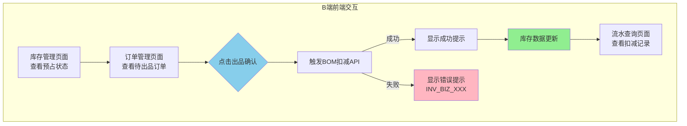

# P005 BOM库存扣减 - 前端UI交互测试用例

**@spec P005-bom-inventory-deduction**

**功能模块**: BOM库存预占与扣减 - B端UI交互
**测试版本**: 1.0.0
**编写人**: Claude (E2E Test Writer Skill)
**编写日期**: 2025-12-29
**Spec 引用**: [specs/P005-bom-inventory-deduction/spec.md](./spec.md)
**测试框架**: Playwright

---

## 📋 测试概述

### 测试目标

验证 P005 BOM库存扣减功能的前端 UI 交互流程：
1. **B端库存管理页面**: 查看库存预占状态、可用库存计算
2. **B端订单管理页面**: 出品确认操作、库存实扣触发
3. **B端库存流水查询页面**: BOM扣料流水记录查询和详情查看
4. **异常场景 UI 提示**: 库存不足、操作失败等错误提示
5. **数据展示验证**: 库存数值变化、状态标签、流水记录等UI元素正确性

### 业务流程图



### 涉及系统/模块

- [x] B端管理后台 - React 19.2.0 + Ant Design 6.1.0
  - `/inventory/trace` - 库存追溯页面
  - `/inventory/reservation` - 库存预占管理页面
  - `/orders/pending` - 待处理订单页面 (O003)
  - `/inventory/transactions` - 库存流水查询
- [x] 前端状态管理 - Zustand 5.0.9
- [x] 后端API集成 - TanStack Query 5.90.12
- [x] Mock服务 - MSW 2.12.4 (开发阶段)

---

## 🔑 关键UI交互节点

| 节点序号 | 页面路径 | UI元素 | 交互操作 | 验证检查点 |
|---------|---------|--------|---------|----------|
| 1 | /inventory/trace | 库存列表表格 | 查看库存记录 | 显示`on_hand_qty`、`reserved_qty`、`available_qty` |
| 2 | /inventory/trace | 库存状态标签 | 查看预占状态 | 显示"正常"/"预占中"/"库存不足"标签 |
| 3 | /inventory/reservation | 预占统计卡片 | 查看预占概览 | 显示当前预占订单数、预占库存数量 |
| 4 | /orders/pending | 待出品订单卡片 | 查看订单信息 | 显示订单号、商品名称、数量、状态 |
| 5 | /orders/pending | 出品确认按钮 | 点击触发扣减 | 按钮禁用、显示Loading状态 |
| 6 | /orders/pending | 成功提示弹窗 | 查看成功信息 | Toast/Message显示"出品确认成功" |
| 7 | /orders/pending | 错误提示弹窗 | 查看错误信息 | Modal显示具体错误码和消息 |
| 8 | /inventory/transactions | 流水查询表单 | 筛选BOM扣减记录 | 日期范围、SKU筛选、事务类型选择 |
| 9 | /inventory/transactions | 流水记录表格 | 查看扣减记录 | 显示SKU、数量、类型、时间、订单号 |
| 10 | /inventory/transactions | 流水详情抽屉 | 点击查看详情 | 显示BOM组件明细、操作人、快照ID |

---

## 📝 测试用例清单

### TC-UI-001: B端库存管理页面 - 查看库存预占状态

**用例ID**: TC-UI-001
**优先级**: 🔴 高
**测试类型**: UI功能测试
**页面路径**: `/inventory/trace`
**覆盖故事**: US1 (库存预占)

**前置条件**:
- [x] 用户已登录B端系统
- [x] 测试数据已准备: 威士忌库存 on_hand=1000ml, reserved=45ml, available=955ml
- [x] 浏览器已打开到登录页面

**测试数据**:
```json
{
  "skuId": "11111111-0000-0000-0000-000000000001",
  "skuCode": "RAW-WHISKEY",
  "skuName": "威士忌",
  "onHandQty": 1000.0,
  "reservedQty": 45.0,
  "availableQty": 955.0
}
```

**测试步骤**:

| 步骤 | 操作端 | 操作描述 | 预期结果 | Playwright选择器 | 实际结果 | 通过状态 |
|-----|-------|---------|---------|---------------|---------|---------|
| 1 | B端 | 打开浏览器访问 `http://localhost:3000/inventory/trace` | 页面加载完成，显示库存追溯页面 | `page.goto('/inventory/trace')` | [执行后填写] | ☐ 通过 ☐ 失败 |
| 2 | B端 | 等待库存列表表格加载 | 表格显示至少1条库存记录 | `page.locator('table.ant-table tbody tr').count()` | [执行后填写] | ☐ 通过 ☐ 失败 |
| 3 | B端 | 在搜索框输入"威士忌"并搜索 | 搜索框接受输入 | `page.getByPlaceholder('搜索SKU').fill('威士忌')` | [执行后填写] | ☐ 通过 ☐ 失败 |
| 4 | B端 | 点击搜索按钮或按Enter键 | 表格刷新，只显示威士忌相关记录 | `page.getByRole('button', { name: '搜索' }).click()` | [执行后填写] | ☐ 通过 ☐ 失败 |
| 5 | B端 | 验证表格中威士忌库存数据 | 表格中显示: 现存=1000ml, 预占=45ml, 可用=955ml | `page.locator('table tbody tr').filter({ hasText: '威士忌' })` | [执行后填写] | ☐ 通过 ☐ 失败 |
| 6 | B端 | 检查库存状态标签 | 显示"预占中"标签，颜色为蓝色/橙色 | `page.locator('.ant-tag').filter({ hasText: '预占中' })` | [执行后填写] | ☐ 通过 ☐ 失败 |
| 7 | B端 | 验证可用库存计算公式 | 可用库存 = 现存库存 - 预占库存 (955 = 1000 - 45) | JavaScript断言: `available === onHand - reserved` | [执行后填写] | ☐ 通过 ☐ 失败 |

**后置检查**:
- [ ] 页面无JavaScript错误（检查console）
- [ ] 网络请求返回200状态码
- [ ] 数据格式符合前端类型定义

---

### TC-UI-002: B端库存预占管理页面 - 预占概览

**用例ID**: TC-UI-002
**优先级**: 🟡 中
**测试类型**: UI展示测试
**页面路径**: `/inventory/reservation`
**覆盖故事**: US1 (库存预占)

**前置条件**:
- [x] 用户已登录B端系统
- [x] 当前有156个预占订单，总预占库存2845件

**测试步骤**:

| 步骤 | 操作端 | 操作描述 | 预期结果 | Playwright选择器 | 实际结果 | 通过状态 |
|-----|-------|---------|---------|---------------|---------|---------|
| 1 | B端 | 访问 `/inventory/reservation` | 页面加载完成 | `page.goto('/inventory/reservation')` | [执行后填写] | ☐ 通过 ☐ 失败 |
| 2 | B端 | 检查"当前预占订单"统计卡片 | 显示数值156，前缀为锁图标 | `page.locator('.ant-statistic').filter({ hasText: '当前预占订单' })` | [执行后填写] | ☐ 通过 ☐ 失败 |
| 3 | B端 | 检查"预占库存数量"统计卡片 | 显示数值2845件 | `page.locator('.ant-statistic').filter({ hasText: '预占库存数量' })` | [执行后填写] | ☐ 通过 ☐ 失败 |
| 4 | B端 | 检查"今日释放次数"统计卡片 | 显示数值89，颜色为绿色 | `page.locator('.ant-statistic').filter({ hasText: '今日释放次数' })` | [执行后填写] | ☐ 通过 ☐ 失败 |
| 5 | B端 | 检查"超时待释放"统计卡片 | 显示数值12，颜色为橙色 | `page.locator('.ant-statistic').filter({ hasText: '超时待释放' })` | [执行后填写] | ☐ 通过 ☐ 失败 |
| 6 | B端 | 检查Alert提示信息 | 显示预占说明文字，包含"30分钟"超时规则 | `page.locator('.ant-alert').filter({ hasText: '库存预占说明' })` | [执行后填写] | ☐ 通过 ☐ 失败 |

**后置检查**:
- [ ] 所有统计卡片显示正常
- [ ] 数值和图标正确对应
- [ ] 页面响应式布局正常

---

### TC-UI-003: B端订单管理页面 - 出品确认操作（正向流程）

**用例ID**: TC-UI-003
**优先级**: 🔴 高
**测试类型**: 端到端UI交互测试
**页面路径**: `/orders/pending`
**覆盖故事**: US2 (库存实扣)

**前置条件**:
- [x] 用户已登录B端系统
- [x] 存在状态为"PENDING_PRODUCTION"的待出品订单
- [x] 订单已预占库存 (威士忌45ml、可乐150ml、杯子1个、吸管1根)
- [x] 后端API `/api/inventory/deductions` 正常工作

**测试数据**:
```json
{
  "orderId": "test-order-ui-001",
  "orderNo": "ORD-20251229-001",
  "productName": "威士忌可乐鸡尾酒",
  "quantity": 1,
  "status": "PENDING_PRODUCTION",
  "queueNumber": "A001"
}
```

**测试步骤**:

| 步骤 | 操作端 | 操作描述 | 预期结果 | Playwright选择器 | 实际结果 | 通过状态 |
|-----|-------|---------|---------|---------------|---------|---------|
| 1 | B端 | 访问 `/orders/pending` | 页面加载完成，显示待处理订单页面 | `page.goto('/orders/pending')` | [执行后填写] | ☐ 通过 ☐ 失败 |
| 2 | B端 | 等待订单卡片加载 | 显示至少1个"待制作"订单卡片 | `page.locator('.beverage-order-card').filter({ hasText: '待制作' })` | [执行后填写] | ☐ 通过 ☐ 失败 |
| 3 | B端 | 找到订单号为"ORD-20251229-001"的订单卡片 | 卡片显示订单号、商品名称、数量 | `page.locator('.beverage-order-card').filter({ hasText: 'ORD-20251229-001' })` | [执行后填写] | ☐ 通过 ☐ 失败 |
| 4 | B端 | 检查订单卡片内容 | 显示"威士忌可乐鸡尾酒 x1"、状态标签"待制作" | `page.locator('.beverage-order-card').filter({ hasText: '威士忌可乐鸡尾酒' })` | [执行后填写] | ☐ 通过 ☐ 失败 |
| 5 | B端 | 点击"开始制作"按钮 | 按钮显示Loading状态，禁用交互 | `page.getByRole('button', { name: '开始制作' }).click()` | [执行后填写] | ☐ 通过 ☐ 失败 |
| 6 | B端 | 等待API响应 | 订单状态更新为"制作中" | `await page.waitForResponse(resp => resp.url().includes('/api/orders'))` | [执行后填写] | ☐ 通过 ☐ 失败 |
| 7 | B端 | 找到更新后的订单卡片 | 卡片移动到"制作中"栏目 | `page.locator('.beverage-order-card').filter({ hasText: '制作中' })` | [执行后填写] | ☐ 通过 ☐ 失败 |
| 8 | B端 | 点击"完成制作"按钮 | 按钮显示Loading状态 | `page.getByRole('button', { name: '完成制作' }).click()` | [执行后填写] | ☐ 通过 ☐ 失败 |
| 9 | B端 | 等待出品确认API响应 | 发送POST请求到 `/api/inventory/deductions` | `await page.waitForResponse('/api/inventory/deductions')` | [执行后填写] | ☐ 通过 ☐ 失败 |
| 10 | B端 | 检查成功提示 | 显示Toast消息"出品确认成功" | `page.locator('.ant-message').filter({ hasText: '出品确认成功' })` | [执行后填写] | ☐ 通过 ☐ 失败 |
| 11 | B端 | 验证订单从列表中消失 | 订单卡片不再显示在待处理列表 | `page.locator('.beverage-order-card').filter({ hasText: 'ORD-20251229-001' }).count() === 0` | [执行后填写] | ☐ 通过 ☐ 失败 |

**后置检查**:
- [ ] 库存数据已更新 (调用 `/api/inventory/trace` 验证)
- [ ] 流水记录已生成 (调用 `/api/inventory/transactions` 验证)
- [ ] 页面无JavaScript错误

---

### TC-UI-004: B端订单管理页面 - 出品确认失败（异常流程）

**用例ID**: TC-UI-004
**优先级**: 🔴 高
**测试类型**: 异常流程UI测试
**页面路径**: `/orders/pending`
**覆盖故事**: US2 (库存实扣 - 异常处理)

**前置条件**:
- [x] 用户已登录B端系统
- [x] 存在待出品订单，但后端库存不足
- [x] Mock后端返回 500 错误或业务错误码 `INV_BIZ_001`

**异常场景**: 库存不足导致出品确认失败

**测试步骤**:

| 步骤 | 操作端 | 操作描述 | 预期结果 | Playwright选择器 | 实际结果 | 通过状态 |
|-----|-------|---------|---------|---------------|---------|---------|
| 1 | B端 | 访问 `/orders/pending` | 页面加载完成 | `page.goto('/orders/pending')` | [执行后填写] | ☐ 通过 ☐ 失败 |
| 2 | B端 | 找到待出品订单并点击"完成制作" | 按钮触发API请求 | `page.getByRole('button', { name: '完成制作' }).click()` | [执行后填写] | ☐ 通过 ☐ 失败 |
| 3 | B端 | 等待API响应失败 | 后端返回错误 (HTTP 500 或 422) | `await page.waitForResponse('/api/inventory/deductions')` | [执行后填写] | ☐ 通过 ☐ 失败 |
| 4 | B端 | 检查错误提示Modal | 显示错误Modal弹窗 | `page.locator('.ant-modal').filter({ hasText: '出品失败' })` | [执行后填写] | ☐ 通过 ☐ 失败 |
| 5 | B端 | 验证错误消息内容 | 显示"库存不足"或"INV_BIZ_001"错误码 | `page.locator('.ant-modal-body').filter({ hasText: '库存不足' })` | [执行后填写] | ☐ 通过 ☐ 失败 |
| 6 | B端 | 检查具体缺货信息 | 显示缺货SKU名称和缺口数量 | `page.locator('.ant-modal-body').filter({ hasText: '威士忌' })` | [执行后填写] | ☐ 通过 ☐ 失败 |
| 7 | B端 | 点击"确定"关闭Modal | Modal消失，返回订单列表 | `page.getByRole('button', { name: '确定' }).click()` | [执行后填写] | ☐ 通过 ☐ 失败 |
| 8 | B端 | 验证订单状态未变化 | 订单仍显示在"制作中"栏目 | `page.locator('.beverage-order-card').filter({ hasText: '制作中' })` | [执行后填写] | ☐ 通过 ☐ 失败 |

**异常处理验证**:
- [ ] 错误提示清晰易懂
- [ ] 订单数据未被破坏
- [ ] 库存未被错误扣减
- [ ] 用户可以重新尝试操作

---

### TC-UI-005: B端库存流水查询页面 - BOM扣减记录查询

**用例ID**: TC-UI-005
**优先级**: 🟡 中
**测试类型**: 查询功能UI测试
**页面路径**: `/inventory/transactions`
**覆盖故事**: US3 (流水查询)

**前置条件**:
- [x] 用户已登录B端系统
- [x] 数据库存在BOM扣减流水记录 (类型: `BOM_DEDUCTION`)
- [x] 流水记录包含订单号、SKU、数量、时间等信息

**测试数据**:
```json
{
  "transactionId": "trans-001",
  "transactionType": "BOM_DEDUCTION",
  "skuCode": "RAW-WHISKEY",
  "skuName": "威士忌",
  "quantity": -45.0,
  "unit": "ml",
  "orderId": "test-order-ui-001",
  "createdAt": "2025-12-29T10:30:00Z"
}
```

**测试步骤**:

| 步骤 | 操作端 | 操作描述 | 预期结果 | Playwright选择器 | 实际结果 | 通过状态 |
|-----|-------|---------|---------|---------------|---------|---------|
| 1 | B端 | 访问 `/inventory/transactions` | 页面加载完成，显示流水查询页面 | `page.goto('/inventory/transactions')` | [执行后填写] | ☐ 通过 ☐ 失败 |
| 2 | B端 | 等待流水记录表格加载 | 表格显示流水记录 | `page.locator('table.ant-table tbody tr').count() > 0` | [执行后填写] | ☐ 通过 ☐ 失败 |
| 3 | B端 | 点击"事务类型"下拉筛选器 | 下拉菜单打开 | `page.locator('.ant-select').filter({ hasText: '事务类型' }).click()` | [执行后填写] | ☐ 通过 ☐ 失败 |
| 4 | B端 | 选择"BOM扣减"选项 | 选项被选中，下拉菜单关闭 | `page.locator('.ant-select-item').filter({ hasText: 'BOM扣减' }).click()` | [执行后填写] | ☐ 通过 ☐ 失败 |
| 5 | B端 | 点击"查询"按钮 | 表格刷新，只显示BOM扣减类型记录 | `page.getByRole('button', { name: '查询' }).click()` | [执行后填写] | ☐ 通过 ☐ 失败 |
| 6 | B端 | 验证表格第一行记录 | 显示SKU名称、数量(负数)、类型标签 | `page.locator('table tbody tr').first()` | [执行后填写] | ☐ 通过 ☐ 失败 |
| 7 | B端 | 检查数量列显示 | 显示"-45.0 ml"，颜色为红色 | `page.locator('.transaction-quantity-tag').filter({ hasText: '-45.0' })` | [执行后填写] | ☐ 通过 ☐ 失败 |
| 8 | B端 | 点击记录行的"查看详情"按钮 | 打开流水详情抽屉 | `page.getByRole('button', { name: '查看' }).first().click()` | [执行后填写] | ☐ 通过 ☐ 失败 |
| 9 | B端 | 验证详情抽屉内容 | 显示订单号、SKU信息、BOM快照ID | `page.locator('.ant-drawer').filter({ hasText: '流水详情' })` | [执行后填写] | ☐ 通过 ☐ 失败 |
| 10 | B端 | 检查BOM组件明细表格 | 显示威士忌、可乐、杯子、吸管4个组件 | `page.locator('.ant-drawer table tbody tr').count() === 4` | [执行后填写] | ☐ 通过 ☐ 失败 |
| 11 | B端 | 点击"关闭"按钮 | 抽屉关闭，返回流水列表 | `page.locator('.ant-drawer').getByRole('button', { name: '关闭' }).click()` | [执行后填写] | ☐ 通过 ☐ 失败 |

**后置检查**:
- [ ] 流水记录数据完整
- [ ] 详情抽屉显示正确
- [ ] 筛选功能工作正常

---

### TC-UI-006: B端库存流水查询页面 - 日期范围筛选

**用例ID**: TC-UI-006
**优先级**: 🟢 低
**测试类型**: 查询功能UI测试
**页面路径**: `/inventory/transactions`
**覆盖故事**: US3 (流水查询)

**测试步骤**:

| 步骤 | 操作端 | 操作描述 | 预期结果 | Playwright选择器 | 实际结果 | 通过状态 |
|-----|-------|---------|---------|---------------|---------|---------|
| 1 | B端 | 访问 `/inventory/transactions` | 页面加载完成 | `page.goto('/inventory/transactions')` | [执行后填写] | ☐ 通过 ☐ 失败 |
| 2 | B端 | 点击日期范围选择器 | 日期选择面板打开 | `page.locator('.ant-picker-range').click()` | [执行后填写] | ☐ 通过 ☐ 失败 |
| 3 | B端 | 选择开始日期(今天-7天) | 日期被选中 | `page.locator('.ant-picker-cell').filter({ hasText: '22' }).click()` | [执行后填写] | ☐ 通过 ☐ 失败 |
| 4 | B端 | 选择结束日期(今天) | 日期被选中，面板关闭 | `page.locator('.ant-picker-cell').filter({ hasText: '29' }).click()` | [执行后填写] | ☐ 通过 ☐ 失败 |
| 5 | B端 | 点击"查询"按钮 | 表格刷新，显示7天内的流水记录 | `page.getByRole('button', { name: '查询' }).click()` | [执行后填写] | ☐ 通过 ☐ 失败 |
| 6 | B端 | 验证表格记录的日期 | 所有记录日期在选定范围内 | JavaScript断言: 日期比较逻辑 | [执行后填写] | ☐ 通过 ☐ 失败 |

**后置检查**:
- [ ] 日期筛选功能正常
- [ ] 记录日期符合范围

---

### TC-UI-007: 多层级BOM展开 - 套餐订单出品UI验证

**用例ID**: TC-UI-007
**优先级**: 🟡 中
**测试类型**: 复杂场景UI测试
**页面路径**: `/orders/pending`
**覆盖故事**: US4 (多层级BOM)

**前置条件**:
- [x] 用户已登录B端系统
- [x] 存在套餐订单"观影套餐" (包含"威士忌可乐鸡尾酒")
- [x] 套餐BOM需要递归展开到原料层级

**测试数据**:
```json
{
  "orderId": "test-order-combo-001",
  "orderNo": "ORD-COMBO-001",
  "productName": "观影套餐",
  "quantity": 1,
  "status": "PENDING_PRODUCTION",
  "bomComponents": [
    {"skuName": "威士忌可乐鸡尾酒", "quantity": 1},
    {
      "subComponents": [
        {"skuName": "威士忌", "quantity": 45, "unit": "ml"},
        {"skuName": "可乐", "quantity": 150, "unit": "ml"},
        {"skuName": "杯子", "quantity": 1, "unit": "个"},
        {"skuName": "吸管", "quantity": 1, "unit": "根"}
      ]
    }
  ]
}
```

**测试步骤**:

| 步骤 | 操作端 | 操作描述 | 预期结果 | Playwright选择器 | 实际结果 | 通过状态 |
|-----|-------|---------|---------|---------------|---------|---------|
| 1 | B端 | 访问 `/orders/pending` | 页面加载完成 | `page.goto('/orders/pending')` | [执行后填写] | ☐ 通过 ☐ 失败 |
| 2 | B端 | 找到套餐订单卡片 | 显示"观影套餐"订单 | `page.locator('.beverage-order-card').filter({ hasText: '观影套餐' })` | [执行后填写] | ☐ 通过 ☐ 失败 |
| 3 | B端 | 点击订单卡片查看详情 | 展开订单详情，显示包含项 | `page.locator('.beverage-order-card').filter({ hasText: '观影套餐' }).click()` | [执行后填写] | ☐ 通过 ☐ 失败 |
| 4 | B端 | 验证显示"威士忌可乐鸡尾酒"子项 | 详情中列出子成品 | `page.locator('.order-item').filter({ hasText: '威士忌可乐鸡尾酒' })` | [执行后填写] | ☐ 通过 ☐ 失败 |
| 5 | B端 | 点击"完成制作"按钮 | 触发BOM展开和扣减API | `page.getByRole('button', { name: '完成制作' }).click()` | [执行后填写] | ☐ 通过 ☐ 失败 |
| 6 | B端 | 等待API响应 | 后端展开多层级BOM并扣减所有原料 | `await page.waitForResponse('/api/inventory/deductions')` | [执行后填写] | ☐ 通过 ☐ 失败 |
| 7 | B端 | 检查成功提示 | 显示"出品确认成功" | `page.locator('.ant-message').filter({ hasText: '成功' })` | [执行后填写] | ☐ 通过 ☐ 失败 |
| 8 | B端 | 访问 `/inventory/transactions` | 跳转到流水查询页面 | `page.goto('/inventory/transactions')` | [执行后填写] | ☐ 通过 ☐ 失败 |
| 9 | B端 | 筛选订单号为"ORD-COMBO-001"的流水 | 显示4条BOM扣减记录 (威士忌、可乐、杯子、吸管) | `page.locator('table tbody tr').filter({ hasText: 'ORD-COMBO-001' }).count() === 4` | [执行后填写] | ☐ 通过 ☐ 失败 |

**后置检查**:
- [ ] 多层级BOM正确展开
- [ ] 所有原料都被扣减
- [ ] 流水记录完整

---

## 🔄 状态流转测试

### 订单状态与UI显示映射

| 后端状态 | 前端显示标签 | 标签颜色 | 可操作按钮 | 测试验证 |
|---------|-----------|---------|----------|---------|
| PENDING_PRODUCTION | "待制作" | blue | "开始制作" | ☐ 通过 ☐ 失败 |
| PRODUCING | "制作中" | processing | "完成制作" | ☐ 通过 ☐ 失败 |
| COMPLETED | "已完成" | success | "查看详情" | ☐ 通过 ☐ 失败 |
| CANCELLED | "已取消" | default | 无 | ☐ 通过 ☐ 失败 |

---

## 📊 数据验证检查清单

### 库存数据UI展示验证

| 检查项 | UI位置 | 数据来源 | 验证规则 | 预期值 | 实际值 | 状态 |
|-------|--------|---------|---------|-------|-------|------|
| 现存库存 | InventoryTrace表格 | `on_hand_qty` | ≥ 0 | 1000.0 ml | [实际值] | ☐ ✅ ☐ ❌ |
| 预占库存 | InventoryTrace表格 | `reserved_qty` | ≥ 0, ≤ on_hand | 45.0 ml | [实际值] | ☐ ✅ ☐ ❌ |
| 可用库存 | InventoryTrace表格 | `available_qty` | = on_hand - reserved | 955.0 ml | [实际值] | ☐ ✅ ☐ ❌ |
| 库存状态标签 | InventoryTrace表格 | 业务逻辑计算 | 预占>0 显示"预占中" | "预占中" | [实际值] | ☐ ✅ ☐ ❌ |

### 流水记录UI展示验证

| 检查项 | UI位置 | 数据来源 | 验证规则 | 预期值 | 实际值 | 状态 |
|-------|--------|---------|---------|-------|-------|------|
| 事务类型 | Transactions表格 | `transaction_type` | 枚举值 | "BOM_DEDUCTION" | [实际值] | ☐ ✅ ☐ ❌ |
| 数量标签 | Transactions表格 | `quantity` | <0 显示红色 | "-45.0 ml" (红色) | [实际值] | ☐ ✅ ☐ ❌ |
| 订单号 | Transactions表格 | `order_id` | UUID或订单号 | "ORD-20251229-001" | [实际值] | ☐ ✅ ☐ ❌ |
| BOM快照ID | TransactionDetail抽屉 | `bom_snapshot_id` | UUID | "[UUID]" | [实际值] | ☐ ✅ ☐ ❌ |

---

## 🐛 缺陷记录模板

### BUG-UI-001

**发现时间**: [YYYY-MM-DD HH:mm]
**发现用例**: TC-UI-XXX
**严重程度**: 🔴 严重 / 🟡 一般 / 🟢 轻微
**测试环境**: Chrome 120 / Firefox 121 / Safari 17

**问题描述**:
[详细描述UI问题，包括截图]

**复现步骤**:
1. 访问页面: [URL]
2. 执行操作: [具体操作]
3. 观察结果: [实际显示]

**预期结果**:
[应该显示什么]

**实际结果**:
[实际显示什么]

**截图/录屏**:
[附上截图或录屏文件]

**浏览器Console错误**:
```
[Console错误信息]
```

**网络请求详情**:
```
Request URL: [URL]
Status Code: [状态码]
Response: [响应内容]
```

---

## 📈 Playwright 自动化测试脚本框架

### 测试脚本示例

```typescript
/**
 * @spec P005-bom-inventory-deduction
 * P005 BOM库存扣减 - UI自动化测试
 */
import { test, expect } from '@playwright/test';

test.describe('P005 BOM库存扣减 UI测试', () => {
  test.beforeEach(async ({ page }) => {
    // 登录B端系统
    await page.goto('http://localhost:3000/login');
    await page.getByPlaceholder('用户名').fill('admin');
    await page.getByPlaceholder('密码').fill('admin123');
    await page.getByRole('button', { name: '登录' }).click();
    await page.waitForURL('**/dashboard');
  });

  test('TC-UI-001: 查看库存预占状态', async ({ page }) => {
    // Step 1: 访问库存追溯页面
    await page.goto('http://localhost:3000/inventory/trace');
    await expect(page).toHaveTitle(/库存追溯/);

    // Step 2: 等待表格加载
    await page.waitForSelector('table.ant-table');
    const rows = await page.locator('table tbody tr').count();
    expect(rows).toBeGreaterThan(0);

    // Step 3: 搜索威士忌
    await page.getByPlaceholder('搜索SKU').fill('威士忌');
    await page.getByRole('button', { name: '搜索' }).click();

    // Step 4: 验证库存数据
    const whiskeyRow = page.locator('table tbody tr').filter({ hasText: '威士忌' });
    await expect(whiskeyRow).toBeVisible();

    // Step 5: 验证数值
    const onHandQty = await whiskeyRow.locator('[data-column="onHandQty"]').textContent();
    const reservedQty = await whiskeyRow.locator('[data-column="reservedQty"]').textContent();
    const availableQty = await whiskeyRow.locator('[data-column="availableQty"]').textContent();

    expect(parseFloat(onHandQty!)).toBe(1000.0);
    expect(parseFloat(reservedQty!)).toBe(45.0);
    expect(parseFloat(availableQty!)).toBe(955.0);

    // Step 6: 验证状态标签
    await expect(whiskeyRow.locator('.ant-tag').filter({ hasText: '预占中' })).toBeVisible();
  });

  test('TC-UI-003: 出品确认操作（正向流程）', async ({ page }) => {
    // Step 1: 访问待处理订单页面
    await page.goto('http://localhost:3000/orders/pending');

    // Step 2: 等待订单卡片加载
    await page.waitForSelector('.beverage-order-card');

    // Step 3: 找到待出品订单
    const orderCard = page.locator('.beverage-order-card').filter({ hasText: 'ORD-20251229-001' });
    await expect(orderCard).toBeVisible();

    // Step 4: 点击开始制作
    await orderCard.getByRole('button', { name: '开始制作' }).click();

    // Step 5: 等待状态更新
    await page.waitForResponse(resp => resp.url().includes('/api/orders'));
    await expect(orderCard.locator('.ant-tag').filter({ hasText: '制作中' })).toBeVisible();

    // Step 6: 点击完成制作
    await orderCard.getByRole('button', { name: '完成制作' }).click();

    // Step 7: 等待BOM扣减API
    const deductionResponse = await page.waitForResponse('/api/inventory/deductions');
    expect(deductionResponse.status()).toBe(200);

    // Step 8: 验证成功提示
    await expect(page.locator('.ant-message').filter({ hasText: '出品确认成功' })).toBeVisible();

    // Step 9: 验证订单消失
    await expect(orderCard).not.toBeVisible();
  });

  test('TC-UI-004: 出品确认失败（库存不足）', async ({ page }) => {
    // Mock API 返回库存不足错误
    await page.route('**/api/inventory/deductions', route => {
      route.fulfill({
        status: 422,
        contentType: 'application/json',
        body: JSON.stringify({
          success: false,
          error: 'INV_BIZ_001',
          message: '库存不足',
          details: { skuName: '威士忌', available: 30, required: 45 }
        })
      });
    });

    // 访问订单页面并触发出品确认
    await page.goto('http://localhost:3000/orders/pending');
    const orderCard = page.locator('.beverage-order-card').first();
    await orderCard.getByRole('button', { name: '完成制作' }).click();

    // 验证错误Modal
    const errorModal = page.locator('.ant-modal').filter({ hasText: '出品失败' });
    await expect(errorModal).toBeVisible();
    await expect(errorModal).toContainText('库存不足');
    await expect(errorModal).toContainText('威士忌');

    // 关闭Modal
    await errorModal.getByRole('button', { name: '确定' }).click();

    // 验证订单状态未变化
    await expect(orderCard).toBeVisible();
  });

  test('TC-UI-005: BOM扣减记录查询', async ({ page }) => {
    // Step 1: 访问流水查询页面
    await page.goto('http://localhost:3000/inventory/transactions');

    // Step 2: 选择事务类型
    await page.locator('.ant-select').filter({ hasText: '事务类型' }).click();
    await page.locator('.ant-select-item').filter({ hasText: 'BOM扣减' }).click();

    // Step 3: 点击查询
    await page.getByRole('button', { name: '查询' }).click();

    // Step 4: 验证表格记录
    await page.waitForSelector('table tbody tr');
    const firstRow = page.locator('table tbody tr').first();
    await expect(firstRow).toContainText('BOM_DEDUCTION');

    // Step 5: 打开详情抽屉
    await firstRow.getByRole('button', { name: '查看' }).click();
    const drawer = page.locator('.ant-drawer').filter({ hasText: '流水详情' });
    await expect(drawer).toBeVisible();

    // Step 6: 验证BOM组件明细
    const componentRows = await drawer.locator('table tbody tr').count();
    expect(componentRows).toBe(4); // 威士忌、可乐、杯子、吸管

    // Step 7: 关闭抽屉
    await drawer.getByRole('button', { name: '关闭' }).click();
  });
});
```

### Playwright 配置文件

```typescript
/**
 * @spec P005-bom-inventory-deduction
 * Playwright 配置
 */
import { defineConfig, devices } from '@playwright/test';

export default defineConfig({
  testDir: './tests/e2e/p005',
  fullyParallel: true,
  forbidOnly: !!process.env.CI,
  retries: process.env.CI ? 2 : 0,
  workers: process.env.CI ? 1 : undefined,
  reporter: 'html',
  use: {
    baseURL: 'http://localhost:3000',
    trace: 'on-first-retry',
    screenshot: 'only-on-failure',
    video: 'retain-on-failure',
  },
  projects: [
    {
      name: 'chromium',
      use: { ...devices['Desktop Chrome'] },
    },
    {
      name: 'firefox',
      use: { ...devices['Desktop Firefox'] },
    },
    {
      name: 'webkit',
      use: { ...devices['Desktop Safari'] },
    },
  ],
  webServer: {
    command: 'npm run dev',
    url: 'http://localhost:3000',
    reuseExistingServer: !process.env.CI,
  },
});
```

---

## 📎 附录

### A. 前端页面路由映射

| 功能模块 | 路由路径 | 页面组件 |
|---------|---------|---------|
| 库存追溯 | `/inventory/trace` | `InventoryTrace/index.tsx` |
| 库存预占管理 | `/inventory/reservation` | `InventoryReservation.tsx` |
| 待处理订单 | `/orders/pending` | `PendingOrdersPage.tsx` (O003) |
| 库存流水查询 | `/inventory/transactions` | `InventoryTrace/index.tsx` (Tab) |

### B. 前端状态管理

- **Zustand Store**: `inventoryStore.ts`
  - 状态: `currentInventory`, `transactions`, `selectedTransaction`
  - 操作: `setInventoryFilters`, `refreshTransactions`

- **TanStack Query Keys**:
  - `['inventory', 'list']` - 库存列表
  - `['inventory', 'transactions']` - 流水记录
  - `['orders', 'pending']` - 待处理订单

### C. API Mock 数据

如需在开发环境测试,使用 MSW Mock 数据:

```typescript
// mocks/handlers/inventoryHandlers.ts
import { http, HttpResponse } from 'msw';

export const inventoryHandlers = [
  http.post('/api/inventory/deductions', () => {
    return HttpResponse.json({
      success: true,
      message: '出品确认成功'
    });
  }),

  http.get('/api/inventory/transactions', () => {
    return HttpResponse.json({
      success: true,
      data: [
        {
          id: 'trans-001',
          transactionType: 'BOM_DEDUCTION',
          skuCode: 'RAW-WHISKEY',
          skuName: '威士忌',
          quantity: -45.0,
          unit: 'ml',
          orderId: 'test-order-001',
          createdAt: '2025-12-29T10:30:00Z'
        }
      ]
    });
  })
];
```

---

## 📈 测试执行统计

### 测试用例统计

| 类别 | 用例数量 |
|------|---------|
| 正向流程 | 3 |
| 异常流程 | 1 |
| 边界条件 | 0 |
| 状态流转 | 1 |
| 数据验证 | 2 |
| **总计** | **7** |

### 测试覆盖率目标

| 功能模块 | 目标覆盖率 | 实际覆盖率 |
|---------|----------|----------|
| 库存查询UI | 80% | [待执行] |
| 订单出品UI | 90% | [待执行] |
| 流水查询UI | 70% | [待执行] |
| 异常处理UI | 100% | [待执行] |

---

**文档版本**: v1.0
**最后更新**: 2025-12-29
**生成工具**: e2e-test-writer skill
