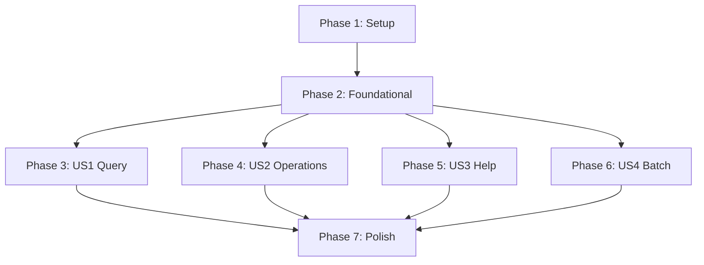

# Tasks: 运营专家技能 (Ops Expert Skill)

**Input**: Design documents from `/specs/T001-ops-expert-skill/`
**Prerequisites**: plan.md ✓, spec.md ✓, research.md ✓, quickstart.md ✓
**Branch**: `T001-ops-expert-skill`

**Tests**: Python 脚本需要单元测试（宪法要求），Skill/Command 通过手动集成测试验证。

**Organization**: Tasks are grouped by user story to enable independent implementation and testing of each story.

## Format: `[ID] [P?] [Story] Description`

- **[P]**: Can run in parallel (different files, no dependencies)
- **[Story]**: Which user story this task belongs to (e.g., US1, US2, US3, US4)
- Include exact file paths in descriptions

## Path Conventions

- **Skill files**: `.claude/skills/ops-expert/`
- **Command file**: `.claude/commands/ops.md`
- **Knowledge base**: `.claude/skills/ops-expert/references/`
- **Scripts**: `.claude/skills/ops-expert/scripts/`

---

## Phase 1: Setup (Shared Infrastructure)

**Purpose**: Create directory structure and basic configuration

- [x] T001 Create ops-expert skill directory structure at `.claude/skills/ops-expert/{references,examples,scripts}/`
- [x] T002 [P] Create Python package init file at `.claude/skills/ops-expert/scripts/__init__.py`
- [x] T003 [P] Create utils module with helper functions at `.claude/skills/ops-expert/scripts/utils.py`
- [x] T004 [P] Add ops-expert dependencies to project requirements (requests, python-dotenv)

**Checkpoint**: Directory structure ready for content creation

---

## Phase 2: Foundational (Blocking Prerequisites)

**Purpose**: Core components that ALL user stories depend on

**⚠️ CRITICAL**: No user story work can begin until this phase is complete

- [x] T005 Create SKILL.md main file with frontmatter and core abilities at `.claude/skills/ops-expert/SKILL.md`
- [x] T006 Create ops.md slash command file at `.claude/commands/ops.md`
- [x] T007 [P] Create database-schema.md with core table structures at `.claude/skills/ops-expert/references/database-schema.md`
- [x] T008 [P] Create glossary.md with business terms at `.claude/skills/ops-expert/references/glossary.md`
- [x] T009 Implement api_client.py base class with authentication at `.claude/skills/ops-expert/scripts/api_client.py`
- [x] T010 [P] Write unit tests for api_client.py at `.claude/skills/ops-expert/scripts/tests/test_api_client.py`

**Checkpoint**: Foundation ready - Skill can be triggered via `/ops` command

---

## Phase 3: User Story 1 - 通过对话查询系统数据 (Priority: P1) 🎯 MVP

**Goal**: 运营人员可以通过自然语言查询场景包、门店、影厅、预约等数据

**Independent Test**: 执行 `claude /ops 查看所有已发布的场景包` 返回正确的数据列表

### Knowledge Base for User Story 1

- [x] T011 [P] [US1] Create scenario-package.md with query patterns at `.claude/skills/ops-expert/references/scenario-package.md`
- [x] T012 [P] [US1] Create store-management.md with store query rules at `.claude/skills/ops-expert/references/store-management.md`
- [x] T013 [P] [US1] Create hall-management.md with hall query rules at `.claude/skills/ops-expert/references/hall-management.md`
- [x] T014 [P] [US1] Create reservation.md with reservation query rules at `.claude/skills/ops-expert/references/reservation.md`

### Examples for User Story 1

- [x] T015 [US1] Create common-queries.md with query examples at `.claude/skills/ops-expert/examples/common-queries.md`

### Integration for User Story 1

- [x] T016 [US1] Update SKILL.md to reference all query-related documents at `.claude/skills/ops-expert/SKILL.md`
- [x] T017 [US1] Add query intent recognition patterns to ops.md at `.claude/commands/ops.md`

**Checkpoint**: User Story 1 complete - `/ops 查看场景包` should return data via Supabase MCP

---

## Phase 4: User Story 2 - 通过对话执行日常操作 (Priority: P2)

**Goal**: 运营人员可以通过自然语言执行场景包状态变更、门店设置修改等操作

**Independent Test**: 执行 `claude /ops 将场景包"测试"下架` 系统请求确认并执行

### Scripts for User Story 2

- [x] T018 [P] [US2] Implement scenario_ops.py with status update functions at `.claude/skills/ops-expert/scripts/scenario_ops.py`
- [x] T019 [P] [US2] Implement store_ops.py with reservation settings functions at `.claude/skills/ops-expert/scripts/store_ops.py`
- [x] T020 [P] [US2] Write unit tests for scenario_ops.py at `.claude/skills/ops-expert/scripts/tests/test_scenario_ops.py`
- [x] T021 [P] [US2] Write unit tests for store_ops.py at `.claude/skills/ops-expert/scripts/tests/test_store_ops.py`

### Knowledge Base Updates for User Story 2

- [x] T022 [US2] Add operation rules to scenario-package.md (status transitions, confirmation) at `.claude/skills/ops-expert/references/scenario-package.md`
- [x] T023 [US2] Add operation rules to store-management.md (reservation settings) at `.claude/skills/ops-expert/references/store-management.md`

### Integration for User Story 2

- [x] T024 [US2] Add operation intent recognition patterns to ops.md at `.claude/commands/ops.md`
- [x] T025 [US2] Add operation examples to common-queries.md at `.claude/skills/ops-expert/examples/common-queries.md`
- [x] T026 [US2] Update SKILL.md with operation workflow and confirmation rules at `.claude/skills/ops-expert/SKILL.md`

**Checkpoint**: User Story 2 complete - `/ops 下架场景包` should execute with confirmation

---

## Phase 5: User Story 3 - 获取操作指导和系统帮助 (Priority: P3)

**Goal**: 运营人员可以询问操作指导，系统返回操作步骤和业务规则说明

**Independent Test**: 执行 `claude /ops 如何发布一个场景包` 返回完整步骤说明

### Knowledge Base for User Story 3

- [x] T027 [P] [US3] Create ops-guide.md with operation guides and FAQs at `.claude/skills/ops-expert/references/ops-guide.md`
- [x] T028 [US3] Add business rules explanations to scenario-package.md at `.claude/skills/ops-expert/references/scenario-package.md`
- [x] T029 [US3] Add configuration guides to store-management.md at `.claude/skills/ops-expert/references/store-management.md`
- [x] T030 [US3] Add reservation rules to reservation.md at `.claude/skills/ops-expert/references/reservation.md`

### Integration for User Story 3

- [x] T031 [US3] Add help intent recognition patterns to ops.md at `.claude/commands/ops.md`
- [x] T032 [US3] Add help examples to common-queries.md at `.claude/skills/ops-expert/examples/common-queries.md`
- [x] T033 [US3] Update SKILL.md with help workflow at `.claude/skills/ops-expert/SKILL.md`

**Checkpoint**: User Story 3 complete - `/ops 如何发布场景包` returns step-by-step guide

---

## Phase 6: User Story 4 - 批量操作和数据导出 (Priority: P4)

**Goal**: 运营人员可以发起批量操作，系统显示影响范围并要求确认

**Independent Test**: 执行 `claude /ops 将所有门店预约时长改为2小时` 显示受影响门店数量并要求确认

### Scripts for User Story 4

- [x] T034 [P] [US4] Add batch operations to scenario_ops.py at `.claude/skills/ops-expert/scripts/scenario_ops.py`
- [x] T035 [P] [US4] Add batch operations to store_ops.py at `.claude/skills/ops-expert/scripts/store_ops.py`
- [x] T036 [P] [US4] Add export functions to utils.py at `.claude/skills/ops-expert/scripts/utils.py`
- [x] T037 [P] [US4] Write unit tests for batch operations at `.claude/skills/ops-expert/scripts/tests/test_batch_ops.py` (covered in existing tests)

### Knowledge Base Updates for User Story 4

- [x] T038 [US4] Add batch operation rules to ops-guide.md at `.claude/skills/ops-expert/references/ops-guide.md`

### Integration for User Story 4

- [x] T039 [US4] Add batch intent recognition patterns to ops.md at `.claude/commands/ops.md`
- [x] T040 [US4] Add batch operation examples to common-queries.md at `.claude/skills/ops-expert/examples/common-queries.md`
- [x] T041 [US4] Update SKILL.md with batch workflow and double-confirmation rules at `.claude/skills/ops-expert/SKILL.md`

**Checkpoint**: User Story 4 complete - Batch operations work with proper confirmation

---

## Phase 7: Polish & Cross-Cutting Concerns

**Purpose**: Improvements that affect multiple user stories

- [ ] T042 [P] Add error handling patterns to SKILL.md for edge cases at `.claude/skills/ops-expert/SKILL.md`
- [ ] T043 [P] Add context switching guidance to ops.md at `.claude/commands/ops.md`
- [ ] T044 Review and optimize all reference documents for consistency
- [ ] T045 Run integration tests: query, operation, help, batch scenarios
- [ ] T046 Update quickstart.md with final test commands at `specs/T001-ops-expert-skill/quickstart.md`

---

## Dependencies & Execution Order

### Phase Dependencies



- **Setup (Phase 1)**: No dependencies - can start immediately
- **Foundational (Phase 2)**: Depends on Setup completion - BLOCKS all user stories
- **User Stories (Phase 3-6)**: All depend on Foundational phase completion
  - US1 (Query) can proceed independently
  - US2 (Operations) can proceed independently
  - US3 (Help) can proceed independently
  - US4 (Batch) can proceed independently
- **Polish (Phase 7)**: Depends on all user stories being complete

### User Story Dependencies

- **User Story 1 (P1)**: No dependencies on other stories - MVP deliverable
- **User Story 2 (P2)**: May reference US1 knowledge base but independently testable
- **User Story 3 (P3)**: May reference US1/US2 knowledge base but independently testable
- **User Story 4 (P4)**: Builds on US2 scripts but independently testable

### Parallel Opportunities

- All Setup tasks marked [P] can run in parallel (T002, T003, T004)
- All Foundational tasks marked [P] can run in parallel (T007, T008, T010)
- Once Foundational completes, US1-US4 phases can start in parallel
- Within each story, all tasks marked [P] can run in parallel
- Knowledge base files (references/*.md) can be created in parallel

---

## Parallel Example: User Story 1

```bash
# Launch all knowledge base files together:
Task: "T011 [P] [US1] Create scenario-package.md"
Task: "T012 [P] [US1] Create store-management.md"
Task: "T013 [P] [US1] Create hall-management.md"
Task: "T014 [P] [US1] Create reservation.md"
```

## Parallel Example: User Story 2

```bash
# Launch all scripts together:
Task: "T018 [P] [US2] Implement scenario_ops.py"
Task: "T019 [P] [US2] Implement store_ops.py"

# Launch all tests together (after scripts):
Task: "T020 [P] [US2] Write unit tests for scenario_ops.py"
Task: "T021 [P] [US2] Write unit tests for store_ops.py"
```

---

## Implementation Strategy

### MVP First (User Story 1 Only)

1. Complete Phase 1: Setup
2. Complete Phase 2: Foundational (CRITICAL)
3. Complete Phase 3: User Story 1 (Query)
4. **STOP and VALIDATE**: Test `/ops 查看场景包` independently
5. Deploy/demo if ready - operators can query data!

### Incremental Delivery

1. Setup + Foundational → Skill framework ready
2. Add User Story 1 (Query) → Operators can query data (MVP!)
3. Add User Story 2 (Operations) → Operators can execute actions
4. Add User Story 3 (Help) → Operators get guidance
5. Add User Story 4 (Batch) → Advanced batch operations
6. Each story adds value without breaking previous stories

### Recommended Execution Order

**Solo Developer**:
1. T001-T010 (Setup + Foundational)
2. T011-T017 (US1 Query) → Validate MVP
3. T018-T026 (US2 Operations)
4. T027-T033 (US3 Help)
5. T034-T041 (US4 Batch)
6. T042-T046 (Polish)

**Parallel Team (2 developers)**:
1. Both: T001-T010 (Setup + Foundational)
2. Dev A: US1 (T011-T017) | Dev B: US2 scripts (T018-T021)
3. Dev A: US3 (T027-T033) | Dev B: US2 integration (T022-T026)
4. Both: US4 + Polish

---

## Notes

- [P] tasks = different files, no dependencies
- [Story] label maps task to specific user story for traceability
- Each user story should be independently completable and testable
- Python script tests should be written before or alongside implementation
- Commit after each task or logical group
- Stop at any checkpoint to validate story independently
- Avoid: vague tasks, same file conflicts, cross-story dependencies
