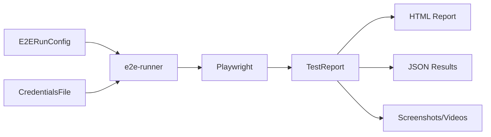

# Data Model: E2E Test Runner

**@spec T003-e2e-runner**

## Overview

This document defines the data models used by the e2e-runner skill for test execution configuration, credentials management, and test reporting.

---

## 1. E2ERunConfig

**Purpose**: Test run configuration object that defines how tests should be executed in a specific environment.

### Schema Definition

```typescript
interface E2ERunConfig {
  /** Environment identifier (e.g., "saas-staging", "onprem-uat") */
  env_profile: string;

  /** Base URL of the target environment */
  baseURL: string;

  /** Playwright projects configuration (optional) */
  projects?: PlaywrightProject[];

  /** Path to credentials file (optional) */
  credentials_ref?: string;

  /** Number of retries for failed tests (default: 0) */
  retries?: number;

  /** Number of parallel workers (default: CPU cores) */
  workers?: number;

  /** Test timeout in milliseconds (default: 30000) */
  timeout?: number;

  /** Output directory for test reports (must be unique) */
  report_output_dir: string;

  /** Glob pattern for test files (optional, default: "scenarios/**/*.spec.ts") */
  testMatch?: string;
}
```

### JSON Schema

```json
{
  "$schema": "http://json-schema.org/draft-07/schema#",
  "type": "object",
  "required": ["env_profile", "baseURL", "report_output_dir"],
  "properties": {
    "env_profile": {
      "type": "string",
      "pattern": "^[a-z0-9-]+$",
      "description": "Environment identifier (lowercase alphanumeric with hyphens)",
      "examples": ["saas-staging", "onprem-uat", "production"]
    },
    "baseURL": {
      "type": "string",
      "format": "uri",
      "description": "Base URL of the target environment",
      "examples": ["https://staging.example.com", "https://uat.cinema.com"]
    },
    "projects": {
      "type": "array",
      "description": "Playwright projects configuration",
      "items": {
        "$ref": "#/definitions/PlaywrightProject"
      }
    },
    "credentials_ref": {
      "type": "string",
      "description": "Path to credentials file (relative or absolute)",
      "examples": ["credentials/saas-staging.json", "../secrets/uat-creds.json"]
    },
    "retries": {
      "type": "integer",
      "minimum": 0,
      "maximum": 5,
      "default": 0,
      "description": "Number of retries for failed tests"
    },
    "workers": {
      "type": "integer",
      "minimum": 1,
      "description": "Number of parallel workers (default: CPU cores)"
    },
    "timeout": {
      "type": "integer",
      "minimum": 1000,
      "default": 30000,
      "description": "Test timeout in milliseconds"
    },
    "report_output_dir": {
      "type": "string",
      "description": "Output directory for test reports (must be unique)",
      "examples": ["./reports/run-2025-12-30-14-30", "./test-results/staging-run-001"]
    },
    "testMatch": {
      "type": "string",
      "default": "scenarios/**/*.spec.ts",
      "description": "Glob pattern for test files",
      "examples": ["scenarios/**/*.spec.ts", "scenarios/inventory/**/*.spec.ts"]
    }
  }
}
```

### Example Configurations

#### Minimal Configuration
```json
{
  "env_profile": "saas-staging",
  "baseURL": "https://staging.cinema.com",
  "report_output_dir": "./reports/run-2025-12-30-14-30"
}
```

#### Full Configuration
```json
{
  "env_profile": "saas-staging",
  "baseURL": "https://staging.cinema.com",
  "projects": [
    {
      "name": "chromium",
      "use": {
        "browserName": "chromium",
        "viewport": { "width": 1920, "height": 1080 }
      }
    },
    {
      "name": "Mobile Chrome",
      "use": {
        "browserName": "chromium",
        "viewport": { "width": 375, "height": 667 },
        "isMobile": true
      }
    }
  ],
  "credentials_ref": "credentials/saas-staging.json",
  "retries": 2,
  "workers": 4,
  "timeout": 60000,
  "report_output_dir": "./reports/run-2025-12-30-14-30",
  "testMatch": "scenarios/**/*.spec.ts"
}
```

### Validation Rules

| Field | Rule | Error Code |
|-------|------|-----------|
| env_profile | Must match pattern `^[a-z0-9-]+$` | `RUNNER_VAL_001` |
| baseURL | Must be valid HTTP/HTTPS URL | `RUNNER_VAL_002` |
| baseURL | Must be reachable (health check) | `RUNNER_VAL_003` |
| credentials_ref | File must exist if specified | `RUNNER_VAL_004` |
| retries | Must be 0-5 | `RUNNER_VAL_005` |
| workers | Must be ≥ 1 | `RUNNER_VAL_006` |
| timeout | Must be ≥ 1000ms | `RUNNER_VAL_007` |
| report_output_dir | Must not exist (uniqueness check) | `RUNNER_VAL_008` |
| testMatch | Must match at least one test file | `RUNNER_VAL_009` |

---

## 2. PlaywrightProject

**Purpose**: Defines a Playwright project configuration for multi-browser/device testing.

### Schema Definition

```typescript
interface PlaywrightProject {
  /** Project name (e.g., "chromium", "firefox", "Mobile Chrome") */
  name: string;

  /** Playwright project options */
  use?: {
    /** Browser name */
    browserName?: 'chromium' | 'firefox' | 'webkit';

    /** Viewport size */
    viewport?: { width: number; height: number };

    /** Mobile emulation */
    isMobile?: boolean;

    /** User agent string */
    userAgent?: string;

    /** Storage state (for auth) */
    storageState?: string;

    /** Additional Playwright options */
    [key: string]: any;
  };
}
```

### JSON Schema

```json
{
  "definitions": {
    "PlaywrightProject": {
      "type": "object",
      "required": ["name"],
      "properties": {
        "name": {
          "type": "string",
          "description": "Project name",
          "examples": ["chromium", "firefox", "Mobile Chrome"]
        },
        "use": {
          "type": "object",
          "properties": {
            "browserName": {
              "type": "string",
              "enum": ["chromium", "firefox", "webkit"]
            },
            "viewport": {
              "type": "object",
              "properties": {
                "width": { "type": "integer", "minimum": 1 },
                "height": { "type": "integer", "minimum": 1 }
              }
            },
            "isMobile": { "type": "boolean" },
            "userAgent": { "type": "string" },
            "storageState": { "type": "string" }
          }
        }
      }
    }
  }
}
```

### Example Projects

```json
[
  {
    "name": "Desktop Chrome",
    "use": {
      "browserName": "chromium",
      "viewport": { "width": 1920, "height": 1080 }
    }
  },
  {
    "name": "Mobile Safari",
    "use": {
      "browserName": "webkit",
      "viewport": { "width": 375, "height": 667 },
      "isMobile": true,
      "userAgent": "Mozilla/5.0 (iPhone; CPU iPhone OS 14_0 like Mac OS X)"
    }
  },
  {
    "name": "Authenticated Admin",
    "use": {
      "browserName": "chromium",
      "storageState": "auth/admin.json"
    }
  }
]
```

---

## 3. CredentialsFile

**Purpose**: Securely store environment-specific credentials outside of configuration files.

### Schema Definition

```typescript
interface CredentialsFile {
  /** Environment identifier (must match E2ERunConfig.env_profile) */
  env_profile: string;

  /** User credentials for login tests */
  users?: UserCredential[];

  /** API keys for API tests */
  api_keys?: ApiKeyCredential[];
}

interface UserCredential {
  /** User role (e.g., "admin", "user", "guest") */
  role: string;

  /** Username or email */
  username: string;

  /** Password (plain text - file must be secured) */
  password: string;

  /** Optional display name */
  display_name?: string;
}

interface ApiKeyCredential {
  /** API service name (e.g., "supabase", "stripe") */
  service: string;

  /** API key value */
  api_key: string;

  /** Optional API secret */
  api_secret?: string;
}
```

### JSON Schema

```json
{
  "$schema": "http://json-schema.org/draft-07/schema#",
  "type": "object",
  "required": ["env_profile"],
  "properties": {
    "env_profile": {
      "type": "string",
      "description": "Must match the env_profile in E2ERunConfig"
    },
    "users": {
      "type": "array",
      "items": {
        "type": "object",
        "required": ["role", "username", "password"],
        "properties": {
          "role": { "type": "string" },
          "username": { "type": "string" },
          "password": { "type": "string" },
          "display_name": { "type": "string" }
        }
      }
    },
    "api_keys": {
      "type": "array",
      "items": {
        "type": "object",
        "required": ["service", "api_key"],
        "properties": {
          "service": { "type": "string" },
          "api_key": { "type": "string" },
          "api_secret": { "type": "string" }
        }
      }
    }
  }
}
```

### Example Credentials File

```json
{
  "env_profile": "saas-staging",
  "users": [
    {
      "role": "admin",
      "username": "admin@cinema.com",
      "password": "SecurePassword123!",
      "display_name": "Admin User"
    },
    {
      "role": "user",
      "username": "user@cinema.com",
      "password": "UserPassword456!"
    }
  ],
  "api_keys": [
    {
      "service": "supabase",
      "api_key": "eyJhbGciOiJIUzI1NiIsInR5cCI6IkpXVCJ9...",
      "api_secret": "sk_test_abcdef123456"
    }
  ]
}
```

### Security Requirements

⚠️ **CRITICAL**: Credentials files must be protected:

1. **File permissions**: Set to `0600` (owner read/write only)
2. **Git exclusion**: Add to `.gitignore`:
   ```
   credentials/
   secrets/
   *.credentials.json
   ```
3. **Environment variables**: Consider using env vars instead:
   ```bash
   export SAAS_STAGING_ADMIN_PASSWORD="..."
   ```
4. **Validation**: e2e-runner must check file permissions and warn if > 0600

---

## 4. TestReport

**Purpose**: Structured representation of test execution results.

### Schema Definition

```typescript
interface TestReport {
  /** Test run metadata */
  metadata: {
    /** Environment profile */
    env_profile: string;

    /** Test execution timestamp (ISO 8601) */
    timestamp: string;

    /** Total execution duration in milliseconds */
    duration: number;

    /** Playwright version */
    playwright_version: string;
  };

  /** Test execution statistics */
  stats: {
    /** Total number of tests */
    total: number;

    /** Number of passed tests */
    passed: number;

    /** Number of failed tests */
    failed: number;

    /** Number of skipped tests */
    skipped: number;

    /** Number of flaky tests (passed after retry) */
    flaky?: number;
  };

  /** Report artifacts */
  artifacts: {
    /** HTML report path */
    html_report: string;

    /** JSON results path */
    json_results: string;

    /** Test traces directory (optional) */
    traces_dir?: string;

    /** Screenshots directory (optional) */
    screenshots_dir?: string;

    /** Videos directory (optional) */
    videos_dir?: string;
  };

  /** Failed test details (optional) */
  failures?: TestFailure[];
}

interface TestFailure {
  /** Test file path */
  file: string;

  /** Test title */
  title: string;

  /** Error message */
  error: string;

  /** Error stack trace */
  stack?: string;

  /** Screenshot path (if available) */
  screenshot?: string;

  /** Video path (if available) */
  video?: string;
}
```

### JSON Schema

```json
{
  "$schema": "http://json-schema.org/draft-07/schema#",
  "type": "object",
  "required": ["metadata", "stats", "artifacts"],
  "properties": {
    "metadata": {
      "type": "object",
      "required": ["env_profile", "timestamp", "duration"],
      "properties": {
        "env_profile": { "type": "string" },
        "timestamp": { "type": "string", "format": "date-time" },
        "duration": { "type": "integer", "minimum": 0 },
        "playwright_version": { "type": "string" }
      }
    },
    "stats": {
      "type": "object",
      "required": ["total", "passed", "failed", "skipped"],
      "properties": {
        "total": { "type": "integer", "minimum": 0 },
        "passed": { "type": "integer", "minimum": 0 },
        "failed": { "type": "integer", "minimum": 0 },
        "skipped": { "type": "integer", "minimum": 0 },
        "flaky": { "type": "integer", "minimum": 0 }
      }
    },
    "artifacts": {
      "type": "object",
      "required": ["html_report", "json_results"],
      "properties": {
        "html_report": { "type": "string" },
        "json_results": { "type": "string" },
        "traces_dir": { "type": "string" },
        "screenshots_dir": { "type": "string" },
        "videos_dir": { "type": "string" }
      }
    },
    "failures": {
      "type": "array",
      "items": {
        "type": "object",
        "required": ["file", "title", "error"],
        "properties": {
          "file": { "type": "string" },
          "title": { "type": "string" },
          "error": { "type": "string" },
          "stack": { "type": "string" },
          "screenshot": { "type": "string" },
          "video": { "type": "string" }
        }
      }
    }
  }
}
```

### Example Test Report

```json
{
  "metadata": {
    "env_profile": "saas-staging",
    "timestamp": "2025-12-30T14:30:00.000Z",
    "duration": 45320,
    "playwright_version": "1.40.1"
  },
  "stats": {
    "total": 15,
    "passed": 12,
    "failed": 2,
    "skipped": 1,
    "flaky": 1
  },
  "artifacts": {
    "html_report": "./reports/run-2025-12-30-14-30/index.html",
    "json_results": "./reports/run-2025-12-30-14-30/results.json",
    "traces_dir": "./reports/run-2025-12-30-14-30/traces",
    "screenshots_dir": "./reports/run-2025-12-30-14-30/screenshots",
    "videos_dir": "./reports/run-2025-12-30-14-30/videos"
  },
  "failures": [
    {
      "file": "scenarios/inventory/E2E-INVENTORY-001.spec.ts",
      "title": "库存调整审批流程",
      "error": "Timeout 30000ms exceeded.",
      "stack": "Error: Timeout 30000ms exceeded.\n    at ...",
      "screenshot": "./reports/run-2025-12-30-14-30/screenshots/test-failed-1.png",
      "video": "./reports/run-2025-12-30-14-30/videos/test-failed-1.webm"
    },
    {
      "file": "scenarios/order/E2E-ORDER-003.spec.ts",
      "title": "取消订单流程",
      "error": "expect(received).toBe(expected)\n\nExpected: 200\nReceived: 500",
      "screenshot": "./reports/run-2025-12-30-14-30/screenshots/test-failed-2.png"
    }
  ]
}
```

---

## 5. Data Flow

### Test Execution Flow



### Configuration Loading Sequence

1. **Load E2ERunConfig** from JSON file
2. **Validate** configuration (check required fields, baseURL reachability)
3. **Load credentials** (if `credentials_ref` is specified)
4. **Merge** credentials into Playwright environment variables
5. **Execute** tests with merged configuration
6. **Generate** TestReport with results and artifacts
7. **Persist** report to `report_output_dir`

---

## 6. Error Codes

| Code | Description | HTTP Status |
|------|-------------|-------------|
| `RUNNER_VAL_001` | Invalid env_profile format | 400 |
| `RUNNER_VAL_002` | Invalid baseURL format | 400 |
| `RUNNER_VAL_003` | baseURL unreachable | 503 |
| `RUNNER_VAL_004` | Credentials file not found | 404 |
| `RUNNER_VAL_005` | Invalid retries value | 400 |
| `RUNNER_VAL_006` | Invalid workers value | 400 |
| `RUNNER_VAL_007` | Invalid timeout value | 400 |
| `RUNNER_VAL_008` | Report directory already exists | 409 |
| `RUNNER_VAL_009` | No test files matched | 404 |
| `RUNNER_SEC_001` | Credentials file permissions too open | 403 |
| `RUNNER_SEC_002` | env_profile mismatch (config vs credentials) | 400 |
| `RUNNER_EXEC_001` | Playwright execution failed | 500 |
| `RUNNER_EXEC_002` | Test timeout exceeded | 504 |
| `RUNNER_REPORT_001` | Failed to generate report | 500 |

---

## 7. Version History

| Version | Date | Changes |
|---------|------|---------|
| 1.0.0 | 2025-12-30 | Initial data model definition |

---

## References

- **Spec**: `specs/T003-e2e-runner/spec.md`
- **Quickstart**: `specs/T003-e2e-runner/quickstart.md`
- **Skill**: `.claude/skills/e2e-runner/skill.md`
- **Playwright Config**: https://playwright.dev/docs/test-configuration
- **JSON Schema**: https://json-schema.org/
