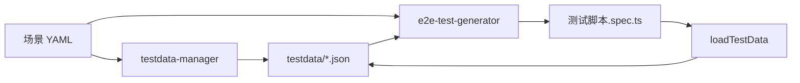

# Feature Specification: testdata-manager

**Feature ID**: T003-testdata-manager
**Type**: Claude Code Skill
**Status**: Draft
**Created**: 2025-12-30
**Priority**: P1

---

## Overview

**testdata-manager** 是一个 Claude Code Skill，用于设计、生成和管理 E2E 测试数据。它与 T005-e2e-scenario-author 和 T002-e2e-test-generator 协同工作，为测试场景提供结构化、可维护的测试数据。

---

## User Stories

### US-1: 从场景 YAML 生成测试数据模板

**As a** QA Engineer
**I want to** 根据场景 YAML 自动生成测试数据模板
**So that** 我可以快速创建符合场景需求的测试数据

**Acceptance Criteria**:
- ✅ 读取场景 YAML 文件（E2E-INVENTORY-002.yaml）
- ✅ 分析 `testdata_ref` 字段（如 `bomTestData.scenario_001`）
- ✅ 提取所有步骤中的 `testdata_ref` 参数
- ✅ 生成 JSON Schema 定义数据结构
- ✅ 创建 `testdata/bomTestData.json` 文件
- ✅ 包含所有必需字段（带占位符注释）

**Example**:
```bash
/testdata-manager generate --from E2E-INVENTORY-002

# 输出
✅ Generated: testdata/bomTestData.json
📋 Data Structure:
   - scenario_001
     - h5BaseUrl
     - products_page
     - product_whiskey_cola
     - order_params
     - adminCredentials
     - ...
```

---

### US-2: 设计测试数据结构

**As a** QA Engineer
**I want to** 通过对话式交互设计测试数据结构
**So that** 数据能够准确反映业务场景和边界情况

**Acceptance Criteria**:
- ✅ 询问用户数据需求（正常场景、边界场景、异常场景）
- ✅ 提供数据类型建议（URL、选择器、业务对象）
- ✅ 支持多环境配置（dev, staging, prod）
- ✅ 生成符合 JSON Schema 的数据文件
- ✅ 包含数据验证规则

**Example**:
```bash
/testdata-manager design

# 对话流程
🤖 请选择场景类型:
   1. 正常流程（Happy Path）
   2. 边界条件（Boundary Cases）
   3. 异常场景（Error Cases）

👤 [选择] 1

🤖 请描述业务对象:
   - 商品信息（product_whiskey_cola）
   - 订单参数（order_params）
   - 管理员凭证（adminCredentials）

# 生成的数据结构
{
  "scenario_001": {
    "product_whiskey_cola": {
      "id": "sku-whiskey-cola",
      "name": "威士忌可乐鸡尾酒",
      "price": 68.00,
      "bomItems": [...]
    }
  }
}
```

---

### US-3: 验证测试数据完整性

**As a** QA Engineer
**I want to** 验证测试数据文件是否完整且符合规范
**So that** 测试运行时不会因为缺少数据而失败

**Acceptance Criteria**:
- ✅ 检查场景 YAML 中引用的所有 `testdata_ref`
- ✅ 验证对应的数据在 JSON 文件中存在
- ✅ 检查数据类型是否正确（URL、数字、对象）
- ✅ 验证必填字段是否有值
- ✅ 生成验证报告

**Example**:
```bash
/testdata-manager validate E2E-INVENTORY-002

# 输出
🔍 Validating testdata for E2E-INVENTORY-002

✅ testdata_ref: bomTestData.scenario_001 - EXISTS
✅ Field: h5BaseUrl - Valid URL
✅ Field: product_whiskey_cola - Valid Object
❌ Field: adminCredentials.password - MISSING

Validation Score: 90% (9/10 checks passed)

💡 Suggestions:
   - Add adminCredentials.password field
```

---

### US-4: 生成测试数据变体

**As a** QA Engineer
**I want to** 根据基础数据生成多个测试数据变体
**So that** 我可以测试不同的场景组合（如不同门店、不同用户）

**Acceptance Criteria**:
- ✅ 基于模板生成多个数据变体
- ✅ 支持参数化（如 storeId: 1, 2, 3）
- ✅ 支持数据工厂模式（Faker.js 集成）
- ✅ 自动生成唯一标识符
- ✅ 保持数据关联性（如订单 ↔ 用户）

**Example**:
```bash
/testdata-manager generate-variants \
  --base bomTestData.scenario_001 \
  --count 5 \
  --vary storeId,hallId

# 生成
testdata/bomTestData.json
{
  "scenario_001": { ... },
  "scenario_002": { storeId: 2, hallId: 2, ... },
  "scenario_003": { storeId: 3, hallId: 3, ... },
  ...
}
```

---

### US-5: 环境配置管理

**As a** QA Engineer
**I want to** 为不同环境（dev/staging/prod）管理不同的测试数据
**So that** 测试可以在不同环境中正确运行

**Acceptance Criteria**:
- ✅ 支持多环境配置文件
- ✅ 环境变量覆盖机制
- ✅ 敏感数据处理（密码、Token）
- ✅ 环境切换命令

**Example**:
```bash
# 文件结构
testdata/
├── bomTestData.dev.json
├── bomTestData.staging.json
├── bomTestData.prod.json
└── common.json

# 使用
TEST_ENV=staging /testdata-manager validate E2E-INVENTORY-002
```

---

## Functional Requirements

### FR-1: 数据文件结构

**Schema**:
```json
{
  "<dataFileName>": {
    "<scenario_key>": {
      "// 系统配置": "comment",
      "h5BaseUrl": "string (URL)",
      "adminBaseUrl": "string (URL)",

      "// 认证信息": "comment",
      "userCredentials": {
        "phone": "string",
        "verifyCode": "string"
      },
      "adminCredentials": {
        "username": "string",
        "password": "string",
        "role": "string"
      },

      "// 业务数据": "comment",
      "product_whiskey_cola": {
        "id": "string",
        "name": "string",
        "price": "number",
        "bomItems": [
          { "skuId": "string", "quantity": "number" }
        ]
      },

      "// UI 元素选择器": "comment",
      "selectors": {
        "confirm_production_btn": "string (CSS selector)"
      }
    }
  }
}
```

### FR-2: 数据加载器

生成通用的测试数据加载器：

```typescript
// testdata/loader.ts
import fs from 'fs';
import path from 'path';

export async function loadTestData(ref: string): Promise<any> {
  const [dataFile, scenarioKey] = ref.split('.');
  const env = process.env.TEST_ENV || 'dev';

  // 加载环境特定文件
  const filePath = path.join(__dirname, `${dataFile}.${env}.json`);

  if (!fs.existsSync(filePath)) {
    throw new Error(`Test data file not found: ${filePath}`);
  }

  const data = JSON.parse(fs.readFileSync(filePath, 'utf-8'));

  if (!data[scenarioKey]) {
    throw new Error(`Scenario key not found: ${scenarioKey} in ${dataFile}`);
  }

  return data[scenarioKey];
}
```

### FR-3: 数据验证 Schema

使用 JSON Schema 验证数据：

```json
{
  "$schema": "http://json-schema.org/draft-07/schema#",
  "type": "object",
  "properties": {
    "h5BaseUrl": {
      "type": "string",
      "format": "uri",
      "pattern": "^https?://"
    },
    "product_whiskey_cola": {
      "type": "object",
      "required": ["id", "name", "price"],
      "properties": {
        "id": { "type": "string" },
        "name": { "type": "string" },
        "price": { "type": "number", "minimum": 0 }
      }
    }
  }
}
```

---

## Non-Functional Requirements

### NFR-1: 性能

- 数据文件加载时间 < 100ms
- 数据验证时间 < 500ms

### NFR-2: 可维护性

- 数据文件支持 JSON 和 YAML 格式
- 包含详细的注释说明数据用途
- 版本控制友好（Git diff 可读）

### NFR-3: 安全性

- 敏感数据加密存储（密码、Token）
- 支持 `.env` 文件注入
- 生产环境数据脱敏

---

## Integration with e2e-test-generator

### 工作流集成



### 命令流程示例

```bash
# 1. 创建场景（T001）
/scenario-author create

# 2. 生成测试数据（T003 - 新 skill）
/testdata-manager generate --from E2E-INVENTORY-002

# 3. 手动编辑数据
vim testdata/bomTestData.json

# 4. 验证数据完整性
/testdata-manager validate E2E-INVENTORY-002

# 5. 生成测试脚本（T002）
/e2e-test-generator generate E2E-INVENTORY-002

# 6. 运行测试
/e2e-test-generator run E2E-INVENTORY-002 --ui
```

---

## Success Metrics

- ✅ 测试数据文件覆盖率 ≥ 95% 的场景
- ✅ 数据验证失败率 < 5%
- ✅ 数据加载性能 < 100ms
- ✅ 减少 50% 的测试数据维护时间

---

## Out of Scope (P2+)

- 数据库数据生成（SQL/Supabase seed）
- 性能测试数据生成（大批量数据）
- 图像/文件测试数据生成

---

## References

- [Faker.js](https://fakerjs.dev/) - 测试数据生成库
- [JSON Schema](https://json-schema.org/) - 数据验证
- [Playwright Test Data](https://playwright.dev/docs/test-parameterize) - Playwright 数据参数化
