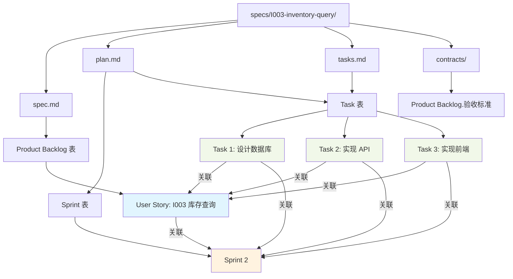

# Scrum 与 Spec-Driven 开发流程映射指南

**@spec T004-lark-project-management**

**版本**: 1.0.0
**日期**: 2025-12-31

---

## 📋 概述

本文档说明 **Scrum 敏捷开发** 与 **Spec-Driven 开发流程** 之间的映射关系，以及如何在飞书多维表格中体现这两种流程。

---

## 🗺️ 核心概念映射

### Spec-Driven 工作流 → Scrum 工作流

```
Spec-Driven 开发流程                Scrum 敏捷流程
────────────────────                ──────────────
specs/<specId>/                     Product Backlog
  ├── spec.md          ─────────→  User Story (PBI)
  ├── plan.md          ─────────→  Sprint Backlog + 技术设计
  └── tasks.md         ─────────→  Task 列表
```

### 详细对应关系

| Spec 文件 | Scrum 工件 | 飞书表 | 说明 |
|----------|-----------|--------|------|
| `specs/<specId>/` | Epic / User Story | Product Backlog 表 | 一个 spec 对应一个或多个 User Story |
| `spec.md` | User Story | Product Backlog 表的一条记录 | 功能需求说明 |
| `plan.md` | Sprint Backlog + 设计文档 | Sprint 表 + Task 表 | 实施计划和技术设计 |
| `tasks.md` | Task 列表 | Task 表 | 具体开发任务 |
| `contracts/api.yaml` | 验收标准 (AC) | Product Backlog.验收标准 字段 | API 契约和验收条件 |
| `data-model.md` | 验收标准 (AC) | Product Backlog.验收标准 字段 | 数据模型要求 |

---

## 📄 spec.md → Product Backlog (User Story)

### spec.md 结构

```markdown
# I003-inventory-query

## 功能概述
库存查询功能，支持多维度筛选和实时查询。

## 用户故事
作为仓库管理员，我想要查询库存数据，以便掌握商品库存情况。

## 功能需求
1. 支持按门店、商品、时间范围筛选
2. 实时显示库存数量和状态
3. 支持导出 Excel 报表

## 验收标准
1. 用户可以选择门店和商品进行筛选
2. 查询结果在 1 秒内返回
3. 导出的 Excel 包含所有查询字段
4. 支持分页，每页 20 条记录
```

### 映射到 Product Backlog 表

| spec.md 内容 | Product Backlog 字段 | 示例值 |
|-------------|---------------------|--------|
| spec 标题 (如 "I003-inventory-query") | spec_id | "I003" |
| 功能概述 | 标题 | "[I003] 库存查询功能" |
| - | 类型 | "User Story" |
| - | 优先级 | "🟡 P2" (根据业务重要性评估) |
| - | 状态 | "📝 待规划" |
| - | 故事点 | "5" (团队估算) |
| spec 负责人 | 负责人 | Product Owner |
| - | Sprint | (待规划时关联) |
| 验收标准 | 验收标准 | 从 spec.md 提取 |
| 功能概述 + 用户故事 | 描述 | 完整的 User Story 描述 |
| - | 业务价值 | 80 (评估 0-100) |

### 示例：从 spec.md 创建 Product Backlog

**spec.md**:
```markdown
# I003-inventory-query

作为仓库管理员，我想要查询库存数据，以便掌握商品库存情况。

验收标准:
1. 用户可以选择门店和商品进行筛选
2. 查询结果在 1 秒内返回
3. 导出的 Excel 包含所有查询字段
```

**Product Backlog 记录**:
```
标题: [I003] 库存查询功能
类型: User Story
优先级: 🟡 P2
状态: 📝 待规划
故事点: 5
负责人: Product Owner
Sprint: (空)
spec_id: I003
验收标准:
1. 用户可以选择门店和商品进行筛选
2. 查询结果在 1 秒内返回
3. 导出的 Excel 包含所有查询字段
4. 支持分页，每页 20 条记录

描述:
作为仓库管理员，我想要查询库存数据，以便掌握商品库存情况。

功能场景:
- 查看当前所有门店的库存
- 筛选特定商品的库存情况
- 导出库存报表供管理层查看

业务价值: 85
```

---

## 📝 plan.md → Sprint Backlog + 技术设计

### plan.md 结构

```markdown
# I003-inventory-query - 实施计划

## 技术方案
- 前端: React + Ant Design Table
- 后端: Spring Boot + Supabase
- 缓存: Redis (2 分钟)

## 架构设计
- Controller → Service → Repository
- DTO 转换

## 数据模型
- 库存表: inventory
- 门店表: store
- 商品表: product

## API 设计
GET /api/inventory/query

## 实施步骤
1. 设计数据库表结构
2. 实现后端 API
3. 实现前端页面
4. 编写单元测试
5. E2E 测试
```

### 映射到 Sprint Backlog + Task 表

| plan.md 内容 | 映射到 | 说明 |
|-------------|--------|------|
| 技术方案 | Product Backlog.描述 字段 | 记录在 User Story 描述中 |
| 架构设计 | Product Backlog.描述 字段 | 或单独创建设计文档 |
| 数据模型 | contracts/data-model.md | 独立文档 |
| API 设计 | contracts/api.yaml | OpenAPI 规范 |
| 实施步骤 | Task 表 (多条记录) | 每个步骤对应一个 Task |

### 示例：从 plan.md 创建 Task

**plan.md 实施步骤**:
```markdown
## 实施步骤
1. 设计数据库表结构 (4h)
2. 实现后端 API (8h)
3. 实现前端页面 (12h)
4. 编写单元测试 (6h)
5. E2E 测试 (4h)
```

**Task 表记录**:

| 任务 ID | 任务标题 | User Story | 状态 | 负责人 | 优先级 | 预估工时 | Sprint | spec_id | 标签 |
|---------|---------|-----------|------|--------|--------|---------|--------|---------|------|
| TSK-010 | [I003] 设计数据库表结构 | I003 库存查询 | 📝 待办 | 张三 | 🔴 高 | 4 | Sprint 2 | I003 | Backend |
| TSK-011 | [I003] 实现后端 API | I003 库存查询 | 📝 待办 | 张三 | 🔴 高 | 8 | Sprint 2 | I003 | Backend |
| TSK-012 | [I003] 实现前端页面 | I003 库存查询 | 📝 待办 | 李四 | 🟡 中 | 12 | Sprint 2 | I003 | Frontend |
| TSK-013 | [I003] 编写单元测试 | I003 库存查询 | 📝 待办 | 王五 | 🟢 低 | 6 | Sprint 2 | I003 | Test |
| TSK-014 | [I003] E2E 测试 | I003 库存查询 | 📝 待办 | 王五 | 🟢 低 | 4 | Sprint 2 | I003 | Test |

---

## 📋 tasks.md → Task 表

### tasks.md 结构

```markdown
# I003-inventory-query - 任务清单

## Phase 1: 后端开发
- [ ] 设计数据库表结构 (4h) @张三
- [ ] 实现 InventoryQueryController (3h) @张三
- [ ] 实现 InventoryService 业务逻辑 (5h) @张三
- [ ] 编写后端单元测试 (4h) @王五

## Phase 2: 前端开发
- [ ] 实现库存查询页面 (6h) @李四
- [ ] 实现筛选组件 (3h) @李四
- [ ] 实现表格展示 (3h) @李四
- [ ] 实现导出功能 (2h) @李四

## Phase 3: 测试
- [ ] 编写前端单元测试 (2h) @王五
- [ ] E2E 测试 (4h) @王五
```

### 映射规则

| tasks.md 内容 | Task 表字段 | 示例值 |
|--------------|------------|--------|
| 任务标题 (如 "设计数据库表结构") | 任务标题 | "[I003] 设计数据库表结构" |
| - | User Story | I003 库存查询 (关联) |
| 任务状态 ([ ]) | 状态 | "📝 待办" |
| @张三 | 负责人 | 张三 (User) |
| - | 优先级 | "🔴 高" (根据 Phase 推断) |
| (4h) | 预估工时 | 4 |
| - | 实际工时 | (完成后填写) |
| - | Sprint | Sprint 2 (关联) |
| - | spec_id | "I003" |
| Phase 分类 | 标签 | "Backend" / "Frontend" / "Test" |
| - | 创建时间 | 自动 |
| - | 完成时间 | (完成后填写) |

### 自动转换示例

**tasks.md 任务**:
```markdown
- [ ] 设计数据库表结构 (4h) @张三
```

**转换为 Task 表记录**:
```json
{
  "任务标题": "[I003] 设计数据库表结构",
  "User Story": "recv6YfOcnRnsd", // I003 的 record_id
  "状态": "📝 待办",
  "负责人": "ou_zhang_san_id",
  "优先级": "🔴 高",
  "预估工时": 4,
  "实际工时": null,
  "Sprint": "recv6YgomsAMji", // Sprint 2 的 record_id
  "spec_id": "I003",
  "标签": ["Backend"],
  "创建时间": "2026-01-06T09:00:00Z",
  "完成时间": null
}
```

---

## 🔗 关联关系总览



---

## 📊 完整示例：I003-inventory-query

### 1. Spec 文件结构

```
specs/I003-inventory-query/
├── spec.md                 # 功能规格
├── plan.md                 # 实施计划
├── tasks.md                # 任务清单
└── contracts/
    ├── api.yaml            # API 契约
    └── data-model.md       # 数据模型
```

### 2. 飞书多维表格数据

#### Product Backlog 表

| 字段 | 值 |
|------|---|
| **标题** | [I003] 库存查询功能 |
| **类型** | User Story |
| **优先级** | 🟡 P2 |
| **状态** | 🎯 已规划 |
| **故事点** | 5 |
| **负责人** | Product Owner |
| **Sprint** | Sprint 2 (关联) |
| **spec_id** | I003 |
| **验收标准** | 1. 用户可以选择门店和商品进行筛选<br>2. 查询结果在 1 秒内返回<br>3. 导出的 Excel 包含所有查询字段<br>4. 支持分页，每页 20 条记录 |
| **描述** | 作为仓库管理员，我想要查询库存数据，以便掌握商品库存情况。<br><br>功能场景：<br>- 查看当前所有门店的库存<br>- 筛选特定商品的库存情况<br>- 导出库存报表供管理层查看 |
| **业务价值** | 85 |

#### Sprint 表

| 字段 | 值 |
|------|---|
| **Sprint 名称** | Sprint 2 (2026-01-14 ~ 2026-01-27) |
| **Sprint 编号** | SP-002 |
| **开始日期** | 2026/01/14 |
| **结束日期** | 2026/01/27 |
| **Sprint 目标** | 完成库存查询功能和商品管理基础功能 |
| **状态** | 🚀 进行中 |
| **总故事点** | 13 |
| **完成故事点** | 0 |
| **完成率** | 0% |

#### Task 表

| 任务 ID | 任务标题 | User Story | 状态 | 负责人 | 优先级 | 预估工时 | 实际工时 | Sprint | spec_id | 标签 |
|---------|---------|-----------|------|--------|--------|---------|---------|--------|---------|------|
| TSK-010 | [I003] 设计数据库表结构 | I003 库存查询 | ✅ 已完成 | 张三 | 🔴 高 | 4 | 3.5 | Sprint 2 | I003 | Backend |
| TSK-011 | [I003] 实现后端 API | I003 库存查询 | 🚀 进行中 | 张三 | 🔴 高 | 8 | - | Sprint 2 | I003 | Backend |
| TSK-012 | [I003] 实现前端页面 | I003 库存查询 | 📝 待办 | 李四 | 🟡 中 | 12 | - | Sprint 2 | I003 | Frontend |
| TSK-013 | [I003] 编写单元测试 | I003 库存查询 | 📝 待办 | 王五 | 🟢 低 | 6 | - | Sprint 2 | I003 | Test |
| TSK-014 | [I003] E2E 测试 | I003 库存查询 | 📝 待办 | 王五 | 🟢 低 | 4 | - | Sprint 2 | I003 | Test |

---

## 🔄 工作流集成

### 从 Spec 到 Scrum 的完整流程

#### Step 1: 创建 spec.md

```bash
cd specs/
mkdir I003-inventory-query
cd I003-inventory-query
touch spec.md
```

编写 `spec.md`:
```markdown
# I003-inventory-query

作为仓库管理员，我想要查询库存数据...
```

#### Step 2: 创建 Product Backlog (手动或自动)

**手动方式**: 打开飞书表，创建新记录

**自动方式 (未来)**: 使用 lark-pm CLI
```bash
/lark-pm backlog-create \
  --from-spec I003-inventory-query \
  --title "[I003] 库存查询功能" \
  --priority P2 \
  --story-points 5
```

#### Step 3: Sprint Planning (规划到 Sprint)

1. Product Owner 评估优先级
2. 团队进行 Planning Poker 估算故事点
3. 在 Sprint Planning 会议中选择 User Story
4. 在飞书表中将 User Story 关联到 Sprint

```
Product Backlog 表:
[I003] 库存查询功能
  └─ Sprint 字段 → 选择 "Sprint 2"
  └─ 状态 → 更新为 "🎯 已规划"
```

#### Step 4: 拆解任务 (创建 tasks.md)

编写 `tasks.md`:
```markdown
# I003-inventory-query - 任务清单

## Phase 1: 后端开发
- [ ] 设计数据库表结构 (4h) @张三
- [ ] 实现后端 API (8h) @张三

## Phase 2: 前端开发
- [ ] 实现前端页面 (12h) @李四

## Phase 3: 测试
- [ ] 编写单元测试 (6h) @王五
- [ ] E2E 测试 (4h) @王五
```

#### Step 5: 创建 Task (手动或自动)

**手动方式**: 打开飞书 Task 表，创建任务记录

**自动方式 (未来)**: 使用 lark-pm CLI
```bash
/lark-pm task-create \
  --from-tasks-md I003-inventory-query/tasks.md \
  --user-story I003 \
  --sprint SP-002
```

#### Step 6: 执行 Sprint

1. Daily Standup: 更新任务状态
2. 开发人员更新实际工时
3. 完成任务后更新状态为"✅ 已完成"

```
Task 表:
[I003] 设计数据库表结构
  └─ 状态 → 🚀 进行中
  └─ 实际工时 → 3.5
  └─ 状态 → ✅ 已完成
  └─ 完成时间 → 2026/01/15
```

#### Step 7: Sprint Review & Retrospective

1. 检查所有任务是否完成
2. 更新 User Story 状态为"✅ 已完成"
3. 更新 Sprint 完成故事点
4. 计算 Sprint 完成率

```
Sprint 表:
Sprint 2
  └─ 完成故事点 → 5
  └─ 完成率 → 38% (5/13)
  └─ 状态 → ✅ 已完成
```

---

## 🛠️ 自动化集成 (未来)

### 规划中的自动化功能 (PBI-006)

#### 1. spec.md → Product Backlog (自动创建)

```bash
/lark-pm backlog-create --from-spec I003-inventory-query
```

**自动提取**:
- spec_id: 从目录名提取
- 标题: 从 spec.md 第一行提取
- 描述: 从"用户故事"章节提取
- 验收标准: 从"验收标准"章节提取

#### 2. tasks.md → Task 表 (批量导入)

```bash
/lark-pm task-import --tasks-md I003-inventory-query/tasks.md
```

**自动解析**:
- 任务标题: Markdown 列表项
- 负责人: @mention 解析
- 预估工时: (4h) 正则提取
- 标签: 根据 Phase 分类映射

#### 3. Git Commit → Task 更新 (Webhook)

```bash
git commit -m "feat(I003): implement inventory query API

TSK-011"
```

**自动更新**:
- 识别 Commit message 中的 TSK-011
- 更新任务状态为"🚀 进行中"
- 记录 commit hash 到任务备注

#### 4. Code @spec → Task 关联 (扫描)

```typescript
/**
 * @spec I003-inventory-query
 * 库存查询 Controller
 */
@RestController
export class InventoryController {
  // ...
}
```

**自动关联**:
- 扫描代码中的 @spec 标识
- 统计 spec 相关代码行数
- 更新 Task 进度百分比

---

## 📚 参考资料

### Spec-Driven 开发

- [功能分支绑定规则](./.claude/rules/01-branch-spec-binding.md)
- [代码质量规范](./.claude/rules/06-code-quality.md)

### Scrum 敏捷

- [Scrum 工作流指南](./scrum-workflow.md)
- [Scrum 数据模型](./data-model-scrum.md)

---

## 🎯 总结

### 核心映射关系

| Spec 文件 | → | Scrum 概念 | → | 飞书表 |
|----------|---|-----------|---|--------|
| spec.md | → | User Story | → | Product Backlog 表 |
| plan.md | → | Sprint Backlog + 设计 | → | Sprint 表 + Task 表 |
| tasks.md | → | Task 列表 | → | Task 表 |

### 关键字段映射

- `spec_id` → 贯穿所有表，关联 spec 和 Scrum 工件
- `Sprint` → 关联字段，连接 User Story 和 Task
- `User Story` → 关联字段，连接 Task 和 Product Backlog

### 最佳实践

1. **保持 spec.md 和 Product Backlog 同步**
   - spec.md 更新时，同步更新 Product Backlog
   - Product Backlog 状态变更时，考虑更新 spec.md

2. **使用 spec_id 作为唯一标识**
   - 所有表都包含 spec_id 字段
   - 便于跨表查询和追踪

3. **遵循 Scrum 流程，保留 Spec 规范**
   - Scrum 管理迭代和任务
   - Spec 记录详细设计和契约

---

**文档版本**: 1.0.0
**最后更新**: 2025-12-31
**维护者**: Tech Lead
