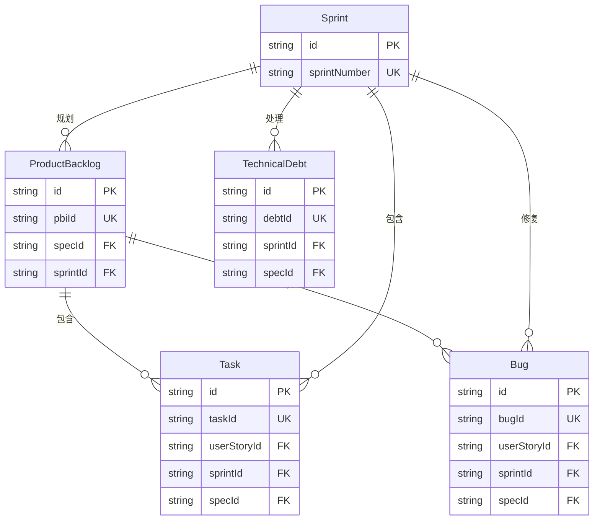

# Data Model: Lark MCP Scrum 项目管理系统

**@spec T004-lark-project-management**

**Phase**: Phase 2 - Scrum Architecture
**Date**: 2025-12-31
**Spec**: [spec.md](./spec.md)

## 概述

本文档定义了基于 Scrum 敏捷开发方法论的项目管理系统数据模型，包含 5 个核心飞书多维表格。

## Scrum 核心理念

```
Epic → User Story → Sprint Backlog → Task → Done
  ↓         ↓            ↓            ↓
产品待办   迭代规划    迭代执行     交付验收
```

## 数据实体总览

| 实体 | 飞书表名 | Scrum 角色 | 用途 | 字段数 |
|------|---------|-----------|------|--------|
| ProductBacklog | 产品待办列表 | Product Owner 管理 | Epic/User Story 管理 | 14 |
| Sprint | 迭代 | Scrum Master 管理 | 迭代周期管理 | 9 |
| Task | 任务 | Development Team | 开发任务跟踪 | 13 |
| Bug | 缺陷 | Development Team | Bug 管理 | 12 |
| TechnicalDebt | 技术债 | Development Team | 技术债务跟踪 | 11 |

## 1. ProductBacklog (产品待办列表)

### 1.1 飞书表结构

| 字段名 | 飞书字段类型 | 必需 | 默认值 | 说明 |
|--------|-------------|------|--------|------|
| 待办项 ID | 自动编号 (AutoNumber) | 自动 | PBI-001 | 格式: PBI-{序号} |
| 标题 | 多行文本 (Text) | ✅ | - | 需求标题 |
| 类型 | 单选 (SingleSelect) | ✅ | User Story | Epic / User Story / Spike |
| 优先级 | 单选 (SingleSelect) | ✅ | 🟡 P2 | 🔴 P0 / 🟠 P1 / 🟡 P2 / 🟢 P3 |
| 状态 | 单选 (SingleSelect) | ✅ | 📝 待规划 | 📝 待规划 / 🎯 已规划 / 🚀 开发中 / ✅ 已完成 / ❌ 已废弃 |
| 故事点 | 单选 (SingleSelect) | ❌ | - | 1, 2, 3, 5, 8, 13, 21 (斐波那契) |
| 负责人 | 人员 (User) | ❌ | - | Product Owner |
| Sprint | 双向关联 (DuplexLink) | ❌ | - | 关联到 Sprint 表 |
| spec_id | 多行文本 (Text) | ❌ | - | 规格标识符 (如 I003, P004) |
| 验收标准 | 多行文本 (Text) | ❌ | - | Acceptance Criteria |
| 描述 | 多行文本 (Text) | ❌ | - | User Story 详细描述 |
| 业务价值 | 数字 (Number) | ❌ | - | 0-100，评估业务价值 |
| 创建时间 | 创建时间 (CreatedTime) | 自动 | - | 自动填充 |
| 最后修改时间 | 修改时间 (ModifiedTime) | 自动 | - | 自动更新 |

### 1.2 TypeScript 类型定义

```typescript
/**
 * @spec T004-lark-project-management
 * 产品待办项实体
 */
export interface ProductBacklog {
  id: string                        // 记录 ID
  pbiId: string                     // PBI-001
  title: string                     // 标题
  type: BacklogType                 // Epic / User Story / Spike
  priority: Priority                // P0-P3
  status: BacklogStatus             // 状态
  storyPoints?: StoryPoints         // 故事点
  owner?: string                    // 负责人 ID
  sprintId?: string                 // 关联 Sprint ID
  specId?: string                   // 规格 ID (如 I003)
  acceptanceCriteria?: string       // 验收标准
  description?: string              // 详细描述
  businessValue?: number            // 业务价值 (0-100)
  createdTime?: number              // 创建时间
  modifiedTime?: number             // 最后修改时间
}

export enum BacklogType {
  Epic = 'Epic',
  UserStory = 'User Story',
  Spike = 'Spike',                  // 技术调研任务
}

export enum Priority {
  P0 = '🔴 P0',
  P1 = '🟠 P1',
  P2 = '🟡 P2',
  P3 = '🟢 P3',
}

export enum BacklogStatus {
  Backlog = '📝 待规划',
  Planned = '🎯 已规划',
  InProgress = '🚀 开发中',
  Done = '✅ 已完成',
  Deprecated = '❌ 已废弃',
}

export enum StoryPoints {
  XS = '1',
  S = '2',
  M = '3',
  L = '5',
  XL = '8',
  XXL = '13',
  XXXL = '21',
}
```

### 1.3 Zod 验证 Schema

```typescript
import { z } from 'zod'

export const ProductBacklogSchema = z.object({
  title: z.string()
    .min(1, '标题不能为空')
    .max(200, '标题不超过200字符'),

  type: z.nativeEnum(BacklogType)
    .default(BacklogType.UserStory),

  priority: z.nativeEnum(Priority)
    .default(Priority.P2),

  status: z.nativeEnum(BacklogStatus)
    .default(BacklogStatus.Backlog),

  storyPoints: z.nativeEnum(StoryPoints).optional(),

  owner: z.string().optional(),

  sprintId: z.string().optional(),

  specId: z.string()
    .regex(/^[A-Z]\d{3}$/, '规格 ID 格式错误 (如 I003)')
    .optional(),

  acceptanceCriteria: z.string()
    .max(2000, '验收标准不超过2000字符')
    .optional(),

  description: z.string()
    .max(5000, '描述不超过5000字符')
    .optional(),

  businessValue: z.number()
    .int()
    .min(0, '业务价值不能小于0')
    .max(100, '业务价值不能大于100')
    .optional(),
})

export type ProductBacklogInput = z.infer<typeof ProductBacklogSchema>
```

## 2. Sprint (迭代)

### 2.1 飞书表结构

| 字段名 | 飞书字段类型 | 必需 | 默认值 | 说明 |
|--------|-------------|------|--------|------|
| Sprint 名称 | 多行文本 (Text) | ✅ | - | 如 "Sprint 24 (2025-01)" |
| Sprint 编号 | 自动编号 (AutoNumber) | 自动 | SP-001 | 格式: SP-{序号} |
| 开始日期 | 日期 (DateTime) | ✅ | - | 格式: yyyy/MM/dd |
| 结束日期 | 日期 (DateTime) | ✅ | - | 格式: yyyy/MM/dd |
| Sprint 目标 | 多行文本 (Text) | ❌ | - | 本迭代的目标 |
| 状态 | 单选 (SingleSelect) | ✅ | 📝 规划中 | 📝 规划中 / 🚀 进行中 / ✅ 已完成 / ❌ 已取消 |
| 总故事点 | 数字 (Number) | ❌ | 0 | 自动汇总关联 Story 的故事点 |
| 完成故事点 | 数字 (Number) | ❌ | 0 | 已完成 Story 的故事点 |
| 完成率 | 进度 (Progress) | ❌ | 0 | 自动计算: 完成故事点 / 总故事点 * 100 |

### 2.2 TypeScript 类型定义

```typescript
/**
 * @spec T004-lark-project-management
 * Sprint 实体
 */
export interface Sprint {
  id: string
  name: string                      // Sprint 24 (2025-01)
  sprintNumber: string              // SP-001
  startDate: number                 // 时间戳,毫秒
  endDate: number                   // 时间戳,毫秒
  goal?: string                     // Sprint 目标
  status: SprintStatus
  totalStoryPoints?: number         // 总故事点
  completedStoryPoints?: number     // 完成故事点
  completionRate?: number           // 完成率 (0-100)
}

export enum SprintStatus {
  Planning = '📝 规划中',
  Active = '🚀 进行中',
  Completed = '✅ 已完成',
  Cancelled = '❌ 已取消',
}
```

### 2.3 Zod 验证 Schema

```typescript
export const SprintSchema = z.object({
  name: z.string()
    .min(1, 'Sprint 名称不能为空')
    .max(100, 'Sprint 名称不超过100字符'),

  startDate: z.number()
    .int()
    .positive(),

  endDate: z.number()
    .int()
    .positive()
    .refine((val, ctx) => {
      const startDate = ctx.parent.startDate
      return val > startDate
    }, '结束日期必须晚于开始日期'),

  goal: z.string()
    .max(1000, 'Sprint 目标不超过1000字符')
    .optional(),

  status: z.nativeEnum(SprintStatus)
    .default(SprintStatus.Planning),

  totalStoryPoints: z.number()
    .int()
    .min(0)
    .optional(),

  completedStoryPoints: z.number()
    .int()
    .min(0)
    .optional(),

  completionRate: z.number()
    .int()
    .min(0)
    .max(100)
    .optional(),
})

export type SprintInput = z.infer<typeof SprintSchema>
```

## 3. Task (任务)

### 3.1 飞书表结构

| 字段名 | 飞书字段类型 | 必需 | 默认值 | 说明 |
|--------|-------------|------|--------|------|
| 任务 ID | 自动编号 (AutoNumber) | 自动 | TSK-001 | 格式: TSK-{序号} |
| 任务标题 | 多行文本 (Text) | ✅ | - | 任务描述 |
| User Story | 双向关联 (DuplexLink) | ❌ | - | 关联 ProductBacklog 表 |
| 状态 | 单选 (SingleSelect) | ✅ | 📝 待办 | 📝 待办 / 🚀 进行中 / 🧪 测试中 / ✅ 已完成 / ❌ 已取消 |
| 负责人 | 人员 (User) | ❌ | - | 开发人员 |
| 优先级 | 单选 (SingleSelect) | ✅ | 🟡 中 | 🔴 高 / 🟡 中 / 🟢 低 |
| 预估工时 | 数字 (Number) | ❌ | - | 单位: 小时 |
| 实际工时 | 数字 (Number) | ❌ | - | 单位: 小时 |
| Sprint | 双向关联 (DuplexLink) | ❌ | - | 关联 Sprint 表 |
| spec_id | 多行文本 (Text) | ❌ | - | 规格标识符 |
| 标签 | 多选 (MultiSelect) | ❌ | - | Frontend, Backend, Test, Docs |
| 创建时间 | 创建时间 (CreatedTime) | 自动 | - | 自动填充 |
| 完成时间 | 日期 (DateTime) | ❌ | - | 手动填写 |

### 3.2 TypeScript 类型定义

```typescript
/**
 * @spec T004-lark-project-management
 * 任务实体
 */
export interface Task {
  id: string
  taskId: string                    // TSK-001
  title: string
  userStoryId?: string              // 关联 User Story ID
  status: TaskStatus
  assignee?: string                 // 负责人 ID
  priority: TaskPriority
  estimatedHours?: number
  actualHours?: number
  sprintId?: string                 // 关联 Sprint ID
  specId?: string                   // 规格 ID
  tags?: TaskTag[]
  createdTime?: number
  completedTime?: number
}

export enum TaskStatus {
  Todo = '📝 待办',
  InProgress = '🚀 进行中',
  Testing = '🧪 测试中',
  Done = '✅ 已完成',
  Cancelled = '❌ 已取消',
}

export enum TaskPriority {
  High = '🔴 高',
  Medium = '🟡 中',
  Low = '🟢 低',
}

export enum TaskTag {
  Frontend = 'Frontend',
  Backend = 'Backend',
  Test = 'Test',
  Docs = 'Docs',
  Design = 'Design',
  Infra = 'Infra',
}
```

### 3.3 Zod 验证 Schema

```typescript
export const TaskSchema = z.object({
  title: z.string()
    .min(1, '任务标题不能为空')
    .max(200, '任务标题不超过200字符'),

  userStoryId: z.string().optional(),

  status: z.nativeEnum(TaskStatus)
    .default(TaskStatus.Todo),

  assignee: z.string().optional(),

  priority: z.nativeEnum(TaskPriority)
    .default(TaskPriority.Medium),

  estimatedHours: z.number()
    .positive()
    .optional(),

  actualHours: z.number()
    .positive()
    .optional(),

  sprintId: z.string().optional(),

  specId: z.string()
    .regex(/^[A-Z]\d{3}$/, '规格 ID 格式错误')
    .optional(),

  tags: z.array(z.nativeEnum(TaskTag)).optional(),

  completedTime: z.number()
    .int()
    .positive()
    .optional(),
})

export type TaskInput = z.infer<typeof TaskSchema>
```

## 4. Bug (缺陷)

### 4.1 飞书表结构

| 字段名 | 飞书字段类型 | 必需 | 默认值 | 说明 |
|--------|-------------|------|--------|------|
| Bug ID | 自动编号 (AutoNumber) | 自动 | BUG-001 | 格式: BUG-{序号} |
| Bug 标题 | 多行文本 (Text) | ✅ | - | 缺陷描述 |
| 严重程度 | 单选 (SingleSelect) | ✅ | 🟡 Medium | 🔴 Critical / 🟠 High / 🟡 Medium / 🟢 Low |
| 状态 | 单选 (SingleSelect) | ✅ | 📝 待修复 | 📝 待修复 / 🚀 修复中 / 🧪 待验证 / ✅ 已关闭 / ❌ 不修复 |
| 报告人 | 人员 (User) | ❌ | - | 单人 |
| 负责人 | 人员 (User) | ❌ | - | 单人 |
| 关联 Story | 双向关联 (DuplexLink) | ❌ | - | 关联 ProductBacklog 表 |
| Sprint | 双向关联 (DuplexLink) | ❌ | - | 关联 Sprint 表 |
| 发现环境 | 单选 (SingleSelect) | ❌ | - | Dev / Test / UAT / Production |
| spec_id | 多行文本 (Text) | ❌ | - | 规格标识符 |
| 复现步骤 | 多行文本 (Text) | ❌ | - | 详细复现步骤 |
| 创建时间 | 创建时间 (CreatedTime) | 自动 | - | 自动填充 |

### 4.2 TypeScript 类型定义

```typescript
/**
 * @spec T004-lark-project-management
 * Bug 实体
 */
export interface Bug {
  id: string
  bugId: string                     // BUG-001
  title: string
  severity: BugSeverity
  status: BugStatus
  reporter?: string                 // 报告人 ID
  assignee?: string                 // 负责人 ID
  userStoryId?: string              // 关联 User Story ID
  sprintId?: string                 // 关联 Sprint ID
  environment?: Environment         // 发现环境
  specId?: string
  reproSteps?: string               // 复现步骤
  createdTime?: number
}

export enum BugSeverity {
  Critical = '🔴 Critical',
  High = '🟠 High',
  Medium = '🟡 Medium',
  Low = '🟢 Low',
}

export enum BugStatus {
  Open = '📝 待修复',
  InProgress = '🚀 修复中',
  PendingVerification = '🧪 待验证',
  Closed = '✅ 已关闭',
  WontFix = '❌ 不修复',
}

export enum Environment {
  Dev = 'Dev',
  Test = 'Test',
  UAT = 'UAT',
  Production = 'Production',
}
```

### 4.3 Zod 验证 Schema

```typescript
export const BugSchema = z.object({
  title: z.string()
    .min(1, 'Bug 标题不能为空')
    .max(200, 'Bug 标题不超过200字符'),

  severity: z.nativeEnum(BugSeverity)
    .default(BugSeverity.Medium),

  status: z.nativeEnum(BugStatus)
    .default(BugStatus.Open),

  reporter: z.string().optional(),
  assignee: z.string().optional(),

  userStoryId: z.string().optional(),
  sprintId: z.string().optional(),

  environment: z.nativeEnum(Environment).optional(),

  specId: z.string()
    .regex(/^[A-Z]\d{3}$/, '规格 ID 格式错误')
    .optional(),

  reproSteps: z.string()
    .max(2000, '复现步骤不超过2000字符')
    .optional(),
})

export type BugInput = z.infer<typeof BugSchema>
```

## 5. TechnicalDebt (技术债)

### 5.1 飞书表结构

| 字段名 | 飞书字段类型 | 必需 | 默认值 | 说明 |
|--------|-------------|------|--------|------|
| 技术债 ID | 自动编号 (AutoNumber) | 自动 | TD-001 | 格式: TD-{序号} |
| 债务标题 | 多行文本 (Text) | ✅ | - | 技术债描述 |
| 类型 | 单选 (SingleSelect) | ✅ | 代码质量 | 代码质量 / 架构 / 性能 / 安全 / 文档 |
| 影响程度 | 单选 (SingleSelect) | ✅ | 🟡 Medium | 🔴 High / 🟡 Medium / 🟢 Low |
| 状态 | 单选 (SingleSelect) | ✅ | 📝 待处理 | 📝 待处理 / 🚀 进行中 / ✅ 已完成 / ❌ 已搁置 |
| 负责人 | 人员 (User) | ❌ | - | 单人 |
| 预估工时 | 数字 (Number) | ❌ | - | 单位: 小时 |
| Sprint | 双向关联 (DuplexLink) | ❌ | - | 关联 Sprint 表 |
| spec_id | 多行文本 (Text) | ❌ | - | 规格标识符 |
| 影响范围 | 多行文本 (Text) | ❌ | - | 受影响的模块 |
| 创建时间 | 创建时间 (CreatedTime) | 自动 | - | 自动填充 |

### 5.2 TypeScript 类型定义

```typescript
/**
 * @spec T004-lark-project-management
 * 技术债实体
 */
export interface TechnicalDebt {
  id: string
  debtId: string                    // TD-001
  title: string
  type: DebtType
  impact: DebtImpact
  status: DebtStatus
  assignee?: string
  estimatedHours?: number
  sprintId?: string
  specId?: string
  impactScope?: string              // 影响范围
  createdTime?: number
}

export enum DebtType {
  CodeQuality = '代码质量',
  Architecture = '架构',
  Performance = '性能',
  Security = '安全',
  Documentation = '文档',
}

export enum DebtImpact {
  High = '🔴 High',
  Medium = '🟡 Medium',
  Low = '🟢 Low',
}

export enum DebtStatus {
  Open = '📝 待处理',
  InProgress = '🚀 进行中',
  Resolved = '✅ 已完成',
  Deferred = '❌ 已搁置',
}
```

### 5.3 Zod 验证 Schema

```typescript
export const TechnicalDebtSchema = z.object({
  title: z.string()
    .min(1, '债务标题不能为空')
    .max(200, '债务标题不超过200字符'),

  type: z.nativeEnum(DebtType)
    .default(DebtType.CodeQuality),

  impact: z.nativeEnum(DebtImpact)
    .default(DebtImpact.Medium),

  status: z.nativeEnum(DebtStatus)
    .default(DebtStatus.Open),

  assignee: z.string().optional(),

  estimatedHours: z.number()
    .positive()
    .optional(),

  sprintId: z.string().optional(),

  specId: z.string()
    .regex(/^[A-Z]\d{3}$/, '规格 ID 格式错误')
    .optional(),

  impactScope: z.string()
    .max(1000, '影响范围不超过1000字符')
    .optional(),
})

export type TechnicalDebtInput = z.infer<typeof TechnicalDebtSchema>
```

## 6. 数据关系 (ER 图)



## 7. Scrum 工作流状态转换

### 7.1 ProductBacklog 状态流转

```
待规划 → 已规划 → 开发中 → 已完成
   ↓                          ↓
已废弃 ←────────────────────────
```

### 7.2 Task 状态流转

```
待办 → 进行中 → 测试中 → 已完成
 ↓                        ↓
已取消 ←──────────────────────
```

### 7.3 Bug 状态流转

```
待修复 → 修复中 → 待验证 → 已关闭
   ↓                      ↓
不修复 ←────────────────────
```

### 7.4 Sprint 状态流转

```
规划中 → 进行中 → 已完成
   ↓              ↓
已取消 ←───────────
```

## 8. 飞书字段类型映射

| TypeScript 类型 | 飞书字段类型 | type 值 | ui_type 值 |
|----------------|-------------|---------|-----------|
| string | 多行文本 | 1 | Text |
| number | 数字 | 2 | Number |
| enum (单选) | 单选 | 3 | SingleSelect |
| enum[] (多选) | 多选 | 4 | MultiSelect |
| number (日期) | 日期 | 5 | DateTime |
| string[] (人员) | 人员 | 11 | User |
| number (进度) | 进度 | 2 | Progress |
| string (关联) | 双向关联 | 21 | DuplexLink |
| string (自动编号) | 自动编号 | 1005 | AutoNumber |
| number (创建时间) | 创建时间 | 1001 | CreatedTime |
| number (修改时间) | 修改时间 | 1002 | ModifiedTime |

## 9. Scrum 指标计算

### 9.1 Sprint Velocity (迭代速率)

```typescript
/**
 * 计算 Sprint 速率
 */
export function calculateSprintVelocity(sprint: Sprint): number {
  return sprint.completedStoryPoints || 0
}
```

### 9.2 Sprint Burndown (燃尽图)

```typescript
/**
 * 生成 Sprint 燃尽图数据
 */
export interface BurndownData {
  date: string
  remainingStoryPoints: number
  idealRemaining: number
}

export function generateBurndownChart(
  sprint: Sprint,
  tasks: Task[]
): BurndownData[] {
  // 实现逻辑...
}
```

### 9.3 Team Capacity (团队产能)

```typescript
/**
 * 计算团队产能
 */
export interface TeamCapacity {
  totalHours: number
  allocatedHours: number
  availableHours: number
}

export function calculateTeamCapacity(
  sprint: Sprint,
  tasks: Task[]
): TeamCapacity {
  const totalHours = tasks.reduce((sum, task) => sum + (task.estimatedHours || 0), 0)
  const allocatedHours = tasks
    .filter(t => t.status !== TaskStatus.Todo)
    .reduce((sum, task) => sum + (task.estimatedHours || 0), 0)

  return {
    totalHours,
    allocatedHours,
    availableHours: totalHours - allocatedHours,
  }
}
```

## 10. 与现有 spec-driven 流程集成

### 10.1 Spec → User Story 映射

```typescript
/**
 * 将 spec.md 转换为 User Story
 */
export function createUserStoryFromSpec(
  specId: string,
  specContent: string
): ProductBacklogInput {
  return {
    title: `[${specId}] ${extractSpecTitle(specContent)}`,
    type: BacklogType.UserStory,
    priority: Priority.P2,
    status: BacklogStatus.Backlog,
    specId,
    acceptanceCriteria: extractAcceptanceCriteria(specContent),
    description: extractDescription(specContent),
  }
}
```

### 10.2 tasks.md → Task 映射

```typescript
/**
 * 将 tasks.md 转换为 Task 列表
 */
export function createTasksFromTasksMd(
  tasksContent: string,
  userStoryId: string
): TaskInput[] {
  const tasks: TaskInput[] = []

  // 解析 tasks.md
  const taskLines = extractTaskLines(tasksContent)

  for (const line of taskLines) {
    tasks.push({
      title: line.title,
      userStoryId,
      status: TaskStatus.Todo,
      priority: TaskPriority.Medium,
      estimatedHours: line.estimatedHours,
    })
  }

  return tasks
}
```

---

**数据模型版本**: 2.0.0 (Scrum)
**最后更新**: 2025-12-31
**下一步**: 创建飞书多维表格并导入数据
