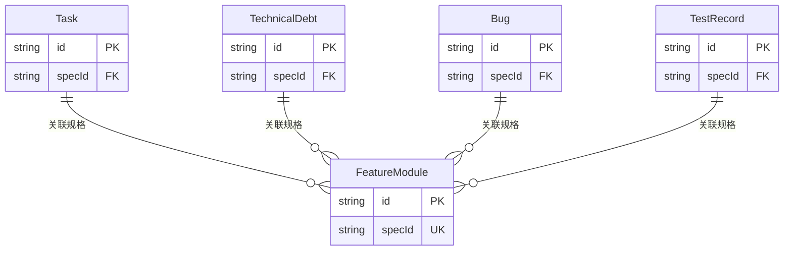

# Data Model: Lark MCP 项目管理系统

**Phase**: Phase 1 - Design
**Date**: 2025-12-31
**Spec**: [spec.md](./spec.md)

## 概述

本文档定义了 Lark MCP 项目管理系统中的 5 个核心数据实体及其在飞书 Base (多维表格) 中的存储结构。

## 数据实体总览

| 实体 | 飞书表名 | 用途 | 字段数 |
|------|---------|------|--------|
| Task | 项目任务 | 跟踪开发任务 | 12 |
| TechnicalDebt | 技术债 | 记录技术债务 | 10 |
| Bug | Bug记录 | 缺陷管理 | 11 |
| FeatureModule | 产品功能矩阵 | 功能模块管理 | 9 |
| TestRecord | 测试记录 | 测试结果跟踪 | 10 |

## 1. Task (项目任务)

### 1.1 飞书表结构

| 字段名 | 飞书字段类型 | 必需 | 默认值 | 说明 |
|--------|-------------|------|--------|------|
| 任务标题 | 多行文本 (Text) | ✅ | - | 任务描述 |
| 优先级 | 单选 (SingleSelect) | ✅ | 🟡 中 | 🔴 高、🟡 中、🟢 低 |
| 状态 | 单选 (SingleSelect) | ✅ | 📝 待办 | 📝 待办、🚀 进行中、✅ 已完成、❌ 已取消 |
| 负责人 | 人员 (User) | ❌ | - | 支持多人 |
| 关联规格 | 多行文本 (Text) | ❌ | - | 如 P003, I004 |
| 截止日期 | 日期 (DateTime) | ❌ | - | 格式: yyyy/MM/dd |
| 标签 | 多选 (MultiSelect) | ❌ | - | Frontend, Backend, Test, Docs, Design, Infra |
| 进度 | 数字 (Progress) | ❌ | 0 | 0-100 |
| 预计工时 | 数字 (Number) | ❌ | - | 单位: 小时 |
| 实际工时 | 数字 (Number) | ❌ | - | 单位: 小时 |
| 备注 | 多行文本 (Text) | ❌ | - | 详细说明 |
| 创建时间 | 创建时间 (CreatedTime) | 自动 | - | 自动填充 |

### 1.2 TypeScript 类型定义

```typescript
/**
 * @spec T004-lark-project-management
 * 任务实体
 */
export interface Task {
  id: string                    // 记录 ID (record_id)
  title: string                 // 任务标题
  priority: TaskPriority        // 优先级
  status: TaskStatus            // 状态
  assignees?: string[]          // 负责人 ID 列表
  specId?: string               // 关联规格 (如 "I003")
  dueDate?: number              // 截止日期 (时间戳,毫秒)
  tags?: TaskTag[]              // 标签
  progress?: number             // 进度 (0-100)
  estimatedHours?: number       // 预计工时
  actualHours?: number          // 实际工时
  notes?: string                // 备注
  createdTime?: number          // 创建时间 (自动)
}

export enum TaskPriority {
  High = '🔴 高',
  Medium = '🟡 中',
  Low = '🟢 低',
}

export enum TaskStatus {
  Todo = '📝 待办',
  InProgress = '🚀 进行中',
  Done = '✅ 已完成',
  Cancelled = '❌ 已取消',
}

export enum TaskTag {
  Frontend = 'Frontend',
  Backend = 'Backend',
  Test = 'Test',
  Docs = 'Docs',
  Design = 'Design',
  Infra = 'Infra',
}
```

### 1.3 Zod 验证 Schema

```typescript
import { z } from 'zod'

export const TaskSchema = z.object({
  title: z.string()
    .min(1, '任务标题不能为空')
    .max(200, '任务标题不超过200字符'),

  priority: z.nativeEnum(TaskPriority)
    .default(TaskPriority.Medium),

  status: z.nativeEnum(TaskStatus)
    .default(TaskStatus.Todo),

  assignees: z.array(z.string())
    .optional(),

  specId: z.string()
    .regex(/^[A-Z]\d{3}$/, '规格 ID 格式错误 (如 I003)')
    .optional(),

  dueDate: z.number()
    .int()
    .positive()
    .optional(),

  tags: z.array(z.nativeEnum(TaskTag))
    .optional(),

  progress: z.number()
    .int()
    .min(0, '进度不能小于0')
    .max(100, '进度不能大于100')
    .optional(),

  estimatedHours: z.number()
    .positive()
    .optional(),

  actualHours: z.number()
    .positive()
    .optional(),

  notes: z.string()
    .max(2000, '备注不超过2000字符')
    .optional(),
})

export type TaskInput = z.infer<typeof TaskSchema>
```

### 1.4 飞书 API 字段映射

```typescript
/**
 * 将 Task 对象转换为飞书 API 字段格式
 */
export function taskToLarkFields(task: TaskInput): Record<string, any> {
  const fields: Record<string, any> = {
    '任务标题': task.title,
    '优先级': task.priority,
    '状态': task.status,
  }

  if (task.assignees) {
    fields['负责人'] = task.assignees.map(id => ({ id }))
  }

  if (task.specId) {
    fields['关联规格'] = task.specId
  }

  if (task.dueDate) {
    fields['截止日期'] = task.dueDate
  }

  if (task.tags) {
    fields['标签'] = task.tags
  }

  if (task.progress !== undefined) {
    fields['进度'] = task.progress
  }

  if (task.estimatedHours !== undefined) {
    fields['预计工时'] = task.estimatedHours
  }

  if (task.actualHours !== undefined) {
    fields['实际工时'] = task.actualHours
  }

  if (task.notes) {
    fields['备注'] = task.notes
  }

  return fields
}

/**
 * 将飞书 API 响应转换为 Task 对象
 */
export function larkFieldsToTask(recordId: string, fields: Record<string, any>): Task {
  return {
    id: recordId,
    title: fields['任务标题'],
    priority: fields['优先级'] as TaskPriority,
    status: fields['状态'] as TaskStatus,
    assignees: fields['负责人']?.map((user: any) => user.id),
    specId: fields['关联规格'] || undefined,
    dueDate: fields['截止日期'] || undefined,
    tags: fields['标签'] || undefined,
    progress: fields['进度'] || undefined,
    estimatedHours: fields['预计工时'] || undefined,
    actualHours: fields['实际工时'] || undefined,
    notes: fields['备注'] || undefined,
    createdTime: fields['创建时间'] || undefined,
  }
}
```

## 2. TechnicalDebt (技术债)

### 2.1 飞书表结构

| 字段名 | 飞书字段类型 | 必需 | 默认值 | 说明 |
|--------|-------------|------|--------|------|
| 债务标题 | 多行文本 (Text) | ✅ | - | 技术债描述 |
| 严重程度 | 单选 (SingleSelect) | ✅ | 🟡 中 | 🔴 严重、🟡 中、🟢 轻微 |
| 状态 | 单选 (SingleSelect) | ✅ | 📝 未处理 | 📝 未处理、🚀 处理中、✅ 已解决、❌ 已搁置 |
| 影响范围 | 多行文本 (Text) | ❌ | - | 受影响的模块 |
| 关联规格 | 多行文本 (Text) | ❌ | - | 如 P003, I004 |
| 预计工作量 | 数字 (Number) | ❌ | - | 单位: 小时 |
| 负责人 | 人员 (User) | ❌ | - | 单人 |
| 发现日期 | 日期 (DateTime) | ❌ | - | 格式: yyyy/MM/dd |
| 解决日期 | 日期 (DateTime) | ❌ | - | 格式: yyyy/MM/dd |
| 备注 | 多行文本 (Text) | ❌ | - | 详细说明 |

### 2.2 TypeScript 类型定义

```typescript
/**
 * @spec T004-lark-project-management
 * 技术债实体
 */
export interface TechnicalDebt {
  id: string
  title: string
  severity: DebtSeverity
  status: DebtStatus
  impact?: string
  specId?: string
  estimatedEffort?: number      // 单位: 小时
  assignee?: string              // 负责人 ID
  foundDate?: number             // 时间戳,毫秒
  resolvedDate?: number          // 时间戳,毫秒
  notes?: string
}

export enum DebtSeverity {
  Critical = '🔴 严重',
  Medium = '🟡 中',
  Minor = '🟢 轻微',
}

export enum DebtStatus {
  Open = '📝 未处理',
  InProgress = '🚀 处理中',
  Resolved = '✅ 已解决',
  Deferred = '❌ 已搁置',
}
```

### 2.3 Zod 验证 Schema

```typescript
export const TechnicalDebtSchema = z.object({
  title: z.string()
    .min(1, '债务标题不能为空')
    .max(200, '债务标题不超过200字符'),

  severity: z.nativeEnum(DebtSeverity)
    .default(DebtSeverity.Medium),

  status: z.nativeEnum(DebtStatus)
    .default(DebtStatus.Open),

  impact: z.string()
    .max(500, '影响范围不超过500字符')
    .optional(),

  specId: z.string()
    .regex(/^[A-Z]\d{3}$/, '规格 ID 格式错误')
    .optional(),

  estimatedEffort: z.number()
    .positive()
    .optional(),

  assignee: z.string().optional(),

  foundDate: z.number()
    .int()
    .positive()
    .optional(),

  resolvedDate: z.number()
    .int()
    .positive()
    .optional(),

  notes: z.string()
    .max(2000, '备注不超过2000字符')
    .optional(),
})

export type TechnicalDebtInput = z.infer<typeof TechnicalDebtSchema>
```

## 3. Bug (Bug 记录)

### 3.1 飞书表结构

| 字段名 | 飞书字段类型 | 必需 | 默认值 | 说明 |
|--------|-------------|------|--------|------|
| Bug 标题 | 多行文本 (Text) | ✅ | - | 缺陷描述 |
| 严重程度 | 单选 (SingleSelect) | ✅ | 🟡 中 | 🔴 严重、🟡 中、🟢 轻微 |
| 状态 | 单选 (SingleSelect) | ✅ | 📝 待修复 | 📝 待修复、🚀 修复中、✅ 已修复、❌ 不修复 |
| 报告人 | 人员 (User) | ❌ | - | 单人 |
| 负责人 | 人员 (User) | ❌ | - | 单人 |
| 关联规格 | 多行文本 (Text) | ❌ | - | 如 P003, I004 |
| 发现日期 | 日期 (DateTime) | ❌ | - | 格式: yyyy/MM/dd |
| 修复日期 | 日期 (DateTime) | ❌ | - | 格式: yyyy/MM/dd |
| 复现步骤 | 多行文本 (Text) | ❌ | - | 详细复现步骤 |
| 环境信息 | 多行文本 (Text) | ❌ | - | 浏览器、OS 等 |
| 备注 | 多行文本 (Text) | ❌ | - | 补充说明 |

### 3.2 TypeScript 类型定义

```typescript
/**
 * @spec T004-lark-project-management
 * Bug 实体
 */
export interface Bug {
  id: string
  title: string
  severity: BugSeverity
  status: BugStatus
  reporter?: string              // 报告人 ID
  assignee?: string              // 负责人 ID
  specId?: string
  foundDate?: number             // 时间戳,毫秒
  fixedDate?: number             // 时间戳,毫秒
  reproSteps?: string            // 复现步骤
  environment?: string           // 环境信息
  notes?: string
}

export enum BugSeverity {
  Critical = '🔴 严重',
  Medium = '🟡 中',
  Minor = '🟢 轻微',
}

export enum BugStatus {
  Open = '📝 待修复',
  InProgress = '🚀 修复中',
  Fixed = '✅ 已修复',
  WontFix = '❌ 不修复',
}
```

### 3.3 Zod 验证 Schema

```typescript
export const BugSchema = z.object({
  title: z.string()
    .min(1, 'Bug 标题不能为空')
    .max(200, 'Bug 标题不超过200字符'),

  severity: z.nativeEnum(BugSeverity)
    .default(BugSeverity.Medium),

  status: z.nativeEnum(BugStatus)
    .default(BugStatus.Open),

  reporter: z.string().optional(),
  assignee: z.string().optional(),

  specId: z.string()
    .regex(/^[A-Z]\d{3}$/, '规格 ID 格式错误')
    .optional(),

  foundDate: z.number()
    .int()
    .positive()
    .optional(),

  fixedDate: z.number()
    .int()
    .positive()
    .optional(),

  reproSteps: z.string()
    .max(2000, '复现步骤不超过2000字符')
    .optional(),

  environment: z.string()
    .max(500, '环境信息不超过500字符')
    .optional(),

  notes: z.string()
    .max(2000, '备注不超过2000字符')
    .optional(),
})

export type BugInput = z.infer<typeof BugSchema>
```

## 4. FeatureModule (产品功能矩阵)

### 4.1 飞书表结构

| 字段名 | 飞书字段类型 | 必需 | 默认值 | 说明 |
|--------|-------------|------|--------|------|
| 功能名称 | 多行文本 (Text) | ✅ | - | 功能模块名称 |
| 所属模块 | 单选 (SingleSelect) | ✅ | - | 库存、商品、订单、门店等 |
| 状态 | 单选 (SingleSelect) | ✅ | 📝 规划中 | 📝 规划中、🚀 开发中、✅ 已上线、❌ 已废弃 |
| 优先级 | 单选 (SingleSelect) | ✅ | 🟡 P2 | 🔴 P0、🟠 P1、🟡 P2、🟢 P3 |
| 负责人 | 人员 (User) | ❌ | - | 单人 |
| 关联规格 | 多行文本 (Text) | ❌ | - | 如 P003, I004 |
| 预计上线日期 | 日期 (DateTime) | ❌ | - | 格式: yyyy/MM/dd |
| 实际上线日期 | 日期 (DateTime) | ❌ | - | 格式: yyyy/MM/dd |
| 备注 | 多行文本 (Text) | ❌ | - | 功能详细说明 |

### 4.2 TypeScript 类型定义

```typescript
/**
 * @spec T004-lark-project-management
 * 功能模块实体
 */
export interface FeatureModule {
  id: string
  name: string
  module: ModuleType
  status: FeatureStatus
  priority: FeaturePriority
  owner?: string                 // 负责人 ID
  specId?: string
  plannedReleaseDate?: number    // 时间戳,毫秒
  actualReleaseDate?: number     // 时间戳,毫秒
  notes?: string
}

export enum ModuleType {
  Inventory = '库存管理',
  Product = '商品管理',
  Order = '订单管理',
  Store = '门店管理',
  User = '用户管理',
  Report = '报表分析',
  System = '系统管理',
  Other = '其他',
}

export enum FeatureStatus {
  Planning = '📝 规划中',
  InDevelopment = '🚀 开发中',
  Released = '✅ 已上线',
  Deprecated = '❌ 已废弃',
}

export enum FeaturePriority {
  P0 = '🔴 P0',
  P1 = '🟠 P1',
  P2 = '🟡 P2',
  P3 = '🟢 P3',
}
```

### 4.3 Zod 验证 Schema

```typescript
export const FeatureModuleSchema = z.object({
  name: z.string()
    .min(1, '功能名称不能为空')
    .max(100, '功能名称不超过100字符'),

  module: z.nativeEnum(ModuleType),

  status: z.nativeEnum(FeatureStatus)
    .default(FeatureStatus.Planning),

  priority: z.nativeEnum(FeaturePriority)
    .default(FeaturePriority.P2),

  owner: z.string().optional(),

  specId: z.string()
    .regex(/^[A-Z]\d{3}$/, '规格 ID 格式错误')
    .optional(),

  plannedReleaseDate: z.number()
    .int()
    .positive()
    .optional(),

  actualReleaseDate: z.number()
    .int()
    .positive()
    .optional(),

  notes: z.string()
    .max(2000, '备注不超过2000字符')
    .optional(),
})

export type FeatureModuleInput = z.infer<typeof FeatureModuleSchema>
```

## 5. TestRecord (测试记录)

### 5.1 飞书表结构

| 字段名 | 飞书字段类型 | 必需 | 默认值 | 说明 |
|--------|-------------|------|--------|------|
| 测试名称 | 多行文本 (Text) | ✅ | - | 测试用例名称 |
| 测试类型 | 单选 (SingleSelect) | ✅ | - | 单元测试、集成测试、E2E测试、手动测试 |
| 状态 | 单选 (SingleSelect) | ✅ | ⏸️ 未执行 | ⏸️ 未执行、✅ 通过、❌ 失败、⚠️ 阻塞 |
| 关联规格 | 多行文本 (Text) | ❌ | - | 如 P003, I004 |
| 执行人 | 人员 (User) | ❌ | - | 单人 |
| 执行日期 | 日期 (DateTime) | ❌ | - | 格式: yyyy/MM/dd |
| 测试结果 | 多行文本 (Text) | ❌ | - | 详细测试结果 |
| 失败原因 | 多行文本 (Text) | ❌ | - | 失败原因分析 |
| 覆盖率 | 数字 (Progress) | ❌ | - | 0-100% |
| 备注 | 多行文本 (Text) | ❌ | - | 补充说明 |

### 5.2 TypeScript 类型定义

```typescript
/**
 * @spec T004-lark-project-management
 * 测试记录实体
 */
export interface TestRecord {
  id: string
  testName: string
  testType: TestType
  status: TestStatus
  specId?: string
  executor?: string              // 执行人 ID
  executionDate?: number         // 时间戳,毫秒
  result?: string                // 测试结果
  failureReason?: string         // 失败原因
  coverage?: number              // 覆盖率 (0-100)
  notes?: string
}

export enum TestType {
  Unit = '单元测试',
  Integration = '集成测试',
  E2E = 'E2E测试',
  Manual = '手动测试',
}

export enum TestStatus {
  NotExecuted = '⏸️ 未执行',
  Passed = '✅ 通过',
  Failed = '❌ 失败',
  Blocked = '⚠️ 阻塞',
}
```

### 5.3 Zod 验证 Schema

```typescript
export const TestRecordSchema = z.object({
  testName: z.string()
    .min(1, '测试名称不能为空')
    .max(200, '测试名称不超过200字符'),

  testType: z.nativeEnum(TestType),

  status: z.nativeEnum(TestStatus)
    .default(TestStatus.NotExecuted),

  specId: z.string()
    .regex(/^[A-Z]\d{3}$/, '规格 ID 格式错误')
    .optional(),

  executor: z.string().optional(),

  executionDate: z.number()
    .int()
    .positive()
    .optional(),

  result: z.string()
    .max(2000, '测试结果不超过2000字符')
    .optional(),

  failureReason: z.string()
    .max(1000, '失败原因不超过1000字符')
    .optional(),

  coverage: z.number()
    .int()
    .min(0, '覆盖率不能小于0')
    .max(100, '覆盖率不能大于100')
    .optional(),

  notes: z.string()
    .max(2000, '备注不超过2000字符')
    .optional(),
})

export type TestRecordInput = z.infer<typeof TestRecordSchema>
```

## 6. 飞书字段类型映射

### 6.1 类型对照表

| TypeScript 类型 | 飞书字段类型 | type 值 | ui_type 值 |
|----------------|-------------|---------|-----------|
| string | 多行文本 | 1 | Text |
| number | 数字 | 2 | Number |
| enum (单选) | 单选 | 3 | SingleSelect |
| enum[] (多选) | 多选 | 4 | MultiSelect |
| number (日期) | 日期 | 5 | DateTime |
| boolean | 复选框 | 7 | Checkbox |
| string[] (人员) | 人员 | 11 | User |
| number (进度) | 进度 | 2 | Progress |
| number (自动) | 创建时间 | 1001 | CreatedTime |

### 6.2 字段属性配置

**单选字段 (SingleSelect)**:
```typescript
{
  field_name: '优先级',
  type: 3,
  ui_type: 'SingleSelect',
  property: {
    options: [
      { name: '🔴 高', color: 1 },  // 红色
      { name: '🟡 中', color: 2 },  // 黄色
      { name: '🟢 低', color: 3 },  // 绿色
    ],
  },
}
```

**人员字段 (User)**:
```typescript
{
  field_name: '负责人',
  type: 11,
  ui_type: 'User',
  property: {
    multiple: true,  // 允许多人
  },
}
```

**日期字段 (DateTime)**:
```typescript
{
  field_name: '截止日期',
  type: 5,
  ui_type: 'DateTime',
  property: {
    date_formatter: 'yyyy/MM/dd',
  },
}
```

**进度字段 (Progress)**:
```typescript
{
  field_name: '进度',
  type: 2,
  ui_type: 'Progress',
  property: {
    min: 0,
    max: 100,
  },
}
```

## 7. 数据关系

### 7.1 实体关联



### 7.2 关联字段实现

**方式 1: 文本字段存储 specId**
- 简单直接
- 飞书表间无强关联
- 查询时需要手动匹配

**方式 2: 使用飞书"单向关联"字段**
- 表间强关联
- 可在飞书界面直接跳转
- 需要额外配置关联表

**决策**: 优先使用方式 1 (文本字段),保持简单性

## 8. 导出数据格式

### 8.1 Excel 导出结构

```typescript
/**
 * Excel 导出配置
 */
export interface ExcelExportConfig {
  sheets: {
    tasks: Task[]
    technicalDebt: TechnicalDebt[]
    bugs: Bug[]
    features: FeatureModule[]
    testRecords: TestRecord[]
  }
  filename: string
  includeTimestamp: boolean
}

/**
 * 生成 Excel 工作簿
 */
export function generateExcelWorkbook(config: ExcelExportConfig): XLSX.WorkBook {
  const workbook = XLSX.utils.book_new()

  // 任务表
  const taskSheet = XLSX.utils.json_to_sheet(config.sheets.tasks.map(formatTaskForExport))
  XLSX.utils.book_append_sheet(workbook, taskSheet, '任务列表')

  // 技术债表
  const debtSheet = XLSX.utils.json_to_sheet(config.sheets.technicalDebt.map(formatDebtForExport))
  XLSX.utils.book_append_sheet(workbook, debtSheet, '技术债')

  // Bug 表
  const bugSheet = XLSX.utils.json_to_sheet(config.sheets.bugs.map(formatBugForExport))
  XLSX.utils.book_append_sheet(workbook, bugSheet, 'Bug记录')

  // 功能矩阵表
  const featureSheet = XLSX.utils.json_to_sheet(config.sheets.features.map(formatFeatureForExport))
  XLSX.utils.book_append_sheet(workbook, featureSheet, '功能矩阵')

  // 测试记录表
  const testSheet = XLSX.utils.json_to_sheet(config.sheets.testRecords.map(formatTestForExport))
  XLSX.utils.book_append_sheet(workbook, testSheet, '测试记录')

  return workbook
}
```

### 8.2 CSV 导出格式

```typescript
/**
 * CSV 导出配置
 */
export interface CSVExportConfig {
  entity: 'task' | 'debt' | 'bug' | 'feature' | 'test'
  data: any[]
  fields: string[]
  filename: string
}

/**
 * 生成 CSV 文件
 */
export function generateCSV(config: CSVExportConfig): string {
  const { parse } = require('json2csv')

  return parse(config.data, {
    fields: config.fields,
    header: true,
    delimiter: ',',
  })
}
```

## 9. 数据迁移与版本控制

### 9.1 Schema 版本

```typescript
/**
 * 数据模型版本
 */
export const DATA_MODEL_VERSION = '1.0.0'

/**
 * Schema 版本信息
 */
export interface SchemaVersion {
  version: string
  createdAt: string
  entities: {
    task: string
    technicalDebt: string
    bug: string
    featureModule: string
    testRecord: string
  }
}
```

### 9.2 数据迁移策略

**向后兼容原则**:
- 新增字段必须是可选的
- 不删除现有字段
- 字段改名需要保留旧字段别名

**迁移脚本示例**:
```typescript
/**
 * 迁移: 添加"实际工时"字段到任务表
 */
export async function migrate_v1_0_0_to_v1_1_0(
  larkClient: LarkClient,
  appToken: string,
  tableId: string
): Promise<void> {
  await larkClient.createField(appToken, tableId, {
    field_name: '实际工时',
    type: 2,
    ui_type: 'Number',
  })
}
```

## 10. 性能优化

### 10.1 批量操作

```typescript
/**
 * 批量创建记录 (最多 500 条/次)
 */
export async function batchCreateRecords<T>(
  larkClient: LarkClient,
  appToken: string,
  tableId: string,
  records: T[],
  toFields: (record: T) => Record<string, any>
): Promise<string[]> {
  const BATCH_SIZE = 500
  const recordIds: string[] = []

  for (let i = 0; i < records.length; i += BATCH_SIZE) {
    const batch = records.slice(i, i + BATCH_SIZE)
    const response = await larkClient.batchCreate(
      appToken,
      tableId,
      batch.map(toFields)
    )
    recordIds.push(...response.record_ids)
  }

  return recordIds
}
```

### 10.2 字段缓存

```typescript
/**
 * 缓存表字段定义,避免重复查询
 */
const fieldCache = new Map<string, LarkField[]>()

export async function getFieldsWithCache(
  larkClient: LarkClient,
  appToken: string,
  tableId: string
): Promise<LarkField[]> {
  const cacheKey = `${appToken}:${tableId}`

  if (fieldCache.has(cacheKey)) {
    return fieldCache.get(cacheKey)!
  }

  const fields = await larkClient.listFields(appToken, tableId)
  fieldCache.set(cacheKey, fields)

  return fields
}
```

---

**数据模型版本**: 1.0.0
**最后更新**: 2025-12-31
**下一步**: 生成 API 契约文档 (contracts/lark-mcp-api.md)
