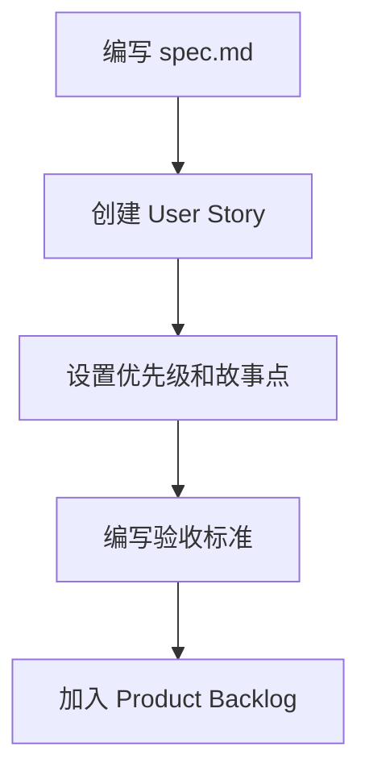
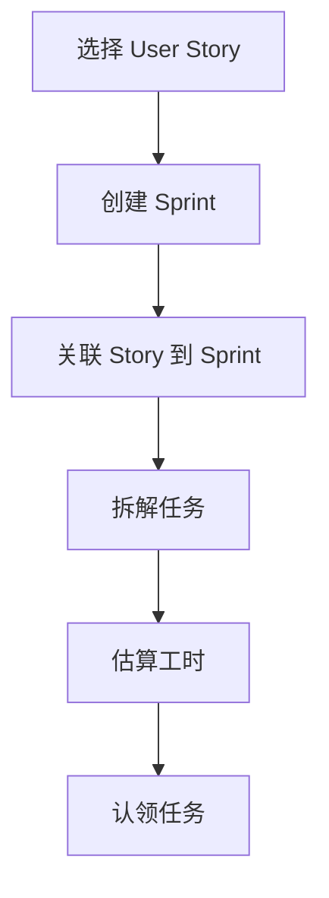
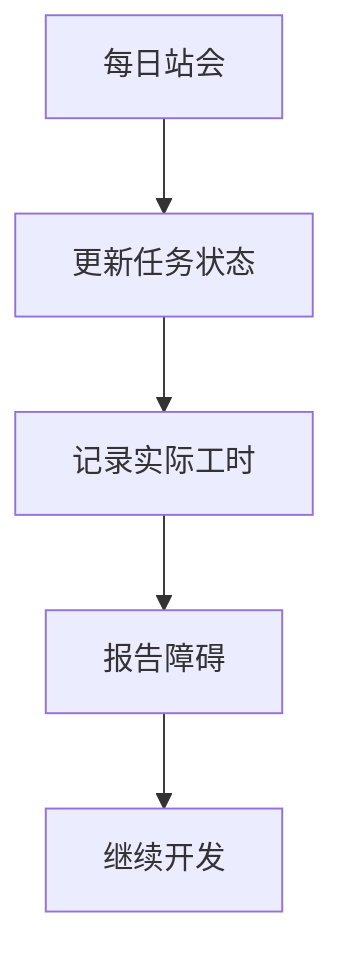
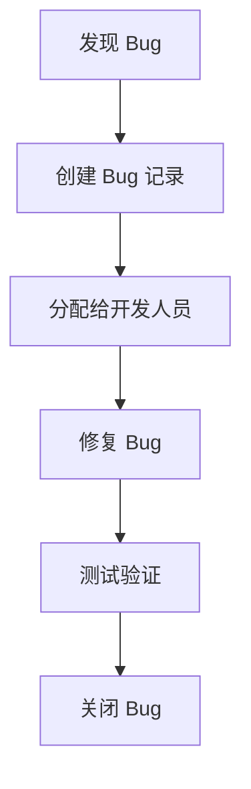
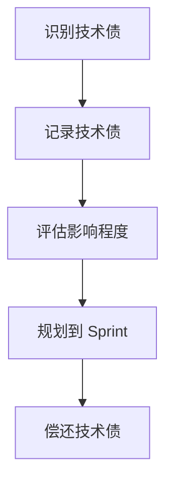

# Scrum 工作流指南

**@spec T004-lark-project-management**

**版本**: 1.0.0
**日期**: 2025-12-31
**适用团队**: Cinema Business Center Platform 开发团队

---

## 📋 目录

1. [Scrum 角色](#scrum-角色)
2. [Scrum 仪式](#scrum-仪式)
3. [工作流程](#工作流程)
4. [飞书多维表格操作指南](#飞书多维表格操作指南)
5. [最佳实践](#最佳实践)
6. [常见问题](#常见问题)

---

## 🎭 Scrum 角色

### Product Owner (产品负责人)

**职责**:
- 管理 Product Backlog (产品待办列表)
- 定义 User Story 的优先级
- 编写验收标准 (Acceptance Criteria)
- 参与 Sprint Planning 和 Sprint Review

**飞书操作**:
- 在"产品待办列表"表中创建 Epic/User Story
- 设置优先级 (P0-P3) 和故事点
- 编写验收标准和描述
- 将待办项分配到 Sprint

### Scrum Master

**职责**:
- 组织 Scrum 仪式 (Planning, Daily Standup, Review, Retrospective)
- 移除团队障碍
- 管理 Sprint 进度
- 维护燃尽图

**飞书操作**:
- 在"迭代 (Sprint)"表中创建新 Sprint
- 监控 Sprint 完成率
- 更新 Sprint 状态
- 跟踪团队速率

### Development Team (开发团队)

**职责**:
- 完成 Sprint Backlog 中的任务
- 参与每日站会
- 报告 Bug 和技术债
- 进行测试和代码审查

**飞书操作**:
- 在"任务 (Task)"表中创建和更新任务
- 在"缺陷 (Bug)"表中报告 Bug
- 在"技术债 (Technical Debt)"表中记录技术债
- 更新任务状态和工时

---

## 🔄 Scrum 仪式

### 1. Sprint Planning (迭代计划会)

**时间**: 每个 Sprint 开始时
**时长**: 2-4 小时 (2 周 Sprint)
**参与者**: 全体 Scrum Team

#### 会议流程

**Part 1: 确定 Sprint 目标** (1 小时)
1. Product Owner 讲解优先级最高的 User Story
2. 团队讨论并确定本 Sprint 要完成的目标
3. 记录 Sprint Goal

**Part 2: 任务拆解** (1-3 小时)
1. 团队将选定的 User Story 拆解为具体任务
2. 估算每个任务的工时
3. 团队成员认领任务

#### 飞书操作步骤

```
1. 打开"产品待办列表"表
2. 筛选状态 = "📝 待规划" 的 User Story
3. 按优先级排序，选择本 Sprint 要完成的 Story
4. 打开"迭代 (Sprint)"表
5. 创建新 Sprint:
   - Sprint 名称: "Sprint 24 (2025-01)"
   - 开始日期: 2025-01-01
   - 结束日期: 2025-01-14
   - Sprint 目标: "完成库存管理核心功能"
   - 状态: "📝 规划中"
6. 在"产品待办列表"表中，将选定的 Story 关联到新 Sprint
7. 更新 Story 状态为 "🎯 已规划"
8. 在"任务 (Task)"表中，为每个 Story 创建具体任务
9. 更新 Sprint 状态为 "🚀 进行中"
```

---

### 2. Daily Standup (每日站会)

**时间**: 每天早上 (如 9:30 AM)
**时长**: 15 分钟
**参与者**: Development Team

#### 三个问题

每个成员回答：
1. **昨天完成了什么？**
2. **今天计划做什么？**
3. **遇到了什么阻碍？**

#### 飞书操作步骤

```
1. 打开"任务 (Task)"表
2. 筛选当前 Sprint + 负责人 = 自己
3. 查看任务状态:
   - ✅ 已完成: 昨天完成的任务
   - 🚀 进行中: 今天继续的任务
   - 📝 待办: 今天计划开始的任务
4. 更新任务状态和实际工时
5. 如有阻碍，在任务备注中记录
```

---

### 3. Sprint Review (迭代评审)

**时间**: Sprint 结束前 1 天
**时长**: 1-2 小时
**参与者**: 全体 Scrum Team + 利益相关方

#### 会议流程

1. **演示完成的功能** (30 分钟)
   - 展示已完成的 User Story
   - 实际操作产品功能
   - 验证验收标准

2. **收集反馈** (30 分钟)
   - 利益相关方提出建议
   - Product Owner 确认是否接受

3. **更新 Product Backlog** (30 分钟)
   - 根据反馈调整优先级
   - 添加新的需求

#### 飞书操作步骤

```
1. 打开"产品待办列表"表
2. 筛选当前 Sprint 的 Story
3. 逐个检查验收标准是否满足
4. 更新 Story 状态:
   - ✅ 已完成: 验收通过
   - 🚀 开发中: 未完成，继续下个 Sprint
5. 打开"迭代 (Sprint)"表
6. 更新 Sprint 完成故事点
7. 计算完成率
```

---

### 4. Sprint Retrospective (迭代回顾)

**时间**: Sprint Review 之后
**时长**: 1 小时
**参与者**: Scrum Team

#### 回顾内容

1. **做得好的地方** (What went well)
2. **需要改进的地方** (What could be improved)
3. **行动计划** (Action items)

#### 飞书操作步骤

```
1. 打开"迭代 (Sprint)"表
2. 查看 Sprint 数据:
   - 总故事点
   - 完成故事点
   - 完成率
3. 打开"任务 (Task)"表
4. 统计数据:
   - 总任务数
   - 完成任务数
   - 预估工时 vs 实际工时
5. 打开"缺陷 (Bug)"表
6. 统计本 Sprint 发现的 Bug 数量和严重程度
7. 更新 Sprint 状态为 "✅ 已完成"
8. 记录团队速率 (Velocity = 完成故事点)
```

---

## 🔧 工作流程

### 流程 1: 从 spec.md 创建 User Story



#### 详细步骤

1. **在 specs/ 目录创建规格文档**
   ```bash
   mkdir -p specs/I006-inventory-adjustment
   cd specs/I006-inventory-adjustment
   touch spec.md
   ```

2. **打开"产品待办列表"表**

3. **创建新记录**
   - 标题: `[I006] 库存调整功能`
   - 类型: `User Story`
   - 优先级: `🟡 P2`
   - 状态: `📝 待规划`
   - 故事点: `5`
   - 负责人: 选择 Product Owner
   - spec_id: `I006`
   - 验收标准:
     ```
     1. 用户可以查看库存调整记录
     2. 用户可以创建新的库存调整单
     3. 支持盘盈、盘亏、报损三种调整类型
     4. 调整需要审批流程
     5. 调整后库存实时更新
     ```
   - 描述:
     ```
     作为仓库管理员，我想要进行库存调整，以便准确反映实际库存情况。

     场景：
     - 定期盘点发现实际库存与系统库存不一致
     - 商品破损需要报损处理
     - 系统初始化时需要录入期初库存
     ```
   - 业务价值: `80`

4. **保存记录**

---

### 流程 2: Sprint Planning 规划任务



#### 详细步骤

1. **创建 Sprint**
   - 打开"迭代 (Sprint)"表
   - 创建新记录:
     - Sprint 名称: `Sprint 24 (2025-01-01 ~ 2025-01-14)`
     - 开始日期: `2025/01/01`
     - 结束日期: `2025/01/14`
     - Sprint 目标: `完成库存调整功能和库存查询优化`
     - 状态: `📝 规划中`
     - 总故事点: `13` (手动计算)
     - 完成故事点: `0`
     - 完成率: `0`

2. **关联 User Story 到 Sprint**
   - 打开"产品待办列表"表
   - 选择要规划的 Story (如 I006)
   - 在 Sprint 字段选择刚创建的 Sprint
   - 更新状态为 `🎯 已规划`

3. **拆解任务**
   - 打开"任务 (Task)"表
   - 为 I006 创建任务:

   **任务 1: 设计数据库表结构**
   - 任务标题: `[I006] 设计库存调整表结构`
   - User Story: 选择 I006
   - 状态: `📝 待办`
   - 负责人: 张三
   - 优先级: `🔴 高`
   - 预估工时: `4`
   - Sprint: 选择当前 Sprint
   - spec_id: `I006`
   - 标签: `Backend`

   **任务 2: 实现后端 API**
   - 任务标题: `[I006] 实现库存调整 CRUD API`
   - User Story: 选择 I006
   - 状态: `📝 待办`
   - 负责人: 张三
   - 优先级: `🔴 高`
   - 预估工时: `8`
   - Sprint: 选择当前 Sprint
   - spec_id: `I006`
   - 标签: `Backend`

   **任务 3: 实现前端页面**
   - 任务标题: `[I006] 实现库存调整前端页面`
   - User Story: 选择 I006
   - 状态: `📝 待办`
   - 负责人: 李四
   - 优先级: `🟡 中`
   - 预估工时: `12`
   - Sprint: 选择当前 Sprint
   - spec_id: `I006`
   - 标签: `Frontend`

   **任务 4: 编写单元测试**
   - 任务标题: `[I006] 编写库存调整单元测试`
   - User Story: 选择 I006
   - 状态: `📝 待办`
   - 负责人: 王五
   - 优先级: `🟢 低`
   - 预估工时: `6`
   - Sprint: 选择当前 Sprint
   - spec_id: `I006`
   - 标签: `Test`

4. **启动 Sprint**
   - 返回"迭代 (Sprint)"表
   - 更新 Sprint 状态为 `🚀 进行中`

---

### 流程 3: 日常任务更新



#### 详细步骤

1. **开始任务**
   - 打开"任务 (Task)"表
   - 找到自己认领的任务
   - 更新状态为 `🚀 进行中`

2. **完成开发**
   - 提交代码到 Git
   - 更新状态为 `🧪 测试中`

3. **测试通过**
   - 更新状态为 `✅ 已完成`
   - 填写实际工时 (如 `10`)
   - 填写完成时间 (如 `2025/01/05`)

4. **遇到障碍**
   - 在任务备注中记录障碍
   - 每日站会中提出
   - Scrum Master 协助解决

---

### 流程 4: Bug 管理



#### 详细步骤

1. **报告 Bug**
   - 打开"缺陷 (Bug)"表
   - 创建新记录:
     - Bug 标题: `[I003] 库存查询筛选条件无效`
     - 严重程度: `🟠 High`
     - 状态: `📝 待修复`
     - 报告人: 选择自己
     - 负责人: 留空 (待分配)
     - 关联 Story: 选择 I003
     - Sprint: 选择当前 Sprint
     - 发现环境: `Test`
     - spec_id: `I003`
     - 复现步骤:
       ```
       1. 打开库存查询页面
       2. 选择门店筛选条件
       3. 点击查询按钮
       4. 实际: 筛选条件未生效，显示所有门店数据
       5. 期望: 只显示选定门店的数据
       ```

2. **分配 Bug**
   - Scrum Master 或 Tech Lead 分配负责人
   - 更新负责人字段

3. **修复 Bug**
   - 开发人员更新状态为 `🚀 修复中`
   - 修复代码并提交

4. **测试验证**
   - QA 或报告人验证修复
   - 更新状态为 `🧪 待验证`

5. **关闭 Bug**
   - 验证通过后更新状态为 `✅ 已关闭`

---

### 流程 5: 技术债管理



#### 详细步骤

1. **记录技术债**
   - 打开"技术债 (Technical Debt)"表
   - 创建新记录:
     - 债务标题: `库存模块缺少单元测试覆盖`
     - 类型: `代码质量`
     - 影响程度: `🔴 High`
     - 状态: `📝 待处理`
     - 负责人: 张三
     - 预估工时: `16`
     - Sprint: 留空 (待规划)
     - spec_id: `I003`
     - 影响范围: `库存查询、库存调整、库存台账三个模块`

2. **优先级评估**
   - Product Owner 和 Tech Lead 讨论
   - 决定何时偿还技术债

3. **规划到 Sprint**
   - 在 Sprint Planning 时
   - 将技术债关联到 Sprint
   - 更新状态为 `🚀 进行中`

4. **偿还技术债**
   - 开发人员完成工作
   - 更新状态为 `✅ 已完成`
   - 填写实际工时

---

## 📊 飞书多维表格操作指南

### 常用视图

#### 产品待办列表

**视图 1: 按优先级排序**
- 筛选条件: 状态 ≠ "✅ 已完成" AND 状态 ≠ "❌ 已废弃"
- 排序: 优先级 (升序) → 业务价值 (降序)

**视图 2: 当前 Sprint**
- 筛选条件: Sprint = "当前 Sprint" AND 状态 ≠ "❌ 已废弃"
- 分组: 状态

**视图 3: 按模块分组**
- 筛选条件: 状态 ≠ "❌ 已废弃"
- 分组: spec_id (前缀,如 I、P、S)

#### 任务 (Task)

**视图 1: 我的任务**
- 筛选条件: 负责人 = "我" AND 状态 ≠ "✅ 已完成"
- 排序: 优先级 (升序) → 创建时间 (升序)

**视图 2: 当前 Sprint 任务**
- 筛选条件: Sprint = "当前 Sprint"
- 分组: 状态
- 排序: 优先级 (升序)

**视图 3: 看板视图**
- 分组: 状态
- 卡片字段: 任务标题、负责人、优先级、预估工时

#### 缺陷 (Bug)

**视图 1: 待修复 Bug**
- 筛选条件: 状态 = "📝 待修复" OR 状态 = "🚀 修复中"
- 排序: 严重程度 (升序) → 创建时间 (升序)

**视图 2: 按严重程度分组**
- 分组: 严重程度
- 排序: 创建时间 (降序)

---

## 💡 最佳实践

### 1. User Story 编写原则 (INVEST)

- **I**ndependent (独立): Story 之间相互独立
- **N**egotiable (可协商): 细节可以讨论调整
- **V**aluable (有价值): 必须为用户/业务带来价值
- **E**stimable (可估算): 能够估算故事点
- **S**mall (小): 能在一个 Sprint 内完成
- **T**estable (可测试): 有明确的验收标准

**示例 (好的 User Story)**:
```
标题: [I006] 库存调整功能
描述: 作为仓库管理员，我想要进行库存调整，以便准确反映实际库存情况。
验收标准:
1. 用户可以创建盘盈、盘亏、报损三种类型的调整单
2. 调整单需要经过审批流程
3. 审批通过后库存实时更新
4. 用户可以查看调整历史记录
```

**示例 (不好的 User Story)**:
```
标题: 库存管理
描述: 完成库存相关功能
验收标准: 无
```

---

### 2. 故事点估算 (Planning Poker)

使用斐波那契数列: **1, 2, 3, 5, 8, 13, 21**

| 故事点 | 复杂度 | 工时参考 | 示例 |
|--------|--------|---------|------|
| 1 | 极简单 | 0.5-1 天 | 修改文案、调整样式 |
| 2 | 简单 | 1-2 天 | 新增简单表单页面 |
| 3 | 中等 | 2-3 天 | 新增 CRUD 页面 |
| 5 | 较复杂 | 3-5 天 | 带审批流程的功能 |
| 8 | 复杂 | 5-8 天 | 复杂业务逻辑 + 多表关联 |
| 13 | 非常复杂 | 8-13 天 | 大型功能模块 |
| 21 | 需要拆分 | >13 天 | 应拆分为多个 Story |

**估算建议**:
- 如果估算结果 ≥ 21，说明 Story 太大，需要拆分
- 团队一起估算，使用 Planning Poker 达成共识
- 参考历史数据调整估算

---

### 3. Sprint 时长建议

| 团队规模 | 建议 Sprint 时长 | 原因 |
|---------|----------------|------|
| 3-5 人 | 2 周 | 平衡反馈速度和开发节奏 |
| 6-9 人 | 2 周 | 标准 Scrum 推荐时长 |
| 10+ 人 | 1 周 | 减少协调成本，快速反馈 |

**Cinema Business Center Platform 团队建议**: **2 周 Sprint**

---

### 4. Definition of Done (DoD)

所有任务完成前必须满足:

- [ ] 代码已提交到 Git 并合并到主分支
- [ ] 单元测试覆盖率 ≥ 80%
- [ ] 代码通过 ESLint/Prettier 检查
- [ ] 代码已经过 Code Review
- [ ] 功能已部署到测试环境
- [ ] 功能已通过 QA 测试
- [ ] 文档已更新 (API 文档、用户手册)
- [ ] `@spec` 标识已添加到代码中

---

### 5. 团队速率 (Velocity) 跟踪

每个 Sprint 结束后记录团队速率:

| Sprint | 规划故事点 | 完成故事点 | 完成率 | 速率 |
|--------|----------|-----------|--------|------|
| Sprint 22 | 18 | 15 | 83% | 15 |
| Sprint 23 | 20 | 18 | 90% | 18 |
| Sprint 24 | 21 | 21 | 100% | 21 |
| **平均** | - | - | **91%** | **18** |

**使用速率规划**:
- 下个 Sprint 规划故事点不应超过平均速率的 120%
- 新团队前 3 个 Sprint 数据不稳定，第 4 个 Sprint 后趋于稳定

---

## ❓ 常见问题

### Q1: Sprint 中间可以加新需求吗？

**A**: 原则上不可以。Sprint 开始后 Sprint Backlog 应保持稳定。

**例外情况**:
- 生产环境紧急 Bug (Critical/High)
- 业务方强制要求的紧急需求

**处理方式**:
1. 评估新需求影响
2. 如需加入，必须移除等量故事点的其他任务
3. 更新 Sprint Backlog 并通知团队

---

### Q2: 任务预估工时和实际工时差异很大怎么办？

**A**: 这是正常现象，通过以下方式改进:

1. **在 Sprint Retrospective 中讨论**
   - 分析偏差原因 (技术难度、需求变更、环境问题)
   - 总结经验教训

2. **调整估算方法**
   - 参考历史数据
   - 增加缓冲时间

3. **拆分任务粒度**
   - 大任务拆分为更小的子任务
   - 单个任务不超过 16 小时

---

### Q3: Bug 修复算不算完成故事点？

**A**: 不算。

- **Story 的 Bug**: 不算完成，Story 继续为"开发中"
- **历史 Bug**: 作为技术债处理，不计入故事点

**原因**: 故事点衡量的是"交付价值"，Bug 修复是"质量保证"。

---

### Q4: 技术债什么时候偿还？

**A**: 建议策略:

- **每个 Sprint 预留 20% 容量处理技术债**
  - 例如: Sprint 总容量 20 故事点，预留 4 故事点给技术债

- **优先级评估**:
  - 🔴 High 影响: 下个 Sprint 必须处理
  - 🟡 Medium 影响: 3 个 Sprint 内处理
  - 🟢 Low 影响: 根据团队容量安排

---

### Q5: 如何处理跨 Sprint 的大型 Epic？

**A**: Epic 拆分策略:

1. **纵向切片 (Vertical Slice)**
   - 按用户价值拆分
   - 每个 Story 都能独立交付价值

2. **示例: 库存管理 Epic**
   ```
   Epic: 库存管理系统
   ├── Story 1: 库存查询 (5 points) → Sprint 22
   ├── Story 2: 库存调整 (8 points) → Sprint 23
   ├── Story 3: 库存台账 (5 points) → Sprint 23
   └── Story 4: 库存预警 (3 points) → Sprint 24
   ```

3. **跟踪 Epic 进度**
   - 在"产品待办列表"表中创建 Epic 类型记录
   - 子 Story 关联到 Epic (通过 spec_id 或描述)

---

## 📚 参考资料

- [Scrum Guide (官方指南)](https://scrumguides.org/)
- [Agile Manifesto (敏捷宣言)](https://agilemanifesto.org/)
- [User Story Mapping (用户故事地图)](https://www.jpattonassociates.com/user-story-mapping/)
- [Planning Poker (计划扑克)](https://www.planningpoker.com/)

---

## 📝 附录: 快速参考卡

### Scrum 仪式时间表 (2 周 Sprint)

| 仪式 | 时间 | 时长 | 参与者 |
|-----|------|------|--------|
| Sprint Planning | Sprint 开始日 9:00 AM | 2-4 小时 | 全员 |
| Daily Standup | 每天 9:30 AM | 15 分钟 | Dev Team |
| Sprint Review | Sprint 最后一天 2:00 PM | 1-2 小时 | 全员 + 利益相关方 |
| Sprint Retrospective | Sprint Review 后 | 1 小时 | Scrum Team |

### 飞书表操作快捷键

| 操作 | 快捷键 |
|-----|--------|
| 创建新记录 | `Ctrl + N` (Windows) / `Cmd + N` (Mac) |
| 搜索记录 | `Ctrl + F` (Windows) / `Cmd + F` (Mac) |
| 筛选 | `Ctrl + Shift + F` |
| 排序 | 点击列标题 |
| 分组 | 拖拽列标题到分组区域 |

---

**文档版本**: 1.0.0
**最后更新**: 2025-12-31
**维护者**: Scrum Master
**反馈**: 如有问题或建议，请在飞书群中讨论
