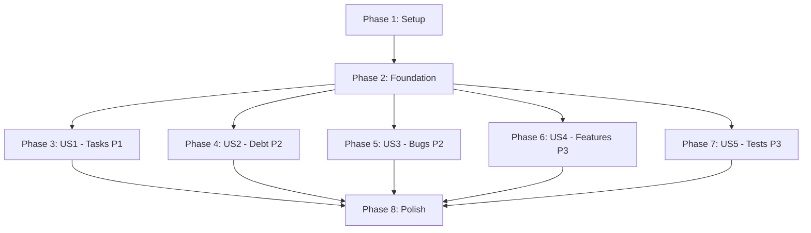

# Tasks: Lark MCP 项目管理系统

**Input**: Design documents from `/specs/T004-lark-project-management/`
**Prerequisites**: plan.md ✅, spec.md ✅, research.md ✅, data-model.md ✅, contracts/lark-mcp-api.md ✅, quickstart.md ✅

**Tests**: 本规格要求测试驱动开发 (TDD),关键业务流程测试覆盖率 100%

**Organization**: Tasks are grouped by user story to enable independent implementation and testing of each story.

## Format: `[ID] [P?] [Story] Description`

- **[P]**: Can run in parallel (different files, no dependencies)
- **[Story]**: Which user story this task belongs to (e.g., US1, US2, US3)
- Include exact file paths in descriptions

## Path Conventions

Claude Code skill 项目结构:
- Skill root: `.claude/skills/lark-pm/`
- Source code: `.claude/skills/lark-pm/src/`
- Tests: `.claude/skills/lark-pm/tests/`

---

## Phase 1: Setup (Shared Infrastructure)

**Purpose**: 项目初始化和基础结构

- [ ] T001 Create skill directory structure at .claude/skills/lark-pm/ per plan.md
- [ ] T002 Initialize TypeScript project with package.json and tsconfig.json in .claude/skills/lark-pm/
- [ ] T003 [P] Configure ESLint and Prettier in .claude/skills/lark-pm/.eslintrc.json and .prettierrc
- [ ] T004 [P] Install primary dependencies: commander, chalk, ora, zod, pino in .claude/skills/lark-pm/package.json
- [ ] T005 [P] Install development dependencies: vitest, @types/node, typescript in .claude/skills/lark-pm/package.json
- [ ] T006 Create skill.md with YAML frontmatter (name: lark-pm, description with Chinese/English keywords) at .claude/skills/lark-pm/skill.md
- [ ] T007 [P] Create environment configuration file .env.example with LARK_APP_ID, LARK_APP_SECRET, LARK_USER_ACCESS_TOKEN placeholders
- [ ] T008 [P] Create .gitignore to exclude .env, node_modules, dist, config.json at .claude/skills/lark-pm/.gitignore

---

## Phase 2: Foundational (Blocking Prerequisites)

**Purpose**: 核心基础设施,所有用户故事的前置依赖

**⚠️ CRITICAL**: No user story work can begin until this phase is complete

### 2.1 配置与日志基础设施

- [ ] T009 [P] Create Lark configuration module in .claude/skills/lark-pm/src/config/lark-config.ts
- [ ] T010 [P] Create structured logger with pino in .claude/skills/lark-pm/src/utils/logger.ts
- [ ] T011 [P] Create config.json manager in .claude/skills/lark-pm/src/config/config-manager.ts

### 2.2 数据模型定义 (所有实体共享)

- [ ] T012 [P] Define Task model with Zod schema in .claude/skills/lark-pm/src/models/task.ts
- [ ] T013 [P] Define TechnicalDebt model with Zod schema in .claude/skills/lark-pm/src/models/debt.ts
- [ ] T014 [P] Define Bug model with Zod schema in .claude/skills/lark-pm/src/models/bug.ts
- [ ] T015 [P] Define FeatureModule model with Zod schema in .claude/skills/lark-pm/src/models/feature.ts
- [ ] T016 [P] Define TestRecord model with Zod schema in .claude/skills/lark-pm/src/models/test-record.ts

### 2.3 飞书 API 客户端基础

- [ ] T017 [P] Define Lark API types in .claude/skills/lark-pm/src/types/lark-api.ts
- [ ] T018 Create Lark API client wrapper with error handling in .claude/skills/lark-pm/src/lark/client.ts
- [ ] T019 Create retry utility with exponential backoff (1s, 2s, 4s) in .claude/skills/lark-pm/src/utils/retry.ts
- [ ] T020 [P] Create input validator utility with Zod in .claude/skills/lark-pm/src/utils/validator.ts

### 2.4 基础设施测试

- [ ] T021 [P] Unit test for retry logic in .claude/skills/lark-pm/tests/utils/retry.test.ts
- [ ] T022 [P] Unit test for logger in .claude/skills/lark-pm/tests/utils/logger.test.ts
- [ ] T023 [P] Unit test for Zod schemas in .claude/skills/lark-pm/tests/models/schemas.test.ts
- [ ] T024 [P] Unit test for config manager in .claude/skills/lark-pm/tests/config/config-manager.test.ts

**Checkpoint**: Foundation ready - user story implementation can now begin in parallel

---

## Phase 3: User Story 1 - 工作任务跟踪 (Priority: P1) 🎯 MVP

**Goal**: 实现任务的创建、更新、查询和筛选功能,作为项目管理的核心能力

**Independent Test**: 通过 `/lark-pm init`, `/lark-pm task-create`, `/lark-pm task-list`, `/lark-pm task-update` 命令验证完整的任务生命周期

### Tests for User Story 1 (TDD: Write tests FIRST) ⚠️

- [ ] T025 [P] [US1] Unit test for Task model validation in .claude/skills/lark-pm/tests/models/task.test.ts
- [ ] T026 [P] [US1] Unit test for task field mapping functions in .claude/skills/lark-pm/tests/lark/task-mapper.test.ts
- [ ] T027 [P] [US1] Integration test for task-create command in .claude/skills/lark-pm/tests/commands/task-create.test.ts
- [ ] T028 [P] [US1] Integration test for task-list command in .claude/skills/lark-pm/tests/commands/task-list.test.ts
- [ ] T029 [P] [US1] Integration test for task-update command in .claude/skills/lark-pm/tests/commands/task-update.test.ts

### Implementation for User Story 1

#### Lark MCP Integration for Tasks

- [ ] T030 [P] [US1] Implement Base App management (create, list) in .claude/skills/lark-pm/src/lark/base-app.ts
- [ ] T031 [US1] Implement Task table creation with field definitions in .claude/skills/lark-pm/src/lark/table.ts
- [ ] T032 [US1] Implement Task record CRUD operations in .claude/skills/lark-pm/src/lark/record.ts
- [ ] T033 [P] [US1] Create task-to-lark-fields mapping in .claude/skills/lark-pm/src/lark/mappers/task-mapper.ts

#### CLI Commands for Tasks

- [ ] T034 [US1] Implement init command (create Base App + Task table) in .claude/skills/lark-pm/src/commands/init.ts
- [ ] T035 [P] [US1] Implement task-create command with validation in .claude/skills/lark-pm/src/commands/task-create.ts
- [ ] T036 [P] [US1] Implement task-list command with filtering in .claude/skills/lark-pm/src/commands/task-list.ts
- [ ] T037 [P] [US1] Implement task-update command in .claude/skills/lark-pm/src/commands/task-update.ts
- [ ] T038 [P] [US1] Implement task-delete command with confirmation in .claude/skills/lark-pm/src/commands/task-delete.ts

#### Main Entry Point

- [ ] T039 [US1] Create main CLI entry point with Commander in .claude/skills/lark-pm/index.ts
- [ ] T040 [US1] Register task commands in main entry point .claude/skills/lark-pm/index.ts
- [ ] T041 [US1] Add help text and version info in .claude/skills/lark-pm/index.ts

**Checkpoint**: At this point, User Story 1 should be fully functional - `/lark-pm` skill can manage tasks end-to-end

---

## Phase 4: User Story 2 - 技术债记录与管理 (Priority: P2)

**Goal**: 实现技术债的记录、跟踪和解决流程

**Independent Test**: 通过 `/lark-pm debt-create`, `/lark-pm debt-list`, `/lark-pm debt-update` 命令验证技术债管理功能

### Tests for User Story 2 (TDD: Write tests FIRST) ⚠️

- [ ] T042 [P] [US2] Unit test for TechnicalDebt model validation in .claude/skills/lark-pm/tests/models/debt.test.ts
- [ ] T043 [P] [US2] Unit test for debt field mapping functions in .claude/skills/lark-pm/tests/lark/debt-mapper.test.ts
- [ ] T044 [P] [US2] Integration test for debt-create command in .claude/skills/lark-pm/tests/commands/debt-create.test.ts
- [ ] T045 [P] [US2] Integration test for debt-list command in .claude/skills/lark-pm/tests/commands/debt-list.test.ts
- [ ] T046 [P] [US2] Integration test for debt-update command in .claude/skills/lark-pm/tests/commands/debt-update.test.ts

### Implementation for User Story 2

#### Lark MCP Integration for Technical Debt

- [ ] T047 [US2] Extend init command to create TechnicalDebt table in .claude/skills/lark-pm/src/commands/init.ts
- [ ] T048 [P] [US2] Create debt-to-lark-fields mapping in .claude/skills/lark-pm/src/lark/mappers/debt-mapper.ts
- [ ] T049 [P] [US2] Implement debt record CRUD operations in .claude/skills/lark-pm/src/lark/record.ts

#### CLI Commands for Technical Debt

- [ ] T050 [P] [US2] Implement debt-create command with severity validation in .claude/skills/lark-pm/src/commands/debt-create.ts
- [ ] T051 [P] [US2] Implement debt-list command with filtering by severity/status in .claude/skills/lark-pm/src/commands/debt-list.ts
- [ ] T052 [P] [US2] Implement debt-update command in .claude/skills/lark-pm/src/commands/debt-update.ts
- [ ] T053 [P] [US2] Implement debt-delete command in .claude/skills/lark-pm/src/commands/debt-delete.ts

#### Integration with Tasks

- [ ] T054 [US2] Add task-debt association logic in .claude/skills/lark-pm/src/commands/debt-create.ts
- [ ] T055 [US2] Register debt commands in main entry point .claude/skills/lark-pm/index.ts

**Checkpoint**: At this point, User Stories 1 AND 2 should both work independently

---

## Phase 5: User Story 3 - Bug 记录与跟踪 (Priority: P2)

**Goal**: 实现 Bug 的发现、记录、修复和验证流程

**Independent Test**: 通过 `/lark-pm bug-create`, `/lark-pm bug-list`, `/lark-pm bug-update` 命令验证 Bug 管理功能

### Tests for User Story 3 (TDD: Write tests FIRST) ⚠️

- [ ] T056 [P] [US3] Unit test for Bug model validation in .claude/skills/lark-pm/tests/models/bug.test.ts
- [ ] T057 [P] [US3] Unit test for bug field mapping functions in .claude/skills/lark-pm/tests/lark/bug-mapper.test.ts
- [ ] T058 [P] [US3] Integration test for bug-create command in .claude/skills/lark-pm/tests/commands/bug-create.test.ts
- [ ] T059 [P] [US3] Integration test for bug-list command in .claude/skills/lark-pm/tests/commands/bug-list.test.ts
- [ ] T060 [P] [US3] Integration test for bug-update command in .claude/skills/lark-pm/tests/commands/bug-update.test.ts

### Implementation for User Story 3

#### Lark MCP Integration for Bugs

- [ ] T061 [US3] Extend init command to create Bug table in .claude/skills/lark-pm/src/commands/init.ts
- [ ] T062 [P] [US3] Create bug-to-lark-fields mapping in .claude/skills/lark-pm/src/lark/mappers/bug-mapper.ts
- [ ] T063 [P] [US3] Implement bug record CRUD operations in .claude/skills/lark-pm/src/lark/record.ts

#### CLI Commands for Bugs

- [ ] T064 [P] [US3] Implement bug-create command with repro steps validation in .claude/skills/lark-pm/src/commands/bug-create.ts
- [ ] T065 [P] [US3] Implement bug-list command with filtering by severity/status in .claude/skills/lark-pm/src/commands/bug-list.ts
- [ ] T066 [P] [US3] Implement bug-update command with status flow validation in .claude/skills/lark-pm/src/commands/bug-update.ts
- [ ] T067 [P] [US3] Implement bug-delete command in .claude/skills/lark-pm/src/commands/bug-delete.ts

#### Bug Statistics

- [ ] T068 [US3] Implement bug statistics command in .claude/skills/lark-pm/src/commands/bug-stats.ts
- [ ] T069 [US3] Register bug commands in main entry point .claude/skills/lark-pm/index.ts

**Checkpoint**: All three core user stories (Tasks, Debt, Bugs) should now be independently functional

---

## Phase 6: User Story 4 - 产品功能矩阵维护 (Priority: P3)

**Goal**: 实现产品功能模块的记录和状态跟踪

**Independent Test**: 通过 `/lark-pm feature-create`, `/lark-pm feature-list`, `/lark-pm feature-update` 命令验证功能矩阵管理

### Tests for User Story 4 (TDD: Write tests FIRST) ⚠️

- [ ] T070 [P] [US4] Unit test for FeatureModule model validation in .claude/skills/lark-pm/tests/models/feature.test.ts
- [ ] T071 [P] [US4] Unit test for feature field mapping functions in .claude/skills/lark-pm/tests/lark/feature-mapper.test.ts
- [ ] T072 [P] [US4] Integration test for feature-create command in .claude/skills/lark-pm/tests/commands/feature-create.test.ts
- [ ] T073 [P] [US4] Integration test for feature-list command in .claude/skills/lark-pm/tests/commands/feature-list.test.ts

### Implementation for User Story 4

#### Lark MCP Integration for Features

- [ ] T074 [US4] Extend init command to create Features table in .claude/skills/lark-pm/src/commands/init.ts
- [ ] T075 [P] [US4] Create feature-to-lark-fields mapping in .claude/skills/lark-pm/src/lark/mappers/feature-mapper.ts
- [ ] T076 [P] [US4] Implement feature record CRUD operations in .claude/skills/lark-pm/src/lark/record.ts

#### CLI Commands for Features

- [ ] T077 [P] [US4] Implement feature-create command with module validation in .claude/skills/lark-pm/src/commands/feature-create.ts
- [ ] T078 [P] [US4] Implement feature-list command with filtering by module/status in .claude/skills/lark-pm/src/commands/feature-list.ts
- [ ] T079 [P] [US4] Implement feature-update command in .claude/skills/lark-pm/src/commands/feature-update.ts
- [ ] T080 [US4] Register feature commands in main entry point .claude/skills/lark-pm/index.ts

**Checkpoint**: Product feature matrix management is functional

---

## Phase 7: User Story 5 - 测试记录管理 (Priority: P3)

**Goal**: 实现测试计划、测试用例执行和测试覆盖率跟踪

**Independent Test**: 通过 `/lark-pm test-create`, `/lark-pm test-list`, `/lark-pm test-update` 命令验证测试记录管理

### Tests for User Story 5 (TDD: Write tests FIRST) ⚠️

- [ ] T081 [P] [US5] Unit test for TestRecord model validation in .claude/skills/lark-pm/tests/models/test-record.test.ts
- [ ] T082 [P] [US5] Unit test for test-record field mapping functions in .claude/skills/lark-pm/tests/lark/test-mapper.test.ts
- [ ] T083 [P] [US5] Integration test for test-create command in .claude/skills/lark-pm/tests/commands/test-create.test.ts
- [ ] T084 [P] [US5] Integration test for test-list command in .claude/skills/lark-pm/tests/commands/test-list.test.ts

### Implementation for User Story 5

#### Lark MCP Integration for Test Records

- [ ] T085 [US5] Extend init command to create TestRecords table in .claude/skills/lark-pm/src/commands/init.ts
- [ ] T086 [P] [US5] Create test-record-to-lark-fields mapping in .claude/skills/lark-pm/src/lark/mappers/test-mapper.ts
- [ ] T087 [P] [US5] Implement test record CRUD operations in .claude/skills/lark-pm/src/lark/record.ts

#### CLI Commands for Test Records

- [ ] T088 [P] [US5] Implement test-create command with test type validation in .claude/skills/lark-pm/src/commands/test-create.ts
- [ ] T089 [P] [US5] Implement test-list command with filtering by type/status in .claude/skills/lark-pm/src/commands/test-list.ts
- [ ] T090 [P] [US5] Implement test-update command in .claude/skills/lark-pm/src/commands/test-update.ts

#### Test Coverage Reporting

- [ ] T091 [US5] Implement test coverage report command in .claude/skills/lark-pm/src/commands/test-coverage.ts
- [ ] T092 [US5] Register test commands in main entry point .claude/skills/lark-pm/index.ts

**Checkpoint**: All five user stories should now be independently functional

---

## Phase 8: Polish & Cross-Cutting Concerns

**Purpose**: 完善系统的跨领域功能和用户体验

### 8.1 数据导出功能

- [ ] T093 [P] Create Excel export utility with xlsx in .claude/skills/lark-pm/src/utils/export/excel-exporter.ts
- [ ] T094 [P] Create CSV export utility with json2csv in .claude/skills/lark-pm/src/utils/export/csv-exporter.ts
- [ ] T095 [P] Create JSON export utility in .claude/skills/lark-pm/src/utils/export/json-exporter.ts
- [ ] T096 Implement export command with format selection in .claude/skills/lark-pm/src/commands/export.ts
- [ ] T097 [P] Unit test for Excel export in .claude/skills/lark-pm/tests/utils/export/excel-exporter.test.ts
- [ ] T098 [P] Unit test for CSV export in .claude/skills/lark-pm/tests/utils/export/csv-exporter.test.ts

### 8.2 通知功能 (FR-013)

- [ ] T099 [P] Implement Lark notification sender in .claude/skills/lark-pm/src/lark/notification.ts
- [ ] T100 Add notification triggers in task-create command .claude/skills/lark-pm/src/commands/task-create.ts
- [ ] T101 Add notification triggers in bug-create command .claude/skills/lark-pm/src/commands/bug-create.ts
- [ ] T102 [P] Unit test for notification sender in .claude/skills/lark-pm/tests/lark/notification.test.ts

### 8.3 统计与报表

- [ ] T103 [P] Implement stats command for overall project statistics in .claude/skills/lark-pm/src/commands/stats.ts
- [ ] T104 Add spec-specific stats filtering in .claude/skills/lark-pm/src/commands/stats.ts
- [ ] T105 [P] Integration test for stats command in .claude/skills/lark-pm/tests/commands/stats.test.ts

### 8.4 批量操作

- [ ] T106 [P] Implement task-import command from JSON/CSV in .claude/skills/lark-pm/src/commands/task-import.ts
- [ ] T107 Add batch creation optimization (max 500 records/batch) in .claude/skills/lark-pm/src/lark/record.ts
- [ ] T108 [P] Integration test for batch import in .claude/skills/lark-pm/tests/commands/task-import.test.ts

### 8.5 配置与状态管理

- [ ] T109 [P] Implement config show command in .claude/skills/lark-pm/src/commands/config-show.ts
- [ ] T110 [P] Implement config set command in .claude/skills/lark-pm/src/commands/config-set.ts
- [ ] T111 [P] Implement config reset command in .claude/skills/lark-pm/src/commands/config-reset.ts
- [ ] T112 [P] Implement status command to check Base App health in .claude/skills/lark-pm/src/commands/status.ts

### 8.6 终端输出美化

- [ ] T113 [P] Create table formatter with cli-table3 in .claude/skills/lark-pm/src/utils/formatter/table-formatter.ts
- [ ] T114 [P] Create colored output helper with chalk in .claude/skills/lark-pm/src/utils/formatter/color-formatter.ts
- [ ] T115 [P] Create loading spinner helper with ora in .claude/skills/lark-pm/src/utils/formatter/spinner.ts
- [ ] T116 Integrate formatters into all list commands (.claude/skills/lark-pm/src/commands/task-list.ts, bug-list.ts, etc.)

### 8.7 错误处理与日志

- [ ] T117 [P] Create global error handler in .claude/skills/lark-pm/src/utils/error-handler.ts
- [ ] T118 Add structured logging to all API calls in .claude/skills/lark-pm/src/lark/client.ts
- [ ] T119 Add error recovery suggestions in error messages across all commands

### 8.8 文档完善

- [ ] T120 [P] Update skill.md with complete command reference and examples
- [ ] T121 [P] Create CONTRIBUTING.md for future contributors in .claude/skills/lark-pm/CONTRIBUTING.md
- [ ] T122 [P] Create CHANGELOG.md to track version history in .claude/skills/lark-pm/CHANGELOG.md
- [ ] T123 Add @spec T004 annotations to all source files

### 8.9 E2E 测试与质量门禁

- [ ] T124 [P] Create E2E test script for full workflow in .claude/skills/lark-pm/tests/e2e/full-workflow.test.ts
- [ ] T125 Configure Vitest coverage thresholds (functions ≥80%, branches ≥80%) in .claude/skills/lark-pm/vitest.config.ts
- [ ] T126 [P] Add pre-commit hook for linting and type checking
- [ ] T127 Add package.json scripts: test, test:coverage, lint, lint:fix, build

---

## Dependencies & Execution Strategy

### User Story Dependencies

### Critical Path

**Blocking sequence**:
1. Phase 1 (Setup) → Phase 2 (Foundation) **MUST complete first**
2. After Phase 2: **All user stories (US1-US5) can run in parallel**
3. Phase 8 (Polish) can start once any user story is complete

### Parallel Execution Examples

**After Phase 2 completes**, you can work on user stories independently:

**Team A**: Implements US1 (Tasks) - T025-T041
**Team B**: Implements US2 (Debt) - T042-T055
**Team C**: Implements US3 (Bugs) - T056-T069
**Team D**: Implements US4 (Features) - T070-T080
**Team E**: Implements US5 (Tests) - T081-T092

Each team can:
- Write tests first (TDD)
- Implement their entity's CRUD operations
- Build CLI commands
- Test independently
- Demo their increment

### MVP Scope (Recommended First Deliverable)

**Minimum Viable Product = Phase 1 + Phase 2 + Phase 3 (US1 only)**

Delivers:
- ✅ Full task management (create, list, update, delete)
- ✅ Filtering and querying
- ✅ Lark Base integration
- ✅ Error handling and retry logic
- ✅ 100% test coverage for core functionality

This allows users to start managing tasks immediately, then incrementally add other features.

---

## Implementation Strategy

### Week 1: Foundation
- Complete Phase 1 (Setup)
- Complete Phase 2 (Foundation)
- **Deliverable**: Working infrastructure, all tests passing

### Week 2: MVP
- Complete Phase 3 (US1 - Tasks)
- **Deliverable**: Working task management system, ready for production use

### Week 3-4: Feature Expansion (Parallel)
- US2 (Debt), US3 (Bugs), US4 (Features), US5 (Tests) in parallel
- **Deliverable**: Full-featured project management system

### Week 5: Polish
- Complete Phase 8 (Polish & Cross-Cutting)
- **Deliverable**: Production-ready with exports, notifications, stats

---

## Task Summary

**Total Tasks**: 127

**By Phase**:
- Phase 1 (Setup): 8 tasks
- Phase 2 (Foundation): 16 tasks
- Phase 3 (US1 - Tasks): 17 tasks
- Phase 4 (US2 - Debt): 14 tasks
- Phase 5 (US3 - Bugs): 14 tasks
- Phase 6 (US4 - Features): 11 tasks
- Phase 7 (US5 - Tests): 12 tasks
- Phase 8 (Polish): 35 tasks

**By User Story**:
- US1 (Tasks): 17 tasks ⭐ MVP
- US2 (Debt): 14 tasks
- US3 (Bugs): 14 tasks
- US4 (Features): 11 tasks
- US5 (Tests): 12 tasks
- Infrastructure: 24 tasks
- Polish: 35 tasks

**Parallel Opportunities**: 76 tasks marked [P] can run in parallel

**Test Coverage**:
- Unit tests: 23 tasks
- Integration tests: 22 tasks
- E2E tests: 1 task
- **Total test tasks**: 46 tasks (36% of total)

**Independent Test Criteria**:
- ✅ US1: Task CRUD lifecycle works end-to-end
- ✅ US2: Debt management works independently
- ✅ US3: Bug tracking works independently
- ✅ US4: Feature matrix works independently
- ✅ US5: Test records work independently

---

**Format Validation**: ✅ All tasks follow checklist format with checkboxes, IDs, labels, and file paths

**Generated**: 2025-12-31
**Ready for implementation**: ✅
