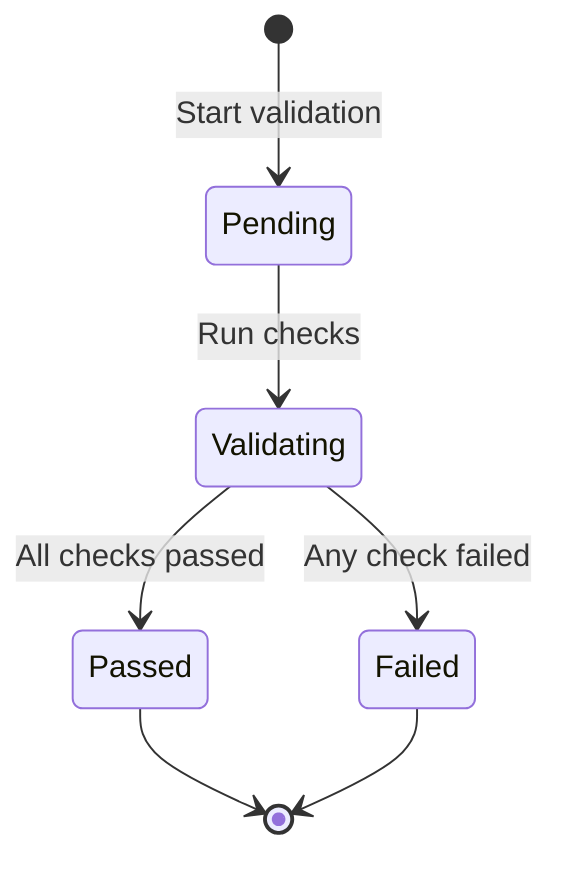
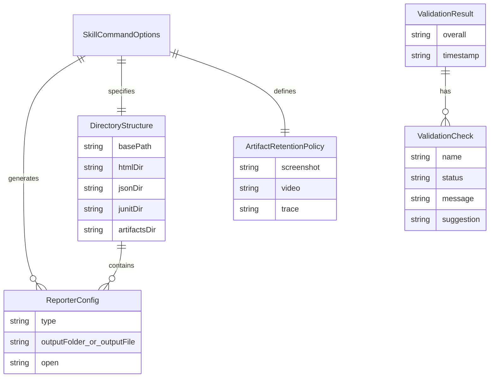

# Data Model: E2E Report Configurator

**Spec**: T006-e2e-report-configurator | **Date**: 2025-12-30 | **Source**: Research decisions from `research.md`

## Overview

This document defines the data schemas for the E2E Report Configurator skill, including reporter configurations, artifact retention policies, directory structures, and validation results.

**Design Principles**:
- **Type Safety**: All schemas have corresponding TypeScript types in `contracts/`
- **Validation**: Zod schemas for runtime validation of user inputs
- **Idempotency**: Schemas support safe re-execution (merge, not replace)
- **Extensibility**: Future reporter types can be added without breaking changes

---

## Entity 1: Reporter Configuration

### Purpose

Represents Playwright reporter configuration for HTML, JSON, or JUnit report formats.

### Schema

```typescript
// Discriminated union based on reporter type
type ReporterConfig = HTMLReporterConfig | JSONReporterConfig | JUnitReporterConfig

interface HTMLReporterConfig {
  type: 'html'
  outputFolder: string
  open?: 'always' | 'never' | 'on-failure'
}

interface JSONReporterConfig {
  type: 'json'
  outputFile: string
}

interface JUnitReporterConfig {
  type: 'junit'
  outputFile: string
}
```

### Fields

| Field | Type | Required | Description | Validation Rules |
|-------|------|----------|-------------|------------------|
| `type` | `'html' \| 'json' \| 'junit'` | ✅ Yes | Reporter format identifier | Must be one of the three allowed values |
| `outputFolder` | `string` | ✅ For HTML | Directory path for HTML report output | Must be valid directory path, unique across reporters |
| `outputFile` | `string` | ✅ For JSON/JUnit | File path for JSON/JUnit output | Must be valid file path, unique across reporters, must end with correct extension (.json/.xml) |
| `open` | `'always' \| 'never' \| 'on-failure'` | ❌ No | When to auto-open HTML report in browser | Only applicable for HTML reporter |

### Validation Rules

1. **Type Constraint**: `type` must be exactly `'html'`, `'json'`, or `'junit'`
2. **Path Uniqueness**: No two reporters can share the same `outputFolder` or `outputFile`
3. **Extension Matching**:
   - JSON reporter: `outputFile` must end with `.json`
   - JUnit reporter: `outputFile` must end with `.xml`
4. **HTML-specific**: `open` option only valid when `type === 'html'`
5. **Directory vs File**:
   - HTML uses `outputFolder` (directory)
   - JSON/JUnit use `outputFile` (file path)

### Zod Validation Schema

```typescript
import { z } from 'zod'

const HTMLReporterConfigSchema = z.object({
  type: z.literal('html'),
  outputFolder: z.string().min(1),
  open: z.enum(['always', 'never', 'on-failure']).optional()
})

const JSONReporterConfigSchema = z.object({
  type: z.literal('json'),
  outputFile: z.string().min(1).endsWith('.json', 'Must end with .json')
})

const JUnitReporterConfigSchema = z.object({
  type: z.literal('junit'),
  outputFile: z.string().min(1).endsWith('.xml', 'Must end with .xml')
})

const ReporterConfigSchema = z.discriminatedUnion('type', [
  HTMLReporterConfigSchema,
  JSONReporterConfigSchema,
  JUnitReporterConfigSchema
])

// Validate unique output paths across reporters
function validateUniqueOutputPaths(reporters: ReporterConfig[]): void {
  const paths = new Set<string>()
  for (const reporter of reporters) {
    const path = reporter.type === 'html' ? reporter.outputFolder : reporter.outputFile
    if (paths.has(path)) {
      throw new Error(`Duplicate output path: ${path}`)
    }
    paths.add(path)
  }
}
```

### Default Values

| Reporter Type | Default Configuration |
|---------------|----------------------|
| **HTML** | `{ type: 'html', outputFolder: 'reports/e2e/html', open: 'never' }` |
| **JSON** | `{ type: 'json', outputFile: 'reports/e2e/json/results.json' }` |
| **JUnit** | `{ type: 'junit', outputFile: 'reports/e2e/junit/results.xml' }` |

### Example Instances

```typescript
// Minimal HTML reporter (mandatory)
const htmlReporter: HTMLReporterConfig = {
  type: 'html',
  outputFolder: 'reports/e2e/html'
}

// HTML reporter with auto-open on failure
const htmlWithOpen: HTMLReporterConfig = {
  type: 'html',
  outputFolder: 'reports/e2e/html',
  open: 'on-failure'
}

// JSON reporter (optional)
const jsonReporter: JSONReporterConfig = {
  type: 'json',
  outputFile: 'reports/e2e/json/results.json'
}

// JUnit reporter (optional)
const junitReporter: JUnitReporterConfig = {
  type: 'junit',
  outputFile: 'reports/e2e/junit/results.xml'
}

// Multi-format configuration
const multiFormat: ReporterConfig[] = [
  htmlReporter,
  jsonReporter,
  junitReporter
]
```

---

## Entity 2: Artifact Retention Policy

### Purpose

Defines when to capture test artifacts (screenshots, videos, traces) during Playwright test execution.

### Schema

```typescript
interface ArtifactRetentionPolicy {
  screenshot: ArtifactRetentionOption
  video: ArtifactRetentionOption
  trace: ArtifactRetentionOption
}

type ArtifactRetentionOption =
  | 'on'                    // Always capture
  | 'off'                   // Never capture
  | 'only-on-failure'       // Capture only when test fails
  | 'retain-on-failure'     // Capture all, delete on success (videos only)
  | 'on-first-retry'        // Capture on first retry (traces only)
```

### Fields

| Field | Type | Required | Description | Validation Rules |
|-------|------|----------|-------------|------------------|
| `screenshot` | `ArtifactRetentionOption` | ✅ Yes | When to capture screenshots | Must be one of the allowed options |
| `video` | `ArtifactRetentionOption` | ✅ Yes | When to capture videos | Must be one of the allowed options |
| `trace` | `ArtifactRetentionOption` | ✅ Yes | When to capture Playwright traces | Must be one of the allowed options |

### Validation Rules

1. **Valid Options**: Each field must be one of the 5 allowed option values
2. **Video-specific**: `'retain-on-failure'` is only valid for `video` field
3. **Trace-specific**: `'on-first-retry'` is only valid for `trace` field
4. **Screenshot**: All options are valid

### Zod Validation Schema

```typescript
import { z } from 'zod'

const ArtifactRetentionOptionSchema = z.enum([
  'on',
  'off',
  'only-on-failure',
  'retain-on-failure',
  'on-first-retry'
])

const ArtifactRetentionPolicySchema = z.object({
  screenshot: ArtifactRetentionOptionSchema,
  video: ArtifactRetentionOptionSchema,
  trace: ArtifactRetentionOptionSchema
}).refine(
  (data) => {
    // 'retain-on-failure' only valid for video
    if (data.screenshot === 'retain-on-failure' || data.trace === 'retain-on-failure') {
      return false
    }
    // 'on-first-retry' only valid for trace
    if (data.screenshot === 'on-first-retry' || data.video === 'on-first-retry') {
      return false
    }
    return true
  },
  {
    message: 'Invalid artifact retention options for specific artifact types'
  }
)
```

### Default Values (by Use Case)

| Use Case | Screenshot | Video | Trace | Rationale |
|----------|------------|-------|-------|-----------|
| **Development** | `only-on-failure` | `retain-on-failure` | `on-first-retry` | Minimal disk usage, debug failures |
| **CI/CD** | `only-on-failure` | `off` | `on-first-retry` | Save CI storage costs |
| **Debugging** | `on` | `on` | `on` | Maximum debugging information |
| **Production** | `only-on-failure` | `off` | `off` | Minimal overhead |

### Example Instances

```typescript
// Default policy (development)
const developmentPolicy: ArtifactRetentionPolicy = {
  screenshot: 'only-on-failure',
  video: 'retain-on-failure',
  trace: 'on-first-retry'
}

// CI/CD policy (cost-optimized)
const ciPolicy: ArtifactRetentionPolicy = {
  screenshot: 'only-on-failure',
  video: 'off',
  trace: 'on-first-retry'
}

// Debug policy (maximum info)
const debugPolicy: ArtifactRetentionPolicy = {
  screenshot: 'on',
  video: 'on',
  trace: 'on'
}

// Minimal policy (no artifacts)
const minimalPolicy: ArtifactRetentionPolicy = {
  screenshot: 'off',
  video: 'off',
  trace: 'off'
}
```

### Playwright Config Mapping

```typescript
// Maps to playwright.config.ts:
export default defineConfig({
  use: {
    screenshot: policy.screenshot,
    video: policy.video,
    trace: policy.trace
  }
})
```

---

## Entity 3: Directory Structure

### Purpose

Represents the standardized directory layout for E2E test reports and artifacts.

### Schema

```typescript
interface DirectoryStructure {
  basePath: string
  htmlDir: string
  jsonDir: string
  junitDir: string
  artifactsDir: string
  screenshotsDir: string
  videosDir: string
  tracesDir: string
}
```

### Fields

| Field | Type | Required | Description | Validation Rules |
|-------|------|----------|-------------|------------------|
| `basePath` | `string` | ✅ Yes | Root directory for all reports (e.g., `reports/e2e`) | Must be valid path, no trailing slash |
| `htmlDir` | `string` | ✅ Yes | HTML report directory (relative to basePath) | Must be `${basePath}/html` |
| `jsonDir` | `string` | ✅ Yes | JSON report directory (relative to basePath) | Must be `${basePath}/json` |
| `junitDir` | `string` | ✅ Yes | JUnit XML report directory (relative to basePath) | Must be `${basePath}/junit` |
| `artifactsDir` | `string` | ✅ Yes | Base artifacts directory (relative to basePath) | Must be `${basePath}/artifacts` |
| `screenshotsDir` | `string` | ✅ Yes | Screenshots directory | Must be `${artifactsDir}/screenshots` |
| `videosDir` | `string` | ✅ Yes | Videos directory | Must be `${artifactsDir}/videos` |
| `tracesDir` | `string` | ✅ Yes | Traces directory | Must be `${artifactsDir}/traces` |

### Validation Rules

1. **Path Consistency**: All paths must start with `basePath`
2. **No Trailing Slashes**: Paths must not end with `/`
3. **Directory Hierarchy**:
   ```
   basePath/
   ├── html/
   ├── json/
   ├── junit/
   └── artifacts/
       ├── screenshots/
       ├── videos/
       └── traces/
   ```
4. **No Circular References**: No path can be a parent of itself

### Zod Validation Schema

```typescript
import { z } from 'zod'
import path from 'path'

const DirectoryStructureSchema = z.object({
  basePath: z.string().min(1).refine(p => !p.endsWith('/'), 'No trailing slash'),
  htmlDir: z.string(),
  jsonDir: z.string(),
  junitDir: z.string(),
  artifactsDir: z.string(),
  screenshotsDir: z.string(),
  videosDir: z.string(),
  tracesDir: z.string()
}).refine(
  (data) => {
    // Validate all paths are under basePath
    const allPaths = [
      data.htmlDir,
      data.jsonDir,
      data.junitDir,
      data.artifactsDir,
      data.screenshotsDir,
      data.videosDir,
      data.tracesDir
    ]
    return allPaths.every(p => p.startsWith(data.basePath))
  },
  {
    message: 'All directories must be under basePath'
  }
)
```

### Default Structure

```typescript
const defaultStructure: DirectoryStructure = {
  basePath: 'reports/e2e',
  htmlDir: 'reports/e2e/html',
  jsonDir: 'reports/e2e/json',
  junitDir: 'reports/e2e/junit',
  artifactsDir: 'reports/e2e/artifacts',
  screenshotsDir: 'reports/e2e/artifacts/screenshots',
  videosDir: 'reports/e2e/artifacts/videos',
  tracesDir: 'reports/e2e/artifacts/traces'
}
```

### Helper Functions

```typescript
// Generate structure from base path
function createDirectoryStructure(basePath: string): DirectoryStructure {
  return {
    basePath,
    htmlDir: `${basePath}/html`,
    jsonDir: `${basePath}/json`,
    junitDir: `${basePath}/junit`,
    artifactsDir: `${basePath}/artifacts`,
    screenshotsDir: `${basePath}/artifacts/screenshots`,
    videosDir: `${basePath}/artifacts/videos`,
    tracesDir: `${basePath}/artifacts/traces`
  }
}

// Create all directories on filesystem
function createDirectories(structure: DirectoryStructure): void {
  const dirs = [
    structure.htmlDir,
    structure.jsonDir,
    structure.junitDir,
    structure.screenshotsDir,
    structure.videosDir,
    structure.tracesDir
  ]

  for (const dir of dirs) {
    fs.mkdirSync(dir, { recursive: true })
    fs.writeFileSync(`${dir}/.gitkeep`, '') // Preserve empty dirs in git
  }
}
```

### Playwright Config Mapping

```typescript
// Maps to playwright.config.ts:
export default defineConfig({
  reporter: [
    ['html', { outputFolder: structure.htmlDir }],
    ['json', { outputFile: `${structure.jsonDir}/results.json` }],
    ['junit', { outputFile: `${structure.junitDir}/results.xml` }]
  ],
  use: {
    screenshot: {
      mode: 'only-on-failure',
      fullPage: true
    },
    // Artifacts go to structure.artifactsDir
  }
})
```

---

## Entity 4: Validation Result

### Purpose

Represents the outcome of validating a Playwright configuration file, including individual checks and overall status.

### Schema

```typescript
interface ValidationResult {
  overall: 'passed' | 'failed'
  checks: ValidationCheck[]
  timestamp: string
}

interface ValidationCheck {
  name: string
  status: 'passed' | 'failed' | 'warning'
  message: string
  suggestion?: string
}
```

### Fields

| Field | Type | Required | Description | Validation Rules |
|-------|------|----------|-------------|------------------|
| `overall` | `'passed' \| 'failed'` | ✅ Yes | Overall validation status | `'failed'` if any check has `status: 'failed'` |
| `checks` | `ValidationCheck[]` | ✅ Yes | List of individual validation checks | Must have at least 1 check |
| `timestamp` | `string` | ✅ Yes | ISO 8601 timestamp of validation | Must be valid ISO date string |

**ValidationCheck Fields**:

| Field | Type | Required | Description | Validation Rules |
|-------|------|----------|-------------|------------------|
| `name` | `string` | ✅ Yes | Name of the validation check | Must be non-empty |
| `status` | `'passed' \| 'failed' \| 'warning'` | ✅ Yes | Check status | Must be one of the three values |
| `message` | `string` | ✅ Yes | Human-readable result message | Must be non-empty |
| `suggestion` | `string` | ❌ No | Optional suggestion for fixing failures | Only present when status is 'failed' or 'warning' |

### Validation Rules

1. **Overall Status**: Must be `'failed'` if any check has `status: 'failed'`
2. **Timestamp Format**: Must be ISO 8601 (e.g., `2025-12-30T10:00:00Z`)
3. **Non-empty Checks**: `checks` array must have at least 1 element
4. **Suggestion Context**: `suggestion` should only be present for failed/warning checks

### Zod Validation Schema

```typescript
import { z } from 'zod'

const ValidationCheckSchema = z.object({
  name: z.string().min(1),
  status: z.enum(['passed', 'failed', 'warning']),
  message: z.string().min(1),
  suggestion: z.string().optional()
})

const ValidationResultSchema = z.object({
  overall: z.enum(['passed', 'failed']),
  checks: z.array(ValidationCheckSchema).min(1),
  timestamp: z.string().datetime()
}).refine(
  (data) => {
    const hasFailures = data.checks.some(c => c.status === 'failed')
    return hasFailures ? data.overall === 'failed' : true
  },
  {
    message: 'overall must be "failed" if any check failed'
  }
)
```

### State Transitions



**States**:
- **Pending**: Validation not started
- **Validating**: Checks in progress
- **Passed**: All checks successful (`overall: 'passed'`)
- **Failed**: At least one check failed (`overall: 'failed'`)

### Example Instances

```typescript
// Successful validation
const passedResult: ValidationResult = {
  overall: 'passed',
  checks: [
    {
      name: 'File exists',
      status: 'passed',
      message: 'playwright.config.ts found'
    },
    {
      name: 'TypeScript validation',
      status: 'passed',
      message: 'Config compiles without errors'
    },
    {
      name: 'Playwright runtime validation',
      status: 'passed',
      message: 'Config loaded successfully by Playwright'
    }
  ],
  timestamp: '2025-12-30T10:00:00Z'
}

// Failed validation
const failedResult: ValidationResult = {
  overall: 'failed',
  checks: [
    {
      name: 'File exists',
      status: 'passed',
      message: 'playwright.config.ts found'
    },
    {
      name: 'TypeScript validation',
      status: 'failed',
      message: 'error TS2322: Type "number" is not assignable to type "string"',
      suggestion: 'Fix type errors in playwright.config.ts'
    },
    {
      name: 'Playwright runtime validation',
      status: 'warning',
      message: 'outputFolder does not exist',
      suggestion: 'Create output directory or update path'
    }
  ],
  timestamp: '2025-12-30T10:05:00Z'
}
```

### Check Categories

| Check Name | Status Codes | Purpose |
|------------|--------------|---------|
| **File exists** | passed/failed | Verify `playwright.config.ts` exists |
| **TypeScript validation** | passed/failed | Compile check with `tsc --noEmit` |
| **Playwright runtime validation** | passed/warning | Load config with `playwright test --list` |
| **Reporter path uniqueness** | passed/failed | Ensure no duplicate output paths |
| **Directory permissions** | passed/warning | Check write access to output directories |

---

## Entity 5: Skill Command Options

### Purpose

Represents command-line options for the `/e2e-report-configurator` skill.

### Schema

```typescript
interface SkillCommandOptions {
  format?: string // 'html' | 'html,json' | 'html,json,junit'
  output?: string // Custom output directory
  artifacts?: 'on-failure' | 'always' | 'never'
}
```

### Fields

| Field | Type | Required | Description | Validation Rules |
|-------|------|----------|-------------|------------------|
| `format` | `string` | ❌ No | Comma-separated list of reporter formats | Must be `'html'`, `'html,json'`, or `'html,json,junit'` |
| `output` | `string` | ❌ No | Custom base output directory (overrides default `reports/e2e`) | Must be valid directory path |
| `artifacts` | `'on-failure' \| 'always' \| 'never'` | ❌ No | Artifact capture policy | Must be one of the three values |

### Validation Rules

1. **Format Constraint**: Must include `'html'` (HTML is mandatory)
2. **Format Order**: Must be in order: `html`, then `json`, then `junit`
3. **Artifact Policy**: Must be one of the three allowed values

### Zod Validation Schema

```typescript
import { z } from 'zod'

const SkillCommandOptionsSchema = z.object({
  format: z.string().regex(/^html(,json)?(,junit)?$/, 'Invalid format string').optional(),
  output: z.string().min(1).optional(),
  artifacts: z.enum(['on-failure', 'always', 'never']).optional()
})
```

### Default Values

```typescript
const defaultOptions: SkillCommandOptions = {
  format: 'html', // HTML only
  output: 'reports/e2e',
  artifacts: 'on-failure'
}
```

### Example Instances

```typescript
// Minimal (HTML only)
const minimalOptions: SkillCommandOptions = {
  format: 'html'
}

// Multi-format
const multiFormatOptions: SkillCommandOptions = {
  format: 'html,json,junit',
  output: 'test-reports',
  artifacts: 'always'
}

// Custom output directory
const customOutputOptions: SkillCommandOptions = {
  format: 'html,json',
  output: 'custom/reports/path',
  artifacts: 'never'
}
```

### Skill Usage Examples

```bash
# Default: HTML only, reports/e2e output, on-failure artifacts
/e2e-report-configurator setup

# HTML + JSON
/e2e-report-configurator setup --format html,json

# All formats with custom output
/e2e-report-configurator setup --format html,json,junit --output my-reports

# Always capture artifacts
/e2e-report-configurator setup --format html --artifacts always
```

---

## Data Model Relationships



**Relationships**:
1. `SkillCommandOptions` → `ReporterConfig[]`: Generates 1-3 reporters based on `format` option
2. `SkillCommandOptions` → `DirectoryStructure`: Specifies base path via `output` option
3. `SkillCommandOptions` → `ArtifactRetentionPolicy`: Defines policy via `artifacts` option
4. `DirectoryStructure` → `ReporterConfig[]`: Provides output paths for each reporter
5. `ValidationResult` → `ValidationCheck[]`: Contains multiple validation checks

---

## Summary

| Entity | Purpose | Key Fields | Validation Complexity |
|--------|---------|------------|----------------------|
| **ReporterConfig** | Reporter format configuration | `type`, `outputFolder/outputFile`, `open` | Medium (path uniqueness) |
| **ArtifactRetentionPolicy** | Artifact capture settings | `screenshot`, `video`, `trace` | Low (enum validation) |
| **DirectoryStructure** | Standardized directory layout | `basePath`, `htmlDir`, `jsonDir`, etc. | Medium (path hierarchy) |
| **ValidationResult** | Config validation outcome | `overall`, `checks`, `timestamp` | Low (status consistency) |
| **SkillCommandOptions** | Skill command-line options | `format`, `output`, `artifacts` | Low (regex + enum) |

**Next Steps**:
- Implement TypeScript contracts in `contracts/reporter-config.ts`
- Add Zod validation in skill implementation
- Create unit tests for validation logic
- Generate quickstart.md with usage examples

---

**Data model complete**: 2025-12-30
**All 5 entities defined**: ✅
**Ready for contracts generation**: ✅
