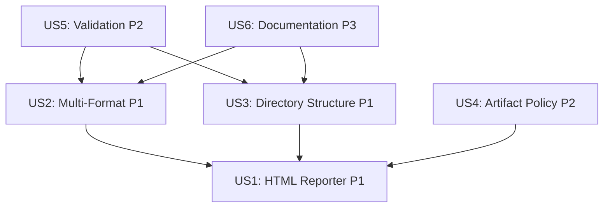

# Tasks: E2E Report Configurator

**Input**: Design documents from `/specs/T006-e2e-report-configurator/`
**Prerequisites**: plan.md ✅, spec.md ✅, research.md ✅, data-model.md ✅, contracts/reporter-config.ts ✅

**Tests**: Test tasks are included (TDD approach - write tests first)

**Organization**: Tasks are grouped by user story to enable independent implementation and testing of each story.

## Format: `[ID] [P?] [Story] Description`

- **[P]**: Can run in parallel (different files, no dependencies)
- **[Story]**: Which user story this task belongs to (e.g., US1, US2, US3)
- Include exact file paths in descriptions

## Path Conventions

- **Skill directory**: `.claude/skills/e2e-report-configurator/`
- **Spec directory**: `specs/T006-e2e-report-configurator/`
- **Target project paths** (generated): `playwright.config.ts`, `reports/e2e/`, `.gitignore`

---

## Phase 1: Setup (Shared Infrastructure)

**Purpose**: Initialize skill structure and foundational code

- [ ] T001 Create skill directory structure at `.claude/skills/e2e-report-configurator/` with subdirectories (`assets/templates/`, `scripts/`, `tests/`)
- [ ] T002 Create skill.md with YAML frontmatter at `.claude/skills/e2e-report-configurator/skill.md` (name: "e2e-report-configurator", description, version: "1.0.0")
- [ ] T003 [P] Copy TypeScript contracts from `specs/T006-e2e-report-configurator/contracts/reporter-config.ts` to `.claude/skills/e2e-report-configurator/scripts/types.ts`
- [ ] T004 [P] Create package.json at `.claude/skills/e2e-report-configurator/package.json` with dependencies (zod, typescript, @types/node)
- [ ] T005 [P] Create tsconfig.json at `.claude/skills/e2e-report-configurator/tsconfig.json` for TypeScript compilation
- [ ] T006 [P] Create vitest.config.ts at `.claude/skills/e2e-report-configurator/vitest.config.ts` for test configuration

---

## Phase 2: Foundational (Blocking Prerequisites)

**Purpose**: Core utilities and templates that ALL user stories depend on

**⚠️ CRITICAL**: No user story work can begin until this phase is complete

- [ ] T007 Implement file utilities in `.claude/skills/e2e-report-configurator/scripts/file-utils.ts` (readFile, writeFile, ensureDirExists, checkPermissions)
- [ ] T008 [P] Implement config parser in `.claude/skills/e2e-report-configurator/scripts/config-parser.ts` (parsePlaywrightConfig using regex patterns from research.md)
- [ ] T009 [P] Implement Zod validation schemas in `.claude/skills/e2e-report-configurator/scripts/validation.ts` (ReporterConfigSchema, ArtifactRetentionPolicySchema, DirectoryStructureSchema)
- [ ] T010 [P] Create reporter templates at `.claude/skills/e2e-report-configurator/assets/templates/playwright-config-html.template.ts` (HTML reporter config snippet)
- [ ] T011 [P] Create reporter templates at `.claude/skills/e2e-report-configurator/assets/templates/playwright-config-multi.template.ts` (multi-format reporter config)
- [ ] T012 [P] Create gitignore template at `.claude/skills/e2e-report-configurator/assets/templates/gitignore.template` (reports/ entry)

**Checkpoint**: Foundation ready - user story implementation can now begin in parallel

---

## Phase 3: User Story 1 - 配置 HTML 报告输出（必选） (Priority: P1) 🎯 MVP

**Goal**: Configure HTML reporter with default output directory `reports/e2e/html` and artifact retention

**Independent Test**: Run `/e2e-report-configurator setup --format html`, verify playwright.config.ts contains HTML reporter configuration, and reports/e2e/html/ directory is created

### Tests for User Story 1 ⚠️

> **NOTE: Write these tests FIRST, ensure they FAIL before implementation**

- [ ] T013 [P] [US1] Unit test for HTML reporter config generation in `.claude/skills/e2e-report-configurator/tests/unit/html-reporter-generator.test.ts` (test generateHTMLReporterConfig function)
- [ ] T014 [P] [US1] Unit test for directory creation in `.claude/skills/e2e-report-configurator/tests/unit/directory-creator.test.ts` (test createReportDirectories function)
- [ ] T015 [P] [US1] Integration test for setup command in `.claude/skills/e2e-report-configurator/tests/integration/setup-html.test.ts` (test full setup flow with HTML format)

### Implementation for User Story 1

- [ ] T016 [P] [US1] Implement HTML reporter config generator in `.claude/skills/e2e-report-configurator/scripts/reporter-generator.ts` (generateHTMLReporterConfig function)
- [ ] T017 [P] [US1] Implement directory creator in `.claude/skills/e2e-report-configurator/scripts/directory-creator.ts` (createReportDirectories with recursive mkdir and .gitkeep)
- [ ] T018 [US1] Implement config updater in `.claude/skills/e2e-report-configurator/scripts/config-updater.ts` (updatePlaywrightConfig using regex from research.md, backup/rollback strategy)
- [ ] T019 [US1] Implement setup command handler in `.claude/skills/e2e-report-configurator/scripts/commands/setup.ts` (parse --format html, call reporter-generator, directory-creator, config-updater)
- [ ] T020 [US1] Add artifact retention default configuration in setup.ts (screenshot: 'only-on-failure', video: 'retain-on-failure', trace: 'on-first-retry')
- [ ] T021 [US1] Add skill.md workflow documentation for setup command with HTML format example

**Checkpoint**: User Story 1 complete - HTML reporter configuration is fully functional

---

## Phase 4: User Story 2 - 配置可选的 JSON 和 JUnit 报告 (Priority: P1)

**Goal**: Support multi-format reporters (HTML + JSON + JUnit) with correct output paths

**Independent Test**: Run `/e2e-report-configurator setup --format html,json,junit`, verify playwright.config.ts contains 3 reporters array with correct paths

### Tests for User Story 2 ⚠️

- [ ] T022 [P] [US2] Unit test for JSON reporter config in `.claude/skills/e2e-report-configurator/tests/unit/json-reporter-generator.test.ts`
- [ ] T023 [P] [US2] Unit test for JUnit reporter config in `.claude/skills/e2e-report-configurator/tests/unit/junit-reporter-generator.test.ts`
- [ ] T024 [P] [US2] Unit test for multi-format reporter array generation in `.claude/skills/e2e-report-configurator/tests/unit/reporter-array-builder.test.ts`
- [ ] T025 [US2] Integration test for multi-format setup in `.claude/skills/e2e-report-configurator/tests/integration/setup-multi-format.test.ts`

### Implementation for User Story 2

- [ ] T026 [P] [US2] Add generateJSONReporterConfig function to reporter-generator.ts (outputFile: reports/e2e/json/results.json)
- [ ] T027 [P] [US2] Add generateJUnitReporterConfig function to reporter-generator.ts (outputFile: reports/e2e/junit/results.xml)
- [ ] T028 [US2] Implement buildReporterArray function in reporter-generator.ts (combine HTML, JSON, JUnit based on format parameter)
- [ ] T029 [US2] Update setup.ts to parse --format parameter (split by comma, validate HTML is present, generate reporter array)
- [ ] T030 [US2] Update directory-creator.ts to create json/ and junit/ subdirectories
- [ ] T031 [US2] Add validation to ensure unique output paths in reporter-array-builder.ts (check no duplicate outputFolder/outputFile)

**Checkpoint**: User Story 2 complete - Multi-format reporters configuration works

---

## Phase 5: User Story 3 - 规范化输出目录结构 (Priority: P1)

**Goal**: Create standardized directory structure `reports/e2e/{html,json,junit,artifacts/}` and update .gitignore

**Independent Test**: Run setup command, verify directory structure matches `reports/e2e/html/`, `reports/e2e/json/`, `reports/e2e/junit/`, `reports/e2e/artifacts/{screenshots,videos,traces}/`, and .gitignore contains `reports/`

### Tests for User Story 3 ⚠️

- [ ] T032 [P] [US3] Unit test for directory structure validation in `.claude/skills/e2e-report-configurator/tests/unit/directory-validator.test.ts`
- [ ] T033 [P] [US3] Unit test for gitignore updater in `.claude/skills/e2e-report-configurator/tests/unit/gitignore-updater.test.ts` (test idempotent append)
- [ ] T034 [US3] Integration test for custom output directory in `.claude/skills/e2e-report-configurator/tests/integration/setup-custom-output.test.ts` (test --output test-results)

### Implementation for User Story 3

- [ ] T035 [P] [US3] Implement DirectoryStructure generator in `.claude/skills/e2e-report-configurator/scripts/directory-structure.ts` (createDirectoryStructure function from data-model.md)
- [ ] T036 [P] [US3] Implement gitignore updater in `.claude/skills/e2e-report-configurator/scripts/gitignore-updater.ts` (using grep-based duplicate check from research.md)
- [ ] T037 [US3] Update directory-creator.ts to create artifacts subdirectories (screenshots/, videos/, traces/ with .gitkeep files)
- [ ] T038 [US3] Update setup.ts to call gitignore-updater after directory creation
- [ ] T039 [US3] Add --output parameter parsing to setup.ts (override default basePath: 'reports/e2e')
- [ ] T040 [US3] Update reporter-generator.ts to use custom basePath from --output parameter

**Checkpoint**: User Story 3 complete - Standardized directory structure and gitignore integration works

---

## Phase 6: User Story 4 - 配置工件保留策略 (Priority: P2)

**Goal**: Configure artifact retention policies (--artifacts on-failure/always/never) for screenshots, videos, traces

**Independent Test**: Run `/e2e-report-configurator setup --artifacts always`, verify playwright.config.ts contains `use: { screenshot: 'on', video: 'on', trace: 'on' }`

### Tests for User Story 4 ⚠️

- [ ] T041 [P] [US4] Unit test for artifact policy generator in `.claude/skills/e2e-report-configurator/tests/unit/artifact-policy-generator.test.ts` (test all 3 policies)
- [ ] T042 [US4] Integration test for artifacts parameter in `.claude/skills/e2e-report-configurator/tests/integration/setup-artifacts-policy.test.ts`

### Implementation for User Story 4

- [ ] T043 [P] [US4] Implement generateArtifactConfig function in `.claude/skills/e2e-report-configurator/scripts/artifact-policy.ts` (map on-failure/always/never to Playwright options from data-model.md)
- [ ] T044 [US4] Update config-updater.ts to merge artifact retention policy into playwright.config.ts use block
- [ ] T045 [US4] Add --artifacts parameter parsing to setup.ts (default: 'on-failure', validate options)
- [ ] T046 [US4] Update skill.md with artifact policy examples

**Checkpoint**: User Story 4 complete - Artifact retention policies are configurable

---

## Phase 7: User Story 5 - 验证报告配置正确性 (Priority: P2)

**Goal**: Implement `/e2e-report-configurator validate` command to check config correctness (TypeScript compilation, directory permissions, Playwright runtime)

**Independent Test**: Create invalid config (wrong output path), run `/e2e-report-configurator validate`, verify error message with suggestions

### Tests for User Story 5 ⚠️

- [ ] T047 [P] [US5] Unit test for TypeScript validator in `.claude/skills/e2e-report-configurator/tests/unit/typescript-validator.test.ts`
- [ ] T048 [P] [US5] Unit test for Playwright runtime validator in `.claude/skills/e2e-report-configurator/tests/unit/playwright-validator.test.ts`
- [ ] T049 [P] [US5] Unit test for directory permission checker in `.claude/skills/e2e-report-configurator/tests/unit/permission-checker.test.ts`
- [ ] T050 [US5] Integration test for validate command in `.claude/skills/e2e-report-configurator/tests/integration/validate-command.test.ts`

### Implementation for User Story 5

- [ ] T051 [P] [US5] Implement validateTypeScript function in `.claude/skills/e2e-report-configurator/scripts/validators/typescript-validator.ts` (run `npx tsc --noEmit playwright.config.ts` from research.md)
- [ ] T052 [P] [US5] Implement validatePlaywrightRuntime function in `.claude/skills/e2e-report-configurator/scripts/validators/playwright-validator.ts` (run `npx playwright test --list` from research.md)
- [ ] T053 [P] [US5] Implement checkDirectoryPermissions function in `.claude/skills/e2e-report-configurator/scripts/validators/permission-checker.ts` (test write access to output directories)
- [ ] T054 [US5] Implement ValidationResult builder in `.claude/skills/e2e-report-configurator/scripts/validators/validation-result-builder.ts` (aggregate ValidationCheck[] from data-model.md)
- [ ] T055 [US5] Implement validate command handler in `.claude/skills/e2e-report-configurator/scripts/commands/validate.ts` (run all validators, format output)
- [ ] T056 [US5] Add error message templates in `.claude/skills/e2e-report-configurator/scripts/validators/error-messages.ts` (EACCES, ENOSPC, EROFS messages from research.md)

**Checkpoint**: User Story 5 complete - Validation command detects config errors and provides actionable suggestions

---

## Phase 8: User Story 6 - 生成报告配置文档 (Priority: P3)

**Goal**: Implement `/e2e-report-configurator docs` command to generate docs/e2e-reports.md with current config, CI/CD examples

**Independent Test**: Run `/e2e-report-configurator docs`, verify docs/e2e-reports.md exists and contains reporter configs, CI/CD integration snippets

### Tests for User Story 6 ⚠️

- [ ] T057 [P] [US6] Unit test for documentation generator in `.claude/skills/e2e-report-configurator/tests/unit/doc-generator.test.ts`
- [ ] T058 [US6] Integration test for docs command in `.claude/skills/e2e-report-configurator/tests/integration/docs-command.test.ts`

### Implementation for User Story 6

- [ ] T059 [P] [US6] Create documentation template at `.claude/skills/e2e-report-configurator/assets/templates/e2e-reports-doc.template.md` (sections: Overview, Current Config, CI/CD Examples)
- [ ] T060 [P] [US6] Implement parseCurrentConfig function in `.claude/skills/e2e-report-configurator/scripts/doc-generator.ts` (read playwright.config.ts, extract reporters array)
- [ ] T061 [P] [US6] Add CI/CD snippets to template (GitHub Actions, GitLab CI, Jenkins from research.md)
- [ ] T062 [US6] Implement generateDocumentation function in doc-generator.ts (merge current config with template, substitute placeholders)
- [ ] T063 [US6] Implement docs command handler in `.claude/skills/e2e-report-configurator/scripts/commands/docs.ts` (write to docs/e2e-reports.md)
- [ ] T064 [US6] Add --output parameter to docs command for custom doc path

**Checkpoint**: User Story 6 complete - Documentation generation provides team-friendly reference

---

## Phase 9: Polish & Cross-Cutting Concerns

**Purpose**: Final integration, error handling, logging, and skill completeness

- [ ] T065 [P] Implement CLI entry point in `.claude/skills/e2e-report-configurator/scripts/cli.ts` (parse subcommands: setup/validate/docs, route to handlers)
- [ ] T066 [P] Add comprehensive error handling to all command handlers (try/catch, structured error messages)
- [ ] T067 [P] Add logging utility in `.claude/skills/e2e-report-configurator/scripts/logger.ts` (log command execution, file operations, validation results)
- [ ] T068 [P] Create skill.md complete workflow documentation (setup → validate → run tests → docs)
- [ ] T069 [P] Add troubleshooting section to skill.md (permission errors, TypeScript errors, missing dependencies from quickstart.md)
- [ ] T070 Implement idempotency checks in config-updater.ts (detect existing reporters, merge instead of duplicate)
- [ ] T071 Add --help flag to cli.ts (display usage, subcommands, options)
- [ ] T072 Add --version flag to cli.ts (display skill version from package.json)
- [ ] T073 Create README.md at `.claude/skills/e2e-report-configurator/README.md` (link to spec.md, quickstart.md, skill.md)
- [ ] T074 Run full test suite and verify 100% pass rate for P1 stories
- [ ] T075 Update specs/T006-e2e-report-configurator/quickstart.md with real skill.md path reference

**Checkpoint**: Skill is production-ready and fully documented

---

## Dependencies

### User Story Dependencies

**Completion Order** (based on priorities and dependencies):
1. **Phase 1**: Setup (T001-T006)
2. **Phase 2**: Foundational (T007-T012)
3. **Phase 3**: US1 - HTML Reporter (T013-T021) 🎯 **MVP Endpoint**
4. **Phase 4**: US2 - Multi-Format (T022-T031)
5. **Phase 5**: US3 - Directory Structure (T032-T040)
6. **Phase 6**: US4 - Artifact Policy (T041-T046)
7. **Phase 7**: US5 - Validation (T047-T056)
8. **Phase 8**: US6 - Documentation (T057-T064)
9. **Phase 9**: Polish (T065-T075)

### External Dependencies

- **Playwright**: Target project must have `@playwright/test` installed
- **TypeScript**: Required for config validation (`tsc --noEmit`)
- **Node.js**: fs/promises for file operations
- **Vitest**: For skill unit tests
- **Zod**: For runtime validation

---

## Parallel Execution Opportunities

### Phase 1 (Setup)
**Parallel Group 1**: T003, T004, T005, T006 (independent file creation)

### Phase 2 (Foundational)
**Parallel Group 2**: T008, T009, T010, T011, T012 (different files, no dependencies)

### Phase 3 (US1)
**Test Parallel**: T013, T014, T015 (independent test files)
**Implementation Parallel**: T016, T017 (different modules)

### Phase 4 (US2)
**Test Parallel**: T022, T023, T024 (independent test files)
**Implementation Parallel**: T026, T027 (different reporter generators)

### Phase 5 (US3)
**Test Parallel**: T032, T033 (different test files)
**Implementation Parallel**: T035, T036 (different modules)

### Phase 6 (US4)
**Test Parallel**: T041, T042 (if T042 not dependent on T041 implementation)
**Implementation Parallel**: T043 can start immediately after T041

### Phase 7 (US5)
**Test Parallel**: T047, T048, T049 (independent validators)
**Implementation Parallel**: T051, T052, T053 (independent validator modules)

### Phase 8 (US6)
**Test Parallel**: T057, T058 (if T058 uses mocks)
**Implementation Parallel**: T059, T060, T061 (different components)

### Phase 9 (Polish)
**Parallel Group 9**: T065, T066, T067, T068, T069, T073 (independent polishing tasks)

---

## Implementation Strategy

### MVP Scope (Minimum Viable Product)

**Target**: Complete Phase 3 (User Story 1) for MVP

**MVP Deliverables**:
- ✅ `/e2e-report-configurator setup --format html` works
- ✅ Generates playwright.config.ts with HTML reporter
- ✅ Creates `reports/e2e/html/` directory structure
- ✅ Configures artifact retention (screenshot, video, trace)
- ✅ Basic validation (TypeScript compiles)

**MVP Tasks**: T001-T021 (21 tasks)

**MVP Timeline**: ~3-5 days (assuming 4-6 tasks/day)

### Post-MVP Increments

**Increment 1** (US2 + US3): Multi-format + Directory structure
- Tasks: T022-T040
- Adds JSON/JUnit support, gitignore integration

**Increment 2** (US4 + US5): Artifact policy + Validation
- Tasks: T041-T056
- Adds configurable artifacts, full validation command

**Increment 3** (US6 + Polish): Documentation + Production-ready
- Tasks: T057-T075
- Adds docs command, CLI polish, production hardening

### Test-Driven Development (TDD) Workflow

For each user story:
1. **Write tests FIRST** (T0XX test tasks)
2. **Verify tests FAIL** (Red phase)
3. **Implement code** (T0XX implementation tasks)
4. **Verify tests PASS** (Green phase)
5. **Refactor** if needed (improve code quality while keeping tests green)

---

## Task Summary

- **Total Tasks**: 75
- **Phase 1 (Setup)**: 6 tasks
- **Phase 2 (Foundational)**: 6 tasks (12 cumulative)
- **Phase 3 (US1 - MVP)**: 9 tasks (21 cumulative) 🎯
- **Phase 4 (US2)**: 10 tasks (31 cumulative)
- **Phase 5 (US3)**: 9 tasks (40 cumulative)
- **Phase 6 (US4)**: 6 tasks (46 cumulative)
- **Phase 7 (US5)**: 10 tasks (56 cumulative)
- **Phase 8 (US6)**: 8 tasks (64 cumulative)
- **Phase 9 (Polish)**: 11 tasks (75 total)

**Parallel Opportunities**: ~35 tasks can run in parallel (47% parallelizable)

**Independent Test Criteria per Story**:
- **US1**: HTML reporter config generates correctly, directories created, artifacts configured
- **US2**: Multi-format reporters array correct, all output paths unique
- **US3**: Directory structure matches convention, .gitignore updated
- **US4**: Artifact policies map correctly to Playwright options
- **US5**: Validation detects errors, provides actionable suggestions
- **US6**: Generated docs contain current config and CI/CD examples

---

## Validation Checklist

Before marking tasks.md complete, verify:

- [x] All tasks follow format: `- [ ] [ID] [P?] [Story?] Description with file path`
- [x] Each user story has Independent Test criteria defined
- [x] MVP scope clearly identified (Phase 3 - US1)
- [x] Dependencies graph shows user story completion order
- [x] Parallel execution opportunities documented
- [x] Test tasks marked with ⚠️ and TDD instructions
- [x] File paths are specific (not generic placeholders)
- [x] Task IDs are sequential (T001-T075)
- [x] Each phase has a clear **Checkpoint** marker

---

**Tasks generated**: 2025-12-30
**Total task count**: 75
**MVP tasks**: 21 (Phase 1-3)
**Parallelizable tasks**: ~35 (47%)
**Ready for implementation**: ✅
