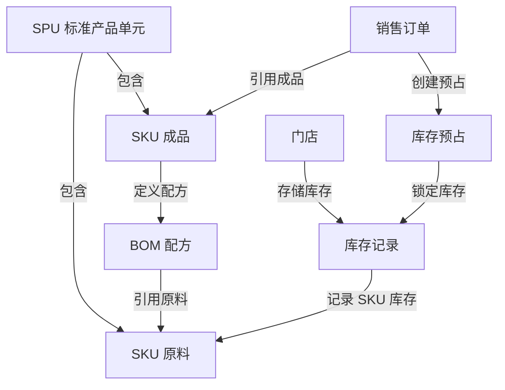

# Data Model: E2E Postman 业务流程测试

**Date**: 2026-01-14  
**Branch**: T009-e2e-postman-flow-test  
**Phase**: 1 - Design & Contracts

## Purpose

定义 E2E 测试中涉及的数据模型、测试数据规格和数据关系。本文档为 Postman Collection 的请求体设计和响应验证提供依据。

---

## Entity Models

### 1. SPU (Standard Product Unit) - 标准产品单元

**用途**: 商品的抽象分类，用于组织相同类型的 SKU

**数据结构**:
```json
{
  "name": "测试饮品 SPU - Mojito",
  "categoryId": "550e8400-e29b-41d4-a716-446655440003",
  "description": "鸡尾酒分类 - 莫吉托系列",
  "status": "ACTIVE"
}
```

**字段说明**:
| 字段 | 类型 | 必填 | 说明 |
|------|------|------|------|
| `name` | string | ✅ | SPU 名称，建议包含 "测试" 前缀 |
| `categoryId` | uuid | ✅ | 分类 ID，固定为饮品分类 |
| `description` | string | ❌ | SPU 描述 |
| `status` | enum | ✅ | 状态：ACTIVE/INACTIVE |

**测试数据**:
- 名称: "测试饮品 SPU - Mojito"
- 分类 ID: `550e8400-e29b-41d4-a716-446655440003` (饮品分类)

---

### 2. SKU (Stock Keeping Unit) - 库存量单位

**用途**: 可交易的具体商品规格，分为原料和成品两种类型

**数据结构**:
```json
{
  "spuId": "{{test_spu_id}}",
  "skuCode": "TEST_MAT_RUM_001",
  "skuName": "朗姆酒",
  "skuType": "RAW_MATERIAL",
  "primaryUnit": "ml",
  "standardCost": 0.15,
  "wasteRate": 0.0,
  "status": "ACTIVE"
}
```

**字段说明**:
| 字段 | 类型 | 必填 | 说明 |
|------|------|------|------|
| `spuId` | uuid | ✅ | 所属 SPU ID |
| `skuCode` | string | ✅ | SKU 编码，原料用 `TEST_MAT_*`，成品用 `TEST_PRD_*` |
| `skuName` | string | ✅ | SKU 名称 |
| `skuType` | enum | ✅ | 类型：RAW_MATERIAL/FINISHED_PRODUCT/COMBO/PACKAGING |
| `primaryUnit` | string | ✅ | 主单位：ml/g/kg/pcs/杯 等 |
| `standardCost` | decimal | ✅ | 标准成本（原料）或售价（成品） |
| `wasteRate` | decimal | ✅ | 损耗率（百分比，0-100） |
| `status` | enum | ✅ | 状态：ACTIVE/INACTIVE |

**测试数据**:

#### 原料 SKU (3 个)
```json
// 1. 朗姆酒
{
  "spuId": "{{test_spu_id}}",
  "skuCode": "TEST_MAT_RUM_001",
  "skuName": "朗姆酒",
  "skuType": "RAW_MATERIAL",
  "primaryUnit": "ml",
  "standardCost": 0.15,
  "wasteRate": 0.0,
  "status": "ACTIVE"
}

// 2. 薄荷叶
{
  "spuId": "{{test_spu_id}}",
  "skuCode": "TEST_MAT_MINT_002",
  "skuName": "薄荷叶",
  "skuType": "RAW_MATERIAL",
  "primaryUnit": "g",
  "standardCost": 0.05,
  "wasteRate": 0.0,
  "status": "ACTIVE"
}

// 3. 苏打水
{
  "spuId": "{{test_spu_id}}",
  "skuCode": "TEST_MAT_SODA_003",
  "skuName": "苏打水",
  "skuType": "RAW_MATERIAL",
  "primaryUnit": "ml",
  "standardCost": 0.01,
  "wasteRate": 0.0,
  "status": "ACTIVE"
}
```

#### 成品 SKU (1 个)
```json
{
  "spuId": "{{test_spu_id}}",
  "skuCode": "TEST_PRD_MOJITO_001",
  "skuName": "莫吉托",
  "skuType": "FINISHED_PRODUCT",
  "primaryUnit": "杯",
  "standardCost": 35.0,  // 售价
  "wasteRate": 5.0,      // 5% 损耗率
  "status": "ACTIVE"
}
```

---

### 3. BOM (Bill of Materials) - 物料清单/配方

**用途**: 定义成品 SKU 由哪些原料组成

**数据结构**:
```json
{
  "finishedProductId": "{{test_sku_id_1}}",
  "components": [
    {
      "componentType": "MATERIAL",
      "materialId": "{{test_material_rum_id}}",
      "quantity": 45,
      "unit": "ml"
    },
    {
      "componentType": "MATERIAL",
      "materialId": "{{test_material_mint_id}}",
      "quantity": 5,
      "unit": "g"
    },
    {
      "componentType": "MATERIAL",
      "materialId": "{{test_material_soda_id}}",
      "quantity": 200,
      "unit": "ml"
    }
  ],
  "wasteRate": 5.0
}
```

**字段说明**:
| 字段 | 类型 | 必填 | 说明 |
|------|------|------|------|
| `finishedProductId` | uuid | ✅ | 成品 SKU ID |
| `components` | array | ✅ | 组件列表，至少包含 1 个组件 |
| `components[].componentType` | enum | ✅ | 组件类型：MATERIAL (使用 materialId) 或 SKU (使用 componentId) |
| `components[].materialId` | uuid | ✅* | 原料 SKU ID（当 componentType = MATERIAL 时必填） |
| `components[].componentId` | uuid | ✅* | 组件 SKU ID（当 componentType = SKU 时必填） |
| `components[].quantity` | decimal | ✅ | 用量 |
| `components[].unit` | string | ✅ | 单位（必须与原料 SKU 的主单位一致） |
| `wasteRate` | decimal | ✅ | 损耗率（百分比，0-100） |

**测试数据 - 莫吉托配方**:
- 成品: 莫吉托 (1 杯)
- 原料 1: 朗姆酒 45ml
- 原料 2: 薄荷叶 5g
- 原料 3: 苏打水 200ml
- 损耗率: 5%

**重要注意事项**:
- ⚠️ 必须使用 `componentType: "MATERIAL"` 和 `materialId` 字段
- ⚠️ 不要使用 `componentId`（会导致 null 错误）
- ⚠️ 单位必须与原料 SKU 的主单位一致

---

### 4. Store Inventory - 门店库存

**用途**: 记录每个门店每个 SKU 的库存数量

**数据结构** (Supabase REST API 格式):
```json
{
  "store_id": "00000000-0000-0000-0000-000000000099",
  "sku_id": "{{test_material_rum_id}}",
  "on_hand_qty": 5000,
  "available_qty": 5000,
  "reserved_qty": 0,
  "safety_stock": 500
}
```

**字段说明**:
| 字段 | 类型 | 必填 | 说明 |
|------|------|------|------|
| `store_id` | uuid | ✅ | 门店 ID，固定为测试门店 |
| `sku_id` | uuid | ✅ | SKU ID |
| `on_hand_qty` | decimal | ✅ | 现存数量（物理库存） |
| `available_qty` | decimal | ✅ | 可用数量（现存数量 - 预占数量） |
| `reserved_qty` | decimal | ✅ | 预占数量（已锁定但未出库） |
| `safety_stock` | decimal | ✅ | 安全库存（低于此值需要补货） |

**测试数据 - 初始库存**:
```json
// 朗姆酒库存 (约 110 杯莫吉托的用量)
{
  "store_id": "00000000-0000-0000-0000-000000000099",
  "sku_id": "{{test_material_rum_id}}",
  "on_hand_qty": 5000,
  "available_qty": 5000,
  "reserved_qty": 0,
  "safety_stock": 500
}

// 薄荷叶库存 (约 100 杯莫吉托的用量 - 最少库存)
{
  "store_id": "00000000-0000-0000-0000-000000000099",
  "sku_id": "{{test_material_mint_id}}",
  "on_hand_qty": 500,
  "available_qty": 500,
  "reserved_qty": 0,
  "safety_stock": 50
}

// 苏打水库存 (约 100 杯莫吉托的用量)
{
  "store_id": "00000000-0000-0000-0000-000000000099",
  "sku_id": "{{test_material_soda_id}}",
  "on_hand_qty": 20000,
  "available_qty": 20000,
  "reserved_qty": 0,
  "safety_stock": 2000
}
```

**库存关系**:
- `available_qty` = `on_hand_qty` - `reserved_qty`
- 订单创建时: `reserved_qty` 增加，`available_qty` 减少
- 订单取消时: `reserved_qty` 减少，`available_qty` 增加

---

### 5. Beverage Order - 销售订单

**用途**: 记录客户购买的商品

**数据结构**:
```json
{
  "storeId": "00000000-0000-0000-0000-000000000099",
  "items": [
    {
      "skuId": "{{test_sku_id_1}}",
      "quantity": 2
    }
  ]
}
```

**字段说明**:
| 字段 | 类型 | 必填 | 说明 |
|------|------|------|------|
| `storeId` | uuid | ✅ | 门店 ID |
| `items` | array | ✅ | 订单项列表，至少包含 1 项 |
| `items[].skuId` | uuid | ✅ | SKU ID（只能是成品或套餐类型） |
| `items[].quantity` | integer | ✅ | 购买数量（必须 > 0） |

**响应数据结构**:
```json
{
  "success": true,
  "data": {
    "id": "order-uuid-12345",
    "storeId": "00000000-0000-0000-0000-000000000099",
    "status": "PENDING_PAYMENT",
    "reservationStatus": "RESERVED",
    "items": [...],
    "createdAt": "2026-01-14T10:00:00Z"
  }
}
```

**测试数据 - 订单场景**:

#### 场景 1: 正常下单 - 单品订单
```json
{
  "storeId": "00000000-0000-0000-0000-000000000099",
  "items": [
    {
      "skuId": "{{test_sku_id_1}}",  // 莫吉托
      "quantity": 2
    }
  ]
}
```
- 预期库存扣减: 朗姆酒 -90ml, 薄荷叶 -10g, 苏打水 -400ml

#### 场景 3: 库存不足 - 超大数量订单
```json
{
  "storeId": "00000000-0000-0000-0000-000000000099",
  "items": [
    {
      "skuId": "{{test_sku_id_1}}",  // 莫吉托
      "quantity": 9999
    }
  ]
}
```
- 预期: 返回 409 错误，缺货清单包含薄荷叶（所需 49995g，可用 500g）

---

### 6. Inventory Reservation - 库存预占记录

**用途**: 记录销售订单对库存的锁定

**数据结构** (系统自动创建，不需要手动调用 API):
```json
{
  "orderId": "order-uuid-12345",
  "skuId": "{{test_material_rum_id}}",
  "storeId": "00000000-0000-0000-0000-000000000099",
  "reservedQty": 90,
  "status": "RESERVED"
}
```

**状态流转**:
- `RESERVED`: 库存已预占（订单创建时）
- `CANCELLED`: 预占已取消（订单取消时）

---

## Data Relationships



---

## Environment Variables Schema

**用途**: 在 Postman 测试中管理动态创建的资源 ID

**变量列表**:
| 变量名 | 类型 | 说明 | 示例值 |
|--------|------|------|--------|
| `supabase_url` | string | Supabase 项目 URL | `https://xxx.supabase.co` |
| `supabase_anon_key` | string | Supabase 匿名密钥 | `eyJhbGciOiJIUzI1NiI...` |
| `api_base_url` | string | 后端 API 基础 URL | `http://localhost:8080` |
| `test_store_id` | uuid | 测试门店 ID | `00000000-0000-0000-0000-000000000099` |
| `test_category_id` | uuid | 测试分类 ID | `550e8400-e29b-41d4-a716-446655440003` |
| `test_spu_id` | uuid | 测试 SPU ID（Setup 阶段创建） | 动态生成 |
| `test_material_rum_id` | uuid | 朗姆酒 SKU ID | 动态生成 |
| `test_material_mint_id` | uuid | 薄荷叶 SKU ID | 动态生成 |
| `test_material_soda_id` | uuid | 苏打水 SKU ID | 动态生成 |
| `test_sku_id_1` | uuid | 莫吉托 SKU ID | 动态生成 |
| `test_bom_id` | uuid | BOM 配方 ID | 动态生成 |
| `test_order_id` | uuid | 测试订单 ID | 动态生成 |

**变量生命周期**:
1. **Setup 阶段**: 创建资源并保存 ID 到环境变量
2. **测试阶段**: 使用环境变量引用资源 ID
3. **Teardown 阶段**: 使用环境变量删除资源并清空变量

---

## Validation Rules

**数据验证规则** (在 Test Scripts 中验证):

### SPU 创建验证
- ✅ 响应状态码 = 201
- ✅ `success` = true
- ✅ `data.id` 存在且为 UUID 格式
- ✅ `data.name` = 请求中的 name

### SKU 创建验证
- ✅ 响应状态码 = 201
- ✅ `success` = true
- ✅ `data.id` 存在且为 UUID 格式
- ✅ `data.skuCode` 唯一且符合命名规范
- ✅ `data.skuType` 符合枚举值

### BOM 创建验证
- ✅ 响应状态码 = 201
- ✅ `success` = true
- ✅ `data.components` 数量 = 请求中的 components 数量
- ✅ `data.wasteRate` = 5.0

### 库存初始化验证
- ✅ 响应状态码 = 201
- ✅ 返回的库存记录包含 `on_hand_qty`, `available_qty`
- ✅ `available_qty` = `on_hand_qty` (初始状态无预占)

### 订单创建验证
- ✅ 响应状态码 = 201 (成功) 或 409 (库存不足)
- ✅ 成功时 `data.status` = "PENDING_PAYMENT"
- ✅ 成功时 `data.reservationStatus` = "RESERVED"
- ✅ 库存不足时 `error` = "ORD_BIZ_002"
- ✅ 库存不足时 `shortageItems` 数组不为空

### 订单取消验证
- ✅ 响应状态码 = 200
- ✅ `success` = true
- ✅ `data.status` = "CANCELLED"
- ✅ `data.reservationStatus` = "CANCELLED"

---

## Next Steps (Phase 1 继续)

Data Model 已完成，继续 Phase 1 其他任务：

1. ✅ 创建 `contracts/api-endpoints.md` - 文档化所有 API 端点
2. ✅ 创建 `quickstart.md` - 快速开始指南
3. ✅ 更新 Agent Context

**准备创建 API 契约文档** 🚀
