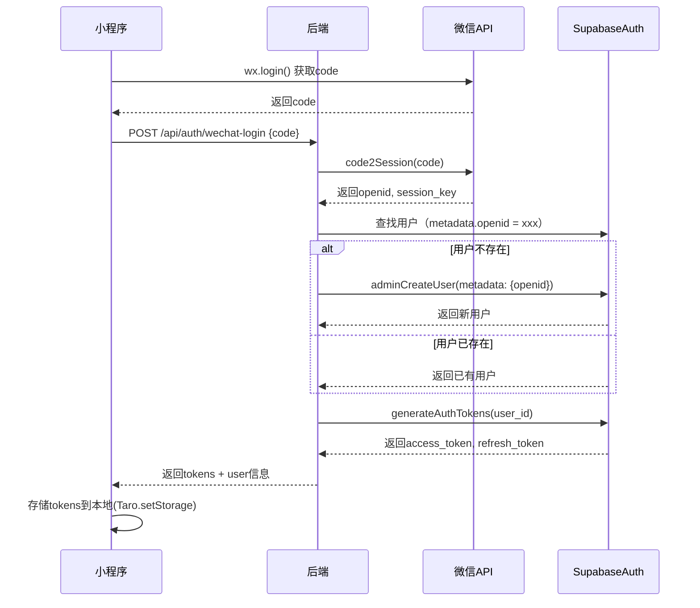
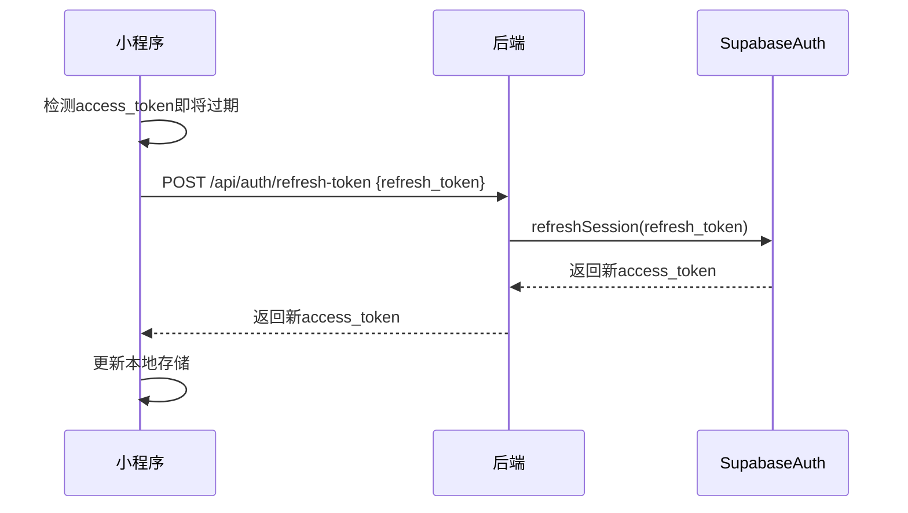
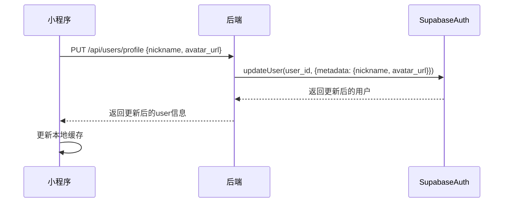

# Data Model: 微信小程序登录功能

**Feature**: U003-wechat-miniapp-login
**Date**: 2025-12-24
**Input**: [spec.md](./spec.md), [research.md](./research.md)

## 数据模型概述

本功能采用**Supabase Auth架构**，使用auth.users表管理用户身份认证，通过user_metadata存储微信相关字段。不创建自定义users表，所有用户数据遵循Supabase Auth标准模式。

## 核心实体

### 1. User（用户） - Supabase Auth Schema

**表名**: `auth.users` (Supabase Auth内置表)

**说明**: 由Supabase Auth自动管理，存储用户核心身份信息

| 字段名 | 类型 | 约束 | 说明 |
|--------|------|------|------|
| id | UUID | PRIMARY KEY | 用户唯一标识（Supabase Auth自动生成） |
| email | VARCHAR(255) | UNIQUE, NULLABLE | 邮箱（微信登录场景可为空或使用虚拟邮箱） |
| encrypted_password | VARCHAR(255) | NULLABLE | 加密密码（微信登录场景不使用） |
| created_at | TIMESTAMPTZ | NOT NULL, DEFAULT NOW() | 创建时间 |
| updated_at | TIMESTAMPTZ | NOT NULL, DEFAULT NOW() | 更新时间 |
| last_sign_in_at | TIMESTAMPTZ | NULLABLE | 最后登录时间 |
| confirmed_at | TIMESTAMPTZ | NULLABLE | 邮箱确认时间（微信登录自动确认） |
| email_confirmed_at | TIMESTAMPTZ | NULLABLE | 同上 |
| phone | VARCHAR(20) | NULLABLE | 手机号（可选） |
| phone_confirmed_at | TIMESTAMPTZ | NULLABLE | 手机号确认时间 |
| raw_user_meta_data | JSONB | NOT NULL, DEFAULT '{}' | 用户元数据（见下方user_metadata结构） |
| raw_app_meta_data | JSONB | NOT NULL, DEFAULT '{}' | 应用元数据（预留） |

**user_metadata结构** (存储在 raw_user_meta_data 字段):

```json
{
  "openid": "o6_bmjrPTlm6_2sxx...",  // 微信OpenID（必填）
  "unionid": "oGgWj7kK...",           // 微信UnionID（可选，仅当小程序绑定到开放平台时）
  "nickname": "张三",                 // 昵称（可选）
  "avatar_url": "https://wx.qlogo.cn/...", // 头像URL（可选）
  "provider": "wechat",               // 登录提供商标识
  "last_login_at": "2025-12-24T10:30:00Z" // 最后登录时间（后端维护）
}
```

**索引**:
- Supabase Auth自动创建id主键索引
- 需在user_metadata中为openid创建GIN索引以支持快速查找：

```sql
-- 创建GIN索引支持JSONB查询
CREATE INDEX idx_users_metadata_openid ON auth.users USING GIN ((raw_user_meta_data->'openid'));
```

**RLS策略**:
```sql
-- 用户只能读取自己的信息
CREATE POLICY "Users can read own data"
  ON auth.users
  FOR SELECT
  USING (auth.uid() = id);

-- 用户只能更新自己的metadata
CREATE POLICY "Users can update own metadata"
  ON auth.users
  FOR UPDATE
  USING (auth.uid() = id)
  WITH CHECK (auth.uid() = id);
```

### 2. Session（会话） - Supabase Auth Schema

**表名**: `auth.sessions` (Supabase Auth内置表)

**说明**: 由Supabase Auth自动管理，存储用户会话和令牌

| 字段名 | 类型 | 约束 | 说明 |
|--------|------|------|------|
| id | UUID | PRIMARY KEY | 会话唯一标识 |
| user_id | UUID | FOREIGN KEY(auth.users.id), NOT NULL | 用户ID |
| created_at | TIMESTAMPTZ | NOT NULL, DEFAULT NOW() | 创建时间 |
| updated_at | TIMESTAMPTZ | NOT NULL, DEFAULT NOW() | 更新时间 |
| factor_id | UUID | NULLABLE | 多因素认证ID（本功能不使用） |
| aal | VARCHAR(10) | NULLABLE | 认证保障级别（Authentication Assurance Level） |
| not_after | TIMESTAMPTZ | NULLABLE | 会话过期时间 |
| refreshed_at | TIMESTAMPTZ | NULLABLE | 最后刷新时间 |
| user_agent | TEXT | NULLABLE | 用户代理 |
| ip | INET | NULLABLE | IP地址 |

### 3. RefreshToken（刷新令牌） - Supabase Auth Schema

**表名**: `auth.refresh_tokens` (Supabase Auth内置表)

**说明**: 由Supabase Auth自动管理，存储刷新令牌

| 字段名 | 类型 | 约束 | 说明 |
|--------|------|------|------|
| id | BIGSERIAL | PRIMARY KEY | 自增ID |
| token | VARCHAR(255) | UNIQUE, NOT NULL | 刷新令牌哈希值 |
| user_id | UUID | FOREIGN KEY(auth.users.id), NOT NULL | 用户ID |
| revoked | BOOLEAN | NOT NULL, DEFAULT FALSE | 是否已撤销 |
| created_at | TIMESTAMPTZ | NOT NULL, DEFAULT NOW() | 创建时间 |
| updated_at | TIMESTAMPTZ | NOT NULL, DEFAULT NOW() | 更新时间 |
| parent | VARCHAR(255) | NULLABLE | 父令牌（用于令牌轮换） |
| session_id | UUID | FOREIGN KEY(auth.sessions.id), NULLABLE | 会话ID |

## 业务数据关联

### 预约订单表（Reservations）

**表名**: `public.reservations`

**说明**: 预约订单业务表，通过user_id关联Supabase Auth用户

| 字段名 | 类型 | 约束 | 说明 |
|--------|------|------|------|
| id | UUID | PRIMARY KEY, DEFAULT gen_random_uuid() | 订单ID |
| user_id | UUID | FOREIGN KEY(auth.users.id), NOT NULL | 用户ID（关联auth.users） |
| scenario_package_id | UUID | NOT NULL | 场景包ID |
| booking_date | DATE | NOT NULL | 预约日期 |
| time_slot | VARCHAR(50) | NOT NULL | 时段 |
| status | VARCHAR(20) | NOT NULL, DEFAULT 'PENDING' | 状态（PENDING/CONFIRMED/CANCELLED） |
| created_at | TIMESTAMPTZ | NOT NULL, DEFAULT NOW() | 创建时间 |
| updated_at | TIMESTAMPTZ | NOT NULL, DEFAULT NOW() | 更新时间 |

**RLS策略**:
```sql
-- 用户只能查看自己的预约
CREATE POLICY "Users can read own reservations"
  ON public.reservations
  FOR SELECT
  USING (auth.uid() = user_id);

-- 用户只能创建自己的预约
CREATE POLICY "Users can create own reservations"
  ON public.reservations
  FOR INSERT
  WITH CHECK (auth.uid() = user_id);

-- 用户只能更新自己的预约
CREATE POLICY "Users can update own reservations"
  ON public.reservations
  FOR UPDATE
  USING (auth.uid() = user_id)
  WITH CHECK (auth.uid() = user_id);
```

## 数据流转

### 1. 用户注册流程（静默登录）



### 2. 令牌刷新流程



### 3. 用户资料更新流程



## 数据验证规则

### user_metadata字段验证

| 字段 | 类型 | 验证规则 | 错误消息 |
|------|------|---------|---------|
| openid | String | 必填，长度≤100 | "微信OpenID不能为空" |
| nickname | String | 可选，长度≤100 | "昵称不能超过100字符" |
| avatar_url | String | 可选，URL格式 | "头像URL格式不正确" |
| phone | String | 可选，11位数字 | "手机号格式不正确" |

### 后端DTO验证（使用javax.validation）

```java
// UserProfileDto.java
public class UserProfileDto {
    @Size(max = 100, message = "昵称不能超过100字符")
    private String nickname;

    @Pattern(regexp = "https?://.*", message = "头像URL格式不正确")
    private String avatarUrl;

    @Pattern(regexp = "^1[3-9]\\d{9}$", message = "手机号格式不正确")
    private String phone;
}
```

## 数据迁移策略

### 初始化Supabase Auth

**步骤**:
1. 在Supabase Dashboard启用Auth功能
2. 配置JWT密钥（Supabase自动生成）
3. 设置令牌有效期（Access Token: 7天，Refresh Token: 30天）
4. 创建user_metadata的GIN索引（支持openid查询）

```sql
-- 在Supabase SQL Editor执行
CREATE INDEX IF NOT EXISTS idx_users_metadata_openid
  ON auth.users USING GIN ((raw_user_meta_data->'openid'));

-- 启用RLS（Supabase Auth表默认启用）
ALTER TABLE auth.users ENABLE ROW LEVEL SECURITY;
ALTER TABLE public.reservations ENABLE ROW LEVEL SECURITY;

-- 创建RLS策略（见上方"RLS策略"章节）
```

### 现有数据迁移（如有）

如果已有用户数据需迁移到Supabase Auth：

```sql
-- 示例：从旧users表迁移到auth.users
INSERT INTO auth.users (id, email, raw_user_meta_data, created_at, updated_at, confirmed_at)
SELECT
  id,
  CONCAT(openid, '@wechat.local') AS email,
  jsonb_build_object(
    'openid', openid,
    'nickname', nickname,
    'avatar_url', avatar_url,
    'phone', phone,
    'provider', 'wechat'
  ) AS raw_user_meta_data,
  created_at,
  updated_at,
  created_at AS confirmed_at
FROM public.old_users;
```

## 性能优化

### 索引策略

1. **GIN索引**: 在user_metadata的openid字段创建GIN索引，支持快速查找
2. **复合索引**: 在reservations表的(user_id, created_at)创建复合索引，优化"我的预约"查询

```sql
CREATE INDEX idx_reservations_user_created
  ON public.reservations(user_id, created_at DESC);
```

### 查询优化

**查找用户示例**（Java后端）:
```java
// 通过openid查找用户
public User findUserByOpenid(String openid) {
    String query = "SELECT * FROM auth.users WHERE raw_user_meta_data->>'openid' = ?";
    return supabaseClient.query(query, openid).firstOrNull();
}
```

## 安全考虑

### 数据加密

- **密码**: Supabase Auth自动使用bcrypt加密密码（微信登录场景不使用密码）
- **JWT令牌**: 使用HS256算法签名，密钥≥256位（由Supabase管理）
- **session_key**: 微信session_key用于解密手机号，仅临时存储在后端内存或Redis中，不持久化到数据库

### 权限控制

- **RLS策略**: 强制用户只能访问自己的数据（auth.uid() = user_id）
- **Admin权限**: 仅后端使用Supabase Admin API创建用户，前端无法直接操作auth.users表
- **Token验证**: 所有API请求验证JWT令牌，确保请求来自合法用户

## 下一步

完成data-model设计后，需要生成：
1. **contracts/api.yaml**: API契约定义
2. **quickstart.md**: 开发环境配置
3. **postman/**: Postman测试集合
