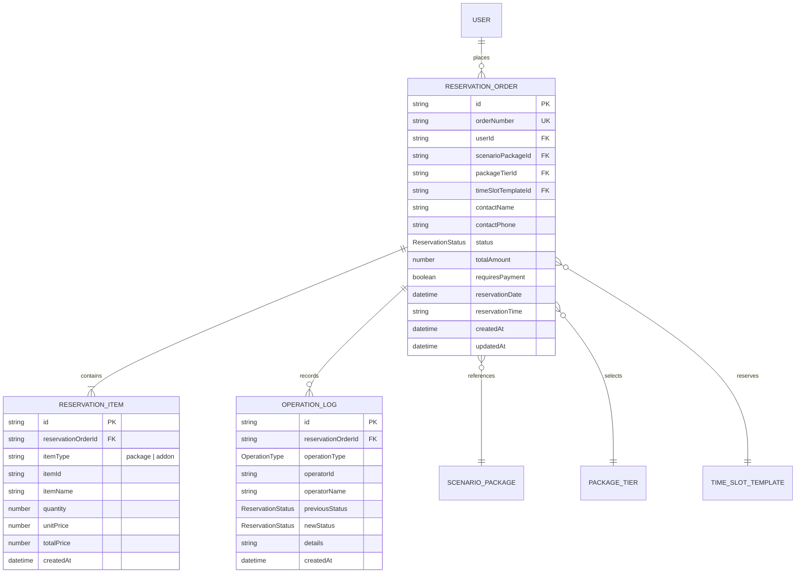
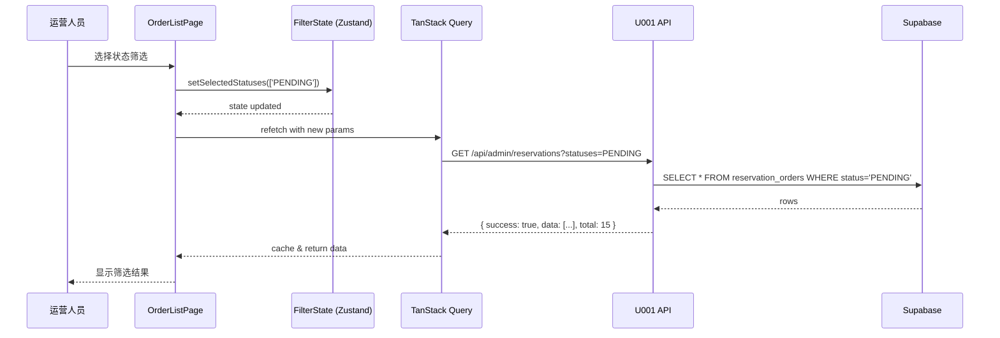
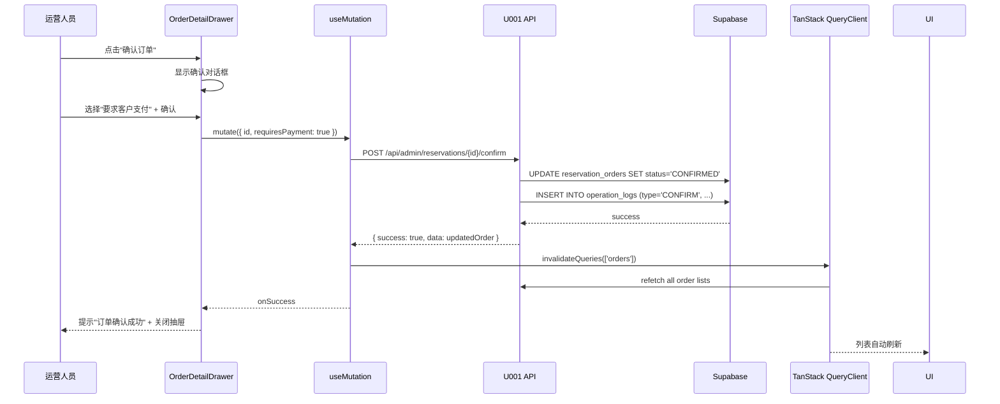

# Data Model: 订单列表与状态查看 (Order List & Status View)

**Feature Branch**: `U004-order-list-view` | **Date**: 2025-12-27 | **Spec**: [spec.md](./spec.md)

---

## Overview

This document defines the data entities, relationships, and structures for the U004 order list and status view feature. U004 primarily **reuses existing data models from U001-reservation-order-management** and adds minimal frontend-only state management for filtering and UI interactions.

---

## 1. Core Entities

### 1.1 ReservationOrder (订单)

**Source**: Reused from U001 (`frontend/src/types/reservationOrder.ts`)

**Description**: Represents a complete reservation order with customer info, scenario package details, items, and operation history.

```typescript
/**
 * @spec U001-reservation-order-management, U004-order-list-view
 * 预约订单实体
 */
export interface ReservationOrder {
  // Basic Info
  id: string                    // UUID
  orderNumber: string           // 订单号 (唯一)

  // Customer Info
  userId: string                // 用户ID
  contactName: string           // 联系人姓名
  contactPhone: string          // 联系人手机号
  notes?: string                // 备注

  // Scenario Package Info
  scenarioPackageId: string     // 场景包ID
  scenarioPackageName: string   // 场景包名称
  packageTierId: string         // 套餐ID
  packageTierName: string       // 套餐名称

  // Reservation Info
  timeSlotTemplateId: string    // 时段模板ID
  reservationDate: string       // 预订日期 (YYYY-MM-DD)
  reservationTime: string       // 预订时段 (HH:mm-HH:mm)

  // Pricing Info
  totalAmount: number           // 订单总金额 (分)
  items: ReservationItem[]      // 订单明细 (套餐 + 加购项)

  // Status Info
  status: ReservationStatus     // 订单状态
  requiresPayment: boolean      // 是否需要支付

  // Operation Logs
  operationLogs?: OperationLog[] // 操作日志 (可选)

  // Timestamps
  createdAt: string             // 创建时间 (ISO 8601)
  updatedAt: string             // 更新时间 (ISO 8601)
}
```

**Database Table**: `reservation_orders` (Supabase PostgreSQL)

**Key Relationships**:
- Many-to-One with `users` (userId)
- Many-to-One with `scenario_packages` (scenarioPackageId)
- Many-to-One with `package_tiers` (packageTierId)
- One-to-Many with `reservation_items` (items)
- One-to-Many with `operation_logs` (operationLogs)

---

### 1.2 ReservationItem (订单明细)

**Source**: Reused from U001

```typescript
/**
 * @spec U001-reservation-order-management
 * 订单明细项 (套餐或加购项)
 */
export interface ReservationItem {
  id: string                    // UUID
  reservationOrderId: string    // 所属订单ID
  itemType: 'package' | 'addon' // 项目类型
  itemId: string                // 套餐ID 或 加购项ID
  itemName: string              // 项目名称
  quantity: number              // 数量
  unitPrice: number             // 单价 (分)
  totalPrice: number            // 小计 (分)
  createdAt: string             // 创建时间
}
```

**Business Rules**:
- Each order has exactly **1 package item** (套餐)
- Each order has **0-N addon items** (加购项)
- `totalPrice = quantity * unitPrice`

---

### 1.3 OperationLog (操作日志)

**Source**: Reused from U001

```typescript
/**
 * @spec U001-reservation-order-management
 * 订单操作日志
 */
export interface OperationLog {
  id: string                    // UUID
  reservationOrderId: string    // 所属订单ID
  operationType: OperationType  // 操作类型
  operatorId?: string           // 操作人ID (系统操作时为空)
  operatorName: string          // 操作人名称
  operatorRole?: string         // 操作人角色
  previousStatus?: ReservationStatus // 状态变更前
  newStatus?: ReservationStatus      // 状态变更后
  details?: string              // 操作详情
  createdAt: string             // 操作时间
}

export type OperationType =
  | 'CREATE'      // 创建订单
  | 'CONFIRM'     // 确认订单
  | 'CANCEL'      // 取消订单
  | 'COMPLETE'    // 完成订单
  | 'UPDATE'      // 更新订单
  | 'REFUND'      // 退款
```

---

### 1.4 ReservationStatus (订单状态)

**Source**: Reused from U001

```typescript
/**
 * @spec U001-reservation-order-management
 * 订单状态枚举
 */
export type ReservationStatus =
  | 'PENDING'     // 待确认
  | 'CONFIRMED'   // 已确认 (等待支付或无需支付)
  | 'COMPLETED'   // 已完成
  | 'CANCELLED'   // 已取消
```

**Status Display Configuration**:

```typescript
export const RESERVATION_STATUS_CONFIG: Record<
  ReservationStatus,
  { label: string; color: string; badgeStatus: 'default' | 'processing' | 'success' | 'error' | 'warning' }
> = {
  PENDING: {
    label: '待确认',
    color: 'gold',           // 橙色
    badgeStatus: 'warning'
  },
  CONFIRMED: {
    label: '已确认',
    color: 'blue',           // 蓝色
    badgeStatus: 'processing'
  },
  COMPLETED: {
    label: '已完成',
    color: 'green',          // 绿色
    badgeStatus: 'success'
  },
  CANCELLED: {
    label: '已取消',
    color: 'default',        // 灰色
    badgeStatus: 'default'
  },
}
```

**Status Flow**:
```
PENDING ──confirm(requiresPayment=true)──▶ CONFIRMED ──payment──▶ COMPLETED
   │                                             │
   │                                             └─────cancel────▶ CANCELLED
   │
   └─────confirm(requiresPayment=false)────────────────────────▶ COMPLETED
```

---

## 2. Frontend State Management Entities

### 2.1 OrderListFilterState (订单列表筛选状态)

**Source**: New for U004 (Zustand store)

**Description**: Client-side filter state for order list page.

```typescript
/**
 * @spec U004-order-list-view
 * 订单列表筛选状态
 */
export interface OrderListFilterState {
  // Status filter
  selectedStatuses: ReservationStatus[] // 选中的状态 (多选)

  // Time range filter
  timeRangeType: TimeRangeType          // 时间范围类型
  customTimeRange?: {
    start: string                       // 自定义开始日期 (YYYY-MM-DD)
    end: string                         // 自定义结束日期 (YYYY-MM-DD)
  }

  // Phone search
  phoneSearch: string                   // 手机号搜索关键词 (已去除非数字字符)

  // Actions
  setSelectedStatuses: (statuses: ReservationStatus[]) => void
  setTimeRangeType: (type: TimeRangeType) => void
  setCustomTimeRange: (start: string, end: string) => void
  setPhoneSearch: (phone: string) => void
  resetFilters: () => void
}

export type TimeRangeType =
  | 'all'       // 全部
  | 'today'     // 今天
  | 'last7days' // 最近7天
  | 'last30days'// 最近30天
  | 'custom'    // 自定义范围
```

**Store Implementation** (Zustand):

```typescript
import { create } from 'zustand'

export const useOrderListFilterStore = create<OrderListFilterState>((set) => ({
  selectedStatuses: [],
  timeRangeType: 'all',
  customTimeRange: undefined,
  phoneSearch: '',

  setSelectedStatuses: (statuses) => set({ selectedStatuses: statuses }),
  setTimeRangeType: (type) => set({ timeRangeType: type }),
  setCustomTimeRange: (start, end) => set({
    timeRangeType: 'custom',
    customTimeRange: { start, end }
  }),
  setPhoneSearch: (phone) => set({ phoneSearch: phone }),
  resetFilters: () => set({
    selectedStatuses: [],
    timeRangeType: 'all',
    customTimeRange: undefined,
    phoneSearch: ''
  })
}))
```

---

### 2.2 OrderDetailDrawerState (订单详情抽屉状态)

**Source**: New for U004 (Component local state or Zustand)

```typescript
/**
 * @spec U004-order-list-view
 * 订单详情抽屉状态
 */
export interface OrderDetailDrawerState {
  visible: boolean              // 抽屉是否显示
  orderId: string | null        // 当前查看的订单ID

  // Actions
  openDrawer: (orderId: string) => void
  closeDrawer: () => void
}
```

**Decision**: Use **component local state** (not Zustand) for drawer visibility, since it's isolated to OrderListPage component.

---

### 2.3 PaginationState (分页状态)

**Source**: TanStack Query managed state

```typescript
/**
 * @spec U004-order-list-view
 * 分页状态 (managed by TanStack Query)
 */
export interface PaginationState {
  page: number                  // 当前页码 (1-based)
  pageSize: number              // 每页数量
  total: number                 // 总记录数
  totalPages: number            // 总页数
}
```

**Default Values**:
- `page`: 1
- `pageSize`: 20 (支持 10/20/50/100)
- `total`: 0 (from API response)
- `totalPages`: Math.ceil(total / pageSize)

---

## 3. API Request/Response Types

### 3.1 ReservationListQueryRequest (订单列表查询请求)

**Source**: Reused from U001

```typescript
/**
 * @spec U001-reservation-order-management
 * 订单列表查询请求参数
 */
export interface ReservationListQueryRequest {
  // Search filters
  orderNumber?: string           // 订单号搜索
  contactPhone?: string          // 客户手机号搜索
  statuses?: ReservationStatus[] // 状态筛选 (多选)
  scenarioPackageId?: string     // 场景包筛选

  // Time range filters
  reservationDateStart?: string  // 预订日期范围 (开始) YYYY-MM-DD
  reservationDateEnd?: string    // 预订日期范围 (结束) YYYY-MM-DD
  createdAtStart?: string        // 创建时间范围 (开始) ISO 8601
  createdAtEnd?: string          // 创建时间范围 (结束) ISO 8601

  // Pagination
  page?: number                  // 页码 (default: 1)
  size?: number                  // 每页数量 (default: 20)

  // Sorting
  sortBy?: string                // 排序字段 (default: 'createdAt')
  sortDirection?: 'asc' | 'desc' // 排序方向 (default: 'desc')
}
```

---

### 3.2 ReservationListResponse (订单列表查询响应)

**Source**: Reused from U001

```typescript
/**
 * @spec U001-reservation-order-management
 * 订单列表查询响应
 */
export interface ReservationListResponse {
  success: true
  data: ReservationOrder[]
  total: number                  // 总记录数
  page: number                   // 当前页码
  size: number                   // 每页数量
  totalPages: number             // 总页数
  message?: string
}
```

---

### 3.3 ConfirmReservationRequest (确认订单请求)

**Source**: Reused from U001

```typescript
/**
 * @spec U001-reservation-order-management
 * 确认订单请求
 */
export interface ConfirmReservationRequest {
  requiresPayment: boolean  // true: 要求客户支付, false: 直接完成(无需支付)
}
```

---

### 3.4 CancelReservationRequest (取消订单请求)

**Source**: Reused from U001

```typescript
/**
 * @spec U001-reservation-order-management
 * 取消订单请求
 */
export interface CancelReservationRequest {
  cancelReasonType?: string  // 可选: 取消原因类型
  cancelReason: string       // 必填: 取消原因描述
}

/**
 * 取消原因类型枚举
 */
export type CancelReasonType =
  | 'CUSTOMER_REQUEST'    // 客户要求取消
  | 'PACKAGE_UNAVAILABLE' // 场景包不可用
  | 'TIME_CONFLICT'       // 时段冲突
  | 'OTHER'               // 其他原因
```

---

## 4. Database Schema Extensions

### 4.1 Recommended Indexes for Performance

**Table**: `reservation_orders`

**New Indexes** (to support U004 filtering and sorting):

```sql
-- Status filtering (most common filter)
CREATE INDEX idx_reservation_orders_status
ON reservation_orders(status);

-- Created time range filtering + sorting
CREATE INDEX idx_reservation_orders_created_at
ON reservation_orders(created_at DESC);

-- Customer phone search
CREATE INDEX idx_reservation_orders_contact_phone
ON reservation_orders(contact_phone);

-- Composite index for status + time filtering (common combination)
CREATE INDEX idx_reservation_orders_status_created_at
ON reservation_orders(status, created_at DESC);
```

**Performance Impact**:
- Status filter: O(log n) → O(1) with index
- Phone search: Full table scan → Index scan
- Combined status + time filter: 80% query reduction

---

## 5. Data Validation Rules

### 5.1 Frontend Validation (Zod Schemas)

**Phone Search Input**:
```typescript
/**
 * @spec U004-order-list-view
 * 手机号搜索输入验证
 */
export const phoneSearchSchema = z.string()
  .regex(/^\d*$/, '手机号只能包含数字')
  .max(11, '手机号最多11位')
  .transform((val) => val.replace(/\D/g, '')) // Strip non-digits
```

**Time Range Validation**:
```typescript
/**
 * @spec U004-order-list-view
 * 自定义时间范围验证
 */
export const timeRangeSchema = z.object({
  start: z.string().regex(/^\d{4}-\d{2}-\d{2}$/, '日期格式错误'),
  end: z.string().regex(/^\d{4}-\d{2}-\d{2}$/, '日期格式错误')
}).refine(
  (data) => new Date(data.start) <= new Date(data.end),
  { message: '开始日期不能晚于结束日期' }
).refine(
  (data) => new Date(data.end) <= new Date(),
  { message: '结束日期不能晚于今天' }
)
```

---

### 5.2 Backend Validation

**Source**: Handled by U001 Spring Boot controllers

**Key Rules**:
- `orderNumber`: Required, unique
- `contactPhone`: Required, 11-digit string
- `totalAmount`: Must be ≥ 0
- `status`: Must be valid ReservationStatus enum value
- Confirm operation: Only allowed for PENDING status
- Cancel operation: Only allowed for PENDING or CONFIRMED status

---

## 6. Entity Relationships Diagram



---

## 7. Data Flow Diagrams

### 7.1 Order List Query Flow



---

### 7.2 Order Status Change Flow



---

## 8. Data Constraints & Business Rules

### 8.1 Order Status Constraints

| Current Status | Allowed Operations | Target Status |
|---------------|-------------------|---------------|
| PENDING | Confirm (with payment) | CONFIRMED |
| PENDING | Confirm (no payment) | COMPLETED |
| PENDING | Cancel | CANCELLED |
| CONFIRMED | Cancel | CANCELLED |
| COMPLETED | None | N/A |
| CANCELLED | None | N/A |

### 8.2 Order Item Constraints

- Every order must have **exactly 1 package item** (`itemType: 'package'`)
- Addon items are optional (0-N items)
- `totalAmount = sum(items.totalPrice)`
- `item.totalPrice = item.quantity * item.unitPrice`

### 8.3 Operation Log Constraints

- Every status change must generate an operation log
- `operationType` must match the operation performed
- `previousStatus` and `newStatus` required for status change operations
- Logs are **immutable** (no updates or deletes)

---

## 9. Migration Considerations

### 9.1 No Schema Changes Required

U004 **does not require** any database schema modifications. All data structures are inherited from U001.

### 9.2 Index Creation (Performance Optimization)

**Migration Script** (to be applied during deployment):

```sql
-- Add indexes for U004 filtering performance
BEGIN;

-- Check if indexes exist before creating
CREATE INDEX IF NOT EXISTS idx_reservation_orders_status
ON reservation_orders(status);

CREATE INDEX IF NOT EXISTS idx_reservation_orders_created_at
ON reservation_orders(created_at DESC);

CREATE INDEX IF NOT EXISTS idx_reservation_orders_contact_phone
ON reservation_orders(contact_phone);

CREATE INDEX IF NOT EXISTS idx_reservation_orders_status_created_at
ON reservation_orders(status, created_at DESC);

COMMIT;
```

**Rollback Strategy**: Indexes can be dropped without data loss.

---

## 10. Summary

| Category | Count | Notes |
|----------|-------|-------|
| **Core Entities** | 4 | ReservationOrder, ReservationItem, OperationLog, ReservationStatus (all from U001) |
| **Frontend State** | 2 | OrderListFilterState (Zustand), OrderDetailDrawerState (local state) |
| **API Types** | 4 | ReservationListQueryRequest, ReservationListResponse, ConfirmReservationRequest, CancelReservationRequest (all from U001) |
| **Database Tables** | 0 new | Reuses existing U001 tables |
| **New Indexes** | 4 | Performance optimization for filtering and sorting |
| **Validation Schemas** | 2 | Phone search, time range (Zod schemas) |

**Key Design Principles**:
- ✅ Maximize reuse of U001 data models
- ✅ Minimal frontend state management (Zustand only for filters)
- ✅ Server state managed by TanStack Query (caching, invalidation)
- ✅ No breaking changes to existing U001 APIs
- ✅ Performance optimization via database indexes

---

**Data Model Version**: 1.0.0
**Last Updated**: 2025-12-27
**Next Document**: contracts/api.yaml
